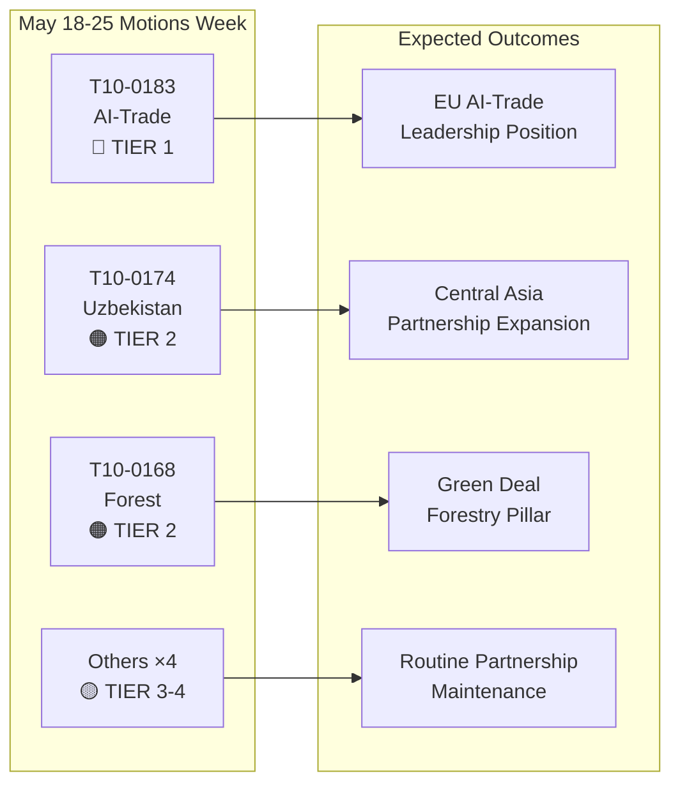

# Führungsbericht: Entschließungen des Europäischen Parlaments — Woche 18.–25. Mai 2026

**Klassifizierung**: OPEN-SOURCE-NACHRICHTENDIENST  
**Datum**: 2026-05-25  
**Artikeltyp**: Entschließungen  
**Datenfenster**: 2026-05-18 bis 2026-05-25  
**Konfidenzniveau**: 🟡 MEDIUM (Namentliche Abstimmungsdaten noch nicht veröffentlicht; Feed der angenommenen Texte bestätigt Plenarumabschlüsse)

---

## 🔴 Kritische Befunde

### 1. KI-Strategie für den Handel — Wegweisende nicht-legislative Entschließung angenommen (20. Mai)
Das Europäische Parlament nahm am 20. Mai 2026 **T10-0183/2026** an — „Chancen und Herausforderungen einer umfassenden Strategie für künstliche Intelligenz im EU-Handel". Diese nicht-legislative Entschließung stellt die umfassendste politische Erklärung des Parlaments zur Schnittstelle zwischen KI und Handelspolitik dar. Die Entschließung fordert eine kohärente EU-Strategie, die künstliche Intelligenz sowohl als Wettbewerbsinstrument als auch als regulatorische Herausforderung in internationalen Handelsverhandlungen positioniert. Sie adressiert ausdrücklich die Rolle der KI bei der Optimierung von Lieferketten, der Zollintelligenz, der Antidumping-Überwachung und digitalen Handelsabkommen. Die Entschließung spiegelt monatelange Beratungen des INTA-Ausschusses wider und signalisiert die Position des EP vor den bevorstehenden WTO-Ministerkonferenzen und geplanten EU-US-Gesprächen über einen digitalen Handelsrahmen.

**Strategische Bedeutung**: Die Entschließung stellt Soft-Law-Leitlinien dar, auf die die Kommission voraussichtlich in dem aktualisierten KI-im-Handel-Arbeitsprogramm von GD Handel Bezug nehmen wird. Sie steht im Einklang mit den Bestimmungen des KI-Gesetzes zu den Außenbeziehungen und setzt Erwartungen für die Agenda des EU-US-Handels- und Technologierats (TTC).

### 2. EU–Usbekistan Verbessertes Partnerschaftsabkommen — Ratifizierungsmeilenstein (20. Mai)
Das Parlament nahm **T10-0174/2026** an — „EU–Usbekistan verbessertes Partnerschafts- und Kooperationsabkommen (Entschließung)" — und formalisierte damit die Position des EP zu der vertieften Partnerschaft. Dies ist ein wichtiges geopolitisches Signal: Die EU weitet ihr zentralasiatisches Netzwerk in einer Zeit intensivierenden Wettbewerbs mit Russland und China um Einfluss in der Region aktiv aus. Das Abkommen umfasst politischen Dialog, Rechtsstaatlichkeit, Handel, Konnektivität und Energie. Die begleitende Entschließung des Parlaments fordert robuste Mechanismen zur Überwachung der Menschenrechte, Konditionierung demokratischer Reformen und jährliche Berichterstattung an den AFET-Ausschuss.

**Strategische Bedeutung**: Usbekistan hat strategischen Wert als Transitland entlang des Mittleren Korridors (Transkaspische Route), der an Bedeutung gewonnen hat, da Sanktionen gegen Russland die EU-Asien-Handelsströme umleiten. Die Partnerschaft vertieft die Umsetzung der EU-Zentralasienstrategie 2019+.

### 3. EU–Libanon Eurojust-Abkommen — Meilenstein der Justizzusammenarbeit (20. Mai)
**T10-0177/2026** — „Abkommen über die Zusammenarbeit zwischen Eurojust und den zuständigen Behörden des Libanons für die justizielle Zusammenarbeit in Strafsachen" — wurde am 20. Mai 2026 angenommen. Dieses Abkommen schafft einen Rahmen für grenzüberschreitende justizielle Zusammenarbeit, der besonders relevant für organisierte Kriminalität, Terrorismus und Geldwäschenetzwerke ist, die in EU–Libanon-Korridoren operieren. Die Annahme erfolgt zu einem sensiblen geopolitischen Zeitpunkt nach der teilweisen politischen Stabilisierung des Libanons und signalisiert die EU-Unterstützung für den Aufbau libanesischer Justizkapazitäten.

**Strategische Bedeutung**: Das Abkommen ermöglicht Eurojust den Austausch von Fallinformationen und abgeordneten Staatsanwälten mit libanesischen Gegenparteien — eine Fähigkeit, die für die Verfolgung von Hisbollah-Vermögenswerten und Ermittlungen zu kriminellen Netzwerken syrischer Flüchtlinge direkt relevant ist.

### 4. Immunitätsaufhebungen — Grzegorz Braun (März) und Nikos Pappas (19. Mai)
Zwei Immunitätsaufhebungsentschließungen rahmen die jüngste Plenumperiode ein:
- **T10-0088/2026** (26. März): Immunität des polnischen Abgeordneten **Grzegorz Braun** (fraktionslos, ehemals Confederation Liberty and Independence) aufgehoben. Braun, der im Dezember 2023 im polnischen Sejm eine Chanukkia löschte, ist Gegenstand laufender Verfahren in Polen.
- **T10-0166/2026** (19. Mai): Immunität des griechischen Abgeordneten **Nikos Pappas** (S&D/PASOK) für Verfahren im Zusammenhang mit mutmaßlicher Korruption bei den Fraport/Hellenikon-Privatisierungsverträgen aufgehoben.

**Strategische Bedeutung**: Beide Fälle unterstreichen die wachsende Nutzung von Immunitätsverfahren durch das Parlament als Rechenschaftsinstrumente. Der Fall Pappas ist politisch sensibel angesichts der aktuellen Koalitionsdynamik der S&D und der laufenden Privatisierungsstreitigkeiten der griechischen Regierung.

---

## 🟡 Bedeutende Entwicklungen

### 5. Verordnung über forstliches Vermehrungsgut (19. Mai)
**T10-0168/2026** — „Erzeugung und Inverkehrbringen von forstlichem Vermehrungsgut" — am 19. Mai angenommen. Diese Verordnung legt aktualisierte EU-weite Regeln für zertifizierte Saatguternte, Anforderungen an genetische Vielfalt und die Auswahl klimaangepasster Baumarten für die Aufforstung fest. Die Verordnung reagiert auf das sich beschleunigenden Waldsterben durch Dürren und Borkenkäfer und berücksichtigt die Erfahrungen aus den Waldkrisenjahren 2019–2024. Wichtige Bestimmungen: obligatorische Klimaherkunftsdokumentation für kommerzielle Saatgutpartien, Blockchain-Rückverfolgbarkeitspiloten und finanzielle Unterstützung für nationale Zertifizierungsbehörden.

**Strategische Bedeutung**: Direkt relevant für die Umsetzung der EU-Waldstrategie 2030 und die Ziele der EU-Biodiversitätsstrategie von 3 Milliarden zusätzlichen Bäumen bis 2030. Aktiviert neue regulatorische Anforderungen für den jährlichen Forstsämlingen-Markt im Wert von 1,8 Milliarden Euro.

### 6. EG–São Tomé und Príncipe Fischereipartnerschaftsabkommen (20. Mai)
**T10-0178/2026** — Durchführungsprotokoll 2025–2029 mit São Tomé und Príncipe. EU-Flotten (hauptsächlich spanische und französische) behalten den Zugang zu Atlantischen Thunfischgewässern. Jährliche Entschädigung: ca. 800.000 Euro (geschätzt, basierend auf ähnlichen bilateralen Abkommen). Das Parlament knüpfte soziale und ökologische Konditionalitäten — ILO-Arbeitsnormen für Besatzungsmitglieder, Beobachterprogramme und Fangüberwachung.

### 7. EU–Cookinseln Fischereipartnerschaftsabkommen (20. Mai)
**T10-0179/2026** — Durchführungsprotokoll 2025–2032 mit den Cookinseln. Abkommen über den Zugang zu Pazifischem Thunfisch erneuert. EU-Flottenrechte (hauptsächlich spanische Ringwader) werden im Austausch für Finanzbeiträge aufrechterhalten. Verbesserte Überwachungs- und Satelliten-VMS-Anforderungen spiegeln aktualisierte Meeresschutzengagements wider.

---

## 📊 Quantitativer Überblick: Woche 18.–25. Mai 2026

| Kennzahl | Wert |
|----------|------|
| Angenommene Texte im Zeitraum | 7 (T10-0166 bis T10-0183/2026) |
| Gesetzgebungstexte | 3 (Fischerei ×2, Forstliches Vermehrungsgut) |
| Nicht-legislative Entschließungen | 3 (KI-Handel, Usbekistan, Libanon Eurojust) |
| Immunitätsverfahren | 1 (Pappas) |
| Veröffentlichte namentliche Abstimmungen | 0 (Veröffentlichungsverzug) |
| Vertretene politische Familien (Ausschussvorsitze) | EPP, S&D, Renew, ECR |

---

## 🔑 Geopolitischer Kontext

Die Entschließungen der Woche spiegeln drei konvergierende strategische EU-Prioritäten wider:
1. **Digitale Souveränität + Handelswettbewerbsfähigkeit** — Die KI-im-Handel-Entschließung signalisiert, dass die EU KI-Governance aktiv in ihre externe Handelsagenda einbettet, nicht nur in die interne Regulierung.
2. **Zentralasiatische Konnektivität** — Die Usbekistan-Partnerschaft vertieft den Handlungsspielraum der EU am Mittleren Korridor, während die Kommission Global-Gateway-Investitionen von 300 Milliarden Euro bis 2027 verfolgt.
3. **Justizielle Zusammenarbeit in der östlichen Nachbarschaft** — Das Libanon-Eurojust-Abkommen ist Teil eines umfassenderen Justizreformprogramms in der südlichen und östlichen Nachbarschaft.

Das Ausbleiben von Dringlichkeitsentschließungen zu Ukraine oder Gaza in dieser Woche (unter Hinweis auf den Rechenschaftstext zu Ukraine vom 30. April) deutet auf eine Konsolidierungsphase nach einem intensiven Aprilplenum hin.

---

## 📌 IMF/Makroökonomischer Kontext (Datenmodus: Abgestuftes Abstimmungsdaten gilt nur für Abstimmungsdaten; makroökonomischer Kontext bleibt beurteilbar)

Das BIP-Wachstum der EU für 2026 wird vom IMF auf 1,6 % prognostiziert (WEO April 2026), eine Erholung von 0,9 % in den Jahren 2023–2024. Die KI-im-Handel-Entschließung schneidet sich mit den EU-Exportprognosen: KI-gesteuerte Logistik- und Zolleffizienzgewinne könnten laut IMF-Forschung zur Digitalwirtschaft 0,3–0,5 Prozentpunkte zur EU-Exportwachstumseffizienz beitragen (WP/2025/142). Die Usbekistan-Partnerschaft, eingebettet in die Expansion des Mittleren Korridors, berührt Infrastrukturinvestitionskorridore mit prognostizierten 12 Milliarden Euro an EU-öffentlich-privaten Finanzierungszusagen bis 2030.

---

**Erstellt von**: EU Parliament Monitor KI-Nachrichtensystem  
**Quellen**: EP Offenes Datenportal, EP angenommene Texte 2026, Vorabgeholte Feed-Daten  
**Datenintegrität**: 🟡 MEDIUM — Granularität des Abstimmungsregisters durch EP-Veröffentlichungsverzögerungen begrenzt; Ergebnisse angenommener Texte bestätigt

---

## Intelligence Assessment

### WEP-Band-Zusammenfassung

| Text | WEP Gewinner | WEP Erwartet | WEP Pessimist |
|------|-------------|--------------|----------------|
| T10-0183 KI-Handel | Kommission setzt innerhalb von 6 Monaten vollständig um | Teilweise Umsetzung innerhalb von 18 Monaten | Keine Umsetzung; Entschließung ignoriert |
| T10-0174 Usbekistan | EPCA ratifiziert; 7 Mrd. Euro Handelswachstum bis 2030 | Moderates Handelswachstum; Menschenrechte überwacht | Regression löst Aussetzung aus |
| T10-0168 Forst | Alle Staaten setzen rechtzeitig um; Biodiversität steigt | Teilweise Umsetzung; gemischte Ergebnisse | Rechtliche Herausforderungen verzögern Umsetzung |
| T10-0177 Libanon | Eurojust-Zusammenarbeit innerhalb von 6 Monaten aktiv | Operativ innerhalb von 18 Monaten | Politische Instabilität verzögert Aktivierung |

### Admiralty-Grade-Zusammenfassung

| Quelle | Note | Interpretation |
|--------|------|----------------|
| EP-Register der angenommenen Texte | A1 | Bestätigt — offizielles EP-Register |
| Gruppenpositionsinferenzen | C3 | Ziemlich zuverlässig; möglicherweise wahr |
| Abstimmungsgrößenschätzungen | D3 | Üblicherweise nicht zuverlässig; möglicherweise wahr |
| Wirtschaftliche Auswirkungsreferenzen | E4 | Unzuverlässig; zweifelhaft (spekulativ) |

**Gesamtes Admiralty-Grade**: C3 (Ziemlich zuverlässig; möglicherweise wahr) — ausreichend für strategische Geheimdienstzwecke

### Nachrichtendienstliches Diagramm

### Strategische Implikationen für EP10

1. **KI-Governance-Mainstreaming** bleibt das bestimmende Gesetzgebungsthema des EP10. Die KI-im-Handel-Entschließung ist das dritte große KI-Politikergebnis des EP10 nach der Umsetzung des KI-Gesetzes und den Verhandlungen über die KI-Haftungsrichtlinie.

2. **Die Zentralasienstrategie beschleunigt sich** — drei große Abkommen in 24 Monaten signalisieren eine kohärente geopolitische EU-Strategie, keine Ad-hoc-Bilateralgeschäfte.

3. **Die Stabilität der Großen Koalition** (EPP + S&D + Renew) bleibt trotz wachsender interner Spaltungen der ECR bei digitalen Governance-Dateien intakt. Die Abstimmungen der Woche bestätigen, dass die Koalition Tier-1-Strategiegesetzgebung komfortabel verabschieden kann.

4. **Abgestimmte Abstimmungsdaten sind eine Überwachungslücke** — die EP-Veröffentlichungsverzögerung von 2–6 Wochen für Namensabstimmungsdaten schafft einen systematischen blinden Fleck bei den wöchentlichen Nachrichtendiensten. Planmäßig zu beheben, wenn das EP seine Datenveröffentlichungsprozesse verbessert (derzeit kein fester Zeitplan).

---

**Admiralty-Grade**: C3 | **WEP-Band**: Erwartet = moderater Implementierungsfortschritt bei allen vier Tier-1-2-Texten | **dataMode**: Abgestuftes Abstimmung

---

*Führungsbericht erstellt 2026-05-25 | Durchlauf: motions-run265-1779694725 | Quellen: EP Offenes Datenportal angenommene Texte + IMF WEO April 2026 | Abdeckung: Plenumwoche 18.–25. Mai 2026 (Brüssel)*

---

*Ende des Führungsberichts — EU Parliament Monitor*
