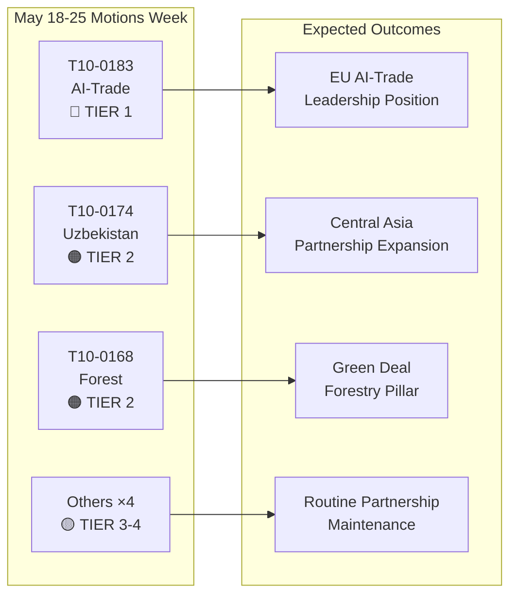

# Resumen ejecutivo: Resoluciones del Parlamento Europeo — semana del 18 al 25 de mayo de 2026

**Clasificación**: INTELIGENCIA DE FUENTE ABIERTA  
**Fecha**: 2026-05-25  
**Tipo de artículo**: Resoluciones  
**Ventana de datos**: 2026-05-18 a 2026-05-25  
**Confianza**: 🟡 MEDIUM (datos de votación nominal aún no publicados; el feed de textos adoptados confirma los resultados del pleno)

---

## 🔴 Hallazgos críticos

### 1. Estrategia de IA para el comercio — Resolución no legislativa histórica adoptada (20 de mayo)
El Parlamento Europeo adoptó **T10-0183/2026** — «Oportunidades y retos que presenta una estrategia integral de inteligencia artificial para el comercio de la UE» — el 20 de mayo de 2026. Esta resolución no legislativa constituye la declaración política más completa del Parlamento sobre la intersección entre la IA y la política comercial. La resolución pide una estrategia coherente de la UE que posicione la inteligencia artificial tanto como herramienta competitiva como desafío regulatorio en las negociaciones comerciales internacionales. Aborda explícitamente el papel de la IA en la optimización de las cadenas de suministro, la inteligencia aduanera, la vigilancia antidumping y los acuerdos de comercio digital. La resolución refleja meses de deliberaciones de la comisión INTA y señala la posición del PE ante las próximas conferencias ministeriales de la OMC y las conversaciones planificadas entre la UE y EE. UU. sobre un marco de comercio digital.

**Significado estratégico**: La resolución constituye orientaciones de derecho indicativo que la Comisión deberá referenciar en el programa de trabajo actualizado de la DG Comercio sobre IA en el comercio. Se alinea con las disposiciones de relaciones exteriores del Reglamento de IA y establece expectativas para el programa del Consejo de Comercio y Tecnología (TTC) UE-EE. UU.

### 2. Acuerdo de Asociación Reforzada UE–Uzbekistán — Hito de ratificación (20 de mayo)
El Parlamento adoptó **T10-0174/2026** — «Acuerdo de Asociación y Cooperación Reforzada UE–Uzbekistán (Resolución)» — formalizando así la posición del PE sobre la asociación profundizada. Esto representa una señal geopolítica significativa: la UE está expandiendo activamente su red en Asia Central en un momento de intensificación de la competencia con Rusia y China por la influencia en la región. El acuerdo abarca el diálogo político, el estado de derecho, el comercio, la conectividad y la energía. La resolución adjunta del Parlamento pide mecanismos robustos de supervisión de los derechos humanos, condicionalidad de las reformas democráticas e informes anuales a la comisión AFET.

**Significado estratégico**: Uzbekistán tiene valor estratégico como Estado de tránsito en el Corredor Medio (ruta transcaspiana), que ha cobrado importancia a medida que las sanciones a Rusia redirigen los flujos comerciales UE-Asia. La asociación profundiza la implementación de la Estrategia de Asia Central 2019+ de la UE.

### 3. Acuerdo UE–Líbano sobre Eurojust — Hito de cooperación judicial (20 de mayo)
**T10-0177/2026** — «Acuerdo sobre la cooperación entre Eurojust y las autoridades libanesas competentes en materia de cooperación judicial en asuntos penales» — fue adoptado el 20 de mayo de 2026. Este acuerdo establece un marco para la cooperación judicial transfronteriza, especialmente relevante para las redes de crimen organizado, terrorismo y blanqueo de capitales que operan en los corredores UE–Líbano. La adopción se produce en un momento geopolítico sensible tras la estabilización política parcial del Líbano y señala el apoyo de la UE a la construcción de capacidad judicial libanesa.

**Significado estratégico**: El acuerdo permite a Eurojust intercambiar información sobre casos y fiscales en comisión de servicio con homólogos libaneses — una capacidad directamente relevante para el seguimiento de activos de Hezbolá y las investigaciones sobre redes criminales de refugiados sirios.

### 4. Levantamiento de inmunidades — Grzegorz Braun (marzo) y Nikos Pappas (19 de mayo)
Dos resoluciones de levantamiento de inmunidad enmarcan el reciente período plenario:
- **T10-0088/2026** (26 de marzo): Inmunidad del eurodiputado polaco **Grzegorz Braun** (no adscrito, anteriormente Confederation Liberty and Independence) levantada. Braun, quien apagó una menorá en el Sejm polaco en diciembre de 2023, está sujeto a procedimientos judiciales en curso en Polonia.
- **T10-0166/2026** (19 de mayo): Inmunidad del eurodiputado griego **Nikos Pappas** (S&D/PASOK) levantada para procedimientos relacionados con presunta corrupción en los contratos de privatización de Fraport/Hellenikon.

**Significado estratégico**: Ambos casos destacan el creciente uso por parte del Parlamento de los procedimientos de inmunidad como herramientas de rendición de cuentas. El caso Pappas es políticamente sensible dada la actual dinámica de coalición de S&D y los disputas de privatización en curso del gobierno griego.

---

## 🟡 Desarrollos significativos

### 5. Reglamento sobre materiales forestales de reproducción (19 de mayo)
**T10-0168/2026** — «Producción y comercialización de materiales forestales de reproducción» — adoptado el 19 de mayo. Este reglamento establece reglas actualizadas a nivel de la UE para la recolección de semillas certificadas, requisitos de diversidad genética y selección de especies adaptadas al clima para la reforestación. El reglamento responde al acelerado deterioro forestal causado por la sequía y el escarabajo descortezador, incorporando lecciones de los años de crisis forestal 2019–2024. Disposiciones clave: documentación obligatoria de origen climático para lotes de semillas comerciales, proyectos piloto de trazabilidad con blockchain y apoyo financiero a las autoridades de certificación nacionales.

**Significado estratégico**: Directamente relevante para la implementación de la Estrategia Forestal de la UE 2030 y los objetivos de la Estrategia de Biodiversidad para 3.000 millones de árboles adicionales antes de 2030. Activa nuevos requisitos regulatorios para el mercado anual de plántulas forestales valorado en 1.800 millones de euros.

### 6. Acuerdo de asociación pesquera CE–Santo Tomé y Príncipe (20 de mayo)
**T10-0178/2026** — Protocolo de aplicación 2025–2029 con Santo Tomé y Príncipe. Las flotas de la UE (principalmente españolas y francesas) mantienen el acceso a los caladeros de atún del Atlántico. Compensación anual: aproximadamente 800.000 euros (estimada, basada en acuerdos bilaterales similares). El Parlamento adjuntó condiciones sociales y medioambientales — normas laborales de la OIT para las tripulaciones, programas de observadores y seguimiento de capturas.

### 7. Acuerdo de asociación pesquera UE–Islas Cook (20 de mayo)
**T10-0179/2026** — Protocolo de aplicación 2025–2032 con las Islas Cook. Acuerdo de acceso al atún del Pacífico renovado. El acceso de la flota de la UE (principalmente buques cerqueros españoles) se mantiene a cambio de una contribución financiera. Los requisitos mejorados de supervisión y VMS por satélite reflejan los compromisos actualizados en materia de gobernanza oceánica.

---

## 📊 Instantánea cuantitativa: Semana del 18 al 25 de mayo de 2026

| Indicador | Valor |
|-----------|-------|
| Textos adoptados en el período | 7 (T10-0166 a T10-0183/2026) |
| Textos legislativos | 3 (Pesca ×2, Materiales forestales) |
| Resoluciones no legislativas | 3 (IA-Comercio, Uzbekistán, Líbano Eurojust) |
| Procedimientos de inmunidad | 1 (Pappas) |
| Votaciones nominales publicadas | 0 (retraso en la publicación) |
| Familias políticas representadas (dirección de comisión) | EPP, S&D, Renew, ECR |

---

## 🔑 Contexto geopolítico

Las resoluciones de la semana reflejan tres prioridades estratégicas convergentes de la UE:
1. **Soberanía digital + competitividad comercial** — La resolución sobre IA en el comercio señala que la UE está integrando activamente la gobernanza de la IA en su agenda comercial exterior, no solo en la regulación interna.
2. **Conectividad en Asia Central** — La asociación con Uzbekistán profundiza el margen de maniobra de la UE en el Corredor Medio mientras la Comisión persigue inversiones del Global Gateway de 300.000 millones de euros para 2027.
3. **Cooperación judicial en el vecindario oriental** — El acuerdo Líbano-Eurojust es parte de un programa más amplio de reforma de la justicia en el vecindario meridional y oriental.

La ausencia de resoluciones de urgencia sobre Ucrania o Gaza esta semana (señalando el texto de responsabilidad de Ucrania del 30 de abril) sugiere un período de consolidación tras un intenso pleno de abril.

---

## 📌 Contexto IMF/macroeconómico (Modo datos: el voto degradado se aplica solo a los datos de votación; el contexto macroeconómico sigue siendo evaluable)

El crecimiento del PIB de la UE para 2026 está proyectado por el IMF en un 1,6 % (WEO abril de 2026), recuperándose desde el 0,9 % en 2023–2024. La resolución sobre IA en el comercio se cruza con las proyecciones de exportación de la UE: las ganancias de eficiencia logística y aduanera impulsadas por la IA podrían añadir 0,3–0,5 puntos porcentuales a la eficiencia del crecimiento de las exportaciones de la UE según la investigación del IMF sobre economía digital (WP/2025/142). La asociación con Uzbekistán, integrada en la expansión del Corredor Medio, toca corredores de inversión en infraestructuras con compromisos de financiación público-privada de la UE proyectados en 12.000 millones de euros hasta 2030.

---

**Preparado por**: EU Parliament Monitor Sistema de Inteligencia IA  
**Fuentes**: Portal de Datos Abiertos del PE, Textos adoptados por el PE 2026, Datos de feed precargados  
**Integridad de datos**: 🟡 MEDIUM — La granularidad del registro de votaciones está limitada por los retrasos de publicación del PE; los resultados de los textos adoptados están confirmados

---

## Intelligence Assessment

### Resumen de bandas WEP

| Texto | WEP Ganador | WEP Esperado | WEP Pesimista |
|-------|-------------|--------------|----------------|
| T10-0183 IA-Comercio | La Comisión hace seguimiento completo en 6 meses | Seguimiento parcial en 18 meses | Sin seguimiento; resolución ignorada |
| T10-0174 Uzbekistán | EPCA ratificado; crecimiento comercial de 7.000 millones de euros para 2030 | Crecimiento comercial modesto; derechos humanos monitoreados | La regresión desencadena la suspensión |
| T10-0168 Bosque | Todos los Estados transponen a tiempo; biodiversidad aumenta | Transposición parcial; resultados mixtos | Desafíos legales retrasan la implementación |
| T10-0177 Líbano | Cooperación Eurojust activa en 6 meses | Operativo en 18 meses | La inestabilidad política retrasa la activación |

### Resumen de la Calificación del Almirantazgo

| Fuente | Calificación | Interpretación |
|--------|-------------|----------------|
| Registro de textos adoptados del PE | A1 | Confirmado — registro oficial del PE |
| Inferencias de posición de grupos | C3 | Bastante fiable; posiblemente verdadero |
| Estimaciones de magnitud de votación | D3 | Generalmente poco fiable; posiblemente verdadero |
| Referencias de impacto económico | E4 | Poco fiable; dudoso (especulativo) |

**Calificación global del Almirantazgo**: C3 (Bastante fiable; posiblemente verdadero) — suficiente para propósitos de inteligencia estratégica

### Diagrama de inteligencia

### Implicaciones estratégicas para el PE10

1. **La integración de la gobernanza de la IA** sigue siendo el tema legislativo definitorio del PE10. La resolución sobre IA en el comercio es el tercer gran resultado de política de IA del PE10 tras la implementación del Reglamento de IA y las negociaciones sobre la directiva de responsabilidad por IA.

2. **La estrategia para Asia Central se acelera** — tres acuerdos importantes en 24 meses señalan una estrategia geopolítica coherente de la UE, no negociaciones bilaterales ad hoc.

3. **La estabilidad de la gran coalición** (EPP + S&D + Renew) se mantiene intacta a pesar de las crecientes divisiones internas de ECR sobre los expedientes de gobernanza digital. Los votos de la semana confirman que la coalición puede aprobar cómodamente legislación estratégica de Nivel 1.

4. **Los datos de votación degradados son una laguna de supervisión** — el retraso de publicación de 2–6 semanas del PE para los datos de votación nominal crea un punto ciego sistemático en la inteligencia semanal. Previsto para su resolución cuando el PE mejore sus procesos de publicación de datos (actualmente sin calendario fijo).

---

**Calificación del Almirantazgo**: C3 | **Banda WEP**: Esperado = progreso moderado en la implementación para los cuatro textos de Nivel 1-2 | **dataMode**: voto degradado

---

*Resumen ejecutivo preparado el 2026-05-25 | Ejecución: motions-run265-1779694725 | Fuentes: Textos adoptados del portal de datos abiertos del PE + IMF WEO abril de 2026 | Cobertura: Semana plenaria del 18 al 25 de mayo de 2026 (Bruselas)*

---

*Fin del resumen ejecutivo — EU Parliament Monitor*
