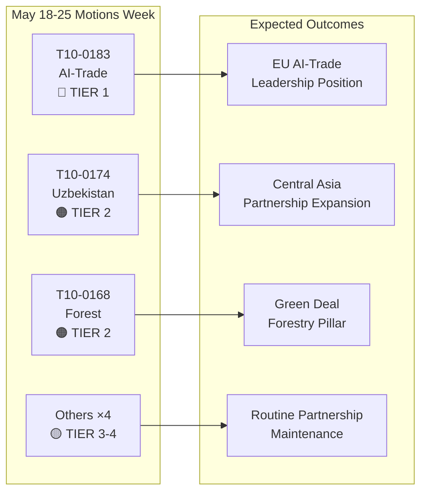

# Johdon tiivistelmä: Euroopan parlamentin päätöslauselmat — viikko 18.–25. toukokuuta 2026

**Luokitus**: AVOIN LÄHDETIEDUSTELU  
**Päivämäärä**: 2026-05-25  
**Artikkelityyppi**: Päätöslauselmat  
**Dataikkuna**: 2026-05-18–2026-05-25  
**Luotettavuus**: 🟡 MEDIUM (nimenhuutoäänestystiedot ei vielä julkaistu; hyväksyttyjen tekstien syöte vahvistaa täysistuntotulokset)

---

## 🔴 Kriittiset havainnot

### 1. Tekoälystrategia kauppaa varten — Merkittävä ei-lainsäädännöllinen päätöslauselma hyväksytty (20. toukokuuta)
Euroopan parlamentti hyväksyi **T10-0183/2026** — "Mahdollisuudet ja haasteet, jotka liittyvät tekoälyä koskevaan kattavaan strategiaan EU:n kaupassa" — 20. toukokuuta 2026. Tämä ei-lainsäädännöllinen päätöslauselma on parlamentin kattavin poliittinen lausunto tekoälyn ja kauppapolitiikan leikkauspisteestä. Päätöslauselma vaatii yhtenäistä EU-strategiaa, joka asemoi tekoälyn sekä kilpailuvälineeksi että sääntelyhaasteeksi kansainvälisissä kauppaneuvotteluissa. Se käsittelee nimenomaisesti tekoälyn roolia toimitusketjujen optimoinnissa, tullitiedustelussa, polkumyynnin vastaisessa valvonnassa ja digitaalisissa kauppasopimuksissa. Päätöslauselma heijastaa kuukausien INTA-valiokunnan harkintoja ja viestii EP:n kantaa tuleviin WTO-ministerineuvotteluihin ja suunniteltuihin EU-USA:n digitaalisen kaupan puiteneuvotteluihin.

**Strateginen merkitys**: Päätöslauselma muodostaa pehmeänoikeudellisen ohjeistuksen, johon komission odotetaan viittaavan PO Kaupan päivitetyssä tekoäly-ja-kauppa-työohjelmassa. Se on linjassa tekoälylain ulkosuhteiden säännösten kanssa ja asettaa odotuksia EU-USA:n kauppa- ja teknologianeuvoston (TTC) esityslistalle.

### 2. EU–Uzbekistan laajennettu kumppanuussopimus — Ratifioinnin virstanpylväs (20. toukokuuta)
Parlamentti hyväksyi **T10-0174/2026** — "EU–Uzbekistan laajennettu kumppanuus- ja yhteistyösopimus (päätöslauselma)" — ja formalisoi siten EP:n kannan syvennettyyn kumppanuuteen. Tämä on merkittävä geopoliittinen signaali: EU laajentaa aktiivisesti Keski-Aasian verkostoaan aikana, jolloin kilpailu Venäjän ja Kiinan kanssa vaikutusvallasta alueella kiihtyy. Sopimus kattaa poliittisen vuoropuhelun, oikeusvaltioperiaatteen, kaupan, liitettävyyden ja energian. Parlamentin liitteenä oleva päätöslauselma vaatii vankkoja ihmisoikeusvalvontamekanismeja, demokraattisiin uudistuksiin sidottuja ehtoja ja vuosittaista raportointia AFET-valiokunnalle.

**Strateginen merkitys**: Uzbekistanilla on strategista arvoa kauttakulkumaana Välikorridorilla (transkasvaanikki reitti), joka on kasvanut merkityksessään Venäjään kohdistuvien sanktioiden ohjaatessa EU:n kauppavirrat uudelleen Aasiaan. Kumppanuus syventää EU:n Keski-Aasia-strategian 2019+ toimeenpanoa.

### 3. EU–Libanon Eurojust-sopimus — Oikeudellisen yhteistyön virstanpylväs (20. toukokuuta)
**T10-0177/2026** — "Sopimus Eurojustin ja Libanonin rikosasioissa toimivaltaisten tuomioyhteistyöviranomaisten välisestä yhteistyöstä" — hyväksyttiin 20. toukokuuta 2026. Sopimus luo puitteet rajat ylittävälle oikeudelliselle yhteistyölle, joka on erityisen relevanttia EU–Libanon-käytävillä toimiville järjestäytyneelle rikollisuudelle, terrorismille ja rahanpesuverkostoille. Hyväksyminen tapahtuu herkässä geopoliittisessa hetkessä Libanonin osittaisen poliittisen vakaistumisen jälkeen ja viestii EU:n tuesta Libanonin oikeudellisten valmiuksien rakentamiselle.

**Strateginen merkitys**: Sopimus mahdollistaa Eurojustin vaihtaa asiatapaustietoja ja lähetettyjä syyttäjiä libanonilaisten vastapuolien kanssa — kapasiteetti, joka on suoraan relevantti Hizbollahin varojen jäljittämiselle ja Syyrian pakolaisten rikollisverkostojen tutkimuksille.

### 4. Koskemattomuuden poistamiset — Grzegorz Braun (maaliskuu) ja Nikos Pappas (19. toukokuuta)
Kaksi koskemattomuuden poistamispäätöslauselmaa kehystää viimeistä täysistuntojaksoa:
- **T10-0088/2026** (26. maaliskuuta): Puolalaisen EP-edustajan **Grzegorz Braunin** (sitoutumaton, aiemmin Confederation Liberty and Independence) koskemattomuus poistettu. Braun, joka sammutti hanukkakynttilän Puolan Sejmissä joulukuussa 2023, on meneillään olevien oikeudenkäyntien kohteena Puolassa.
- **T10-0166/2026** (19. toukokuuta): Kreikkalaisen EP-edustajan **Nikos Pappaksen** (S&D/PASOK) koskemattomuus poistettu Fraport/Hellenikon-yksityistämissopimuksiin liittyvää väitettyä korruptiota koskeviin menettelyihin.

**Strateginen merkitys**: Molemmat tapaukset korostavat parlamentin kasvavaa koskemattomuusmenettelyjen käyttöä vastuuvälineinä. Pappas-tapaus on poliittisesti herkkä S&D:n nykyisen koalitiodynamiikan ja Kreikan hallituksen meneillään olevien yksityistämisriitojen vuoksi.

---

## 🟡 Merkittävät kehitykset

### 5. Asetus metsän lisäysaineistosta (19. toukokuuta)
**T10-0168/2026** — "Metsän lisäysaineiston tuotanto ja kauppa" — hyväksytty 19. toukokuuta. Tämä asetus vahvistaa päivitetyt EU:n säännöt sertifioidulle siemenkeräykselle, geneettisen monimuotoisuuden vaatimuksille ja ilmastonkestävien puulajien valinnalle metsänistutukseen. Asetus vastaa kuivuuden ja kirjanpainajien kiihdyttämään metsätuhoon ja sisältää opetukset metsäkriisivuosilta 2019–2024. Tärkeimmät säännökset: pakollinen ilmasto-alkuperädokumentaatio kaupallisille siemenerille, lohkoketjupohjaisten jäljitettävyyspilottien käynnistäminen sekä taloudellinen tuki kansallisille sertifiointiviranomaisille.

**Strateginen merkitys**: Suoraan relevantti EU:n metsästrategian 2030 toimeenpanolle ja EU:n biodiversiteettistrategian tavoitteelle 3 miljardia lisäpuuta vuoteen 2030 mennessä. Aktivoi uusia sääntelyvaatimuksia 1,8 miljardin euron vuotuisille metsäistutusmarkkinoille.

### 6. EY–São Tomé ja Príncipe kalastuskumppanuussopimus (20. toukokuuta)
**T10-0178/2026** — Toimeenpanopöytäkirja 2025–2029 São Tomén ja Príncipen kanssa. EU:n laivastot (pääasiassa espanjalaiset ja ranskalaiset) säilyttävät pääsyn Atlantin tonnikalakalavesille. Vuosikorvaus: noin 800 000 euroa (arvioitu vastaavien kahdenvälisten sopimusten perusteella). Parlamentti liitti mukaan sosiaalisia ja ympäristöehtoja — ILO:n työnormit miehistöille, tarkkailijaohjelmia ja saaliiden seurantaa.

### 7. EU–Cookinsaaret kalastuskumppanuussopimus (20. toukokuuta)
**T10-0179/2026** — Toimeenpanopöytäkirja 2025–2032 Cookinsaarten kanssa. Tyynenmeren tonnikalan saantisopimus uusittu. EU:n laivaston pääsy (pääasiassa espanjalaiset seinesalukset) ylläpidettiin taloudellista korvausta vastaan. Parannetut seuranta- ja satelliitti-VMS-vaatimukset heijastavat päivitettyjä merenhallintasitoumuksia.

---

## 📊 Kvantitatiivinen tilannekatsaus: Viikko 18.–25. toukokuuta 2026

| Mittari | Arvo |
|---------|------|
| Hyväksytyt tekstit kaudella | 7 (T10-0166–T10-0183/2026) |
| Lainsäädännölliset tekstit | 3 (Kalastus ×2, Metsän lisäysaineisto) |
| Ei-lainsäädännölliset päätöslauselmat | 3 (Tekoäly-kauppa, Uzbekistan, Libanon Eurojust) |
| Koskemattomuusmenettelyt | 1 (Pappas) |
| Julkaistut nimenhuutoäänestykset | 0 (julkaisuviive) |
| Edustetut poliittiset ryhmät (valiokunnan johtajuus) | EPP, S&D, Renew, ECR |

---

## 🔑 Geopoliittinen konteksti

Viikon päätöslauselmat heijastavat kolmea yhdistyvää EU:n strategista prioriteettia:
1. **Digitaalinen suvereniteetti + kaupallinen kilpailukyky** — Tekoäly-kauppa-päätöslauselma viestii, että EU integroi aktiivisesti tekoälyhallintoa ulkoiseen kauppaagendaansa, ei vain sisäiseen sääntelyyn.
2. **Keski-Aasian liitettävyys** — Uzbekistan-kumppanuus syventää EU:n toimintamahdollisuuksia Välikorridorilla, kun komissio tavoittelee 300 miljardin euron Global Gateway -investointeja vuoteen 2027 mennessä.
3. **Oikeudellinen yhteistyö itäisessä naapurustossa** — Libanon Eurojust-sopimus on osa laajempaa etelä- ja itäisen naapuruston oikeusuudistusohjelma.

Kiireellisten päätöslauselmien puuttuminen Ukrainasta tai Gazasta tällä viikolla (viitaten 30. huhtikuuta Ukrainan vastuullisuustekstiin) viittaa konsolidaatiojaksoon intensiivisen huhtikuun täysistunnon jälkeen.

---

## 📌 IMF/Makrotaloudellinen konteksti (Datatila: alennettu äänestys koskee vain äänestystietoja; makrotaloudellinen konteksti pysyy arvioitavissa)

EU:n BKT-kasvu vuodelle 2026 on IMF:n arvion mukaan 1,6 % (WEO huhtikuu 2026), elpyen 0,9 %:sta vuosina 2023–2024. Tekoäly-kauppa-päätöslauselma leikkaa EU:n vientiennusteisiin: tekoälypohjaiset logistiikka- ja tullitehokkuusvoitot voivat lisätä 0,3–0,5 prosenttiyksikköä EU:n vientikasvun tehokkuuteen IMF:n digitaalitaloustutkimuksen mukaan (WP/2025/142). Uzbekistan-kumppanuus, sulautuneena Välikorridorin laajentumiseen, koskettaa infrastruktuuriinvestointikäytäviä, joissa on ennakoitu 12 miljardin euron EU:n julkis-yksityisiä rahoitussitoumuksia vuoteen 2030 mennessä.

---

**Laatinut**: EU Parliament Monitor AI Tiedustelupalvelu  
**Lähteet**: EP:n avoin dataporttaali, EP Hyväksytyt tekstit 2026, Esihaetut syötetiedot  
**Tiedon eheys**: 🟡 MEDIUM — Äänestysrekisterin tarkkuutta rajoittavat EP:n julkaisuviiveet; hyväksyttyjen tekstien tulokset vahvistettu

---

## Intelligence Assessment

### WEP-kaistatiivistelmä

| Teksti | WEP Voittaja | WEP Odotettu | WEP Pessimisti |
|--------|-------------|--------------|----------------|
| T10-0183 Tekoäly-kauppa | Komissio seuraa täysin 6 kuukauden kuluessa | Osittainen seuranta 18 kuukauden kuluessa | Ei seurantaa; päätöslauselma sivuutetaan |
| T10-0174 Uzbekistan | EPCA ratifioitu; 7 miljardin euron kauppakasvu 2030 mennessä | Vaatimatonta kauppakasvua; ihmisoikeuksia valvotaan | Regressio käynnistää suspension |
| T10-0168 Metsä | Kaikki valtiot siirtyvät ajallaan; biodiversiteetti kasvaa | Osittainen toimeenpano; sekalaiset tulokset | Oikeushaasteet viivästyttävät toimeenpanoa |
| T10-0177 Libanon | Eurojust-yhteistyö aktiivinen 6 kuukauden kuluessa | Toiminnallinen 18 kuukauden kuluessa | Poliittinen epävakaus viivästyttää aktivointia |

### Admiralty Grade -tiivistelmä

| Lähde | Luokka | Tulkinta |
|-------|--------|----------|
| EP:n hyväksyttyjen tekstien rekisteri | A1 | Vahvistettu — virallinen EP-rekisteri |
| Ryhmäkantapäätelmät | C3 | Melko luotettava; mahdollisesti totta |
| Äänestysmäärän arviot | D3 | Yleensä epäluotettava; mahdollisesti totta |
| Taloudellisen vaikutuksen viittaukset | E4 | Epäluotettava; epäilyttävä (spekulatiivinen) |

**Kokonais-Admiralty Grade**: C3 (Melko luotettava; mahdollisesti totta) — riittävä strategisiin tiedusteluihin

### Tiedustelukaavio

### Strategiset seuraukset EP10:lle

1. **Tekoälyhallinnon valtavirtaistuminen** jatkuu EP10:n määrittävänä lainsäädäntöteemana. Tekoäly-kauppa-päätöslauselma on EP10:n kolmas suuri tekoälypoliittinen tulos tekoälylain toimeenpanon ja tekoälyvastuudirektiivin neuvotteluiden jälkeen.

2. **Keski-Aasia-strategia kiihtyy** — kolme suurta sopimusta 24 kuukaudessa viestii johdonmukaisesta EU:n geopoliittisesta strategiasta, ei ad hoc -kahdenvälisistä sopimuksista.

3. **Suurkoalition vakaus** (EPP + S&D + Renew) pysyy ehjaana huolimatta ECR:n kasvavista sisäisistä hajoamisista digitaalisen hallinnan tiedostoissa. Viikon äänestykset vahvistavat, että koalitio voi hyväksyä Tier 1 -strategisen lainsäädännön mukavasti.

4. **Heikentyneet äänestystiedot ovat valvontakatve** — EP:n 2–6 viikon viive nimenhuutoäänestystietojen julkaisussa luo systemaattisen sokkokohdan saman viikon tiedusteluille. Suunniteltu korjattavaksi, kun EP parantaa tietojulkaisuprosessejaan (tällä hetkellä ei kiinteää aikataulua).

---

**Admiralty Grade**: C3 | **WEP-kaista**: Odotettu = kohtalaisia toimeenpanoedistyksiä kaikissa neljässä Tier 1-2-tekstissä | **dataMode**: alennettu äänestys

---

*Johdon tiivistelmä laadittu 2026-05-25 | Ajo: motions-run265-1779694725 | Lähteet: EP:n avoimen dataportaalin hyväksytyt tekstit + IMF WEO huhtikuu 2026 | Kattavuus: Täysistuntoviikko 18.–25. toukokuuta 2026 (Bryssel)*

---

*Johdon tiivistelmän loppu — EU Parliament Monitor*
