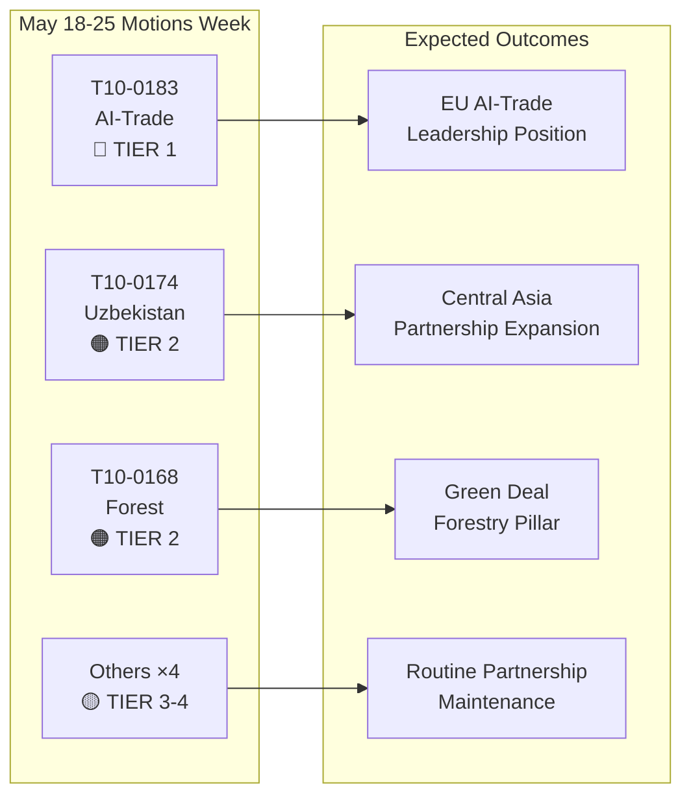

# Note de synthèse exécutive : Résolutions du Parlement européen — semaine du 18 au 25 mai 2026

**Classification** : RENSEIGNEMENT DE SOURCE OUVERTE  
**Date** : 2026-05-25  
**Type d'article** : Résolutions  
**Fenêtre de données** : 2026-05-18 au 2026-05-25  
**Confiance** : 🟡 MEDIUM (données de vote nominal non encore publiées ; le flux des textes adoptés confirme les résultats pléniers)

---

## 🔴 Constats critiques

### 1. Stratégie en matière d'IA pour le commerce — Résolution non législative historique adoptée (20 mai)
Le Parlement européen a adopté **T10-0183/2026** — « Opportunités et défis liés à une stratégie globale en matière d'intelligence artificielle pour le commerce de l'UE » — le 20 mai 2026. Cette résolution non législative constitue la déclaration de politique la plus complète du Parlement sur l'intersection entre l'IA et la politique commerciale. La résolution appelle à une stratégie européenne cohérente positionnant l'intelligence artificielle à la fois comme un outil de compétitivité et un défi réglementaire dans les négociations commerciales internationales. Elle aborde explicitement le rôle de l'IA dans l'optimisation des chaînes d'approvisionnement, le renseignement douanier, la surveillance anti-dumping et les accords commerciaux numériques. La résolution reflète des mois de délibérations de la commission INTA et signale la position du PE à l'approche des futures conférences ministérielles de l'OMC et des pourparlers planifiés entre l'UE et les États-Unis sur un cadre de commerce numérique.

**Signification stratégique** : La résolution constitue des orientations de droit souple que la Commission devrait mentionner dans le programme de travail actualisé de la DG Commerce sur l'IA et le commerce. Elle s'aligne sur les dispositions relatives aux relations extérieures du règlement sur l'IA et fixe les attentes à l'ordre du jour du Conseil du commerce et des technologies (TTC) UE-États-Unis.

### 2. Accord de partenariat renforcé UE–Ouzbékistan — Étape de la ratification (20 mai)
Le Parlement a adopté **T10-0174/2026** — « Accord de partenariat et de coopération renforcé UE–Ouzbékistan (résolution) » — formalisant ainsi la position du PE sur le partenariat approfondi. Cela représente un signal géopolitique important : l'UE étend activement son réseau en Asie centrale à un moment où s'intensifie la concurrence avec la Russie et la Chine pour l'influence dans la région. L'accord couvre le dialogue politique, l'état de droit, le commerce, la connectivité et l'énergie. La résolution accompagnatrice du Parlement appelle à des mécanismes robustes de surveillance des droits de l'homme, à la conditionnalité des réformes démocratiques et à un rapport annuel présenté à la commission AFET.

**Signification stratégique** : L'Ouzbékistan a une valeur stratégique en tant qu'État de transit sur le Corridor intermédiaire (route transcaspienne), dont l'importance s'est accrue car les sanctions contre la Russie réorientent les flux commerciaux UE-Asie. Le partenariat approfondit la mise en œuvre de la Stratégie EU–Asie centrale 2019+.

### 3. Accord UE–Liban sur Eurojust — Étape de la coopération judiciaire (20 mai)
**T10-0177/2026** — « Accord sur la coopération entre Eurojust et les autorités libanaises compétentes en matière de coopération judiciaire en matière pénale » — a été adopté le 20 mai 2026. Cet accord établit un cadre pour la coopération judiciaire transfrontalière, particulièrement pertinent pour les réseaux de criminalité organisée, de terrorisme et de blanchiment d'argent opérant dans les corridors UE–Liban. L'adoption intervient à un moment géopolitique sensible après la stabilisation politique partielle du Liban et signale le soutien de l'UE au renforcement des capacités judiciaires libanaises.

**Signification stratégique** : L'accord permet à Eurojust d'échanger des informations sur les affaires et des procureurs détachés avec les homologues libanais — une capacité directement pertinente pour le suivi des actifs du Hezbollah et les enquêtes sur les réseaux criminels de réfugiés syriens.

### 4. Levées d'immunité — Grzegorz Braun (mars) et Nikos Pappas (19 mai)
Deux résolutions de levée d'immunité encadrent la récente période plénière :
- **T10-0088/2026** (26 mars) : Immunité du député polonais **Grzegorz Braun** (non inscrit, anciennement Confederation Liberty and Independence) levée. Braun, qui a éteint une ménorah au Sejm polonais en décembre 2023, fait l'objet de procédures judiciaires en cours en Pologne.
- **T10-0166/2026** (19 mai) : Immunité du député grec **Nikos Pappas** (S&D/PASOK) levée pour des procédures liées à une prétendue corruption dans les contrats de privatisation Fraport/Hellenikon.

**Signification stratégique** : Ces deux cas mettent en évidence l'utilisation croissante par le Parlement des procédures d'immunité comme outils de responsabilité. L'affaire Pappas est politiquement sensible compte tenu de la dynamique de coalition actuelle du groupe S&D et des litiges de privatisation en cours du gouvernement grec.

---

## 🟡 Développements significatifs

### 5. Règlement sur les matériels forestiers de reproduction (19 mai)
**T10-0168/2026** — « Production et commercialisation de matériels forestiers de reproduction » — adopté le 19 mai. Ce règlement établit des règles mises à jour à l'échelle de l'UE pour la récolte de semences certifiées, les exigences en matière de diversité génétique et la sélection d'espèces adaptées au climat pour le reboisement. Le règlement répond à l'accélération du dépérissement des forêts due à la sécheresse et aux scolytes, et intègre les enseignements des années de crise forestière 2019–2024. Dispositions clés : documentation obligatoire sur l'origine climatique des lots de semences commerciales, projets pilotes de traçabilité par blockchain et soutien financier aux autorités nationales de certification.

**Signification stratégique** : Directement pertinent pour la mise en œuvre de la Stratégie forestière de l'UE 2030 et les objectifs de la Stratégie pour la biodiversité visant 3 milliards d'arbres supplémentaires d'ici 2030. Active de nouvelles exigences réglementaires pour le marché annuel des semis forestiers d'une valeur de 1,8 milliard d'euros.

### 6. Accord de partenariat de pêche CE–São Tomé-et-Príncipe (20 mai)
**T10-0178/2026** — Protocole de mise en œuvre 2025–2029 avec São Tomé-et-Príncipe. Les flottes de l'UE (principalement espagnoles et françaises) maintiennent l'accès aux eaux thonières de l'Atlantique. Compensation annuelle : environ 800 000 euros (estimée, sur la base d'accords bilatéraux similaires). Le Parlement a attaché des conditionnalités sociales et environnementales — normes du travail de l'OIT pour les équipages, programmes d'observateurs et surveillance des captures.

### 7. Accord de partenariat de pêche UE–Îles Cook (20 mai)
**T10-0179/2026** — Protocole de mise en œuvre 2025–2032 avec les Îles Cook. Accord d'accès au thon du Pacifique renouvelé. L'accès de la flotte de l'UE (principalement des senneurs espagnols) est maintenu en échange d'une contribution financière. Les exigences renforcées en matière de surveillance et de VMS par satellite reflètent les engagements actualisés en matière de gouvernance des océans.

---

## 📊 Instantané quantitatif : Semaine du 18 au 25 mai 2026

| Indicateur | Valeur |
|------------|--------|
| Textes adoptés dans la période | 7 (T10-0166 à T10-0183/2026) |
| Textes législatifs | 3 (Pêche ×2, Matériels forestiers) |
| Résolutions non législatives | 3 (IA-Commerce, Ouzbékistan, Liban Eurojust) |
| Procédures d'immunité | 1 (Pappas) |
| Votes nominaux publiés | 0 (délai de publication) |
| Familles politiques représentées (direction de commission) | EPP, S&D, Renew, ECR |

---

## 🔑 Contexte géopolitique

Les résolutions de la semaine reflètent trois priorités stratégiques européennes convergentes :
1. **Souveraineté numérique + compétitivité commerciale** — La résolution sur l'IA dans le commerce signale que l'UE intègre activement la gouvernance de l'IA dans son agenda commercial extérieur, et pas seulement dans la réglementation interne.
2. **Connectivité en Asie centrale** — Le partenariat avec l'Ouzbékistan approfondit le levier de l'UE sur le Corridor intermédiaire tandis que la Commission poursuit des investissements Global Gateway de 300 milliards d'euros d'ici 2027.
3. **Coopération judiciaire dans le voisinage oriental** — L'accord Liban-Eurojust s'inscrit dans un programme plus large de réforme de la justice dans le voisinage méridional et oriental.

L'absence de résolutions d'urgence sur l'Ukraine ou Gaza cette semaine (en notant le texte sur la responsabilisation de l'Ukraine du 30 avril) suggère une période de consolidation après un plenum d'avril intense.

---

## 📌 Contexte IMF/macroéconomique (Mode données : le vote dégradé s'applique uniquement aux données de vote ; le contexte macroéconomique reste évaluable)

La croissance du PIB de l'UE pour 2026 est projetée par l'IMF à 1,6 % (WEO avril 2026), se redressant depuis 0,9 % en 2023–2024. La résolution sur l'IA dans le commerce s'inscrit dans les projections d'exportation de l'UE : les gains d'efficacité logistique et douanière pilotés par l'IA pourraient ajouter 0,3 à 0,5 point de pourcentage à l'efficacité de la croissance des exportations de l'UE selon les recherches de l'IMF sur l'économie numérique (WP/2025/142). Le partenariat ouzbek, intégré dans l'expansion du Corridor intermédiaire, touche des corridors d'investissement d'infrastructure avec des engagements de financement public-privé européen projetés à 12 milliards d'euros d'ici 2030.

---

**Préparé par** : EU Parliament Monitor Système de renseignement IA  
**Sources** : Portail de données ouvertes EP, Textes adoptés par l'EP 2026, Données de flux préchargées  
**Intégrité des données** : 🟡 MEDIUM — La granularité du registre des votes est limitée par les délais de publication de l'EP ; les résultats des textes adoptés sont confirmés

---

## Intelligence Assessment

### Résumé des bandes WEP

| Texte | WEP Gagnant | WEP Attendu | WEP Pessimiste |
|-------|-------------|-------------|----------------|
| T10-0183 IA-Commerce | La Commission assure un suivi complet dans les 6 mois | Suivi partiel dans les 18 mois | Aucun suivi ; résolution ignorée |
| T10-0174 Ouzbékistan | EPCA ratifié ; croissance commerciale de 7 milliards d'euros d'ici 2030 | Croissance commerciale modeste ; droits de l'homme surveillés | La régression déclenche la suspension |
| T10-0168 Forêt | Tous les États transposent à temps ; biodiversité en hausse | Transposition partielle ; résultats mitigés | Des défis juridiques retardent la mise en œuvre |
| T10-0177 Liban | Coopération Eurojust active dans les 6 mois | Opérationnel dans les 18 mois | L'instabilité politique retarde l'activation |

### Résumé de la note de l'Amirauté

| Source | Note | Interprétation |
|--------|------|----------------|
| Registre des textes adoptés du PE | A1 | Confirmé — registre officiel du PE |
| Inférences sur les positions des groupes | C3 | Assez fiable ; peut-être vrai |
| Estimations de l'ampleur des votes | D3 | Habituellement peu fiable ; peut-être vrai |
| Références d'impact économique | E4 | Peu fiable ; douteux (spéculatif) |

**Note globale de l'Amirauté** : C3 (Assez fiable ; peut-être vrai) — suffisant à des fins de renseignement stratégique

### Diagramme de renseignement

### Implications stratégiques pour le PE10

1. **L'intégration de la gouvernance de l'IA** continue d'être le thème législatif déterminant du PE10. La résolution sur l'IA dans le commerce est le troisième résultat majeur de politique en matière d'IA du PE10, après la mise en œuvre du règlement sur l'IA et les négociations sur la directive sur la responsabilité en matière d'IA.

2. **La stratégie Asie centrale s'accélère** — trois accords majeurs en 24 mois signalent une stratégie géopolitique européenne cohérente, non des transactions bilatérales ad hoc.

3. **La stabilité de la grande coalition** (EPP + S&D + Renew) reste intacte malgré les divisions internes croissantes de l'ECR sur les dossiers de gouvernance numérique. Les votes de la semaine confirment que la coalition peut adopter confortablement la législation stratégique de niveau 1.

4. **Les données de vote dégradées constituent une lacune de surveillance** — le délai de publication de 2 à 6 semaines du PE pour les données de vote nominal crée un angle mort systématique dans le renseignement hebdomadaire. Prévu pour être résolu lorsque le PE améliorera ses processus de publication des données (actuellement sans calendrier précis).

---

**Note de l'Amirauté** : C3 | **Bande WEP** : Attendu = progrès modéré dans la mise en œuvre pour les quatre textes de niveau 1-2 | **dataMode** : vote dégradé

---

*Note de synthèse exécutive préparée le 2026-05-25 | Exécution : motions-run265-1779694725 | Sources : Textes adoptés du portail de données ouvertes PE + IMF WEO avril 2026 | Couverture : Semaine plénière du 18 au 25 mai 2026 (Bruxelles)*

---

*Fin de la note de synthèse exécutive — EU Parliament Monitor*
