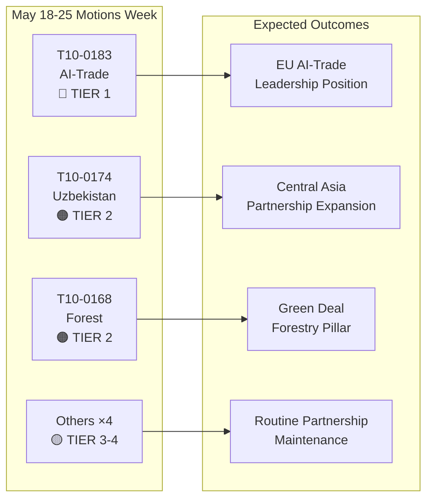

# סיכום מנהלים: החלטות הפרלמנט האירופי — שבוע 18–25 במאי 2026

**סיווג**: מודיעין ממקורות פתוחים  
**תאריך**: 2026-05-25  
**סוג מאמר**: החלטות  
**חלון נתונים**: 2026-05-18 עד 2026-05-25  
**רמת ביטחון**: 🟡 MEDIUM (נתוני הצבעה בהצבעה שמית טרם פורסמו; עדכון הטקסטים שאומצו מאשר את תוצאות המליאה)

---

## 🔴 ממצאים קריטיים

### 1. אסטרטגיית בינה מלאכותית לסחר — החלטה לא-חקיקתית פורצת דרך אומצה (20 במאי)
הפרלמנט האירופי אימץ את **T10-0183/2026** — "הזדמנויות ואתגרים הנובעים מאסטרטגיה מקיפה לבינה מלאכותית בסחר האיחוד האירופי" — ב-20 במאי 2026. החלטה לא-חקיקתית זו מהווה את ההצהרה המדינית המקיפה ביותר של הפרלמנט בנושא צומת הבינה המלאכותית ומדיניות הסחר. ההחלטה קוראת לאסטרטגיה קוהרנטית של האיחוד האירופי שתמצב בינה מלאכותית הן ככלי תחרותי והן כאתגר רגולטורי במשא ומתן מסחרי בינלאומי. היא עוסקת מפורשות בתפקיד הבינה המלאכותית באופטימיזציה של שרשראות אספקה, מודיעין מכס, פיקוח אנטי-דמפינג והסכמי סחר דיגיטלי. ההחלטה משקפת חודשים של דיונים בוועדת INTA ומסמנת את עמדת הפרלמנט הפרלמנט האירופי לקראת ועידות שרי ה-WTO הקרובות ושיחות מתוכננות בין האיחוד האירופי לארצות הברית על מסגרת סחר דיגיטלי.

**משמעות אסטרטגית**: ההחלטה מהווה הנחיות משפט-רך שהנציבות צפויה להתייחס אליהן בתוכנית העבודה המעודכנת של מינהל הסחר הכללי בנושא בינה מלאכותית בסחר. היא תואמת את הוראות תקנת הבינה המלאכותית בנוגע ליחסי חוץ ומגדירה ציפיות לסדר היום של מועצת המסחר והטכנולוגיה TTC בין האיחוד האירופי לארצות הברית.

### 2. הסכם שותפות מוגבר בין האיחוד האירופי לאוזבקיסטן — ציון דרך לאישרור (20 במאי)
הפרלמנט אימץ את **T10-0174/2026** — "הסכם שותפות ושיתוף פעולה מוגבר בין האיחוד האירופי לאוזבקיסטן (החלטה)" — ובכך הוסמכה עמדת הפרלמנט האירופי על השותפות המעמיקה. זהו אות גיאופוליטי חשוב: האיחוד האירופי מרחיב באופן פעיל את רשת אסיה המרכזית שלו בתקופה של התגברות התחרות עם רוסיה וסין על השפעה באזור. ההסכם מכסה דיאלוג פוליטי, שלטון חוק, מסחר, קישוריות ואנרגיה. ההחלטה הנלווית של הפרלמנט קוראת למנגנוני פיקוח חזקים על זכויות אדם, מותנות ברפורמות דמוקרטיות, ודיווח שנתי לוועדת AFET.

**משמעות אסטרטגית**: לאוזבקיסטן ערך אסטרטגי כמדינת מעבר לאורך המסדרון האמצעי (מסלול טרנס-קספי), שצבר חשיבות כאשר סנקציות על רוסיה מכוונות מחדש את זרמי הסחר האירופי-אסייתי. השותפות מעמיקה את יישום אסטרטגיית האיחוד האירופי לאסיה המרכזית 2019+.

### 3. הסכם האיחוד האירופי-לבנון בנושא יורוג'וסט — ציון דרך לשיתוף פעולה שיפוטי (20 במאי)
**T10-0177/2026** — "הסכם על שיתוף פעולה בין יורוג'וסט לרשויות הלבנוניות המוסמכות לשיתוף פעולה שיפוטי בעניינים פליליים" — אומץ ב-20 במאי 2026. הסכם זה מקים מסגרת לשיתוף פעולה שיפוטי חוצה גבולות, רלוונטי במיוחד לרשתות פשע מאורגן, טרור והלבנת הון הפועלות במסדרונות האיחוד האירופי-לבנון. האימוץ מגיע ברגע גיאופוליטי רגיש לאחר היציבות הפוליטית החלקית של לבנון, ומסמן את תמיכת האיחוד האירופי בבניית יכולות שיפוטיות לבנוניות.

**משמעות אסטרטגית**: ההסכם מאפשר ליורוג'וסט להחליף מידע תיקים ותובעים מושאלים עם עמיתים לבנוניים — יכולת רלוונטית ישירות למעקב אחר נכסי חיזבאללה וחקירות רשתות פשע של פליטים סורים.

### 4. ביטול חסינות — גז'גוז' בראון (מרץ) וניקוס פפאס (19 במאי)
שתי החלטות ביטול חסינות מסגרות את תקופת המליאה האחרונה:
- **T10-0088/2026** (26 במרץ): חסינותו של חבר הפרלמנט הפולני **Grzegorz Braun** (לא-מסונף, לשעבר Confederation Liberty and Independence) בוטלה. בראון, שכיבה חנוכייה בסיים הפולני בדצמבר 2023, עומד בפני הליכים משפטיים מתמשכים בפולין.
- **T10-0166/2026** (19 במאי): חסינותו של חבר הפרלמנט היווני **Nikos Pappas** (S&D/PASOK) בוטלה להליכים הנוגעים לשחיתות נטענת בחוזי הפרטה Fraport/Hellenikon.

**משמעות אסטרטגית**: שני המקרים מדגישים את השימוש הגובר של הפרלמנט בהליכי חסינות ככלי אחריותיות. מקרה פפאס רגיש פוליטית לאור דינמיקת הקואליציה הנוכחית של S&D וסכסוכי ההפרטה המתמשכים של הממשלה היוונית.

---

## 🟡 התפתחויות משמעותיות

### 5. תקנת חומרי רבייה ביערות (19 במאי)
**T10-0168/2026** — "ייצור ושיווק של חומרי רבייה ביערות" — אומצה ב-19 במאי. תקנה זו קובעת כללים מעודכנים ברחבי האיחוד האירופי לאיסוף זרעים מוסמך, דרישות גיוון גנטי ובחירת מיני עצים מותאמי אקלים לייעור מחדש. התקנה מגיבה להתפשטות מוות יערות מואצת עקב בצורת ומינקפת קליפת העץ, ומשלבת לקחים משנות משבר היערות 2019-2024. הוראות מרכזיות: תיעוד מקור אקלים חובה לאצוות זרעים מסחריות, פיילוטי מעקב בלוקצ'יין ותמיכה כספית לרשויות הסמכה לאומיות.

**משמעות אסטרטגית**: רלוונטית ישירות ליישום אסטרטגיית היערות של האיחוד האירופי 2030 ויעדי אסטרטגיית המגוון הביולוגי של 3 מיליארד עצים נוספים עד 2030. מפעילה דרישות רגולטוריות חדשות לשוק שתילי היערות השנתי בשווי 1.8 מיליארד יורו.

### 6. הסכם שותפות דייג EG–סאו טומה ופרינסיפה (20 במאי)
**T10-0178/2026** — פרוטוקול יישום 2025-2029 עם סאו טומה ופרינסיפה. ציי האיחוד האירופי (בעיקר ספרדיים וצרפתיים) שומרים על גישה למימי טונה אטלנטיים. פיצוי שנתי: כ-800,000 יורו (הערכה, בהתבסס על הסכמים דו-צדדיים דומים). הפרלמנט צירף מותניות חברתיות וסביבתיות — תקני עבודה של ארגון ILO לצוות, תוכניות תצפית ומעקב תפיסה.

### 7. הסכם שותפות דייג האיחוד האירופי-איי קוק (20 במאי)
**T10-0179/2026** — פרוטוקול יישום 2025-2032 עם איי קוק. הסכם גישה לטונה מהאוקיינוס השקט חודש. גישת ציי האיחוד האירופי (בעיקר ספינות רשת טבעת ספרדיות) נשמרת בתמורה לתרומה כספית. דרישות ניטור ו-VMS לוויין משופרות משקפות מחויבויות מעודכנות לממשל אוקיינוסים.

---

## 📊 תמונת מצב כמותית: שבוע 18–25 במאי 2026

| מדד | ערך |
|-----|-----|
| טקסטים שאומצו בתקופה | 7 (T10-0166 עד T10-0183/2026) |
| טקסטים חקיקתיים | 3 (דיג ×2, חומרי רבייה ביערות) |
| החלטות לא-חקיקתיות | 3 (בינה מלאכותית-סחר, אוזבקיסטן, לבנון יורוג'וסט) |
| הליכי חסינות | 1 (פפאס) |
| הצבעות שמיות שפורסמו | 0 (עיכוב פרסום) |
| משפחות פוליטיות מיוצגות (הנהגת ועדה) | EPP, S&D, Renew, ECR |

---

## 🔑 הקשר גיאופוליטי

ההחלטות של השבוע משקפות שלוש עדיפויות אסטרטגיות מתכנסות של האיחוד האירופי:
1. **ריבונות דיגיטלית + תחרותיות מסחרית** — החלטת הבינה המלאכותית בסחר מסמנת שהאיחוד האירופי משלב באופן פעיל ממשל בינה מלאכותית בסדר יום הסחר החיצוני שלו, לא רק בוויסות פנימי.
2. **קישוריות באסיה המרכזית** — שותפות אוזבקיסטן מעמיקה את מינוף האיחוד האירופי על המסדרון האמצעי בעוד הנציבות מבקשת השקעות Global Gateway בהיקף 300 מיליארד יורו עד 2027.
3. **שיתוף פעולה שיפוטי בשכנות המזרחית** — הסכם לבנון-יורוג'וסט הוא חלק מתוכנית רפורמה שיפוטית רחבה יותר בשכנות הדרומית והמזרחית.

היעדרם של החלטות דחיפות בנושא אוקראינה או עזה השבוע (תוך ציון טקסט האחריותיות האוקראיני מ-30 באפריל) מרמז על תקופת איחוד לאחר ישיבת מליאה אפריל עמוסה.

---

## 📌 הקשר IMF/כלכלה מאקרו (מצב נתונים: ההצבעה המדורגת חלה על נתוני הצבעה בלבד; ההקשר הכלכלי המאקרו-כלכלי נשאר ניתן להערכה)

IMF מעריך שצמיחת התמ"ג של האיחוד האירופי ל-2026 תעמוד על 1.6% (WEO אפריל 2026), בהתאוששות מ-0.9% ב-2023-2024. החלטת הבינה המלאכותית בסחר נחתכת עם תחזיות היצוא של האיחוד האירופי: רווחי יעילות לוגיסטיקה ומכס מונעי בינה מלאכותית עשויים להוסיף 0.3-0.5 נקודות אחוז ליעילות צמיחת יצוא האיחוד האירופי לפי מחקר IMF על כלכלה דיגיטלית (WP/2025/142). שותפות אוזבקיסטן, המשולבת בהרחבת המסדרון האמצעי, נוגעת למסדרונות השקעה בתשתיות עם התחייבויות מימון ציבורי-פרטי אירופי מוערכות ב-12 מיליארד יורו עד 2030.

---

**הוכן על ידי**: מערכת מודיעין הבינה המלאכותית של מעקב הפרלמנט האירופי  
**מקורות**: פורטל הנתונים הפתוח של הפרלמנט האירופי, טקסטים שאומצו 2026, נתוני עדכון שנטענו מראש  
**שלמות הנתונים**: 🟡 MEDIUM — פירוט רשומת ההצבעה מוגבל על ידי עיכובי פרסום הפרלמנט האירופי; תוצאות הטקסטים שאומצו אושרו

---

## Intelligence Assessment

### סיכום רצועת WEP

| טקסט | WEP זוכה | WEP צפוי | WEP פסימי |
|------|----------|-----------|-----------|
| T10-0183 בינה מלאכותית-סחר | הנציבות עוקבת במלואה תוך 6 חודשים | מעקב חלקי תוך 18 חודשים | אין מעקב; ההחלטה מתעלמת ממנה |
| T10-0174 אוזבקיסטן | EPCA מאושרר; צמיחה מסחרית של 7 מיליארד יורו עד 2030 | צמיחה מסחרית צנועה; זכויות אדם מנוטרות | נסיגה מפעילה השעיה |
| T10-0168 יערות | כל המדינות מיישמות בזמן; מגוון ביולוגי עולה | יישום חלקי; תוצאות מעורבות | אתגרים משפטיים מעכבים יישום |
| T10-0177 לבנון | שיתוף פעולה יורוג'וסט פעיל תוך 6 חודשים | תפקודי תוך 18 חודשים | אי-יציבות פוליטית מעכבת הפעלה |

### סיכום דרגת האדמירלות

| מקור | דרגה | פרשנות |
|------|------|---------|
| רשומת טקסטים שאומצו של הפרלמנט האירופי | A1 | מאושר — רשומה רשמית של הפרלמנט האירופי |
| הסקות עמדות קבוצה | C3 | אמין למדי; אפשרי שנכון |
| הערכות גודל הצבעה | D3 | בדרך כלל לא אמין; אפשרי שנכון |
| התייחסויות השפעה כלכלית | E4 | לא אמין; מפוקפק (ספקולטיבי) |

**דרגת אדמירלות כוללת**: C3 (אמין למדי; אפשרי שנכון) — מספיק למטרות מודיעין אסטרטגי

### תרשים מודיעין

### השלכות אסטרטגיות עבור EP10

1. **עיקרון ממשל הבינה המלאכותית** ממשיך להיות הנושא החקיקתי המגדיר של EP10. החלטת הבינה המלאכותית בסחר היא התפוקה המדינית השלישית הגדולה בתחום הבינה המלאכותית של EP10 לאחר יישום תקנת הבינה המלאכותית ומשא ומתן על הנחיית האחריות לבינה מלאכותית.

2. **האסטרטגיה לאסיה המרכזית מואצת** — שלוש הסכמות גדולות ב-24 חודשים מסמנות אסטרטגיה גיאופוליטית קוהרנטית של האיחוד האירופי, לא עסקאות דו-צדדיות אד-הוק.

3. **יציבות הקואליציה הגדולה** (EPP + S&D + Renew) נשארת שלמה למרות פיצולים פנימיים גוברים של ECR על קבצי ממשל דיגיטלי. הצבעות השבוע מאשרות שהקואליציה יכולה לאשר חקיקה אסטרטגית של רמה 1 בנוחות.

4. **נתוני הצבעה מדורגים הם פער ניטור** — עיכוב הפרסום של הפרלמנט האירופי של שבועיים עד שישה שבועות לנתוני הצבעה שמית יוצר נקודה עיוורת שיטתית במודיעין שבועי. מתוכנן לפתרון כשהפרלמנט האירופי ישפר את תהליכי פרסום הנתונים שלו (כרגע אין לוח זמנים קבוע).

---

**דרגת אדמירלות**: C3 | **רצועת WEP**: צפוי = התקדמות יישום מתונה לכל ארבעת הטקסטים ברמה 1-2 | **dataMode**: הצבעה מדורגת

---

*סיכום מנהלים הוכן ב-2026-05-25 | ריצה: motions-run265-1779694725 | מקורות: טקסטים שאומצו מהפורטל הפתוח לנתוני הפרלמנט האירופי + IMF WEO אפריל 2026 | כיסוי: שבוע מליאה 18-25 במאי 2026 (בריסל)*

---

*סוף סיכום מנהלים — EU Parliament Monitor*
