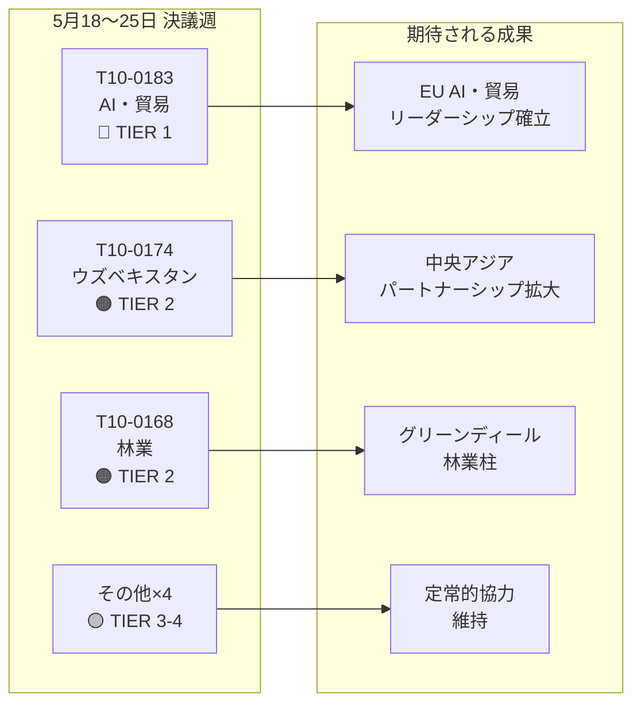

# 欧州議会エグゼクティブブリーフ：決議 — 2026年5月18日〜25日週

**分類**：オープンソース・インテリジェンス  
**日付**：2026-05-25  
**記事種別**：決議  
**データ対象期間**：2026-05-18〜2026-05-25  
**信頼度**：🟡 MEDIUM（記名投票データ未公開；採択テキスト更新により本会議結果を確認）

---

## 🔴 重大な発見事項

### 1. 貿易分野における AI 戦略 — 画期的な非立法決議の採択（5月20日）
欧州議会は2026年5月20日、**T10-0183/2026**「EU の貿易における包括的 AI 戦略から生じる機会と課題」を採択しました。この非立法決議は、議会が貿易政策と AI のガバナンスの交点について打ち出した最も包括的な政策声明です。決議は、AI を競争上の手段かつ国際的な通商交渉における規制課題として位置付ける、EU としての一貫した戦略を求めています。サプライチェーン最適化、税関インテリジェンス、アンチダンピング監視、デジタル貿易協定における AI の役割を明示的に取り上げています。本決議は INTA 委員会での数ヶ月にわたる審議を反映しており、来たる WTO 閣僚会議および EU・米国間のデジタル貿易枠組みに関する交渉に向けた欧州議会の立場を示すものです。

**戦略的意義**：本決議は、欧州委員会が更新した AI・通商に関する DG TRADE 作業計画において考慮することが見込まれるソフトロー・ガイダンスです。AI 規制法（AI Act）の対外関係条項と整合しており、EU・米国貿易技術評議会（TTC）の課題設定に対する期待を示しています。

### 2. EU・ウズベキスタン強化パートナーシップ協定 — 批准の節目（5月20日）
議会は**T10-0174/2026**「EU・ウズベキスタン強化パートナーシップ・協力協定（決議）」を採択し、深化する協力関係に対する欧州議会の立場を確立しました。これは重要な地政学的シグナルです。中央アジアにおけるロシアおよび中国との影響力争いが激化するなか、EU は中央アジアネットワークを積極的に拡大しています。本協定は政治対話、法の支配、貿易、連結性、エネルギーを包含しています。議会の付随決議は、民主改革を条件とした強固な人権監視メカニズムの設置と、AFET 委員会への年次報告を求めています。

**戦略的意義**：ウズベキスタンは中間回廊（トランスカスピアン・ルート）の沿線通過国として戦略的価値を有しており、ロシアへの制裁によって欧州・アジア間の貿易が再編されるなか、その重要性は一層高まっています。本協力関係は 2019 年以降の EU 中央アジア戦略の深化を促進するものです。

### 3. EU・レバノン間ユーロジャスト協定 — 司法協力の節目（5月20日）
**T10-0177/2026**「ユーロジャストとレバノン当局間の刑事司法協力に関する協力協定」が2026年5月20日に採択されました。本協定は越境司法協力の枠組みを確立するものであり、EU・レバノン間の回廊を縦断する組織犯罪ネットワーク、テロ、マネーロンダリングに特に関連します。採択は、レバノンの政治的部分安定という地政学的に微妙な時期に行われており、EU によるレバノンの司法能力構築支援を示すものです。

**戦略的意義**：本協定によりユーロジャストは、レバノン当局と捜査情報および出向検察官の交換が可能となり、ヒズボラの資産追跡やシリア難民犯罪ネットワークの捜査に直接関わる能力が付与されます。

### 4. 不逮捕特権の剥奪 — ブラウン（3月）、パパス（5月19日）
二つの不逮捕特権剥奪決議が直近の本会議期間を画しています。
- **T10-0088/2026**（3月26日）：ポーランドの欧州議会議員 **Grzegorz Braun**（無所属、旧 Confederation Liberty and Independence）の不逮捕特権剥奪。2023年12月にポーランド下院でハヌカの燭台を消火器で消したブラウン氏は、ポーランドにおける継続中の法的手続きの対象となっています。
- **T10-0166/2026**（5月19日）：ギリシャの欧州議会議員 **Nikos Pappas**（S&D/PASOK）の不逮捕特権剥奪。フラポート/ヘレニコン民営化契約をめぐる疑惑に関する手続きを対象としています。

**戦略的意義**：両件は、議会が不逮捕特権手続きを説明責任ツールとして活用する傾向の強まりを示しています。パパス案件は、現在の S&D 連立ダイナミクスおよびギリシャ政府の継続する民営化紛争に照らして政治的敏感性を帯びています。

---

## 🟡 重要な進展

### 5. 林業再生材料規則（5月19日）
**T10-0168/2026**「林業再生材料の生産と販売」が5月19日に採択されました。本規則は、認証種子採取、遺伝的多様性要件、植林・再植林に用いる気候適応樹種の選定に関するEU全域の規則を更新するものです。干ばつおよび樹皮甲虫による森林枯死の加速への対応として、2019-2024年の森林危機から得た教訓を取り込んでいます。主要条項には、商業種子ロットに対する気候由来地の必須文書化、ブロックチェーン追跡のパイロット実施、各国認証機関への財政支援が含まれます。

**戦略的意義**：EU の 2030 年林業戦略および生物多様性戦略における 2030 年までに 30 億本追加という目標の実施に直接関係します。年間 18 億ユーロに上る林業苗木市場に新たな規制要件をもたらします。

### 6. EU・サントメ・プリンシペ漁業パートナーシップ協定（5月20日）
**T10-0178/2026** — 2025-2029 年実施議定書。EU 艦隊（主にスペインおよびフランス）は大西洋のマグロ漁場へのアクセスを維持します。年間補償：約 80 万ユーロ（類似の二国間協定に基づく推計）。議会は社会的・環境的条件を付加しており、乗組員に対する ILO 労働基準、観察・漁獲量モニタリング計画が含まれます。

### 7. EU・クック諸島漁業パートナーシップ協定（5月20日）
**T10-0179/2026** — 2025-2032 年実施議定書。太平洋マグロへのアクセス協定が更新されました。EU 艦隊（主にスペインの旋網船）のアクセスが財政拠出との交換条件で維持されます。強化された VMS 衛星モニタリングおよびモニタリング要件は、海洋ガバナンスに関する更新された責任を反映しています。

---

## 📊 定量的スナップショット：2026年第18〜25週

| 指標 | 値 |
|------|----|
| 当該期間中の採択テキスト | 7件（T10-0166〜T10-0183/2026） |
| 立法テキスト | 3件（漁業×2、林業再生材料） |
| 非立法決議 | 3件（AI・貿易、ウズベキスタン、レバノン・ユーロジャスト） |
| 不逮捕特権剥奪手続 | 1件（パパス） |
| 公開済み記名投票 | 0件（公開遅延） |
| 代表する政治グループ（委員会主導） | EPP, S&D, Renew, ECR |

---

## 🔑 地政学的文脈

今週の決議は、EU の三つの収束する戦略的優先事項を反映しています。
1. **デジタル主権 ＋ 貿易競争力** — AI・貿易決議は、EU が AI ガバナンスを国内規制だけでなく対外貿易アジェンダに積極的に組み込んでいることを示します。
2. **中央アジア接続性** — ウズベキスタン協力関係は、欧州委員会が2027年までに3,000億ユーロの Global Gateway 投資を追求するなか、中間回廊に対する EU のレバレッジを強化します。
3. **南方・東方近隣との司法協力** — レバノン・ユーロジャスト協定は、より広範な南方・東方近隣司法改革プログラムの一部を構成します。

今週、ウクライナやガザに関する緊急決議が見当たらないこと（4月30日の説明責任テキストを踏まえつつ）は、議会が活発な4月の本会議後の整理統合期間にあることを示唆しています。

---

## 📌 IMF/マクロ経済的文脈（データモード：遅延投票は投票データのみに適用；マクロ経済的文脈は引き続き評価可能）

IMF は EU の2026年 GDP 成長率を1.6%と予測しています（WEO 2026年4月版）。2023-2024年の0.9%からの回復です。AI・貿易決議は EU の輸出見通しと交差します。IMF のデジタル経済研究（WP/2025/142）によれば、AI 主導の物流・通関効率化により EU 輸出成長効率が0.3〜0.5パーセントポイント向上する可能性があります。中間回廊拡大に組み込まれるウズベキスタン協力関係は、EU 官民財政コミットメントが2030年までに推計120億ユーロに達するインフラ投資回廊に関わるものです。

---

**作成**：EU Parliament Monitor AI インテリジェンス・システム  
**情報源**：欧州議会オープンデータポータル、採択テキスト 2026、事前読み込みデータ更新  
**データ完全性**：🟡 MEDIUM — 欧州議会の公開遅延により投票記録の詳細が限定的；採択テキストの結果は確認済み

---

## インテリジェンス・アセスメント

### WEP バンド概要

| テキスト | WEP（楽観） | WEP（想定） | WEP（悲観） |
|---------|------------|------------|------------|
| T10-0183 AI・貿易 | 欧州委員会が6ヶ月以内に全面追随 | 18ヶ月以内に部分的追随 | 追随なし；決議は無視 |
| T10-0174 ウズベキスタン | EPCA 批准；2030年までに70億ユーロの貿易成長 | 小規模な貿易成長；人権監視 | 後退が積極的停止を招く |
| T10-0168 林業 | 全加盟国が時間通りに実施；生物多様性向上 | 部分的実施；まちまちな結果 | 法的異議申し立てが実施を遅延 |
| T10-0177 レバノン | 6ヶ月以内にユーロジャスト協力開始 | 18ヶ月以内に機能化 | 政治不安定が稼働を遅延 |

### アドミラルティ・グレーディング概要

| 情報源 | グレード | 解釈 |
|--------|---------|------|
| 欧州議会採択テキスト記録 | A1 | 確認済み — 欧州議会公式記録 |
| グループ立場の推定 | C3 | 信頼できる；おそらく正確 |
| 投票規模の推定 | D3 | 通常は信頼性低；おそらく正確 |
| 経済的影響の言及 | E4 | 信頼性なし；疑わしい（推測的） |

**総合アドミラルティ・グレード**：C3（信頼できる；おそらく正確） — 戦略的インテリジェンス目的には十分

### インテリジェンス図

### EP10 における戦略的意義

1. **AI ガバナンス原則**は引き続き EP10 を定義する立法テーマです。AI・貿易決議は、AI Act の実施および AI 責任指令の交渉に次ぐ EP10 の第三の主要な AI 関連政策成果です。

2. **中央アジア戦略の加速** — 24ヶ月間における三つの主要合意は、アドホックな二国間取引ではなく、EU の一貫した地政学的戦略を示すものです。

3. **大連立の安定性**（EPP + S&D + Renew）は、デジタルガバナンス文書に関する ECR 内部分裂の増加にもかかわらず維持されています。今週の投票は、連立が第1層の戦略立法を安定的に承認できることを確認しています。

4. **遅延投票データは監視上のギャップ** — 記名投票データに対する欧州議会の2〜6週間の公開遅延は、週次インテリジェンスに体系的なブラインドスポットを生じさせています。欧州議会がデータ公開プロセスを改善した際に解決される予定です（現時点では確定したスケジュールなし）。

---

**アドミラルティ・グレード**：C3 | **WEP バンド**：想定 = 全4件の第1〜2層テキストについて適度な実施進捗 | **dataMode**：遅延投票

---

*エグゼクティブブリーフ作成日：2026-05-25 | 実行：motions-run265-1779694725 | 情報源：欧州議会オープンデータポータル採択テキスト + IMF WEO 2026年4月版 | 対象範囲：2026年5月18〜25日本会議週（ブリュッセル）*

---

*エグゼクティブブリーフ終了 — EU Parliament Monitor*
