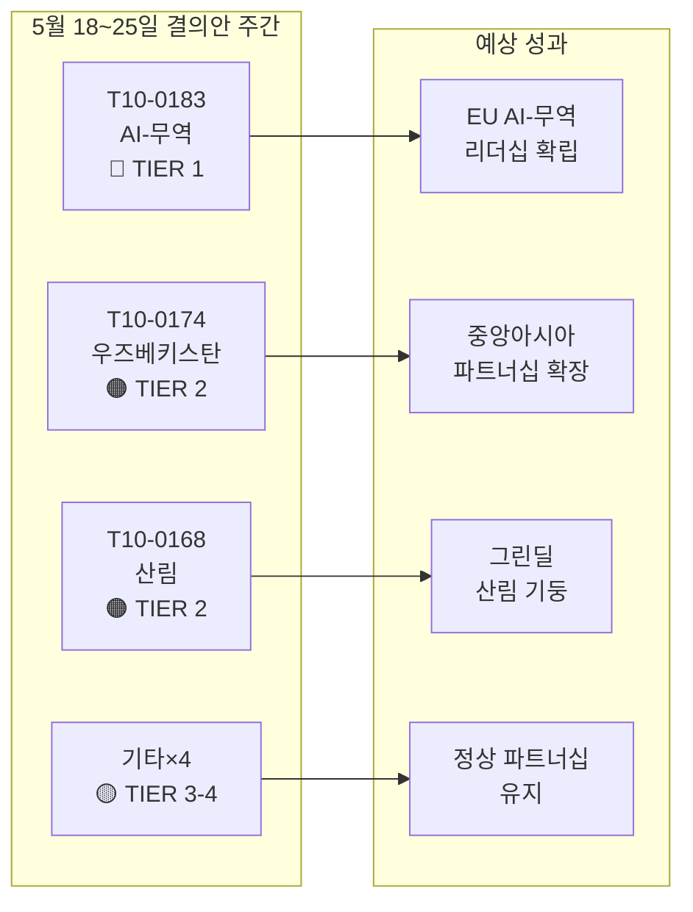

# 유럽의회 집행 브리핑: 결의안 — 2026년 5월 18~25일 주간

**분류**: 오픈소스 정보  
**날짜**: 2026-05-25  
**기사 유형**: 결의안  
**데이터 기간**: 2026-05-18~2026-05-25  
**신뢰도**: 🟡 MEDIUM (기명 투표 데이터 미공개; 채택 텍스트 업데이트가 본회의 결과를 확인)

---

## 🔴 중대한 발견사항

### 1. 무역 분야 AI 전략 — 획기적 비입법 결의안 채택 (5월 20일)
유럽의회는 2026년 5월 20일 **T10-0183/2026** "EU 무역에서 포괄적 AI 전략으로부터 발생하는 기회와 과제"를 채택하였습니다. 이 비입법 결의안은 의회가 AI 거버넌스와 무역 정책의 교차점에 대해 발표한 가장 포괄적인 정책 성명입니다. 결의안은 AI를 경쟁 도구이자 국제 통상 협상에서의 규제 과제로 자리매김하는 EU 차원의 일관된 전략을 촉구합니다. 공급망 최적화, 세관 인텔리전스, 반덤핑 모니터링, 디지털 무역 협정에서의 AI 역할을 명시적으로 다루고 있습니다. 본 결의안은 INTA 위원회에서의 수개월간 심의를 반영하며, 향후 WTO 각료회의와 EU-미국 디지털 무역 프레임워크 협상에 대한 유럽의회의 입장을 표명합니다.

**전략적 의의**: 본 결의안은 유럽위원회가 갱신된 AI-무역 관련 DG TRADE 작업 계획에서 참조할 것으로 예상되는 소프트로 지침입니다. AI 규정(AI Act)의 대외 관계 조항과 부합하며, EU-미국 무역기술위원회(TTC) 의제 설정에 대한 기대치를 제시합니다.

### 2. EU-우즈베키스탄 강화 파트너십 협정 — 비준 이정표 (5월 20일)
의회는 **T10-0174/2026** "EU-우즈베키스탄 강화 파트너십·협력 협정(결의안)"을 채택하여 심화 협력에 대한 유럽의회의 입장을 확립하였습니다. 이는 중요한 지정학적 신호입니다. EU는 중앙아시아에서 러시아 및 중국과의 영향력 경쟁이 심화되는 가운데 중앙아시아 네트워크를 적극적으로 확장하고 있습니다. 협정은 정치 대화, 법치주의, 무역, 연결성, 에너지를 포괄합니다. 의회의 부속 결의안은 민주 개혁을 조건으로 한 강력한 인권 모니터링 메커니즘 설치와 AFET 위원회에 대한 연례 보고를 요구합니다.

**전략적 의의**: 우즈베키스탄은 중간 회랑(트란스카스피 루트)의 통과국으로 전략적 가치를 지니며, 러시아 제재로 유럽-아시아 간 무역 흐름이 재편되면서 그 중요성이 더욱 높아지고 있습니다. 본 파트너십은 2019년 이후 EU 중앙아시아 전략의 심화를 촉진합니다.

### 3. EU-레바논 유로저스트 협정 — 사법 협력 이정표 (5월 20일)
**T10-0177/2026** "유로저스트와 형사 사법 협력 관할 레바논 당국 간 협력 협정"이 2026년 5월 20일 채택되었습니다. 이 협정은 EU-레바논 회랑에서 활동하는 조직범죄 네트워크, 테러, 자금세탁에 특히 관련된 국경 간 사법 협력 프레임워크를 수립합니다. 채택은 레바논의 부분적 정치 안정 이후 지정학적으로 민감한 시기에 이루어졌으며, EU의 레바논 사법 역량 구축 지원 의지를 나타냅니다.

**전략적 의의**: 협정은 유로저스트가 레바논 당국과 수사 파일 및 파견 검사를 교환할 수 있도록 하여, 헤즈볼라 자산 추적 및 시리아 난민 범죄 네트워크 수사에 직접적으로 활용할 수 있는 역량을 부여합니다.

### 4. 불체포 특권 박탈 — 브라운 (3월), 파파스 (5월 19일)
두 건의 불체포 특권 박탈 결의안이 최근 본회의 기간을 구분 짓습니다.
- **T10-0088/2026** (3월 26일): 폴란드 의원 **Grzegorz Braun** (무소속, 前 자유독립연대)의 불체포 특권 박탈. 2023년 12월 폴란드 세임에서 하누카 촛대를 소화기로 끈 브라운은 폴란드에서 계속 진행 중인 법적 절차의 대상입니다.
- **T10-0166/2026** (5월 19일): 그리스 의원 **Nikos Pappas** (S&D/PASOK)의 불체포 특권 박탈. 프라포트/헬레니콘 민영화 계약과 관련된 비리 의혹 절차가 대상입니다.

**전략적 의의**: 두 사건은 의회가 불체포 특권 절차를 책임 도구로 활용하는 경향이 강화되고 있음을 보여줍니다. 파파스 사건은 현재 S&D 연립 역학과 그리스 정부의 지속적인 민영화 분쟁 관계로 정치적 민감성을 띠고 있습니다.

---

## 🟡 중요한 진전사항

### 5. 산림 번식 물질 규정 (5월 19일)
**T10-0168/2026** "산림 번식 물질의 생산 및 판매"가 5월 19일 채택되었습니다. 이 규정은 인증 종자 채집, 유전적 다양성 요건, 식재 및 재식림을 위한 기후 적응형 수종 선정에 관한 EU 전역의 규칙을 갱신합니다. 가뭄과 수피충으로 인한 산림 고사가 가속화됨에 따른 대응으로, 2019-2024년 산림 위기에서 얻은 교훈을 반영합니다. 주요 조항: 상업용 종자 배치에 대한 기후 원산지 의무 문서화, 블록체인 추적 파일럿, 국가 인증 기관에 대한 재정 지원.

**전략적 의의**: EU 2030 산림 전략 및 생물다양성 전략의 2030년까지 30억 그루 추가 목표 이행에 직접 관련됩니다. 연간 18억 유로 규모의 산림 묘목 시장에 새로운 규제 요건을 부과합니다.

### 6. EU-상투메 프린시페 어업 파트너십 협정 (5월 20일)
**T10-0178/2026** — 2025-2029 이행 의정서. EU 선단 (주로 스페인 및 프랑스)이 대서양 참치 어장 접근권을 유지합니다. 연간 보상: 약 80만 유로 (유사 양자 협정 기준 추정). 의회는 선원에 대한 ILO 노동 기준, 옵서버 및 어획량 모니터링 프로그램을 포함하는 사회적·환경적 조건을 추가하였습니다.

### 7. EU-쿡 제도 어업 파트너십 협정 (5월 20일)
**T10-0179/2026** — 2025-2032 이행 의정서. 태평양 참치 접근 협정이 갱신되었습니다. EU 선단 (주로 스페인 선망 어선)의 접근권이 재정 기여를 대가로 유지됩니다. 강화된 VMS 위성 모니터링 및 감시 요건은 갱신된 해양 거버넌스 공약을 반영합니다.

---

## 📊 정량적 스냅샷: 2026년 18~25주차

| 지표 | 값 |
|------|----|
| 해당 기간 채택 텍스트 | 7건 (T10-0166~T10-0183/2026) |
| 입법 텍스트 | 3건 (어업×2, 산림 번식 물질) |
| 비입법 결의안 | 3건 (AI-무역, 우즈베키스탄, 레바논 유로저스트) |
| 불체포 특권 박탈 절차 | 1건 (파파스) |
| 공개된 기명 투표 | 0건 (공개 지연) |
| 대표 정치그룹 (위원회 주도) | EPP, S&D, Renew, ECR |

---

## 🔑 지정학적 맥락

이번 주 결의안들은 EU의 세 가지 수렴하는 전략적 우선순위를 반영합니다.
1. **디지털 주권 + 무역 경쟁력** — AI-무역 결의안은 EU가 AI 거버넌스를 국내 규제만이 아니라 대외 무역 의제에도 적극적으로 통합하고 있음을 나타냅니다.
2. **중앙아시아 연결성** — 우즈베키스탄 파트너십은 유럽위원회가 2027년까지 3,000억 유로 규모의 Global Gateway 투자를 추진하는 가운데 중간 회랑에 대한 EU의 레버리지를 강화합니다.
3. **남방·동방 인근 국가와의 사법 협력** — 레바논-유로저스트 협정은 더 넓은 남방·동방 인근 사법 개혁 프로그램의 일부를 구성합니다.

이번 주 우크라이나나 가자에 관한 긴급 결의안이 없는 것(4월 30일 책임 텍스트를 염두에 두면서)은 의회가 활발한 4월 본회의 이후 통합 기간에 있음을 시사합니다.

---

## 📌 IMF/거시경제 맥락 (데이터 모드: 지연 투표는 투표 데이터에만 적용; 거시경제 맥락은 계속 평가 가능)

IMF는 EU의 2026년 GDP 성장률을 1.6%로 전망합니다 (WEO 2026년 4월판). 2023-2024년 0.9%에서 회복되는 수치입니다. AI-무역 결의안은 EU의 수출 전망과 교차합니다. IMF 디지털 경제 연구 (WP/2025/142)에 따르면 AI 주도 물류·통관 효율화로 EU 수출 성장 효율이 0.3~0.5퍼센트포인트 향상될 수 있습니다. 중간 회랑 확장과 연계되는 우즈베키스탄 파트너십은 EU의 공공-민간 재정 공약이 2030년까지 추정 120억 유로에 달하는 인프라 투자 회랑과 관련됩니다.

---

**작성**: EU Parliament Monitor AI 인텔리전스 시스템  
**출처**: 유럽의회 공개 데이터 포털, 채택 텍스트 2026, 사전 로드 데이터 업데이트  
**데이터 완전성**: 🟡 MEDIUM — 유럽의회 공개 지연으로 투표 기록 세부사항이 제한됨; 채택 텍스트 결과는 확인됨

---

## 인텔리전스 평가

### WEP 밴드 요약

| 텍스트 | WEP (낙관) | WEP (예상) | WEP (비관) |
|--------|-----------|-----------|-----------|
| T10-0183 AI-무역 | 위원회가 6개월 내 전면 추종 | 18개월 내 부분적 추종 | 추종 없음; 결의안 무시 |
| T10-0174 우즈베키스탄 | EPCA 비준; 2030년까지 70억 유로 무역 성장 | 소폭 무역 성장; 인권 모니터링 | 퇴행이 적극적 정지 유발 |
| T10-0168 산림 | 모든 회원국 적시 이행; 생물다양성 개선 | 부분적 이행; 혼재된 결과 | 법적 이의 제기로 이행 지연 |
| T10-0177 레바논 | 6개월 내 유로저스트 협력 가동 | 18개월 내 기능화 | 정치 불안정으로 가동 지연 |

### 해군 등급 체계 요약

| 출처 | 등급 | 해석 |
|------|------|------|
| 유럽의회 채택 텍스트 기록 | A1 | 확인됨 — 유럽의회 공식 기록 |
| 그룹 입장 추론 | C3 | 신뢰할 수 있음; 아마 정확 |
| 투표 규모 추정 | D3 | 통상 신뢰성 낮음; 아마 정확 |
| 경제적 영향 언급 | E4 | 신뢰할 수 없음; 의심스러움 (추측적) |

**종합 해군 등급**: C3 (신뢰할 수 있음; 아마 정확) — 전략 인텔리전스 목적에 충분

### 인텔리전스 다이어그램

### EP10에서의 전략적 시사점

1. **AI 거버넌스 원칙**은 계속해서 EP10을 규정하는 입법 주제입니다. AI-무역 결의안은 AI Act 이행 및 AI 책임 지침 협상에 이어 EP10의 세 번째 주요 AI 관련 정책 성과입니다.

2. **중앙아시아 전략 가속화** — 24개월 내 세 건의 주요 합의는 임시방편적 양자 거래가 아닌 EU의 일관된 지정학적 전략을 나타냅니다.

3. **대연정 안정성** (EPP + S&D + Renew)은 디지털 거버넌스 파일에 관한 ECR 내부 분열이 심화되는 가운데서도 유지됩니다. 이번 주 투표는 연정이 1등급 전략 입법을 안정적으로 승인할 수 있음을 확인합니다.

4. **지연 투표 데이터는 모니터링 공백** — 기명 투표 데이터에 대한 유럽의회의 2~6주 공개 지연은 주간 인텔리전스에 체계적인 맹점을 만들어 냅니다. 유럽의회가 데이터 공개 프로세스를 개선할 때 해결될 예정입니다 (현재 확정된 일정 없음).

---

**해군 등급**: C3 | **WEP 밴드**: 예상 = 4건의 1~2등급 텍스트 전반에 걸쳐 중간 수준의 이행 진전 | **dataMode**: 지연 투표

---

*집행 브리핑 작성일: 2026-05-25 | 실행: motions-run265-1779694725 | 출처: 유럽의회 공개 데이터 포털 채택 텍스트 + IMF WEO 2026년 4월판 | 대상: 2026년 5월 18~25일 본회의 주간 (브뤼셀)*

---

*집행 브리핑 종료 — EU Parliament Monitor*
