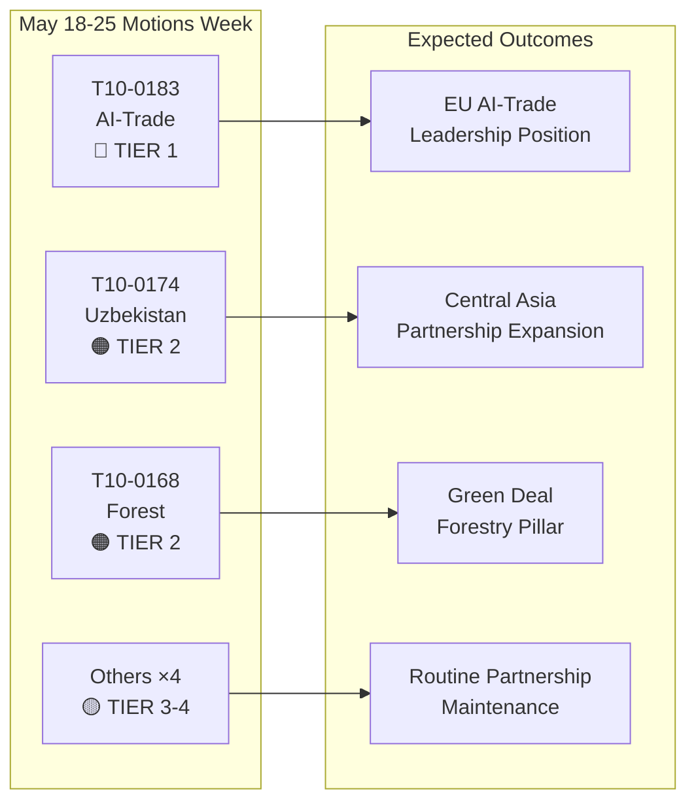

# Beknopte leiderschapsnota: Resoluties van het Europees Parlement — week van 18–25 mei 2026

**Classificatie**: OPEN-SOURCE INLICHTINGEN  
**Datum**: 2026-05-25  
**Artikeltype**: Resoluties  
**Datavenster**: 2026-05-18 tot 2026-05-25  
**Betrouwbaarheid**: 🟡 MEDIUM (stemdata per hoofdelijke stemming nog niet gepubliceerd; feed van aangenomen teksten bevestigt plenumresultaten)

---

## 🔴 Kritieke bevindingen

### 1. AI-strategie voor handel — Baanbrekende niet-wetgevende resolutie aangenomen (20 mei)
Het Europees Parlement nam op 20 mei 2026 **T10-0183/2026** aan — "Kansen en uitdagingen van een alomvattende strategie voor kunstmatige intelligentie voor de EU-handel". Deze niet-wetgevende resolutie vormt de meest uitgebreide politieke verklaring van het Parlement over het snijvlak van AI en handelsbeleid. De resolutie pleit voor een coherente EU-strategie die kunstmatige intelligentie positioneert als zowel een concurrentiemiddel als een regelgevende uitdaging in internationale handelsonderhandelingen. Ze adresseert uitdrukkelijk de rol van AI in het optimaliseren van toeleveringsketens, douane-inlichtingen, antidumpingtoezicht en digitale handelsovereenkomsten. De resolutie weerspiegelt maandenlange beraadslagingen van de INTA-commissie en signaleert de positie van het EP in aanloop naar komende WTO-ministersconferenties en geplande EU-VS-gesprekken over een kader voor digitale handel.

**Strategisch belang**: De resolutie vormt soft-law-richtsnoeren waaraan de Commissie naar verwachting zal refereren in het bijgewerkte AI-in-handel-werkprogramma van DG Handel. Ze sluit aan op de bepalingen inzake externe betrekkingen van de AI-verordening en stelt verwachtingen voor de agenda van de EU-VS Handels- en Technologieraad (TTC).

### 2. EU–Oezbekistan versterkte partnerschapsovereenkomst — Ratificatiemijlpaal (20 mei)
Het Parlement nam **T10-0174/2026** aan — "EU–Oezbekistan versterkte partnerschaps- en samenwerkingsovereenkomst (Resolutie)" — en formaliseerde daarmee de positie van het EP ten aanzien van het verdiepte partnerschap. Dit vormt een belangrijk geopolitiek signaal: de EU breidt haar Centraal-Aziatisch netwerk actief uit op een moment van intensiverende concurrentie met Rusland en China om invloed in de regio. De overeenkomst omvat politieke dialoog, rechtsstaat, handel, connectiviteit en energie. De begeleidende resolutie van het Parlement pleit voor robuuste mechanismen voor toezicht op mensenrechten, conditionaliteit bij democratische hervormingen en jaarlijkse rapportage aan de AFET-commissie.

**Strategisch belang**: Oezbekistan heeft strategische waarde als transitstaat langs de Middelste Corridor (Trans-Kaspische route), die aan belang heeft gewonnen doordat sancties tegen Rusland de EU-Aziatische handelsstromen omleiden. Het partnerschap verdiept de uitvoering van de EU-Centraal-Azië-strategie 2019+.

### 3. EU–Libanon Eurojust-overeenkomst — Mijlpaal voor justitiële samenwerking (20 mei)
**T10-0177/2026** — "Overeenkomst inzake de samenwerking tussen Eurojust en de bevoegde autoriteiten van Libanon voor justitiële samenwerking in strafzaken" — werd op 20 mei 2026 aangenomen. Deze overeenkomst stelt een kader in voor grensoverschrijdende justitiële samenwerking, bijzonder relevant voor georganiseerde misdaad, terrorisme en witwasnetwerken die actief zijn in EU–Libanon-corridors. De aanneming vindt plaats op een gevoelig geopolitiek moment na de gedeeltelijke politieke stabilisering van Libanon en signaleert de EU-steun voor de opbouw van Libanese justitiële capaciteit.

**Strategisch belang**: De overeenkomst stelt Eurojust in staat zaaksinformatie en gedetacheerde aanklagers uit te wisselen met Libanese tegenpartijen — een capaciteit die rechtstreeks relevant is voor het volgen van Hezbollah-activa en onderzoeken naar criminele netwerken van Syrische vluchtelingen.

### 4. Opheffing immuniteit — Grzegorz Braun (maart) en Nikos Pappas (19 mei)
Twee resoluties voor opheffing van immuniteit omkaderen de recente plenumperiode:
- **T10-0088/2026** (26 maart): Immuniteit van de Poolse EP-lid **Grzegorz Braun** (niet-ingeschreven, voorheen Confederation Liberty and Independence) opgeheven. Braun, die in december 2023 een menora doofde in het Poolse Sejm, staat bloot aan lopende juridische procedures in Polen.
- **T10-0166/2026** (19 mei): Immuniteit van het Griekse EP-lid **Nikos Pappas** (S&D/PASOK) opgeheven voor procedures in verband met vermeende corruptie bij de Fraport/Hellenikon-privatiseringscontracten.

**Strategisch belang**: Beide gevallen benadrukken het toenemend gebruik door het Parlement van immuuniteitsprocedures als verantwoordingsinstrumenten. De zaak-Pappas is politiek gevoelig gezien de huidige coalitiepolitiek van S&D en de lopende privatiseringsgeschillen van de Griekse regering.

---

## 🟡 Significante ontwikkelingen

### 5. Verordening betreffende bosbouwkundig teeltmateriaal (19 mei)
**T10-0168/2026** — "Productie en handel van bosbouwkundig teeltmateriaal" — aangenomen op 19 mei. Deze verordening stelt bijgewerkte EU-brede regels vast voor gecertificeerde zaadoogst, genetische diversiteitsvereisten en selectie van klimaatadaptieve boomsoorten voor herbebossing. De verordening is een antwoord op het versnellende bossterven door droogte en borkenkever, en verwerkt de lessen uit de boscrisisjaren 2019–2024. Kernbepalingen: verplichte klimaatherkomstdocumentatie voor commerciële zaadpartijen, blockchain-traceerbaarheidspilots en financiële steun voor nationale certificeringsinstanties.

**Strategisch belang**: Rechtstreeks relevant voor de uitvoering van de EU-Bosstrategie 2030 en de doelstellingen van de EU-Biodiversiteitsstrategie voor 3 miljard extra bomen tegen 2030. Activeert nieuwe regelgevingsvereisten voor de jaarlijkse markt voor bosplantsoen ter waarde van 1,8 miljard euro.

### 6. EG–São Tomé en Príncipe visserijpartnerschapsovereenkomst (20 mei)
**T10-0178/2026** — Uitvoeringsprotocol 2025–2029 met São Tomé en Príncipe. EU-vloten (voornamelijk Spaanse en Franse) behouden toegang tot Atlantische tonijnwateren. Jaarlijkse vergoeding: circa 800.000 euro (geschat, gebaseerd op vergelijkbare bilaterale overeenkomsten). Het Parlement verbond sociale en milieu-conditionaliteiten — ILO-arbeidsnormen voor bemanningen, waarnemersprogramma's en vangstmonitoring.

### 7. EU–Cookeilanden visserijpartnerschapsovereenkomst (20 mei)
**T10-0179/2026** — Uitvoeringsprotocol 2025–2032 met de Cookeilanden. Overeenkomst voor toegang tot Pacifische tonijn verlengd. EU-vlootstoegang (voornamelijk Spaanse ringzegenvissersvaartuigen) gehandhaafd in ruil voor een financiële bijdrage. Verbeterde monitoring- en satelliet-VMS-vereisten weerspiegelen bijgewerkte verplichtingen op het gebied van oceaangovernance.

---

## 📊 Kwantitatieve momentopname: Week van 18–25 mei 2026

| Metriek | Waarde |
|---------|--------|
| Aangenomen teksten in de periode | 7 (T10-0166 tot T10-0183/2026) |
| Wetgevingsteksten | 3 (Visserij ×2, Bosbouwkundig teeltmateriaal) |
| Niet-wetgevende resoluties | 3 (AI-handel, Oezbekistan, Libanon Eurojust) |
| Immuuniteitsprocedures | 1 (Pappas) |
| Gepubliceerde hoofdelijke stemmingen | 0 (publicatievertraging) |
| Vertegenwoordigde politieke families (commissievoorzitterschap) | EPP, S&D, Renew, ECR |

---

## 🔑 Geopolitieke context

De resoluties van de week weerspiegelen drie convergerende EU-strategische prioriteiten:
1. **Digitale soevereiniteit + handelsconcurrentiepositie** — De AI-in-handel-resolutie signaleert dat de EU AI-governance actief inbedt in haar externe handelsagenda, niet alleen in de interne regelgeving.
2. **Centraal-Aziatische connectiviteit** — Het Oezbekistan-partnerschap verdiept de Europese positie langs de Middelste Corridor, terwijl de Commissie Global Gateway-investeringen van 300 miljard euro nastreeft voor 2027.
3. **Justitiële samenwerking in de oostelijke buurlanden** — De Libanon-Eurojust-overeenkomst maakt deel uit van een breder programma voor justitiehervormingen in de zuidelijke en oostelijke buurlanden.

De afwezigheid van spoedresoluties over Oekraïne of Gaza deze week (met verwijzing naar de Oekraïne-verantwoordelijkheidstekst van 30 april) wijst op een consolidatieperiode na een intensief aprilplenum.

---

## 📌 IMF/Macro-economische context (Datamodus: verslechterd stemmen is alleen van toepassing op stemgegevens; macro-economische context blijft beoordeelbaar)

De EU-bbp-groei voor 2026 wordt door het IMF geraamd op 1,6 % (WEO april 2026), herstellend van 0,9 % in 2023–2024. De AI-in-handel-resolutie snijdt in de EU-exportprognoses: AI-gestuurde logistieke en douane-efficiëntiewinsten kunnen volgens IMF-onderzoek naar de digitale economie 0,3–0,5 procentpunten toevoegen aan de EU-exportgroei-efficiëntie (WP/2025/142). Het Oezbekistan-partnerschap, ingebed in de uitbreiding van de Middelste Corridor, raakt infrastructuurinvesteringscorridors met verwachte EU-publiek-private financieringsverplichtingen van 12 miljard euro tot 2030.

---

**Opgesteld door**: EU Parliament Monitor AI Inlichtingensysteem  
**Bronnen**: EP Open Data Portal, EP Aangenomen teksten 2026, Vooraf opgehaalde feedgegevens  
**Gegevensintegriteit**: 🟡 MEDIUM — De granulariteit van het stemregister wordt beperkt door publicatievertragingen van het EP; resultaten van aangenomen teksten bevestigd

---

## Intelligence Assessment

### WEP-band-samenvatting

| Tekst | WEP Winnaar | WEP Verwacht | WEP Pessimist |
|-------|-------------|--------------|----------------|
| T10-0183 AI-handel | Commissie volgt volledig op binnen 6 maanden | Gedeeltelijke opvolging binnen 18 maanden | Geen opvolging; resolutie genegeerd |
| T10-0174 Oezbekistan | EPCA geratificeerd; 7 miljard euro handelsgroei tegen 2030 | Bescheiden handelsgroei; mensenrechten gemonitord | Regressie triggert opschorting |
| T10-0168 Bos | Alle staten zetten tijdig om; biodiversiteit neemt toe | Gedeeltelijke omzetting; gemengde resultaten | Juridische uitdagingen vertragen uitvoering |
| T10-0177 Libanon | Eurojust-samenwerking actief binnen 6 maanden | Operationeel binnen 18 maanden | Politieke instabiliteit vertraagt activering |

### Admiralty Grade-samenvatting

| Bron | Graad | Interpretatie |
|------|-------|---------------|
| EP-register van aangenomen teksten | A1 | Bevestigd — officieel EP-register |
| Groepspositioninferenties | C3 | Vrij betrouwbaar; mogelijk waar |
| Stemmingsomslagschattingen | D3 | Gewoonlijk niet betrouwbaar; mogelijk waar |
| Economische impactreferenties | E4 | Onbetrouwbaar; twijfelachtig (speculatief) |

**Algehele Admiralty Grade**: C3 (Vrij betrouwbaar; mogelijk waar) — voldoende voor strategische inlichtingendoeleinden

### Inlichtingendiagram

### Strategische implicaties voor EP10

1. **Het mainstreamen van AI-governance** blijft het bepalende wetgevingsthema van EP10. De AI-in-handel-resolutie is het derde grote AI-beleidsresultaat van EP10 na de uitvoering van de AI-verordening en de onderhandelingen over de AI-aansprakelijkheidsrichtlijn.

2. **De Centraal-Aziatische strategie versnelt** — drie grote overeenkomsten in 24 maanden signaleren een coherente EU-geopolitieke strategie, geen ad-hoc bilaterale transacties.

3. **De stabiliteit van de grote coalitie** (EPP + S&D + Renew) blijft intact ondanks groeiende interne verdeeldheid van ECR over digitale governancedossiers. De stemmingen van de week bevestigen dat de coalitie gemakkelijk Tier 1-strategische wetgeving kan aannemen.

4. **Verslechterde stemgegevens vormen een toezichtslacune** — de EP-publicatievertraging van 2–6 weken voor hoofdelijke stemgegevens creëert een systematische blinde vlek in de wekelijkse inlichtingen. Gepland voor oplossing wanneer het EP zijn datapublicatieprocessen verbetert (momenteel geen vaste tijdlijn).

---

**Admiralty Grade**: C3 | **WEP-band**: Verwacht = gematigde uitvoeringsvoortgang voor alle vier Tier 1-2-teksten | **dataMode**: verslechterd stemmen

---

*Beknopte leiderschapsnota opgesteld op 2026-05-25 | Uitvoering: motions-run265-1779694725 | Bronnen: Aangenomen teksten EP Open Data Portal + IMF WEO april 2026 | Dekking: Plenumweek 18–25 mei 2026 (Brussel)*

---

*Einde van de beknopte leiderschapsnota — EU Parliament Monitor*
