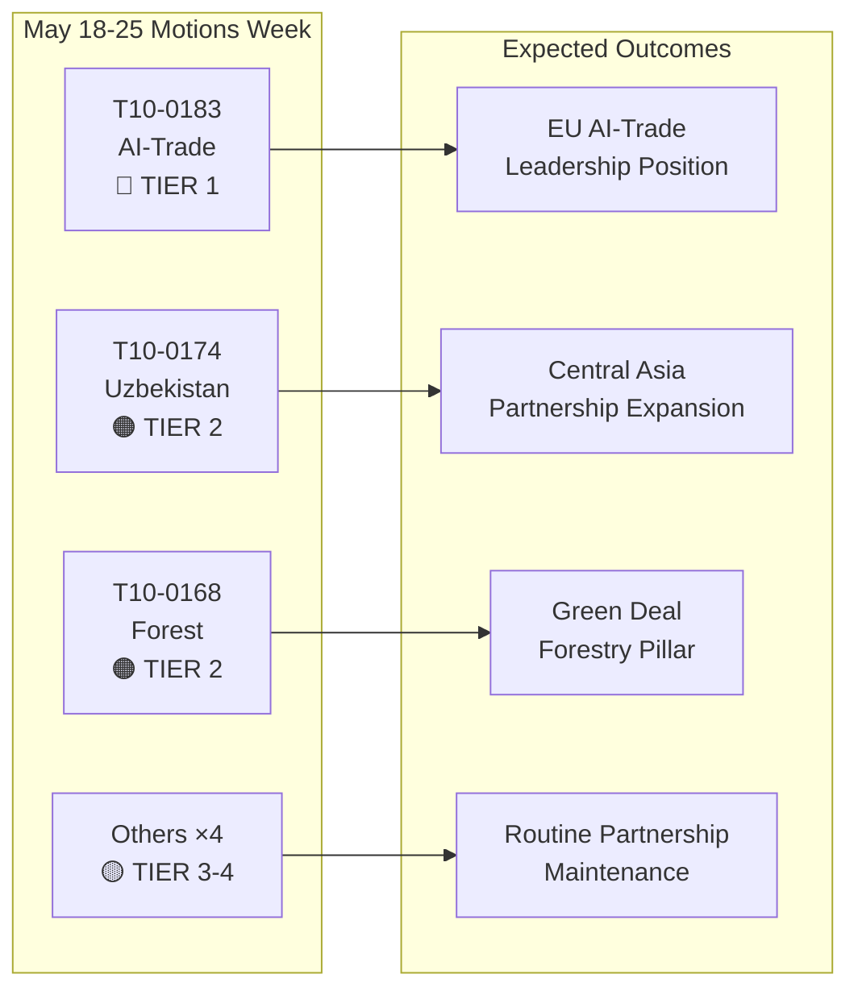

# Ledersammendrag: Europaparlamentets resolusjoner — uken 18.–25. mai 2026

**Klassifisering**: ÅPEN KILDEETTERFORSKNING  
**Dato**: 2026-05-25  
**Artikkeltype**: Resolusjoner  
**Datavindu**: 2026-05-18 til 2026-05-25  
**Konfidens**: 🟡 MEDIUM (navneoppropsdata ikke ennå publisert; vedtatte-tekster-feed bekrefter plenumresultater)

---

## 🔴 Kritiske funn

### 1. AI-strategi for handel — Banebrytende ikke-lovgivningsmessig resolusjon vedtatt (20. mai)
Europaparlamentet vedtok **T10-0183/2026** — "Muligheter og utfordringer knyttet til en helhetlig strategi for kunstig intelligens i EUs handel" — den 20. mai 2026. Denne ikke-lovgivningsmessige resolusjonen er parlamentets mest omfattende politiske erklæring om skjæringspunktet mellom AI og handelspolitikk. Resolusjonen oppfordrer til en sammenhengende EU-strategi som posisjonerer kunstig intelligens som både et konkurranseverktøy og en regulatorisk utfordring i internasjonale handelsforhandlinger. Den adresserer eksplisitt AI's rolle i optimering av forsyningskjeder, tolletterretning, antidumpingovervåking og digitale handelsavtaler. Resolusjonen gjenspeiler måneder av INTA-komiteens drøftelser og signaliserer EP's holdning foran kommende WTO-ministerkonferanser og planlagte EU-USA-samtaler om et rammeverk for digital handel.

**Strategisk betydning**: Resolusjonen utgjør myk-rettslig veiledning som Kommisjonen forventes å referere til i GD Handels oppdaterte AI-i-handel-arbeidsprogram. Den er i tråd med AI-forordningens bestemmelser om ytre forbindelser og setter forventninger til EU-USAs handels- og teknologiråds (TTC) dagsorden.

### 2. EU–Usbekistan utvidet partnerskapsavtale — Ratifiseringsmilepæl (20. mai)
Parlamentet vedtok **T10-0174/2026** — "EU–Usbekistan utvidet partnerskaps- og samarbeidsavtale (resolusjon)" — og formaliserte dermed EP's holdning til det utdypede partnerskapet. Dette er et viktig geopolitisk signal: EU utvider aktivt sitt sentral-asiatiske nettverk i en tid med intensiverende konkurranse med Russland og Kina om innflytelse i regionen. Avtalen dekker politisk dialog, rettsstaten, handel, konnektivitet og energi. Parlamentets medfølgende resolusjon oppfordrer til robuste mekanismer for menneskerettigheter, betingelser knyttet til demokratiske reformer og årlig rapportering til AFET-komiteen.

**Strategisk betydning**: Usbekistan har strategisk verdi som transitland langs Mellomkorridoren (den transkaspiske ruten), som har vokst i betydning da sanksjoner mot Russland omdirigerer EUs handelsstrømmer til Asia. Partnerskapet utdyper gjennomføringen av EUs Sentral-Asia-strategi 2019+.

### 3. EU–Libanon Eurojust-avtale — Milepæl for rettssamarbeid (20. mai)
**T10-0177/2026** — "Avtale om samarbeid mellom Eurojust og Libanons kompetente myndigheter for rettslig samarbeid i straffesaker" — ble vedtatt den 20. mai 2026. Avtalen etablerer et rammeverk for grenseoverskridende rettslig samarbeid, særlig relevant for organisert kriminalitet, terrorisme og hvitvaskernettverk som opererer i EU–Libanon-korridorene. Vedtakelsen skjer i et sensitivt geopolitisk øyeblikk etter Libanons delvise politiske stabilisering og signaliserer EUs støtte til oppbygging av libanesisk rettslig kapasitet.

**Strategisk betydning**: Avtalen gjør det mulig for Eurojust å utveksle saksinformasjon og utlånte statsadvokater med libanesiske motparter — en kapasitet som er direkte relevant for sporing av Hizbollahs eiendeler og etterforskning av kriminelle nettverk tilknyttet syriske flyktninger.

### 4. Immunitetsopphevelser — Grzegorz Braun (mars) og Nikos Pappas (19. mai)
To immunitetsopphevelsesresolusjoner innrammer den siste plenumperioden:
- **T10-0088/2026** (26. mars): Immuniteten til den polske MEP **Grzegorz Braun** (ikke-tilknyttet, tidligere Confederation Liberty and Independence) opphevet. Braun, som slukket en menora i det polske Sejm i desember 2023, er gjenstand for pågående rettsprosedyrer i Polen.
- **T10-0166/2026** (19. mai): Immuniteten til den greske MEP **Nikos Pappas** (S&D/PASOK) opphevet for prosedyrer knyttet til påstått korrupsjon i Fraport/Hellenikon-privatiseringskontraktene.

**Strategisk betydning**: Begge saker belyser parlamentets økende bruk av immunitetsprosedyrer som ansvarlighetsverktøy. Pappas-saken er politisk sensitiv gitt S&D's nåværende koalisjonsforhold og den greske regjeringens pågående privatiseringstvister.

---

## 🟡 Betydelige utviklinger

### 5. Forskrift om skogformeringsmateriale (19. mai)
**T10-0168/2026** — "Produksjon og markedsføring av skogformeringsmateriale" — vedtatt den 19. mai. Denne forskriften fastsetter oppdaterte EU-regler for sertifisert frøinnhøsting, krav til genetisk mangfold og utvalg av klimatilpassede trearter for skogplanting. Forskriften er et svar på den akselererende skogdøden fra tørke og barkbiller, og inkorporerer erfaringer fra skogkriseårene 2019–2024. Viktige bestemmelser: obligatorisk klimaopprinnelsesdokumentasjon for kommersielle frøpartier, pilotprosjekter med blokkjede-sporing og finansiell støtte til nasjonale sertifiseringsmyndigheter.

**Strategisk betydning**: Direkte relevant for gjennomføringen av EUs Skogstrategi 2030 og EUs Biodiversitetsstrategis mål om 3 milliarder ekstra trær innen 2030. Aktiverer nye regulatoriske krav for markedet for skogsplanter verdt 1,8 milliarder euro per år.

### 6. EF–São Tomé og Príncipe fiskepart­nerskapsavtale (20. mai)
**T10-0178/2026** — Gjennomføringsprotokoll 2025–2029 med São Tomé og Príncipe. EU-flåter (primært spanske og franske) opprettholder tilgang til atlantiske tunfiskvann. Årlig kompensasjon: ca. 800 000 euro (estimert, basert på lignende bilaterale avtaler). Parlamentet la til sosiale og miljømessige betingelser — ILO-arbeidsstandarder for mannskap, observatørprogrammer og fangstovervåking.

### 7. EU–Cookøyenes fiskepart­nerskapsavtale (20. mai)
**T10-0179/2026** — Gjennomføringsprotokoll 2025–2032 med Cookøyene. Avtale om tilgang til stillehavstunfisk fornyet. EU-flåtens tilgang (primært spanske notfartøy) opprettholdes i bytte for finansielt bidrag. Forbedrede krav til overvåking og satellitt-VMS gjenspeiler oppdaterte forpliktelser innen havforvaltning.

---

## 📊 Kvantitativt øyeblikksbilde: Uken 18.–25. mai 2026

| Metrikk | Verdi |
|---------|-------|
| Vedtatte tekster i perioden | 7 (T10-0166 til T10-0183/2026) |
| Lovgivningstekster | 3 (Fiskeri ×2, Skogformeringsmateriale) |
| Ikke-lovgivningsmessige resolusjoner | 3 (AI-handel, Usbekistan, Libanon Eurojust) |
| Immunitetsprosedyrer | 1 (Pappas) |
| Publiserte navneoppropstemmer | 0 (publiseringsforsinkelse) |
| Politiske familier representert (komitéansvar) | EPP, S&D, Renew, ECR |

---

## 🔑 Geopolitisk kontekst

Ukets resolusjoner gjenspeiler tre konvergerende EU-strategiske prioriteringer:
1. **Digital suverenitet + handelskonkurranseevne** — AI-i-handel-resolusjonen signaliserer at EU aktivt integrerer AI-styring i sin eksterne handelsagenda, ikke bare intern regulering.
2. **Sentral-asiatisk konnektivitet** — Usbekistan-partnerskapet utdyper EUs handlingsrom langs Mellomkorridoren, mens Kommisjonen forfølger Global Gateway-investeringer på 300 milliarder euro innen 2027.
3. **Rettssamarbeid i det østlige nabolag** — Libanon Eurojust-avtalen er en del av et bredere rettssektorreformprogram i det sørlige og østlige nabolaget.

Fraværet av hasteresolusjonene om Ukraina eller Gaza denne uken (med henvisninger til Ukrainas ansvarlighetstest av 30. april) tyder på en konsolideringsperiode etter et intensivt aprilplenum.

---

## 📌 IMF/Makroøkonomisk kontekst (Datatilstand: forringet avstemning gjelder kun avstemningsdata; makroøkonomisk kontekst forblir vurderbar)

EUs BNP-vekst for 2026 anslås av IMF til 1,6 % (WEO april 2026), med bedring fra 0,9 % i 2023–2024. AI-i-handel-resolusjonen skjærer seg inn i EUs eksportprognoser: AI-drevne logistikk- og tolleffektivitetsgevinster kan legge til 0,3–0,5 prosentpoeng til EUs eksportveksteffektivitet per IMF's forskning på den digitale økonomien (WP/2025/142). Usbekistan-partnerskapet, integrert i Mellomkorridorens utvidelse, berører infrastrukturinvesteringskorridorer med projiserte 12 milliarder euro i EUs offentlig-privat finansieringsforpliktelser frem til 2030.

---

**Utarbeidet av**: EU Parliament Monitor AI Etterretningssystem  
**Kilder**: EP's åpne dataportal, EP Vedtatte tekster 2026, Forhåndshentede feeddata  
**Dataintegritet**: 🟡 MEDIUM — Granulariteten i avstemningsregistret begrenses av EP's publiseringsforsinkelser; resultater av vedtatte tekster bekreftet

---

## Intelligence Assessment

### WEP-band-sammendrag

| Tekst | WEP Vinner | WEP Forventet | WEP Pessimist |
|-------|------------|---------------|----------------|
| T10-0183 AI-handel | Kommisjonen følger fullt opp innen 6 måneder | Delvis oppfølging innen 18 måneder | Ingen oppfølging; resolusjon ignoreres |
| T10-0174 Usbekistan | EPCA ratifiseres; 7 mrd. euro handelsvekst innen 2030 | Moderat handelsvekst; menneskerettigheter overvåket | Regresjon utløser suspensjon |
| T10-0168 Skog | Alle stater implementerer til tide; biodiversitet øker | Delvis implementering; blandede resultater | Rettslige utfordringer forsinker gjennomføring |
| T10-0177 Libanon | Eurojust-samarbeid aktivt innen 6 måneder | Operativt innen 18 måneder | Politisk ustabilitet forsinker aktivering |

### Admiralty Grade-sammendrag

| Kilde | Karakter | Tolkning |
|-------|----------|----------|
| EP's vedtatte tekstregister | A1 | Bekreftet — offisielt EP-register |
| Gruppeholdningsinferenser | C3 | Ganske pålitelig; muligens sant |
| Avstemningsstørrelsesestimater | D3 | Vanligvis ikke pålitelig; muligens sant |
| Økonomiske konsekvenshensvisninger | E4 | Upålitelig; tvilsom (spekulativ) |

**Overordnet Admiralty Grade**: C3 (Ganske pålitelig; muligens sant) — tilstrekkelig for strategiske etterretningsformål

### Etterretningsdiagram

### Strategiske implikasjoner for EP10

1. **AI-styringens mainstreaming** fortsetter å være det definerende lovgivningstemaet for EP10. AI-i-handel-resolusjonen er EP10's tredje store AI-politiske resultat etter AI-forordningens gjennomføring og forhandlingene om AI-ansvarsdirektivet.

2. **Sentral-Asia-strategien akselererer** — tre store avtaler på 24 måneder signaliserer en sammenhengende EU-geopolitisk strategi, ikke ad hoc-bilaterale avtaler.

3. **Storkoalisjonens stabilitet** (EPP + S&D + Renew) forblir intakt til tross for ECR's voksende interne splittelser om digitale styrningssaker. Ukets abstemminger bekrefter at koalisjonen komfortabelt kan vedta Tier 1-strategisk lovgivning.

4. **Forringede avstemningsdata er en overvåkingslukke** — EP's 2–6 ukers forsinkelse i publisering av navneoproppsdata skaper en systematisk blind flekk i etterretning samme uke. Planlagt for løsning når EP forbedrer sine datapubliseringsprosesser (for tiden ingen fast tidsplan).

---

**Admiralty Grade**: C3 | **WEP-band**: Forventet = moderate gjennomføringsframskritt for alle fire Tier 1-2-tekster | **dataMode**: forringet avstemning

---

*Ledersammendrag utarbeidet 2026-05-25 | Kjøring: motions-run265-1779694725 | Kilder: EP's åpne dataportals vedtatte tekster + IMF WEO april 2026 | Dekning: Plenaruke 18.–25. mai 2026 (Brussel)*

---

*Slutt på ledersammendrag — EU Parliament Monitor*
