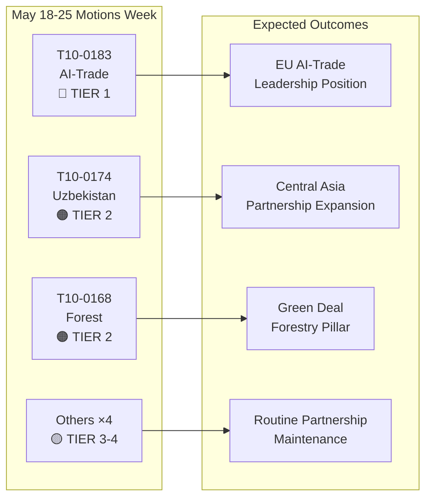

# Verkställande sammanfattning: Europaparlamentets resolutioner — veckan 18–25 maj 2026

**Klassificering**: ÖPPEN KÄLLORDSUNDERRÄTTELSE  
**Datum**: 2026-05-25  
**Artikeltyp**: Resolutioner  
**Datafönster**: 2026-05-18 till 2026-05-25  
**Konfidens**: 🟡 MEDIUM (omröstningsdata i form av namnupprop inte ännu publicerade; antagna-texter-flödet bekräftar plenumresultat)

---

## 🔴 Kritiska fynd

### 1. AI-strategi för handel — Banbrytande icke-lagstiftande resolution antagen (20 maj)
Europaparlamentet antog **T10-0183/2026** — "Möjligheter och utmaningar kopplade till en övergripande strategi för artificiell intelligens i EU:s handel" — den 20 maj 2026. Denna icke-lagstiftande resolution utgör parlamentets mest heltäckande politiska ställningstagande avseende skärningspunkten mellan AI och handelspolitik. Resolutionen efterlyser en sammanhängande EU-strategi som positionerar artificiell intelligens som såväl ett konkurrensverktyg som en regulatorisk utmaning i internationella handelsförhandlingar. Den adresserar uttryckligen AI:s roll i optimering av leveranskedjor, tullunderrättelser, antidumpningsövervakning och digitala handelsavtal. Resolutionen återspeglar månader av INTA-kommitténs överläggningar och signalerar EP:s ståndpunkt inför kommande WTO-ministerkonferenser och planerade EU-USA-samtal om ett ramverk för digital handel.

**Strategisk betydelse**: Resolutionen utgör mjukrättslig vägledning som kommissionen förväntas hänvisa till i GD Handels uppdaterade arbetsprogram för AI och handel. Den harmoniserar med AI-förordningens bestämmelser om yttre förbindelser och sätter förväntningar på EU-USA:s Handels- och teknikråds (TTC) dagordning.

### 2. EU–Uzbekistan förstärkt partnerskapsavtal — Ratificeringsmilstolpe (20 maj)
Parlamentet antog **T10-0174/2026** — "EU–Uzbekistan förstärkt partnerskaps- och samarbetsavtal (resolution)" — och formaliserade därmed EP:s ståndpunkt kring det fördjupade partnerskapet. Detta utgör en viktig geopolitisk signal: EU expanderar aktivt sitt centralasiatiska nätverk vid en tid av intensifierande konkurrens med Ryssland och Kina om inflytande i regionen. Avtalet täcker politisk dialog, rättsstatsprincipen, handel, konnektivitet och energi. Parlamentets medföljande resolution efterlyser robusta mekanismer för mänskliga rättigheter, villkorlighet kopplad till demokratiska reformer och årlig rapportering till AFET-utskottet.

**Strategisk betydelse**: Uzbekistan har strategiskt värde som transitland längs Mellankorridoren (den transkaspiska rutten), vilken har vuxit i betydelse då sanktioner mot Ryssland omdirigerar EU:s handelsflöden till Asien. Partnerskapet fördjupar genomförandet av EU:s Centralasien-strategi 2019+.

### 3. EU–Libanon Eurojust-avtal — Milstolpe för rättssamarbete (20 maj)
**T10-0177/2026** — "Avtal om samarbete mellan Eurojust och Libanons behöriga myndigheter för rättsligt samarbete i brottmål" — antogs den 20 maj 2026. Avtalet fastställer ett ramverk för gränsöverskridande rättsligt samarbete, särskilt relevant för organiserad brottslighet, terrorism och penningtvättsnätverk som verkar i EU–Libanon-korridorerna. Antagandet sker i ett känsligt geopolitiskt läge efter Libanons partiella politiska stabilisering och signalerar EU:s stöd för uppbyggnad av libanesisk rättslig kapacitet.

**Strategisk betydelse**: Avtalet möjliggör för Eurojust att utbyta ärendeinformation och utstationerade åklagare med libanesiska motparter — en kapacitet som är direkt relevant för spårning av Hizbollahs tillgångar och utredningar av kriminella nätverk kopplade till syriska flyktingar.

### 4. Immunitetsupphävanden — Grzegorz Braun (mars) och Nikos Pappas (19 maj)
Två immunitetsupphävningsresolutioner ramar in den senaste plenumperioden:
- **T10-0088/2026** (26 mars): Immuniteten för den polske parlamentsledamoten **Grzegorz Braun** (icke-ansluten, tidigare Confederation Liberty and Independence) upphävdes. Braun, som släckte en menora i det polska Sejm i december 2023, är föremål för pågående rättsliga förfaranden i Polen.
- **T10-0166/2026** (19 maj): Immuniteten för den grekiske parlamentsledamoten **Nikos Pappas** (S&D/PASOK) upphävdes för förfaranden relaterade till påstådd korruption i Fraport/Hellenikon-privatiseringskontrakt.

**Strategisk betydelse**: Båda fallen belyser parlamentets ökande användning av immunitetsförfaranden som ansvarsutkrävningsverktyg. Pappas-fallet är politiskt känsligt mot bakgrund av S&D:s nuvarande koalitionsdynamik och den grekiska regeringens pågående privatiseringstvister.

---

## 🟡 Betydande utvecklingar

### 5. Förordning om skogsförökningsmaterial (19 maj)
**T10-0168/2026** — "Produktion och saluföring av skogsförökningsmaterial" — antogs den 19 maj. Denna förordning fastställer uppdaterade EU-regler för certifierad frötäkt, krav på genetisk mångfald och val av klimatanpassade trädarter för beskogning. Förordningen är ett svar på den accelererande skogsdöden till följd av torka och barkborre, och inkorporerar lärdomar från skogskkrisåren 2019–2024. Viktiga bestämmelser: obligatorisk klimatursprungsdokumentation för kommersiella fröpartier, pilotprojekt med blockkedjebaserad spårbarhet och ekonomiskt stöd till nationella certifieringsmyndigheter.

**Strategisk betydelse**: Direkt relevant för genomförandet av EU:s skogsstrategi 2030 och EU:s biodiversitetsstrategis mål om 3 miljarder ytterligare träd till 2030. Aktiverar nya regulatoriska krav för marknaden för skogsplantor värd 1,8 miljarder euro per år.

### 6. EG–São Tomé och Príncipe fiskepart­nerskapsavtal (20 maj)
**T10-0178/2026** — Genomförandeprotokoll 2025–2029 med São Tomé och Príncipe. EU:s flottor (primärt spanska och franska) behåller tillgång till atlantiska tonfiskvatten. Årlig ersättning: cirka 800 000 euro (uppskattad, baserad på liknande bilaterala avtal). Parlamentet lade till sociala och miljömässiga villkor — ILO:s arbetsnormer för besättningar, observatörsprogram och fångstövervakning.

### 7. EU–Cooköarnas fiskepart­nerskapsavtal (20 maj)
**T10-0179/2026** — Genomförandeprotokoll 2025–2032 med Cooköarna. Avtal om tillgång till stillahavstonfisk förnyades. EU-flottans tillgång (primärt spanska notfartyg) bibehålls i utbyte mot ekonomiskt bidrag. Förstärkta krav på övervakning och satellitbaserat VMS speglar uppdaterade åtaganden inom havsförvaltning.

---

## 📊 Kvantitativ ögonblicksbild: Veckan 18–25 maj 2026

| Mätvärde | Värde |
|----------|-------|
| Antagna texter under perioden | 7 (T10-0166 till T10-0183/2026) |
| Lagstiftningstexter | 3 (Fiskeri ×2, Skogsförökningsmaterial) |
| Icke-lagstiftande resolutioner | 3 (AI-handel, Uzbekistan, Libanon Eurojust) |
| Immunitetsförfaranden | 1 (Pappas) |
| Publicerade namnuppropsomröstningar | 0 (publiceringsfördröjning) |
| Politiska familjer representerade (kommitténs ledning) | EPP, S&D, Renew, ECR |

---

## 🔑 Geopolitiskt sammanhang

Veckans resolutioner speglar tre konvergerande EU-strategiska prioriteringar:
1. **Digital suveränitet + handelskonkurrenskraft** — AI-i-handels-resolutionen signalerar att EU aktivt inbäddar AI-styrning i sin externa handelsagenda, inte bara intern reglering.
2. **Centralasiatisk konnektivitet** — Uzbekistan-partnerskapet fördjupar EU:s handlingsutrymme längs Mellankorridoren, medan kommissionen verkar för Global Gateway-investeringar om 300 miljarder euro till 2027.
3. **Rättssamarbete i det östra grannskapet** — Libanon Eurojust-avtalet är en del av ett bredare reform­program för rättsväsendet i det södra och östra grannskapet.

Frånvaron av resolutioner i nödsituationer om Ukraina eller Gaza denna vecka (med hänvisning till Ukrainas ansvarighetstext av den 30 april) tyder på en konsolidering efter ett intensivt aprilplenum.

---

## 📌 IMF/Makroekonomiskt sammanhang (Dataläge: försämrad omröstning gäller enbart omröstningsdata; makroekonomiskt sammanhang förblir bedömbart)

EU:s BNP-tillväxt för 2026 prognostiseras av IMF till 1,6 % (WEO april 2026), med återhämtning från 0,9 % under 2023–2024. AI-i-handels-resolutionen skär mot EU:s exportprognoser: AI-drivna logistik- och tulleffektivitetsvinster kan tillföra 0,3–0,5 procentenheter till EU:s exporttillväxteffektivitet per IMF:s forskning om den digitala ekonomin (WP/2025/142). Uzbekistan-partnerskapet, inbäddat i Mellankorridorens expansion, berör infrastrukturinvesteringskorridorer med projicerade 12 miljarder euro i EU:s offentlig-privata finansieringsåtaganden till 2030.

---

**Utarbetad av**: EU Parliament Monitor AI Underrättelsesystem  
**Källor**: EP:s öppna dataportal, EP Antagna texter 2026, Förhämtade flödesdata  
**Dataintegritet**: 🟡 MEDIUM — Granulariteten i omröstningsregistret begränsas av EP:s publiceringsfördröjningar; antagna textresultat bekräftade

---

## Intelligence Assessment

### WEP-bands sammanfattning

| Text | WEP Vinnare | WEP Förväntad | WEP Pessimist |
|------|-------------|----------------|----------------|
| T10-0183 AI-handel | Kommissionen följer upp fullt inom 6 månader | Partiell uppföljning inom 18 månader | Ingen uppföljning; resolution ignoreras |
| T10-0174 Uzbekistan | EPCA ratificeras; 7 miljarder euro handelstillväxt till 2030 | Modest handelstillväxt; mänskliga rättigheter övervakade | Regression utlöser suspension |
| T10-0168 Skog | Alla stater implementerar i tid; biodiversitet ökar | Partiell implementering; blandade resultat | Rättsliga utmaningar försenar genomförande |
| T10-0177 Libanon | Eurojust-samarbete aktivt inom 6 månader | Operativt inom 18 månader | Politisk instabilitet försenar aktivering |

### Admiralty Grade-sammanfattning

| Källa | Betyg | Tolkning |
|-------|-------|----------|
| EP:s antagna textregister | A1 | Bekräftat — officiellt EP-register |
| Gruppositionsinferenser | C3 | Ganska tillförlitligt; möjligen sant |
| Röstmagnitudsuppskattningar | D3 | Vanligtvis ej tillförlitligt; möjligen sant |
| Ekonomiska konsekvenshänvisningar | E4 | Opålitligt; tveksamt (spekulativt) |

**Övergripande Admiralty Grade**: C3 (Ganska tillförlitligt; möjligen sant) — tillräckligt för strategiska underrättelseändamål

### Underrättelsediagram

### Strategiska implikationer för EP10

1. **AI-styrningens mainstreaming** fortsätter att vara det definierande lagstiftningstema för EP10. AI-i-handels-resolutionen är EP10:s tredje stora AI-politiska resultat efter AI-förordningens genomförande och förhandlingarna om AI-ansvarsdirektivet.

2. **Centralasien-strategin accelererar** — tre stora avtal på 24 månader signalerar en sammanhängande EU-geopolitisk strategi, inte ad hoc-bilaterala affärer.

3. **Storkoalitionens stabilitet** (EPP + S&D + Renew) förblir intakt trots ECR:s växande interna splittringar kring digitala styrningsfiler. Veckans omröstningar bekräftar att koalitionen bekvämt kan anta Tier 1-strategisk lagstiftning.

4. **Försämrade omröstningsdata är en övervakningslucka** — EP:s 2–6 veckors publiceringsfördröjning för namnuppropsdata skapar en systematisk blind fläck i underrättelser samma vecka. Schemalagd för åtgärd när EP förbättrar sina datapubliceringsprocesser (för närvarande ingen fast tidsram).

---

**Admiralty Grade**: C3 | **WEP-band**: Förväntad = måttliga genomförandeframsteg för alla fyra Tier 1-2-texter | **dataMode**: försämrad omröstning

---

*Verkställande sammanfattning utarbetad 2026-05-25 | Körning: motions-run265-1779694725 | Källor: EP:s öppna dataportals antagna texter + IMF WEO april 2026 | Täckning: Plenumveckan 18–25 maj 2026 (Bryssel)*

---

*Slut på verkställande sammanfattning — EU Parliament Monitor*
