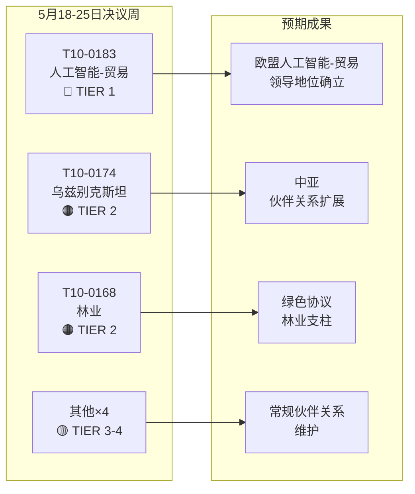

# 欧洲议会执行简报：决议 — 2026年5月18-25日周

**分类**：开源情报  
**日期**：2026-05-25  
**文章类型**：决议  
**数据时间窗口**：2026-05-18 至 2026-05-25  
**可信度**：🟡 MEDIUM（记名表决数据尚未公布；已通过文本更新确认全体会议结果）

---

## 🔴 重大发现

### 1. 贸易领域人工智能战略 — 里程碑式非立法决议获通过（5月20日）
欧洲议会于2026年5月20日通过了**T10-0183/2026**——"欧盟贸易综合人工智能战略带来的机遇与挑战"。这项非立法决议是议会就人工智能治理与贸易政策交叉领域发表的最全面政策声明。决议呼吁欧盟制定连贯战略，将人工智能同时定位为国际贸易谈判中的竞争工具和监管挑战。决议明确涉及人工智能在供应链优化、海关情报、反倾销监测和数字贸易协定中的作用。本决议反映了贸易委员会（INTA）数月来的审议成果，标志着欧洲议会就即将召开的世贸组织部长级会议以及欧美数字贸易框架磋商表明的立场。

**战略意义**：本决议是欧盟委员会在更新后的贸易总司人工智能-贸易工作计划中可能参考的软法律指南。与《人工智能法》对外关系条款相符，并设定了欧美贸易与技术委员会（TTC）议程预期。

### 2. 欧盟-乌兹别克斯坦强化伙伴关系协定 — 批准里程碑（5月20日）
议会通过了**T10-0174/2026**——"欧盟-乌兹别克斯坦强化伙伴关系与合作协定（决议）"，从而确立欧洲议会对深化合作关系的立场。这是一个重要的地缘政治信号：在与俄罗斯和中国争夺中亚影响力的竞争日趋激烈之际，欧盟正积极拓展中亚伙伴网络。协定涵盖政治对话、法治、贸易、互联互通和能源。议会附带决议要求建立强有力的人权监督机制，以民主改革为条件，并每年向外交委员会（AFET）提交报告。

**战略意义**：乌兹别克斯坦作为中间走廊（跨里海线路）的过境国具有重要战略价值，随着制裁俄罗斯导致欧亚贸易流向调整，其重要性进一步凸显。本伙伴关系深化了欧盟2019年以来的中亚战略。

### 3. 欧盟-黎巴嫩欧洲司法合作署协定 — 司法合作里程碑（5月20日）
**T10-0177/2026**——"欧洲司法合作署与黎巴嫩主管当局关于刑事司法合作的合作协定"于2026年5月20日获得通过。该协定建立了跨境司法合作框架，对活跃于欧盟-黎巴嫩走廊的有组织犯罪网络、恐怖主义和洗钱行为尤为重要。通过正值黎巴嫩部分政治稳定后地缘政治敏感时期，彰显了欧盟支持黎巴嫩司法能力建设的态度。

**战略意义**：该协定使欧洲司法合作署得以与黎巴嫩当局交换案件信息和借调检察官——这一能力直接关系到追踪真主党资产和调查叙利亚难民犯罪网络。

### 4. 豁免权撤销 — 布劳恩（3月）与帕帕斯（5月19日）
两项豁免权撤销决议标志着近期全体会议的重要节点：
- **T10-0088/2026**（3月26日）：波兰议员 **Grzegorz Braun**（无党籍，前自由独立联盟）的豁免权遭到撤销。布劳恩于2023年12月在波兰议会下院用灭火器熄灭光明节烛台，目前面临波兰持续进行的法律程序。
- **T10-0166/2026**（5月19日）：希腊议员 **Nikos Pappas**（S&D/PASOK）的豁免权遭到撤销，涉及弗拉波特/赫勒尼孔私有化合同中腐败指控的相关程序。

**战略意义**：两案均凸显议会日益将豁免权程序用作问责工具。帕帕斯案鉴于当前S&D联盟动态及希腊政府持续的私有化争议而具有政治敏感性。

---

## 🟡 重要进展

### 5. 林业繁殖材料条例（5月19日）
**T10-0168/2026**——"林业繁殖材料的生产和销售"于5月19日获得通过。该条例更新了欧盟范围内关于认证种子采集、遗传多样性要求及植林和再造林气候适应树种选择的规则。这是对干旱和树皮甲虫导致森林死亡加速的回应，吸收了2019-2024年森林危机的经验教训。主要条款包括：商业种子批次的气候来源强制记录、区块链追溯试点以及对国家认证机构的财政支持。

**战略意义**：与欧盟2030年森林战略及生物多样性战略"2030年前新增30亿棵树"目标的实施直接相关。为年产值18亿欧元的林业苗木市场带来新的监管要求。

### 6. 欧盟-圣多美和普林西比渔业伙伴关系协定（5月20日）
**T10-0178/2026** — 2025-2029年实施议定书。欧盟船队（主要为西班牙和法国）维持进入大西洋金枪鱼渔场的渠道。年度补偿：约80万欧元（根据类似双边协议估算）。议会附加了社会和环境条件——船员适用国际劳工组织劳工标准、观察员和渔获量监测计划。

### 7. 欧盟-库克群岛渔业伙伴关系协定（5月20日）
**T10-0179/2026** — 2025-2032年实施议定书。太平洋金枪鱼渔场准入协定获得更新。欧盟船队（主要为西班牙围网渔船）的准入权以财政贡献为交换条件得以维持。加强的VMS卫星监测和监控要求反映了更新后的海洋治理承诺。

---

## 📊 定量快照：2026年第18-25周

| 指标 | 数值 |
|------|------|
| 本期通过的文本数 | 7项（T10-0166至T10-0183/2026） |
| 立法文本 | 3项（渔业×2、林业繁殖材料） |
| 非立法决议 | 3项（人工智能-贸易、乌兹别克斯坦、黎巴嫩欧洲司法合作署） |
| 豁免权程序 | 1项（帕帕斯） |
| 已公布的记名表决 | 0次（公布延迟） |
| 委员会主导所代表的政治团体 | EPP、S&D、Renew、ECR |

---

## 🔑 地缘政治背景

本周决议折射出欧盟三大相互交汇的战略优先事项：
1. **数字主权 + 贸易竞争力** — 人工智能-贸易决议表明，欧盟正将人工智能治理积极整合到对外贸易议程，而不仅限于国内监管。
2. **中亚互联互通** — 乌兹别克斯坦伙伴关系在欧盟委员会寻求到2027年实现3000亿欧元"全球门户"投资之际，强化了欧盟对中间走廊的影响力。
3. **与南方及东方邻国的司法合作** — 黎巴嫩-欧洲司法合作署协定是更广泛的南方及东方邻国司法改革计划的组成部分。

本周缺少涉及乌克兰或加沙的紧急决议（在关注4月30日问责文本的同时），暗示议会正处于繁忙的4月全体会议结束后的整合期。

---

## 📌 IMF/宏观经济背景（数据模式：延迟表决仅适用于表决数据；宏观经济背景仍可评估）

IMF预测欧盟2026年GDP增速为1.6%（WEO 2026年4月版），较2023-2024年的0.9%有所回升。人工智能-贸易决议与欧盟出口前景相互交织。根据IMF数字经济研究（WP/2025/142），人工智能驱动的物流和海关效率提升可能使欧盟出口增长效率提高0.3至0.5个百分点。融入中间走廊扩展的乌兹别克斯坦伙伴关系涉及基础设施投资走廊，欧盟公私财政承诺估计到2030年将达120亿欧元。

---

**编制方**：EU Parliament Monitor 人工智能情报系统  
**来源**：欧洲议会开放数据门户、已通过文本2026、预加载数据更新  
**数据完整性**：🟡 MEDIUM — 欧洲议会公布延迟导致表决记录细节有限；已通过文本结果已确认

---

## 情报评估

### WEP 区间概要

| 文本 | WEP（乐观） | WEP（预期） | WEP（悲观） |
|------|-----------|-----------|-----------|
| T10-0183 人工智能-贸易 | 委员会6个月内全面跟进 | 18个月内部分跟进 | 不予跟进；决议被忽视 |
| T10-0174 乌兹别克斯坦 | EPCA获批准；2030年前贸易增长70亿欧元 | 贸易小幅增长；人权受监测 | 退步导致主动中止 |
| T10-0168 林业 | 所有成员国按时实施；生物多样性提升 | 部分实施；成果参差不齐 | 法律挑战延迟实施 |
| T10-0177 黎巴嫩 | 6个月内欧洲司法合作署协作启动 | 18个月内实现运转 | 政治不稳定延缓运转 |

### 海军评级体系概要

| 来源 | 评级 | 说明 |
|------|------|------|
| 欧洲议会已通过文本记录 | A1 | 已确认 — 欧洲议会官方记录 |
| 各团体立场推断 | C3 | 可信；可能准确 |
| 表决规模估算 | D3 | 通常不可信；可能准确 |
| 经济影响参考 | E4 | 不可信；存疑（推测性） |

**综合海军评级**：C3（可信；可能准确）—— 足以满足战略情报目的

### 情报图示

### 对EP10的战略影响

1. **人工智能治理原则**持续成为EP10的标志性立法议题。人工智能-贸易决议是继《人工智能法》实施和人工智能责任指令谈判之后，EP10第三项重大人工智能政策成果。

2. **中亚战略提速** — 24个月内达成三项重大协议，表明这是欧盟一贯的地缘政治战略，而非零散的双边交易。

3. **大联盟稳定性**（EPP + S&D + Renew）尽管ECR在数字治理文件上的内部分歧加剧，仍保持完好。本周投票确认了联盟能够稳固通过第一层级战略立法。

4. **延迟表决数据是监测盲点** — 欧洲议会公布记名表决数据存在2至6周的延迟，在每周情报工作中形成系统性盲点。预计在欧洲议会改进数据发布流程后得到解决（目前尚无确定时间表）。

---

**海军评级**：C3 | **WEP区间**：预期 = 全部4项第1-2层级文本均取得中等程度的实施进展 | **dataMode**：延迟表决

---

*执行简报编制日期：2026-05-25 | 运行：motions-run265-1779694725 | 来源：欧洲议会开放数据门户已通过文本 + IMF WEO 2026年4月版 | 覆盖范围：2026年5月18-25日全体会议周（布鲁塞尔）*

---

*执行简报结束 — EU Parliament Monitor*
