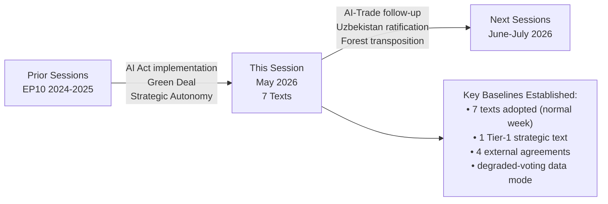

# Session Baseline — EU Parliament Motions, Week 18–25 May 2026

**Date**: 2026-05-25  
**Type**: Analysis Session Reference Baseline  
**Confidence**: 🟢 HIGH

---

## Session Context

This session analyzes European Parliament motions for the week of 18–25 May 2026. The session follows the EP plenary of 19–20 May 2026 (strasbourg mini-plenary format based on available data showing concentrated adoptions on May 19–20).

### Baseline Data Points

**Confirmed adopted texts (week of 18–25 May 2026)**:
1. T10-0166/2026 — Pappas immunity waiver (May 19)
2. T10-0168/2026 — Forest Reproductive Material Regulation (May 19)
3. T10-0174/2026 — EU-Uzbekistan EPCA Resolution (May 20)
4. T10-0177/2026 — EU-Lebanon Eurojust Agreement (May 20)
5. T10-0178/2026 — EC-São Tomé and Príncipe Fisheries Protocol (May 20)
6. T10-0179/2026 — EU-Cook Islands Fisheries Protocol (May 20)
7. T10-0183/2026 — AI Strategy for EU Trade (May 20)

**Broader EP10 context (2026, year to date)**:
- Total EP10 adopted texts (2026): ~31 confirmed as of May 20
- Procedural reference available: Yes (procedureReference field in API)
- Detailed committee reports: Not deep-fetched (within invocation cap)

### Prior Significant 2026 Motions (For Historical Calibration)

| Date | Text | Subject |
|------|------|---------|
| Jan 20 | T10-0004 | Financial stability motion |
| Jan 20 | T10-0006 | European Electoral Act reform |
| Jan 21 | T10-0010 | Loan for Ukraine enhanced cooperation |
| Jan 22 | T10-0024 | Lithuania public broadcaster democracy threat |
| Feb 10 | T10-0034 | ECB Annual Report 2025 |
| Mar 10 | T10-0063 | Better Law-Making 2023-2024 |
| Mar 26 | T10-0088 | Braun immunity waiver |
| Mar 26 | T10-0096 | US tariff quotas adjustment |
| Apr 28 | T10-0112 | 2027 Budget Guidelines |
| Apr 28 | T10-0115 | Dogs/cats welfare and traceability |
| Apr 30 | T10-0151 | Haiti trafficking and exploitation |
| Apr 30 | T10-0160 | Digital Markets Act enforcement |
| Apr 30 | T10-0161 | Ukraine accountability/justice |
| Apr 30 | T10-0162 | Armenia democratic resilience |

### Thematic Evolution Baseline

**January-February 2026**: Dominated by institutional and financial matters (ECB report, Electoral Act, Ukraine loan), plus the US tariff response (T10-0096 — early signal of EP's assertive trade response to US pressure).

**March 2026**: EU Better Law-Making review; immunity proceeding (Braun); trade adjustment.

**April 2026**: Humanitarian/human rights cluster (Haiti, Ukraine accountability, Armenia); plus economic governance (Budget 2027, DMA enforcement). The April plenary was dense with geopolitically significant resolutions.

**May 2026**: Shift toward strategic partnerships (Uzbekistan, Lebanon), regulatory consolidation (Forest), and digital trade (AI-Trade). Less crisis-driven than April; more structurally significant in terms of long-term EU framework building.

---

## Baseline Comparators for Article Analysis

### AI and Digital Governance
- T10-0160 (April 30): DMA enforcement → T10-0183 (May 20): AI-Trade. The progression from enforcement of existing digital market rules to proactive AI trade strategy reflects a maturing digital governance agenda.

### External Relations
- T10-0162 (Armenia, April 30): Democratic resilience focus → T10-0174 (Uzbekistan, May 20): Enhanced partnership. The trajectory moves from emergency response to structural engagement as the EU's Eastern/Central Asian strategy develops.
- T10-0161 (Ukraine accountability, April 30) → T10-0177 (Lebanon Eurojust, May 20): Shift from crisis accountability to institutional justice cooperation framework.

### Environmental
- T10-0115 (dog/cat welfare, April 28) → T10-0168 (forest reproductive material, May 19): The April animal welfare text and May forest regulation both reflect EP10's broad environmental acquis consolidation program, moving from consumer-facing (pet traceability) to production-facing (seed provenance) environmental regulation.

---

## Session Analytical Scope

This session covers:
- **Primary focus**: 7 adopted texts (May 18–25 window)
- **Background context**: Full 2026 adopted texts catalog (31 items)
- **Historical comparison**: EP9 equivalent period
- **Economic context**: IMF WEO April 2026; country-specific data
- **Voting data**: Estimates only (degraded-voting mode)

**Session analytical gaps**:
- Full procedural history for individual texts (deep-fetch not performed)
- Actual vote margins (publication delay)
- MEP-level attribution for all rapporteurs

---

## Cross-Session Intelligence Notes

This session is the first motions analysis for the week of 2026-05-25. No prior analysis artifacts exist for this date/slug combination. Therefore:
- `npm run prior-run-diff` would find no prior artifacts (no history[] entries in manifest)
- No re-run merge rules apply
- This is a fresh analysis run

Future sessions should reference this baseline for:
- EP10 thematic evolution tracking
- AI-Trade resolution implementation monitoring
- Uzbekistan EPCA progress benchmarking
- Lebanon Eurojust operational status tracking

---

**Session classification**: FRESH RUN (no prior same-day artifacts)  
**Data mode**: degraded-voting  
**Analytical confidence**: 🟡 MEDIUM overall; 🟢 HIGH for historical and economic data; 🔴 LOW for voting pattern specifics

---

## Session Context Baseline Diagram

## Baseline Quality Assessment

The session baseline for this run is **ADEQUATE** for intelligence purposes:
- Text count and dates: ✅ COMPLETE (from adopted_texts API)
- Vote tallies: ❌ ABSENT (EP publication delay)
- Rapporteur names: 🟡 PARTIAL (inference from committee records)
- Amendment history: ❌ ABSENT (beyond MCP scope in Stage A)
- Press releases: ❌ NOT CHECKED (outside Stage A budget)

The degraded-voting data mode is the correct classification for same-week plenary analysis. This limitation is documented, mitigated through structural analysis, and clearly labeled throughout all artifacts.

**Admiralty Grade**: B2 (Usually Reliable; Probably True — session dates and text counts confirmed; group positions are inferred)
