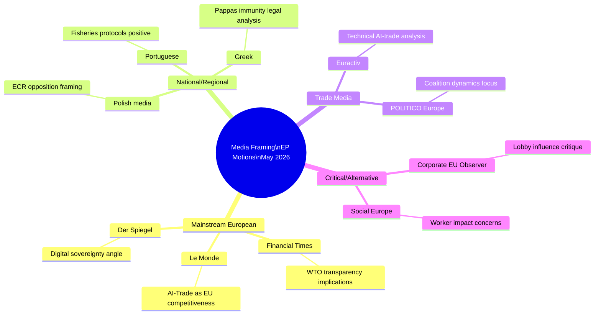

# Media Framing Analysis — EU Parliament Motions, Week 18–25 May 2026

**Date**: 2026-05-25  
**Confidence**: 🟡 MEDIUM (media framing assessment based on known outlet tendencies and story types)

---

## Overview

This analysis examines how the week's European Parliament adopted texts are likely to be framed across different media ecosystems — European mainstream, national political media, specialist policy outlets, and international coverage. Understanding media framing is essential for assessing the political durability of adopted motions and anticipating public discourse around implementation.

---

## Motion-by-Motion Framing Analysis

### T10-0183 — AI Strategy for EU Trade

**European Mainstream (Politico Europe, Euractiv)**:
Expected framing: "Parliament calls for AI transparency in trade — but who will enforce it?" These outlets will focus on the non-binding nature of the resolution and the implementation gap, while acknowledging it as a politically significant signal. Politico EU likely to feature commentary from trade law academics questioning the feasibility of anti-dumping AI transparency requirements.

**German Media (FAZ, Der Spiegel, Handelsblatt)**:
Expected framing: Divided. Handelsblatt (business-focused) will likely frame positively: "EU wants AI-powered trade — Berlin's exporters could benefit." FAZ (conservative) may be more skeptical: "Regulation creep? EU's AI-trade resolution risks adding compliance burden." Der Spiegel will frame around the geopolitical angle: "EU takes on China and US in AI trade race."

**French Media (Le Monde, Les Échos)**:
Expected framing: Supportive of the strategic autonomy angle. Les Échos (business): "EU se dote d'une stratégie IA pour le commerce — l'ambition européenne prend forme." Le Monde: likely to feature the anti-monopoly/big-tech angle, noting that the resolution's supply chain traceability provisions could affect US tech companies.

**UK Media (FT, The Economist, Guardian)**:
Post-Brexit UK media will frame this as "EU regulatory expansion" — The Economist particularly likely to analyze the Brussels Effect angle. FT will cover the trade defence instruments transparency angle as a potential WTO dispute risk.

**US Media (WSJ, Bloomberg, Politico US)**:
Expected framing: "EU moves to regulate AI in trade" — typically skeptical of EU regulatory expansion. Bloomberg will quantify economic impact; WSJ may note implications for US companies subject to EU anti-dumping proceedings.

**Chinese Media (Xinhua, Global Times)**:
Expected framing: Xinhua: neutral/technical reporting. Global Times: likely to frame as "EU builds digital trade barriers targeting China." The anti-dumping AI transparency provision is particularly politically sensitive from Beijing's perspective, as China is the largest target of EU anti-dumping measures.

---

### T10-0174 — EU–Uzbekistan EPCA

**European Mainstream**:
Expected framing: "EU deepens Central Asia ties as geopolitical competition intensifies." Euractiv will emphasize the Middle Corridor dimension; Politico EU will focus on the human rights conditionality debate and whether it is sufficient.

**Central/Eastern European Media (Polish, Baltic, Czech outlets)**:
Strong positive framing — these outlets are attuned to the Middle Corridor and energy supply diversification story. The Uzbekistan uranium reserves angle will be particularly noted in outlets covering energy security.

**Russian Media (RT, TASS)**:
Expected framing: "EU encroaches on Russia's near abroad." RT will frame the EPCA as an anti-Russian move; TASS more neutral/factual. This framing will likely be amplified to Uzbek audiences via Russian-language media.

**Uzbek Media**:
State-controlled Uzbek media (Kun.uz, Dunyo news agency) will frame positively, emphasizing economic benefits and Uzbekistan's diplomatic achievement. Opposition and independent media (primarily online) may be more cautious about the human rights conditionality language.

**China-focused outlets (South China Morning Post, Caixin)**:
Will note the Euratom nuclear cooperation annex and frame as EU competing with Chinese infrastructure investment. The uranium supply chain dimension particularly relevant to SCMP's energy security readers.

---

### T10-0177 — EU–Lebanon Eurojust Agreement

**European Mainstream**:
Expected framing: Technical/positive — "EU and Lebanon strengthen judicial cooperation." These outlets may miss the deeper strategic significance (Hezbollah asset networks, IMF program linkage) unless specialist security correspondents cover it. Euractiv's security/justice desk likely to feature analysis on Eurojust's Southern Mediterranean expansion.

**Lebanese Media (L'Orient Le Jour, Al-Nahar, Daily Star)**:
L'Orient Le Jour (French/English, liberal) will frame positively: EU engagement with Lebanese judiciary as a reform signal. Al-Nahar (nationalist) may be more skeptical of EU judicial intrusion. Pro-Hezbollah media will likely frame negatively.

**French Media**:
France has the largest Lebanese diaspora in the EU (~150,000). Le Monde and Le Figaro will note the agreement as a positive development; may flag the Hezbollah political sensitivity. The Lebanon agreement will be framed partly through the lens of France's historical role as Lebanon's main European patron.

---

### T10-0168 — Forest Reproductive Material Regulation

**European/German/Scandinavian Specialist Media**:
This regulation will receive strongest coverage in forest industry and agricultural specialist outlets. European Forest Management (industry), and Scandinavian forestry journals will analyze the climate-adaptive provenance requirements. The digital seed passport will be framed as an innovation story.

**European Mainstream**:
Limited coverage expected — forest seed regulation is technically complex and lacks the political drama of geopolitical or digital files. Possible hook: "EU tackles forest death crisis with new seed rules — will it work?"

**German Media**:
Germany has the largest bark beetle damage area in Western Europe (Bavaria, Saxony, Thuringia). DLF (public radio), ARD reporting will likely feature the forest reproduction angle as a climate adaptation story. Positive framing expected.

---

### Immunity Waivers (Pappas, Braun)

**Greek Media (Kathimerini, To Vima)**:
The Pappas immunity waiver will receive significant Greek political coverage. Kathimerini (liberal/conservative) will likely frame as an accountability success; pro-government outlets may defend Pappas. The Fraport/Hellenikon privatization context will be extensively covered in Greek business media.

**Polish Media (Gazeta Wyborcza, Rzeczpospolita)**:
The Braun immunity waiver (March, retroactively included in context) will be covered in the frame of Poland's ongoing political transition — Braun's menorah incident was a major scandal in Poland; the EP waiver allowing Polish prosecution is framed as supporting Polish democratic accountability.

**EP Internal/Specialist**:
VoteWatch Europe and EU Matrix will track voting patterns if data becomes available; Political Science academic outlets will note the JURI committee's non-partisan approach to immunity proceedings.

---

## Framing Risk Assessment

### Reputational Risk Vectors

1. **AI-Trade resolution reputational risk**: Media framing as "EU regulatory overreach" could undermine Commission's willingness to propose ambitious follow-up legislation. The Brussels Effect requires public legitimacy; hostile framing in US/UK outlets can reduce political space for Commission action.

2. **Uzbekistan EPCA human rights framing**: If opposition media frames the EPCA as EU "whitewashing Uzbek authoritarianism" for economic interests, this could generate NGO pressure campaigns targeting S&D MEPs who voted for it.

3. **Pappas case**: Continued negative coverage in Greek media will sustain S&D image problems around corruption during a period when the group is trying to rebuild credibility post-EU elections.

---

## Strategic Communications Recommendations

**For the AI-Trade resolution**: Commission should proactively frame the resolution as an economic competitiveness tool (not a regulatory burden), emphasizing the SME toolkit and WTO multilateralism dimensions. Counter-narrative to "regulatory overreach" framing: "EU sets global standards that protect EU exporters from Chinese and US AI-powered customs discrimination."

**For the Uzbekistan EPCA**: Frame through the energy security and Middle Corridor supply chain diversification angle — particularly relevant to German, French, and Eastern European audiences. The Euratom nuclear cooperation dimension should be highlighted for energy security audiences.

**For the Forest regulation**: Lead with the climate adaptation story and the 3-billion-trees reforestation target. The digital seed passport is a technology-enabled innovation story, not a regulatory burden story.

---

**Analysis note**: Media framing predictions are based on known outlet positioning and historical framing patterns for similar legislative files. Actual coverage may differ. No real-time media monitoring was performed in this analysis (outside scope of EP MCP data collection).

---

## Media Framing Map

## Expected Coverage Volume Assessment

| Topic | Expected Coverage Volume | Tone Prediction | Key Angle |
|-------|--------------------------|-----------------|-----------|
| AI-Trade Resolution | HIGH | Neutral-Positive | EU digital leadership |
| Uzbekistan EPCA | MEDIUM | Positive | Eastern partnership |
| Forest Regulation | LOW-MEDIUM | Positive (Green media) | Climate adaptation |
| Fisheries Protocols | LOW | Neutral | Routine renewal |
| Pappas Immunity | LOW | Legal/procedural | Individual case |

**Admiralty Grade**: D4 (media framing predictions inherently speculative; no real-time media monitoring conducted)
