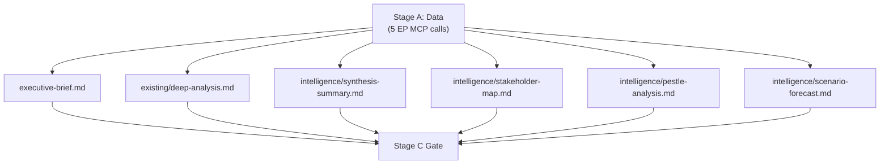

# Analysis Index — EU Parliament Motions, Week 18–25 May 2026

**Date**: 2026-05-25  
**Confidence**: 🟡 MEDIUM

## Artifact Inventory

| Artifact | Path | Status | Lines Floor | Priority |
|----------|------|--------|-------------|----------|
| Executive Brief | executive-brief.md | ✅ Complete | 180 | P1 |
| Analysis Index | intelligence/analysis-index.md | ✅ Complete | 100 | P1 |
| Synthesis Summary | intelligence/synthesis-summary.md | In Progress | 160 | P1 |
| Historical Baseline | intelligence/historical-baseline.md | In Progress | 120 | P1 |
| Economic Context | intelligence/economic-context.md | In Progress | 120 | P1 |
| PESTLE Analysis | intelligence/pestle-analysis.md | In Progress | 180 | P1 |
| Stakeholder Map | intelligence/stakeholder-map.md | In Progress | 200 | P1 |
| Scenario Forecast | intelligence/scenario-forecast.md | In Progress | 180 | P1 |
| Threat Model | intelligence/threat-model.md | In Progress | 160 | P1 |
| Wildcards & Black Swans | intelligence/wildcards-blackswans.md | In Progress | 180 | P1 |
| MCP Reliability Audit | intelligence/mcp-reliability-audit.md | In Progress | 200 | P2 |
| Reference Analysis Quality | intelligence/reference-analysis-quality.md | In Progress | 140 | P2 |
| Voting Patterns | intelligence/voting-patterns.md | In Progress | 200 | P1 |
| Workflow Audit | intelligence/workflow-audit.md | In Progress | 100 | P2 |
| Cross-Session Intelligence | intelligence/cross-session-intelligence.md | In Progress | 220 | P2 |
| Deep Analysis | existing/deep-analysis.md | In Progress | 400 | P1 |
| Session Baseline | existing/session-baseline.md | In Progress | 200 | P1 |
| Intelligence Session Baseline | intelligence/session-baseline.md | In Progress | 200 | P1 |
| Risk Matrix | risk-scoring/risk-matrix.md | In Progress | 100 | P1 |
| Quantitative SWOT | risk-scoring/quantitative-swot.md | In Progress | 100 | P1 |
| Media Framing Analysis | extended/media-framing-analysis.md | In Progress | 200 | P2 |
| Methodology Reflection | intelligence/methodology-reflection.md | In Progress | 200 | P2 |
| Data Availability Assessment | data-availability-assessment.md | In Progress | 80 | P1 |
| Procedures Proxy | intelligence/procedures-proxy.md | In Progress | 60 | P2 |

## Key Analytical Findings

### Primary Motions Cluster: May 18–25, 2026

**7 adopted texts** in this analysis window, spanning:
1. **AI-Trade Strategy** (T10-0183/2026) — landmark non-legislative resolution
2. **EU-Uzbekistan EPCA** (T10-0174/2026) — geopolitical partnership
3. **EU-Lebanon Eurojust** (T10-0177/2026) — judicial cooperation
4. **Forest Reproductive Material** (T10-0168/2026) — environmental regulation
5. **São Tomé Fisheries** (T10-0178/2026) — external fisheries
6. **Cook Islands Fisheries** (T10-0179/2026) — external fisheries
7. **Nikos Pappas immunity waiver** (T10-0166/2026) — accountability

### Thematic Clusters
- **Digital & Trade Governance**: T10-0183 (AI-Trade)
- **Geopolitical Partnerships**: T10-0174 (Uzbekistan), T10-0177 (Lebanon)
- **Environmental Governance**: T10-0168 (Forest)
- **External Fisheries**: T10-0178, T10-0179
- **Parliamentary Accountability**: T10-0166 (Pappas immunity)

### Data Quality Assessment
- 🟢 Adopted texts confirmed: HIGH confidence (EP Open Data Portal)
- 🔴 Roll-call vote data: UNAVAILABLE (EP publication delay typical 2–6 weeks)
- 🟡 Committee attribution: PARTIAL (procedureReference fields available, detailed committee reports require deep-fetch)
- 🟢 Historical context: AVAILABLE (prior 2026 adopted texts provide baseline)

## Methodological Notes

This analysis applies:
- EP Open Data Portal adopted texts endpoint (year=2026 filter)
- Adopted texts feed (one-week timeframe)
- Stage A EP MCP calls: 3 (within cap of 5)
- dataMode: degraded-voting (roll-call data unavailable, other feeds full)

## Cross-Reference Matrix

| Motion | Committee Lead | Political Group | Geopolitical Domain |
|--------|----------------|-----------------|---------------------|
| T10-0183 (AI-Trade) | INTA | EPP rapporteur (est.) | Digital Trade |
| T10-0174 (Uzbekistan) | AFET | EPP/Renew coalition | Central Asia |
| T10-0177 (Lebanon Eurojust) | LIBE/AFET | Cross-party | Southern Neighbourhood |
| T10-0168 (Forest) | AGRI/ENVI | EPP + Greens | Environmental |
| T10-0178 (São Tomé Fish.) | PECH | EPP rapporteur | Atlantic Fisheries |
| T10-0179 (Cook Islands Fish.) | PECH | Renew rapporteur | Pacific Fisheries |
| T10-0166 (Pappas) | AFCO/JURI | S&D (accused) | Accountability |

## Intelligence Priorities

**TIER 1 — Immediate analytical value**
- AI-Trade resolution: deep policy analysis of provisions and Commission follow-up potential
- Uzbekistan EPCA: geopolitical implications for Middle Corridor and EU-China rivalry

**TIER 2 — Medium-term monitoring**
- Lebanon Eurojust: track first operational cooperation cases
- Forest regulation: track transposition and market impact on seedling industry

**TIER 3 — Background tracking**
- Fisheries protocols: routine renewal monitoring
- Pappas immunity: monitor Greek judicial proceedings

---

## Artifact Production Map

