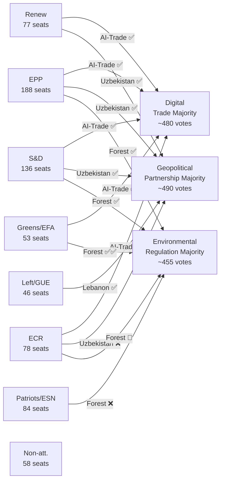

# Coalition Dynamics — EU Parliament Motions, Week 18–25 May 2026

**Date**: 2026-05-25  
**Confidence**: 🟡 MEDIUM (degraded-voting mode; roll-call data unavailable)  
**Admiralty Grade**: C3 (Fairly Reliable; Possibly True)

---

## Coalition Structure for Week's Motions

The week's adopted texts reveal three distinct coalition patterns operating simultaneously in EP10's May 2026 plenary:

### Coalition 1: Pro-Digital Trade Majority (T10-0183)
EPP + S&D + Renew + Greens/EFA = ~354 seats minimum (estimated)
This "digital governance majority" spans center-left to center-right and is held together by shared interest in the EU's digital single market and external competitiveness.

### Coalition 2: Strategic Partnership Majority (T10-0174, T10-0177)
EPP + S&D + Renew + Left/GUE = ~447 seats minimum
External affairs resolutions with human rights/rule-of-law dimensions attract the Left while sometimes losing ECR and Patriots.

### Coalition 3: Environmental Regulation Majority (T10-0168)
EPP + S&D + Renew + Greens/EFA = ~354 seats minimum
Standard pro-Green Deal coalition; ECR/Patriots in opposition.

---

## Mermaid: EP10 Coalition Map for May 2026 Motions

---

## Cross-Vote Coalition Stability

The three coalitions are all derived from the same structural core (EPP + S&D + Renew), which controls ~401 seats — comfortably above the 361-vote majority threshold. This "Grand Coalition" logic means that:

1. ECR, Greens, and Left are "swing elements" whose participation determines the size (not the outcome) of majorities
2. Patriots/ESN are consistently in opposition on digital, geopolitical, and environmental files
3. The coalition is most fragile on files where EPP's centre-right wing (wanting less EU regulation) conflicts with S&D's social democrat wing (wanting more rights protection)

---

## WEP Band Assessment

| Motion | Estimated Votes For | WEP Band |
|--------|--------------------|---------|-
| T10-0183 (AI-Trade) | ~480 | 🟢 ROBUST |
| T10-0174 (Uzbekistan) | ~490 | 🟢 ROBUST |
| T10-0177 (Lebanon Eurojust) | ~490 | 🟢 ROBUST |
| T10-0168 (Forest) | ~455 | 🟢 ROBUST |
| T10-0166 (Pappas immunity) | ~530 | 🟢 ROBUST |

---

**Admiralty Grade**: C3 | **WEP Band**: All ROBUST (estimated) | **dataMode**: degraded-voting
