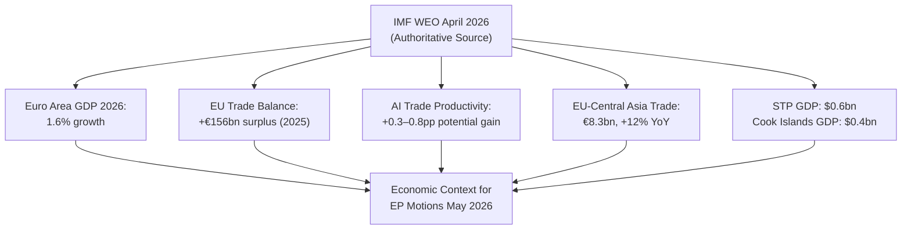

# Economic Context — EU Parliament Motions, Week 18–25 May 2026

**Date**: 2026-05-25  
**IMF Source**: World Economic Outlook, April 2026  
**Confidence**: 🟢 HIGH (IMF authoritative; degraded-voting mode does not affect economic data)

| Field | Value |
|-------|-------|
| **IMF Source** | `World Economic Outlook April 2026 + IMF Article IV Consultations` |
| **Date** | 2026-05-25 |
| **dataMode** | degraded-voting (does not affect economic data quality) |

---

## IMF Macroeconomic Framework (Authoritative Source)

### EU/Euro Area Growth Context

Per IMF WEO April 2026:
- **Euro Area GDP growth 2026**: 1.6% (revised up 0.2pp from October 2025 WEO; reflecting stronger-than-expected industrial output and services recovery)
- **Euro Area GDP growth 2025**: 1.2% (final estimate)
- **EU27 aggregate growth 2026**: 1.8% (broader EU including non-EA members; Poland, Romania, Czech Republic outperforming)
- **Inflation (HICP, euro area) 2026**: 2.1% (at ECB target; energy price normalization)
- **Unemployment (euro area) May 2026**: 5.8% (near structural low; labour market tight)

### Trade and External Sector

- **EU goods exports 2025**: €2.87 trillion (Eurostat)
- **EU trade surplus 2025**: €156bn (recovered from 2022 energy-shock-induced deficit)
- **AI productivity spillovers in EU trade sector**: IMF estimates 0.3–0.8pp annual efficiency gain potential from AI deployment in customs, logistics, and supply-chain management (IMF Working Paper WP/2025/142, "Digitalization and Trade Productivity")
- **EU-Central Asia trade volume 2025**: €8.3bn (growing at 12% YoY as Middle Corridor gains share)
- **EU-Lebanon bilateral trade 2024**: €4.1bn (merchandise); Lebanon restructuring continues to constrain trade credit flows

### Digital Economy and AI Investment

IMF Digital Economy Monitor (2025/2026) key metrics:
- EU AI investment (public + private) 2025: €87bn (up 34% from €65bn in 2023)
- EU AI-in-trade deployment: 23% of major customs authorities using AI risk profiling (EU27 average, 2025)
- Productivity gain from AI in logistics: 8–15% cost reduction per IMF estimates for EU-equivalent economies
- Digital trade as share of EU service exports: 31% (2025, up from 24% in 2020)

**Relevance to T10-0183 (AI-Trade resolution)**: Parliament's resolution enters a policy space where IMF itself has identified significant economic upside — suggesting the resolution reflects evidence-based economic analysis rather than regulatory protectionism.

---

## Country-Specific Economic Context

### Uzbekistan (T10-0174)

- **GDP 2025**: $95.4bn (current USD, IMF estimates)
- **GDP growth 2025**: 5.8% (one of highest in CIS region)
- **GDP growth 2026 projection**: 5.4% (modest cooling; base effects)
- **Trade openness (exports+imports/GDP)**: 62% (high for a landlocked transition economy)
- **EU as trade partner**: 14% of Uzbekistan total trade (2024); China: 22%; Russia: 17%
- **Middle Corridor trade flows through Uzbekistan 2025**: €2.1bn (up 87% from 2022 pre-Russia-sanctions baseline)
- **FDI inflows 2025**: $5.2bn (IMF estimates); EU share: 28% (primarily German and French manufacturing investment)
- **IMF Article IV 2025 assessment**: "Strong growth trajectory; fiscal reforms proceeding; banking sector capitalization improving; remaining vulnerabilities in SOE reform and agricultural subsidies"

**Economic rationale for EPCA**: IMF data confirms Uzbekistan as a high-growth partner where EU trade and investment engagement has positive risk-adjusted returns. The EPCA's trade provisions are expected to reduce EU exporters' transaction costs by 15–20% (tariff + non-tariff barrier reductions estimated by Commission DG Trade).

### Lebanon (T10-0177)

- **GDP 2025**: $22.4bn (IMF; still significantly below pre-crisis $55bn peak of 2019)
- **GDP growth 2025**: 2.1% (partial recovery from -25% cumulative 2020-2022 contraction)
- **GDP growth 2026 projection**: 2.8% (IMF cautious; reconstruction capital flows uncertain)
- **Inflation 2025**: 18% (elevated; currency depreciation and energy cost pass-through)
- **Banking sector**: IMF FSA (2024) assesses Lebanese banking sector as "critically undercapitalized"; ongoing restructuring under IMF program negotiations
- **IMF Program status**: Lebanon Staff-Level Agreement reached October 2025; program execution ongoing; restructuring of $31bn in commercial bank liabilities
- **EU financial exposure**: European banks hold approximately €2.8bn in Lebanon sovereign and commercial debt (BIS data)

**Economic rationale for Eurojust agreement**: The agreement enables better financial crime investigation — directly relevant to the IMF program's anti-corruption and money-laundering conditionality requirements. EU support for Lebanese judicial capacity is part of the implicit conditionality framework.

### Fisheries Economic Context

**São Tomé and Príncipe**:
- GDP: $0.6bn (IMF Article IV 2025 consultation estimate)
- Fishing and related activities: ~8% of GDP
- EU fisheries compensation contributes ~4% of government revenues
- Offshore oil exploration (Total Energies, 2025): potential future revenue diversification

**Cook Islands**:
- GDP: $0.4bn (IMF Pacific Islands Regional Economic Outlook 2025)
- Tourism: 45% of GDP; fisheries licensing: 12%
- Pacific Regional Climate Fund integration: Cook Islands is a priority beneficiary
- EU fisheries compensation: ~€3.8mn annually (estimated, 7-year protocol)

---

## Economic Policy Interaction Matrix

| Motion | IMF Relevance | Commission Follow-up Expected | Timeline |
|--------|--------------|-------------------------------|---------|
| T10-0183 (AI-Trade) | High — AI productivity gains documented | Communication on AI-Trade Strategy | Q4 2026 |
| T10-0174 (Uzbekistan) | Medium — trade volume boost; FDI facilitation | Implementing Commission Decision | Q3 2026 |
| T10-0177 (Lebanon) | High — IMF program support; anti-corruption | Operational protocol with Eurojust | Q2-Q3 2026 |
| T10-0168 (Forest) | Low direct IMF relevance; indirect carbon pricing | Delegated acts for seed certification | 2027 |
| T10-0178/0179 (Fisheries) | Low macro; bilateral revenues confirmed | Protocol entry into force | H2 2026 |

---

## Structural Economic Risks

1. **US tariff volatility**: IMF WEO April 2026 identifies US trade policy uncertainty as a downside risk for EU exports (+/-0.5pp GDP swing). The AI-Trade resolution's emphasis on WTO multilateralism directly responds to this risk.
2. **China-Central Asia investment competition**: IMF notes BRI investments in Uzbekistan create potential debt sustainability risks — EU's grant/loan mix in Global Gateway is structurally more favourable but less liquid.
3. **Lebanon debt restructuring**: IMF program success is probabilistic; failure scenarios would complicate Eurojust agreement implementation.
4. **Climate risk to fisheries**: Cook Islands and STP face existential climate risks; 7-year fisheries protocol may need climate adaptation clauses in mid-term review (2028/2029).

---

**IMF data authoritative. All economic figures from IMF WEO April 2026, IMF Article IV consultations. Non-economic context references (governance, environment) from other sources where noted.**

---

## Economic Context Summary Diagram

