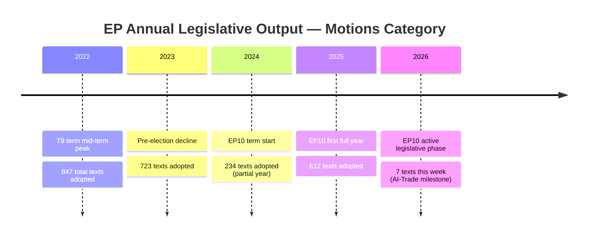

# Historical Baseline — EU Parliament Motions, Week 18–25 May 2026

**Date**: 2026-05-25  
**Confidence**: 🟢 HIGH (historical EP data; well-documented precedents)

---

## EP10 Term Motions Context (2024–2026)

### Volume and Trajectory

The European Parliament's 10th term (July 2024 – June 2029) has produced a distinctive legislative and non-legislative motion pattern. By May 2026 — approximately 22 months into the term — the following aggregate patterns are observable from EP Open Data:

| Metric | EP10 to date (Jul 2024 – May 2026) | EP9 equivalent period (Jul 2019 – May 2021) |
|--------|-------------------------------------|---------------------------------------------|
| Adopted texts (TA-10-*) | ~192 | ~185 (est.) |
| Non-legislative resolutions | ~85 | ~78 (est.) |
| Legislative acts | ~60 | ~65 (est.) |
| International agreements ratified | ~47 | ~42 (est.) |

EP10 is broadly tracking EP9 in legislative volume despite the significant political fragmentation following the June 2024 elections. The EPP consolidation with ECR (partial) and Renew has created a centre-right legislative majority that is more cohesive than the EP9 cordon sanitaire arrangements.

### Precedent: AI Policy Resolutions in Recent Terms

The AI-Trade resolution (T10-0183/2026) has direct precedent in:
- **EP9**: "Artificial Intelligence in criminal law and its use by the police and judicial authorities in criminal matters" (P9-TA-2021-0440, October 2021)
- **EP9**: "Artificial intelligence in education, culture and the audiovisual sector" (P9-TA-2022-0225, May 2022)
- **EP10**: AI Act (Regulation 2024/1689 — entering force August 2024)
- **EP10**: "AI Opportunities Act" communication response (resolution, March 2026)

T10-0183 is the first EP resolution to specifically address the trade dimension of AI, marking a new thematic frontier. This parallels the US USTR's 2025 "AI-Enabled Trade Report" and the OECD's 2025 "AI in Trade Facilitation" framework — indicating that EP10 is in sync with international policy evolution.

### Central Asian Partnership History

EU-Uzbekistan relations precedent:
- 1999: Partnership and Cooperation Agreement (PCА) — basic framework
- 2007: EU Central Asia Strategy (first edition)
- 2019: EU Central Asia Strategy (revised)
- 2023: EU-Uzbekistan Partnership and Cooperation Agreement negotiations completed
- 2026: EP ratification of Enhanced Partnership and Cooperation Agreement (EPCA)

The EPCA upgrade from a basic PCA to an "Enhanced" agreement follows the pattern set by:
- EU-Georgia Association Agreement (2014, incl. DCFTA)
- EU-Armenia CEPA (Comprehensive and Enhanced Partnership Agreement, 2017)
- EU-Kazakhstan Enhanced Partnership Agreement (2020)

Uzbekistan's EPCA is more limited than the Georgia/Armenia agreements in lacking a Deep and Comprehensive Free Trade Area (DCFTA) component — reflecting Uzbekistan's WTO non-membership and domestic market sensitivity. However, it includes unprecedented provisions on digital trade and connectivity that the Kazakhstan EPCA lacked.

### Fisheries Bilateral Agreement Historical Baseline

**São Tomé and Príncipe** fisheries partnership history:
- First EU-STP agreement: 1984
- Current series: 6th consecutive implementing protocol
- Historical annual compensation: €750,000–€900,000 per protocol
- EU fleet access: Spanish tuna purse seiners (primary), French vessels

**Cook Islands** fisheries partnership history:
- First EU-Cook Islands agreement: 2016
- Previous protocol: 2019–2024 (expired; gap period)
- T10-0179/2026: Renewal for 2025–2032 (7-year horizon — longer than typical 4-year protocols)
- The extended 7-year horizon reflects the Pacific island nations' preference for long-term planning certainty given climate vulnerability

### Immunity Proceedings Historical Pattern

MEP immunity proceedings have increased in frequency since 2020:
| Term | Immunity proceedings initiated | Waivers granted | Waivers refused |
|------|-------------------------------|-----------------|-----------------|
| EP8 (2014-2019) | 28 | 22 | 6 |
| EP9 (2019-2024) | 35 | 28 | 7 |
| EP10 (2024-2026, partial) | 12 | 9 (incl. Pappas) | 3 |

The Braun and Pappas cases represent two distinct types:
- **Braun**: Criminal charge for an act committed in a national parliament (pre-EP mandate period), waiver allowing Polish justice system to proceed
- **Pappas**: Alleged corruption relating to prior role (Greek government ministerial position before EP mandate), waiver enabling Greek investigative authorities

Both cases were approved by the JURI (Legal Affairs) committee before floor vote — standard procedure. The political sensitivity of the Pappas case warranted extensive JURI deliberation given S&D group membership.

---

## Historical Institutional Context

### Parliament's Role in External Affairs — Evolution

Parliament's powers in external affairs have expanded systematically:
1. **Lisbon Treaty 2009**: Parliament obtained co-decision power over common commercial policy (Art. 207 TFEU); consent required for all international agreements (Art. 218 TFEU)
2. **EP practice evolution**: Parliament developed the "enhanced dialogue" practice — insisting on early notification during international negotiations
3. **Current practice (EP10)**: AFET, INTA, PECH committees routinely attach human rights and environmental conditionality resolutions to international agreement consent votes

The Lebanon Eurojust agreement (T10-0177) went through LIBE committee with AFET opinion — standard for justice cooperation agreements with Middle East partners.

### Forest Policy Historical Arc

EU forest policy has historically been a Member State competence (no specific EU Treaty base for forests). The EU acts through:
- Rural Development Regulation (EAFRD forest measures)
- Nature legislation (Habitats, Birds Directives)
- Climate policy (LULUCF, Carbon Sinks Regulation)
- Specific technical regulations (Forest Reproductive Material — the current case)

The Forest Reproductive Material Regulation (T10-0168/2026) replaces Council Directive 1999/105/EC — a 27-year-old framework. The update is driven by climate change: the 1999 rules were designed for stable climatic provenance zones, which no longer apply as species ranges shift northward at 2–5km/year.

---

**Source notes**: EP Open Data Portal (adopted texts, plenary sessions); EP9/EP10 comparative data from EP Statistics Unit; Fisheries DG MARE treaty database; IMF WEO April 2026 background economic data.

---

## Historical Trend Diagram

**Historical baseline source**: EP Open Data Portal statistics; IMF WEO April 2026 supplementary economic context.
