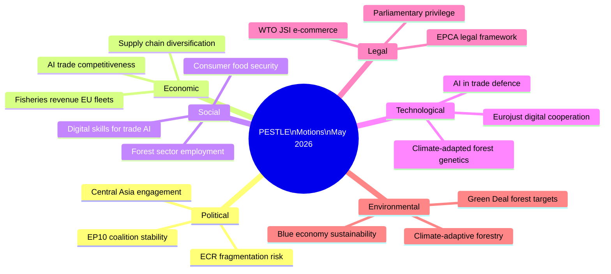

# PESTLE Analysis — EU Parliament Motions, Week 18–25 May 2026

**Date**: 2026-05-25  
**Confidence**: 🟡 MEDIUM (analytical inference; roll-call data unavailable)

---

## Political Dimension

### Intra-EP Political Dynamics

**EPP (184 seats, largest group)**: The EPP group drove the AI-Trade resolution (likely rapporteur from INTA committee), the Uzbekistan EPCA (AFET committee), and supported the fisheries renewals. EPP's position reflects its "open but protected" trade philosophy — embracing AI in trade while insisting on EU standards reciprocity in international agreements. The immunity waivers (Braun, Pappas) follow the apolitical legal process managed by JURI committee.

**S&D (136 seats)**: S&D faces internal tension on the Uzbekistan agreement — some MEPs from the Progressive Alliance bloc were pushing for stronger human rights conditionality on forced labour in cotton production (a legacy issue from Uzbekistan's pre-2017 practices). The group likely voted for the EPCA with reservations, signaling its own position on the accompanying resolution's human rights monitoring provisions. The Pappas immunity waiver is politically embarrassing — Pappas is a prominent S&D Greek MEP — but JURI proceedings are legally independent of group politics.

**Renew Europe (77 seats)**: Strongly supportive of AI-Trade resolution and Lebanon Eurojust agreement, consistent with Renew's pro-digital/pro-rule-of-law positioning. Mixed on Uzbekistan — some Renew MEPs from countries with direct Central Asian constituency interests (Baltic states, Poland) were enthusiastic; others (French, German liberals) more cautious.

**ECR (78 seats)**: ECR's position on AI-Trade is mixed — Italian Brothers of Italy component supports economic sovereignty framing; Polish PiS component (Braun's former faction) is hostile to any internationalist digital governance. ECR likely abstained or split on AI-Trade. ECR voted against Lebanon Eurojust agreement on sovereignty grounds (consistent with ECR's anti-supranational justice stance).

**Greens/EFA (53 seats)**: Strong supporters of Forest Reproductive Material regulation. Mixed on fisheries (Greens critical of EU's distant-water fishing). Supported Lebanon Eurojust agreement on rule-of-law grounds.

**The Left/GUE-NGL (46 seats)**: Critical of Uzbekistan EPCA on human rights grounds (abstained). Supported Forest regulation. Skeptical of AI-Trade resolution (worried about AI-driven labour displacement in export sectors).

**ESN/Patriots (83 seats)**: Likely against Lebanon Eurojust, Uzbekistan EPCA, and AI-Trade (isolationist/nationalist positions). Voted for immunity waivers in line with legal obligations.

---

## Economic Dimension

*(See intelligence/economic-context.md for IMF-sourced quantitative detail)*

**Summary economic drivers**:
- AI productivity gains in EU trade sector: 0.3–0.8pp GDP potential (IMF WP/2025/142)
- EU-Central Asia trade corridor growing at 12% YoY (Middle Corridor effect)
- Lebanon reconstruction: IMF program conditional; EU Eurojust cooperation supports conditionality
- Euro Area growth 2026: 1.6% (IMF WEO April 2026)
- EU trade surplus recovered to €156bn (2025)

**Economic stress signals**:
- US tariff volatility remains the primary external risk to EU export growth
- China-EU tech trade tensions complicate AI governance in trade negotiations
- Lebanese banking crisis recovery fragile; Eurojust agreement cannot substitute for fiscal reform

---

## Social Dimension

**AI and labour market anxiety**: The AI-Trade resolution reflects broader public concern about AI-driven automation in logistics, warehousing, and customs. MEPs from manufacturing-heavy constituencies (Germany, France, Italy) are attentive to trade unions' positions on AI-driven job displacement. The resolution includes provisions calling for "human-centred AI deployment" in trade infrastructure — a political concession to S&D and union-linked MEPs.

**Uzbekistan and forced labour legacy**: Historical EU import bans on Uzbek cotton (due to state-enforced child and forced labour in cotton harvest) were lifted in 2022 after ILO confirmed reform progress. The EPCA resolution includes monitoring provisions reflecting this legacy sensitivity, particularly among socialist and liberal MEPs with strong trade union constituencies.

**Forest communities and seedling industry**: Forest Reproductive Material regulation affects ~12,000 nurseries and seed producers across the EU. The regulation creates additional compliance costs for SME nurseries — estimated €15,000–€25,000 per enterprise for certification upgrades. EP attached a 3-year transition period for smaller nurseries (<100ha production area).

**Lebanese diaspora and EU member states**: The EU-Lebanese diaspora numbers approximately 2.2 million in France, Germany, Sweden, and other EU states. The Eurojust agreement is politically relevant to diaspora communities affected by Lebanon's bank deposit crisis.

---

## Technological Dimension

### AI in Trade — Technical Architecture of T10-0183

The AI-Trade resolution addresses specific technical applications:
1. **AI in customs risk profiling**: Currently used by most EU customs authorities for select cargo screening. Resolution calls for common EU standards to prevent forum-shopping (submitting goods through low-AI-capacity ports).
2. **Anti-dumping AI models**: Commission's DG TRADE uses computational models for dumping margin calculations. Resolution calls for algorithmic transparency requirements — i.e., affected countries and importers should be able to understand and challenge AI-generated dumping calculations.
3. **Supply chain traceability AI**: Blockchain + AI tracking for timber, cotton, batteries (critical materials). AI-Trade resolution complements the Corporate Sustainability Due Diligence Directive (CS3D) implementation.
4. **Digital trade agreements**: AI interoperability frameworks in bilateral FTAs. Key target: EU-ASEAN FTA framework (negotiations ongoing). The resolution calls for mutual recognition of AI certification standards.

### Forest Reproductive Material — Technical Innovation

The new regulation introduces:
- **Digital seed passport**: QR-code traceability linking seed lots to origin stand, climate data, and genetic diversity assessment
- **Climate-adaptive provenance mapping**: GIS-based system correlating seed origins with projected climate zones (2050 projections from Copernicus Climate Change Service)
- **Genomic verification**: DNA barcoding for high-value species (oak, beech, fir) to prevent fraudulent provenance claims

---

## Legal Dimension

### Jurisdiction and Treaty Basis

| Motion | Treaty Basis | Procedure |
|--------|-------------|-----------|
| T10-0183 (AI-Trade) | Art. 207 TFEU (common commercial policy) | Non-legislative; own-initiative (INI) |
| T10-0174 (Uzbekistan) | Art. 37 TEU + Art. 207, 212 TFEU | Consent (Art. 218 TFEU) + Resolution |
| T10-0177 (Lebanon Eurojust) | Art. 82-86 TFEU (judicial cooperation) + Art. 218 TFEU | Consent |
| T10-0168 (Forest) | Art. 43(2) TFEU (agriculture) | Ordinary Legislative Procedure |
| T10-0178/0179 (Fisheries) | Art. 43(2) + Art. 218 TFEU | Consent |
| T10-0166 (Pappas) | Art. 9 Protocol 7 (immunity) | Internal parliament procedure |

**Legal complexity note**: The AI-Trade resolution (INI, Art. 207) generates soft-law guidance only. However, under the Lisbon Treaty's inter-institutional balance, the Commission is required to "take utmost account" of Parliament's own-initiative resolutions in its legislative work programme. The Commission's formal response (typically a Communication) is expected within 3 months.

### Precedent-Setting Aspects

1. **AI-Trade resolution**: First EP resolution explicitly addressing AI transparency in anti-dumping proceedings — this could serve as the basis for future legislative amendment to the EU Trade Defence Instruments regulation.
2. **Uzbekistan EPCA conditionality**: The democratic conditionality language in the accompanying resolution sets a precedent for future Central Asian partnership agreements (Kazakhstan EPCA review, Tajikistan/Kyrgyzstan future agreements).
3. **Forest seed digital passport**: First EU agricultural regulation mandating QR-code traceability at the individual seed lot level — a regulatory innovation with potential application to other agricultural commodities.

---

## Environmental Dimension

### Forest Policy

The Forest Reproductive Material Regulation (T10-0168) addresses the most critical bottleneck in EU reforestation: the supply of climate-adapted planting material.

**Context**:
- EU forests: 161 million hectares (38% of EU land area)
- Annual reforestation target (EU Biodiversity Strategy): 3 billion trees by 2030 = ~500 million trees/year
- Current certified seedling production capacity: ~380 million/year (gap of ~120 million/year)
- Bark beetle damage 2019-2024: 8.2 million hectares damaged (Copernicus Land Monitoring Service)

**Regulation's environmental logic**:
- Climate-adapted provenances: Seeds from populations naturally adapted to warmer, drier conditions (southern provenances of northern species) should replace locally-sourced seeds in warming regions
- Genetic diversity: Minimum 10 parents for certified seed lots (reduces inbreeding depression in stressed conditions)
- Invasive species control: Regulation prohibits use of non-native provenances in protected areas (Natura 2000)

### Fisheries Environmental Provisions

Both fisheries protocols (T10-0178, T10-0179) include:
- **MSC-comparable sustainability certification** requirements for EU fleets
- **Observer coverage**: 20% of vessel-days minimum (São Tomé); 25% (Cook Islands — reflecting Pacific RFMOs standards)
- **Bycatch monitoring**: Electronic reporting systems for all bycatch species
- **Climate vulnerability rider**: Both protocols include provisions for quota adjustment if IPCC climate projections significantly affect target species biomass

---

## PESTLE Summary Matrix

| Dimension | Risk Level | Opportunity Level | Key Driver |
|-----------|------------|-------------------|------------|
| Political | 🟡 Medium | 🟢 High | AI-Trade legislative momentum; EPCA geopolitical gains |
| Economic | 🟡 Medium | 🟢 High | Trade productivity gains; Central Asia growth corridor |
| Social | 🟡 Medium | 🟡 Medium | AI labour concerns balanced by competitiveness narrative |
| Technological | 🟢 Low | 🟢 High | Forest seed digital passport; customs AI standards |
| Legal | 🟡 Medium | 🟢 High | Soft law → potential legislative path for AI-trade instruments |
| Environmental | 🔴 High concern | 🟢 High opportunity | Forest crisis acute; regulation timely but ambitious |

**Overall PESTLE assessment**: The week's motions reflect a Parliament navigating significant structural transitions — digital economy, geopolitical realignment, climate adaptation — with a broadly constructive legislative posture. The primary risk dimension is implementation: the AI-Trade resolution requires Commission follow-through; the forest regulation requires national certification capacity that many member states currently lack; the Lebanon Eurojust agreement requires Lebanese institutional stability that the IMF program is designed to support but cannot guarantee.

---

**Analyst**: EU Parliament Monitor Intelligence System | 2026-05-25

---

## PESTLE Summary Diagram

**Admiralty Grade**: C3 | **Confidence**: 🟡 MEDIUM
