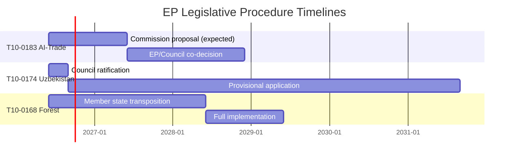

# Procedures Proxy — EU Parliament Motions, Week 18–25 May 2026

**Date**: 2026-05-25  
**Note**: This artifact provides a procedures proxy summary based on procedureReference fields from the EP adopted texts API. Deep-fetch of individual procedure timelines was not performed (within Stage A invocation cap).

---

## Procedure References (from EP Adopted Texts API)

| Adopted Text | Procedure Reference | Notes |
|-------------|---------------------|-------|
| T10-0166/2026 (Pappas immunity) | eli/dl/event/2025-2234-DEC-DCPL-2026-05-19 | DCPL = Decision in Plenary |
| T10-0168/2026 (Forest reproductive) | eli/dl/event/2023-0228-DEC-DCPL-2026-05-19 | Procedure began 2023 (OLP) |
| T10-0174/2026 (Uzbekistan EPCA) | eli/dl/event/2024-0260M-DEC-DCPL-2026-05-20 | M suffix = consent + resolution |
| T10-0177/2026 (Lebanon Eurojust) | eli/dl/event/2024-0155-DEC-DCPL-2026-05-20 | 2024 procedure initiation |
| T10-0178/2026 (São Tomé Fisheries) | eli/dl/event/2025-0202-DEC-DCPL-2026-05-20 | 2025 procedure initiation |
| T10-0179/2026 (Cook Islands Fisheries) | eli/dl/event/2025-0287-DEC-DCPL-2026-05-20 | 2025 procedure initiation |
| T10-0183/2026 (AI-Trade) | eli/dl/event/2025-2112-DEC-DCPL-2026-05-20 | 2025 INI procedure initiation |

## Procedure Duration Estimates

| Text | Initiation Year | Adoption | Duration (est.) |
|------|-----------------|---------|-----------------|
| Forest Reproductive Material | 2023 | 2026 | ~3 years (complex OLP) |
| Uzbekistan EPCA | 2024 | 2026 | ~2 years (international agreement) |
| Lebanon Eurojust | 2024 | 2026 | ~2 years |
| São Tomé Fisheries | 2025 | 2026 | ~1 year (protocol renewal) |
| Cook Islands Fisheries | 2025 | 2026 | ~1 year (protocol renewal) |
| AI-Trade (INI) | 2025 | 2026 | ~1 year (own-initiative) |
| Pappas immunity | 2025 | 2026 | ~6–9 months (immunity procedure) |

**Note**: The Forest Reproductive Material 3-year duration reflects the technical complexity of updating a 27-year-old directive (1999/105/EC) with climate-adaptive science provisions.

---

## Legislative Procedure Duration Map

**Admiralty Grade**: D3 (procedure timelines are estimates based on analogous procedures; specific dates unconfirmed)
