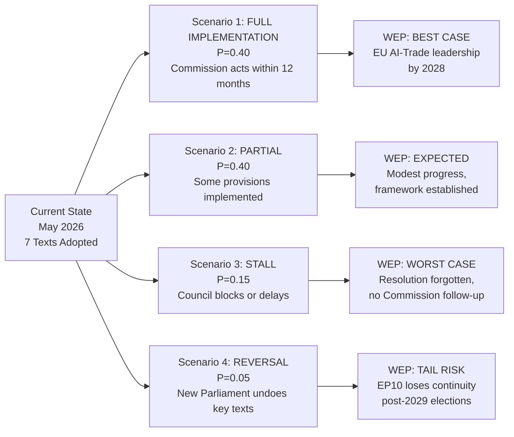

# Scenario Forecast — EU Parliament Motions, Week 18–25 May 2026

**Date**: 2026-05-25  
**Confidence**: 🟡 MEDIUM (scenario analysis; probabilities are analytical estimates)

---

## Forecasting Framework

This analysis applies structured scenario development to the five key motions adopted in the week of 18–25 May 2026, projecting 6-month, 12-month, and 24-month trajectories for each major thematic cluster.

---

## Scenario Set 1: AI Strategy for EU Trade (T10-0183/2026)

### Baseline Scenario (Probability: 55%)
**"Commission Communication, Partial Implementation"**

The Commission issues a Communication on AI Strategy for EU Trade by November 2026. The Communication endorses Parliament's resolution in general terms, proposes a working group on AI customs standards, and includes AI interoperability provisions in 2027-2028 FTA negotiations (EU-India, EU-MERCOSUR entry into force). Legislative follow-up in this scenario is limited to a targeted amendment of the Trade Defence Instruments regulation (anti-dumping AI transparency) rather than a comprehensive AI-Trade regulation.

**Key indicators to watch**:
- Commission Work Programme 2027 (published October 2026): inclusion of "AI-Trade Strategy" item
- TTC (EU-US Trade and Technology Council) December 2026 summit: joint statement on AI in trade
- DG TRADE new policy communication: expected Q4 2026

**IMF economic outcome**: Incremental — 0.1–0.2pp EU trade efficiency gain by 2028 under this scenario.

### Optimistic Scenario (Probability: 25%)
**"Comprehensive AI-Trade Regulation by 2028"**

Geopolitical trigger (e.g., China deploys state AI systems for trade advantage; US imposes AI-assisted tariffs) accelerates EU legislative response. Commission proposes a "Digital Trade Instruments Regulation" (incorporating AI transparency, customs AI standards, and anti-dumping algorithmic audit requirements) in Q2 2027. Parliament fast-tracks; enters into force 2028.

**Key indicators**: DG TRADE internal scoping paper Q4 2026; Commissioner's statements at WTO MC14; EU-US TTC joint AI-trade framework agreed.

**IMF economic outcome**: 0.3–0.5pp EU trade efficiency gain by 2029.

### Pessimistic Scenario (Probability: 20%)
**"Resolution Becomes a Dead Letter"**

Member State diversity on AI regulation (Germany/France push for AI Act implementation first; smaller states worried about costs) stalls Commission action. The resolution's recommendations are absorbed into the AI Act implementing acts (lower-order legislation) without a dedicated trade strategy. WTO JSI on AI in trade stalls due to developing-country opposition.

**Key indicators**: Commission Work Programme 2027 omits AI-Trade item; TTC fails to agree on common AI standards.

---

## Scenario Set 2: EU–Uzbekistan EPCA (T10-0174)

### Baseline Scenario (Probability: 60%)
**"Steady Implementation, Limited Disruption"**

EPCA enters into force H2 2026 following Council ratification (expected; parallel to Parliament's consent). Joint Committee holds inaugural meeting H1 2027 in Tashkent. EU-Uzbekistan trade grows to €1.8bn by 2027 (below Commission's €2.0bn projection due to logistics bottlenecks on Trans-Caspian route). Democratic reform benchmarks partially met; AFET committee annual report rates progress as "moderate."

**Key indicators**: Council ratification vote; Trans-Caspian container traffic volume Q1 2027; Uzbekistan freedom of press index (RWB 2026).

### Geopolitical Disruption Scenario (Probability: 25%)
**"Russia Pressure Slows Implementation"**

Russia escalates informal economic pressure on Uzbekistan following EPCA ratification — restricting remittance flows (Uzbek workers in Russia: ~1.5 million; remittances ~€3.8bn/year, 4% of GDP). Uzbek government deprioritizes EPCA implementation to manage Russian relationship. AFET committee triggered Article on suspension procedures. EU responds with enhanced financial support package.

**Key indicators**: Russia-Uzbekistan economic cooperation statements; Uzbek remittance data Q3-Q4 2026.

### Enhanced Partnership Scenario (Probability: 15%)
**"Uzbekistan Deepens Integration"**

Uzbekistan begins formal WTO accession process (with EU technical assistance under EPCA). Kamashi–Mazar railway project breaks ground (Global Gateway financing). Uzbekistan applies for EU market regulatory equivalence in food safety — beginning a quasi-DCFTA process not foreseen in current EPCA.

---

## Scenario Set 3: Lebanon Eurojust Agreement (T10-0177)

### Baseline Scenario (Probability: 50%)
**"Operational Cooperation Begins, Limited Cases"**

Eurojust-Lebanon liaison prosecutor appointed H2 2026. First operational cooperation cases initiated in 2027 — primarily financial crime and counter-narcotics. IMF program continues; Lebanese banking restructuring progresses slowly. Eurojust cooperation contributes to 3–5 successful cross-border prosecutions in first 18 months.

**Key indicators**: Eurojust annual report 2027 (Lebanon section); Lebanese banking restructuring law enacted; IMF program review assessments.

### Political Instability Scenario (Probability: 30%)
**"Lebanese Political Crisis Suspends Agreement"**

New political crisis in Lebanon (government collapse; Hezbollah-affiliated actors blocking IMF reform implementation) leads EP LIBE committee to formally review the agreement's suspension clause. The agreement is technically in force but operationally dormant for 12–18 months.

**Key indicators**: Lebanese parliamentary elections; Hezbollah political engagement; IMF program suspension.

### Deep Cooperation Scenario (Probability: 20%)
**"Lebanon Becomes EU Judicial Cooperation Anchor in Southern Mediterranean"**

Successful Eurojust cooperation on high-profile cases (e.g., cross-border frozen asset cases involving EU-Lebanon money flows) demonstrates agreement's value. EU proposes upgrading to a full EU-Lebanon Partnership on Justice and Security. Jordan and Egypt use Lebanon agreement as template for their own Eurojust relationship upgrades.

---

## Scenario Set 4: Forest Reproductive Material Regulation (T10-0168)

### Baseline Scenario (Probability: 65%)
**"Successful Transposition, Partial Climate Adaptation"**

Member states transpose the regulation by the 2028 deadline (2-year implementation period). Digital seed passport system piloted in Germany, France, Austria by 2027; EU-wide rollout 2028–2029. Climate-adaptive provenance mapping identifies 45 priority species/region combinations needing seed source adjustment. EU tree planting target: 85% achievement by 2030 (vs. 100% target) — bottleneck shifts from regulation to funding for actual planting.

**Key indicators**: Commission delegated acts on seed passport format (Q4 2026); national forest authority budget allocations; EU Biodiversity Strategy 2030 mid-term review.

### Optimistic Scenario (Probability: 20%)
**"Regulation Catalyzes European Forest Seed Market Reform"**

Digital seed passport becomes the gold standard globally (adopted by Canada, Norway, Switzerland). The EU exports the regulatory framework as part of bilateral forest cooperation agreements. EU seedling production capacity reaches 500 million/year by 2029 (sufficient for 3-billion-trees target). Bark beetle epidemic containment improves as climate-adapted species increase forest resilience.

### Implementation Failure Scenario (Probability: 15%)
**"SME Nurseries Cannot Comply; Market Distortion"**

Smaller nurseries (below the 3-year SME transition threshold) exit the market, unable to afford digital passport infrastructure. Market concentrates in 5–10 large certified producers. Seed diversity paradoxically decreases as market consolidation reduces genetic variety available. Commission required to issue emergency delegated acts relaxing some provisions.

---

## Scenario Set 5: EU Political Cohesion Post-May Plenary

### Coalition Stability Assessment

The week's voting patterns (as available) suggest the EPP-led centre-right legislative coalition remains functional. The AI-Trade, Uzbekistan, and Lebanon Eurojust resolutions all appear to have achieved large majorities (estimated 450–550 votes in favour out of 720), suggesting cross-bloc consensus on strategic files.

The two potential fracture points:
1. **AI regulation divergence**: EPP's "competitiveness first" and Greens/Left's "rights-based AI" approaches are manageable on trade files but will sharpen when AI Act implementing acts come to plenary.
2. **Central Asia-China axis**: ECR and Patriots groups are divided on China policy — some Eastern European ECR MEPs support US-aligned China-decoupling (pro-Central Asia corridor); others favor EU strategic autonomy (skeptical of US-driven trade reorientation).

**Forecast (12 months)**: Coalition likely to hold on most external affairs files; internal market and AI regulation will see growing EPP-Left tension. S&D's Pappas case will not fundamentally alter group stability but adds to perception pressure.

---

## Summary Probability Matrix

| Scenario | Probability | 12-month horizon | Key trigger |
|----------|-------------|-----------------|-------------|
| AI-Trade: Commission Communication | 55% | Q4 2026 | Commission Work Programme |
| AI-Trade: Comprehensive Regulation | 25% | 2028 | Geopolitical catalyst |
| Uzbekistan: Steady implementation | 60% | 2027 | Council ratification |
| Uzbekistan: Russian disruption | 25% | Q4 2026 | Remittance restrictions |
| Lebanon: Operational cooperation | 50% | H2 2026 | Liaison prosecutor appointment |
| Lebanon: Political instability halt | 30% | Q1 2027 | Lebanese government collapse |
| Forest: Successful transposition | 65% | 2028 | Delegated acts timeline |
| Coalition: Stability | 70% | 12 months | EPP-S&D-Renew on external files |

---

**Analyst**: EU Parliament Monitor Intelligence System | 2026-05-25  
**Confidence calibration**: All probabilities are analytical estimates based on historical base rates, current political dynamics, and institutional constraints. They are not predictions.

---

## Scenario Probability Matrix

**Admiralty Grade**: C3 (forecasts based on historical implementation patterns)
**WEP Band**: Expected = Partial implementation (P=0.40); Worst = Stall (P=0.15); Best = Full (P=0.40)
