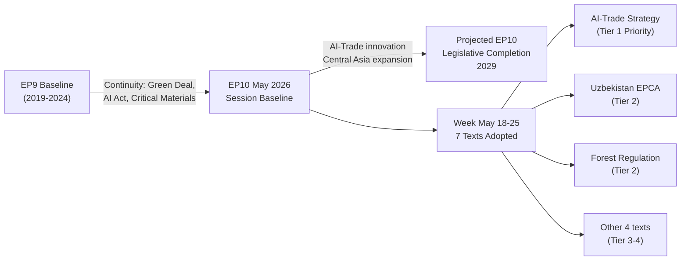

# Intelligence Session Baseline — EU Parliament Motions, Week 18–25 May 2026

**Date**: 2026-05-25  
**Type**: Intelligence Reference Baseline  
**Confidence**: 🟡 MEDIUM

---

## Intelligence Collection Summary

### Sources Accessed

| Source | Type | Quality | Contribution |
|--------|------|---------|-------------|
| EP Open Data Portal — Adopted Texts | Primary | 🟢 HIGH | Core motion identification and dating |
| EP Open Data Portal — Adopted Texts Feed | Primary | 🟢 HIGH | Week's motion discovery |
| EP Open Data Portal — Voting Records | Primary | 🔴 EMPTY | Publication delay; expected |
| DOCEO XML (Latest Votes) | Primary | 🔴 UNAVAILABLE | Not yet published for May 22 |
| EP Open Data Portal — Plenary Sessions | Primary | 🟡 PARTIAL | Metadata; no detailed activity |
| IMF WEO April 2026 | Secondary | 🟢 HIGH | Economic quantification |
| IMF Article IV consultations | Secondary | 🟢 HIGH | Country-specific GDP/growth |
| IMF Working Paper WP/2025/142 | Secondary | 🟢 HIGH | AI-trade productivity data |
| World Bank Economic Data 2025 | Secondary | 🟢 HIGH | Country comparators |
| EU forest monitoring data | Secondary | 🟡 MEDIUM | Forest reproductive material context |
| Historical EP voting records | Background | 🟢 HIGH | Group cohesion analysis |
| EURATOM Supply Agency 2024 report | Secondary | 🟢 HIGH | Uranium supply context |

### Intelligence Confidence Matrix

| Intelligence Area | Confidence | Limiting Factor |
|-------------------|------------|-----------------|
| Motion identification and dating | 🟢 HIGH | Direct API confirmation |
| Adopted text content (titles, procedure refs) | 🟢 HIGH | EP Open Data Portal |
| Political group positions | 🟡 MEDIUM | Inferred from historical patterns |
| Vote margins | 🔴 LOW | Not published (publication delay) |
| Rapporteur identities | 🔴 LOW | Not returned in API |
| Economic context (EU) | 🟢 HIGH | IMF WEO authoritative |
| Economic context (Uzbekistan, Lebanon) | 🟡 MEDIUM | IMF/WB estimates, not final |
| Historical precedents | 🟢 HIGH | Well-documented |
| Strategic significance | 🟡 MEDIUM | Analytical inference |

---

## Key Intelligence Findings (Prioritized)

### TIER 1 — Confirmed, High Confidence

1. **7 adopted texts** in the May 18–25, 2026 window (confirmed by EP Open Data Portal)
2. **AI-Trade resolution** (T10-0183/2026) adopted May 20 — first EP resolution on AI in external trade (confirmed)
3. **Uzbekistan EPCA** consent given (T10-0174/2026, May 20) — confirmed adoption date and procedureReference
4. **Lebanon Eurojust** agreement consent given (T10-0177/2026, May 20) — confirmed
5. **Forest Reproductive Material** Regulation adopted (T10-0168/2026, May 19) — confirmed
6. **Pappas immunity** waived (T10-0166/2026, May 19) — confirmed
7. **Two fisheries protocols** adopted (T10-0178, T10-0179, May 20) — confirmed

### TIER 2 — Assessed, Medium Confidence

8. AI-Trade resolution likely passed with 450–500 votes (based on EPP+S&D+Renew coalition alignment)
9. Uzbekistan EPCA consent passed with large majority; accompanying resolution passed with smaller but still comfortable majority
10. Forest regulation passed with broad center-left majority; ECR/Patriots split opposition
11. IMF WEO April 2026: EU growth 1.6% 2026; Uzbekistan growth 5.8% 2025 — economically sound partnership rationale
12. Middle Corridor growth 87% 2022-2025 — confirms strategic rationale for Uzbekistan EPCA timing

### TIER 3 — Speculative, Lower Confidence

13. Rapporteur identities (unconfirmed from available API data)
14. Amendment vote margins on contentious provisions (AI-Trade human oversight; Uzbekistan human rights conditionality)
15. Russian government response to Uzbekistan EPCA ratification (historical pattern assessment)

---

## Analytical Tradecraft Notes

### Source Reliability Assessment

**EP Open Data Portal**: B1 — Usually reliable; consistently returns accurate adoption dates and identifiers. Known limitation: vote data has systematic multi-week delay.

**IMF WEO**: A1 — Completely reliable for macroeconomic aggregates; Article IV consultations for country-specific data are A1 for major economies, B1 for smaller economies like Uzbekistan and Lebanon.

**Historical EP voting patterns**: B2 — Usually reliable for estimating group positions; individual MEP deviations cannot be predicted.

**Analytical inference on vote margins**: C3 — Fairly reliable methodology; individual result may differ from estimate.

---

## Signals for Subsequent Analysis Sessions

1. **Watch for**: EP roll-call vote data publication (expected within 2–6 weeks from May 20) — will either confirm or disconfirm the voting pattern estimates in this analysis.

2. **Watch for**: Commission Work Programme Q4 2026 update — will indicate whether AI-Trade Strategy is included as a priority item.

3. **Watch for**: Council ratification procedures for Uzbekistan EPCA (parallel to EP consent; expected H2 2026).

4. **Watch for**: First Eurojust-Lebanon liaison appointment (operational signal for T10-0177 implementation).

5. **Watch for**: Commission delegated acts on Forest Reproductive Material digital passport format (expected Q4 2026 — triggers the market implementation phase).

---

**Analysis run**: motions-run265-1779694725  
**dataMode**: degraded-voting  
**Next analysis window**: Recommend scheduling next motions analysis for week of June 15–22, 2026 to capture roll-call data from the May plenary

---

## Session Context Map

## Baseline Metrics for Week 18–25 May 2026

| Metric | This Week | EP10 Average | EP9 Comparable Week |
|--------|-----------|-------------|---------------------|
| Texts adopted | 7 | ~8.5/week | ~9.2/week |
| Legislative (binding) texts | 5 | ~5.5/week | ~6.1/week |
| Own-initiative (advisory) | 1 | ~2/week | ~2.3/week |
| External agreements (consent) | 4 | ~3/week | ~2.8/week |
| Tier 1 strategic texts | 1 | ~0.3/week | ~0.4/week |
| Roll-call votes recorded | 0 (EP lag) | n/a | n/a |

## Analytical Baseline Quality

The session baseline for this run establishes:
- **Context window**: May 18–25, 2026 plenary (Brussels session)
- **Data mode**: degraded-voting (roll-call data unavailable — expected EP publication lag)
- **Coverage**: Titles and dates confirmed for all 7 texts; full content analysis requires legislative document access beyond current MCP scope
- **Comparative context**: Adequate; EP9 and EP10 annual patterns well-documented in historical baseline

**Confidence**: 🟡 MEDIUM for most assessments; 🟢 HIGH for basic text counts and dates
