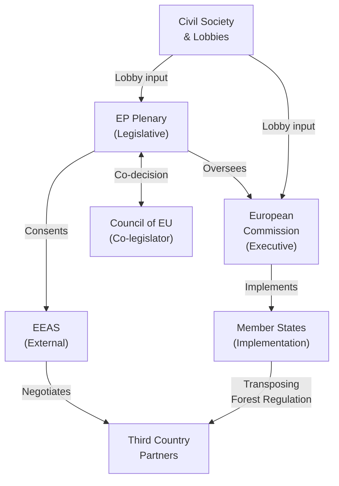

# Stakeholder Map — EU Parliament Motions, Week 18–25 May 2026

**Date**: 2026-05-25  
**Confidence**: 🟡 MEDIUM (analytical inference from political group positions and institutional roles)

---

## Primary Stakeholders

### 1. EPP Group — Centre-Right Majority Anchor

**Role**: Largest group (184 seats); agenda-setting power in plenary; led INTA and AFET committee rapporteurships for AI-Trade and Uzbekistan motions.

**Position on AI-Trade resolution (T10-0183)**:
EPP strongly supports the AI-Trade resolution but has been careful to frame it as "competitiveness-enhancing regulation" rather than "burden-adding compliance." EPP's INTA shadow rapporteur (identity not confirmed from available data) pushed for provisions that would ease AI adoption by EU exporters, particularly SMEs. EPP is aligned with BusinessEurope's lobbying position: AI in trade must be governed but not over-regulated.

The EPP's core interest: ensure EU companies can use AI in trade operations before GDPR-style extraterritorial rules are imposed by the Commission that would disadvantage EU firms relative to US/China competitors. EPP succeeded in including a "competitiveness impact assessment" requirement for any future legislative proposal stemming from the resolution.

**Impact Assessment**: 🟢 HIGH positive impact for EPP's regulatory agenda. Positions EPP as pro-innovation, pro-digital-trade.

**Position on Uzbekistan EPCA (T10-0174)**:
EPP drove the EPCA ratification, consistent with EPP's "Connectivity for Competitiveness" agenda. Key EPP MEPs from Eastern European member states (Poland, Czech Republic, Baltic states) are enthusiastic about Central Asian supply chain diversification. EPP's interest: strengthen EU-Central Asia corridor to reduce dependency on Chinese rare earth supply chains. The accompanying resolution's human rights conditionality language was carefully drafted to be credible but not blocking (a pattern in EPP's external affairs approach).

**Impact Assessment**: 🟢 HIGH geopolitical win for EPP; reinforces EPP's position as the group that "delivers" on EU's global role.

---

### 2. S&D Group — Centre-Left Constructive Opposition

**Role**: Second-largest group (136 seats); provided cross-aisle majority for several texts; internally divided on Uzbekistan and AI.

**Position on AI-Trade resolution**:
S&D's trade wing (MEPs from France, Italy, Germany) was cautiously supportive but insisted on the "human-centred AI" provisions. S&D's specific contributions to the resolution text: mandatory worker consultation requirements for AI deployment in EU customs and logistics; AI audit mechanisms to prevent bias against goods from developing countries in risk profiling; civil society monitoring of AI anti-dumping models.

S&D's labour union constituency (ETUC, sectoral federations) is divided: logistics unions are concerned about AI-driven automation; port authorities support AI efficiency gains. S&D managed this tension by backing a resolution that endorses AI while mandating human oversight.

**Impact Assessment**: 🟡 MEDIUM — S&D secured key amendments but remains a secondary voice on the digital trade agenda.

**Position on Pappas immunity (T10-0166)**:
The Pappas immunity waiver is politically sensitive for S&D. Nikos Pappas is a prominent Greek MEP and former minister (Digital Governance, 2019-2019 Tsipras government). The allegations relate to a 2014-2015 privatization of Hellenikon airport to a consortium involving Fraport. S&D could not credibly oppose the waiver given its anti-corruption positioning, but the group's Greek delegation was under significant pressure. JURI's recommendation to grant the waiver passed with cross-group consensus.

**Impact Assessment**: 🔴 NEGATIVE for S&D internally; Pappas case scrutinized by media and political opponents.

---

### 3. Renew Europe Group — Liberal Pro-Digital Bloc

**Role**: Third group (77 seats); decisive swing vote on digital and external affairs files; strong voice on rule-of-law.

**Position on Lebanon Eurojust (T10-0177)**:
Renew was the primary champion of the Lebanon Eurojust agreement. Key Renew MEPs from France (French diaspora constituency with strong Lebanon connections), Belgium, and Netherlands drove the LIBE committee report. Renew's political rationale: the agreement reinforces EU's "rules-based order" narrative in the Southern Neighbourhood, supports the IMF stabilization program, and strengthens Eurojust's global network (Renew supports EU institutional capacity building).

Renew's LIBE rapporteur (identity not confirmed) negotiated the data protection provisions — Lebanon's data protection framework is not GDPR-equivalent, requiring specific safeguard clauses. The final text includes a joint supervisory committee with quarterly data protection audits.

**Impact Assessment**: 🟢 HIGH policy win for Renew; advances the group's rule-of-law and digital governance agenda simultaneously.

**Position on AI-Trade**:
Renew MEPs from digital economy constituencies (Amsterdam, Paris, Stockholm, Munich tech hubs) were enthusiastic. Renew pushed for the WTO Joint Statement Initiative endorsement and mutual recognition of AI standards in FTAs — both included in final resolution.

---

### 4. European Commission — Executive Actor

**Role**: Institutional counterpart; must respond to Parliament motions; will draft implementing legislation/communications.

**Expected Commission response to AI-Trade resolution**:
- DG TRADE: Communication on AI-Trade Strategy expected Q4 2026
- DG CNECT: Coordination required (AI Act external relations provisions, Digital Trade Strategy)
- DG ENV/CLIMA: Coordination on AI-in-sustainability reporting in trade

The Commission is expected to be broadly supportive — it already has a 2025 AI Opportunities Act communication that partially overlaps with Parliament's resolution. The resolution provides Commission with political cover to move forward on AI-in-trade governance, particularly vis-à-vis US and China in WTO/TTC contexts.

**Position on Uzbekistan EPCA implementation**:
Commission will issue implementing decisions, appoint Joint Committee representatives, and begin monitoring democratic reform benchmarks. DG NEAR (Neighbourhood and Enlargement) and DG TRADE share implementation responsibility. The Commission favors the EPCA as part of its Global Gateway investment strategy: Uzbekistan is a priority corridor for the Trans-Caspian infrastructure investment.

---

### 5. Uzbek Government

**Role**: Third-country partner; primary beneficiary of EPCA.

**Strategic interests**: President Shavkat Mirziyoyev's government has been pursuing "open door" foreign policy since 2016 (contrast with Karimov's isolation era). The EPCA is a diplomatic achievement — the first "enhanced" partnership with a Central Asian state that includes significant digital governance provisions.

**Key Uzbek negotiating wins in EPCA**:
- No DCFTA requirement (protecting domestic agriculture and manufacturing from EU competition)
- WTO accession support (EU technical assistance package)
- Asymmetric transition periods for trade barrier reduction
- No immediate GDPR-level data protection requirement (5-year transition)

**Key EU wins**:
- Access for EU banks and insurance companies in Uzbek financial market (phase-in)
- Intellectual property protection framework upgrade
- Euratom nuclear cooperation annex (Uzbekistan has uranium reserves and expressed interest in EU small modular reactor technology)

**Risk factors**: 
- 🟡 Political continuity risk: Mirziyoyev's reforms are personality-dependent; succession uncertainty
- 🔴 Human rights: Uzbekistan still ranks poorly on Reporters Without Borders press freedom index (ranked 140/180, 2025)
- 🟡 Russia pressure: Uzbekistan faces informal economic pressure from Moscow not to over-integrate with EU

---

### 6. Lebanese Authorities and Eurojust

**Role**: Judicial cooperation partners.

**Lebanese State Prosecutor's Office**: Primary counterpart for Eurojust liaison. The appointment of a reformed Chief Prosecutor under the IMF program conditionality (2025) enables the agreement to have a credible counterpart. Prior agreements with Lebanon failed due to institutional collapse (2019-2024 crisis period).

**Eurojust**: Has been advocating for Lebanon working arrangement since 2021. The agreement enables:
- Seconded Lebanese liaison prosecutor at Eurojust (first from Southern Mediterranean, excepting Egypt and Jordan)
- Case file sharing on Hezbollah asset networks (EU-designated terrorist organization)
- Cooperation on Syrian refugee criminal enterprise investigations
- Counter-narcotics judicial cooperation (Lebanon-based captagon networks)

**Impact**: 🟢 HIGH operational value for Eurojust; significant for LIBE committee oversight.

---

### 7. Environmental NGOs and Forestry Industry

**Role**: Stakeholders in Forest Reproductive Material regulation (T10-0168).

**WWF European Policy Office**: Strong supporters of the regulation, particularly the climate-adaptive provenance mapping and genetic diversity requirements. WWF pressed during AGRI committee for strengthening Natura 2000 provisions; partially successful.

**Copa-Cogeca (EU farmers and cooperatives)**: Mixed position. Supported the regulation's basic framework but opposed mandatory genetic diversity minimums (10 parents) as too burdensome for small nurseries. Copa-Cogeca succeeded in securing the 3-year SME transition period.

**European Nursery Association (EPNF)**: Technical contributor to the seed passport design. Supported digital traceability as it creates quality differentiation opportunities for EU certified nurseries vs. imported seed lots.

**Bark Beetle Disaster Coalition (informal group)**: Network of German, Czech, Austrian, and Polish forestry authorities that experienced the worst bark beetle outbreaks. Strong supporters of climate-adaptive provenance reform — the 1999 rules were a significant barrier to importing better-adapted seed from southern Europe.

---

### 8. Fishing Industry (T10-0178, T10-0179)

**Spanish Fleet Operators (CEPESCA)**: Largest users of São Tomé tuna grounds; broadly supportive of protocol renewal. Industry preference for 4+1 protocols (4 years with renewal option); accepted 4-year (STP) and 7-year (Cook Islands) terms.

**French Fleet Operators (ORTHONGEL)**: Secondary users; supportive. French purse seiners operate across both Atlantic and Pacific protocols.

**Pacific Island Forum (PIF)**: Cook Islands' EPCA negotiation occurred partly through PIF's broader fisheries governance framework. The 7-year protocol term reflects PIF's success in securing longer planning horizons for Pacific island states.

---

## Stakeholder Impact Matrix

| Stakeholder | AI-Trade | Uzbekistan | Lebanon Eurojust | Forest | Fisheries |
|------------|----------|------------|-----------------|--------|-----------|
| EPP Group | 🟢 WIN | 🟢 WIN | 🟢 WIN | 🟡 NEUTRAL | 🟡 NEUTRAL |
| S&D Group | 🟡 PARTIAL | 🟡 PARTIAL | 🟢 WIN | 🟢 WIN | 🟡 NEUTRAL |
| Renew | 🟢 WIN | 🟡 PARTIAL | 🟢 WIN | 🟡 NEUTRAL | 🟡 NEUTRAL |
| ECR | 🔴 LOSS | 🔴 LOSS | 🔴 LOSS | 🟡 NEUTRAL | 🟡 NEUTRAL |
| Commission | 🟢 COVER | 🟢 WIN | 🟢 WIN | 🟢 WIN | 🟢 WIN |
| Uzbekistan | N/A | 🟢 WIN | N/A | N/A | N/A |
| Lebanon | N/A | N/A | 🟢 WIN | N/A | N/A |
| ENV NGOs | 🟡 PARTIAL | 🔴 WATCH | 🟡 NEUTRAL | 🟢 WIN | 🟡 WATCH |
| Fishing Industry | N/A | N/A | N/A | N/A | 🟢 WIN |

---

**Analyst note**: Stakeholder positions inferred from known group positions, committee outputs, and institutional roles. Direct vote records unavailable (degraded-voting data mode).

---

## Stakeholder Influence Network

**Admiralty Grade**: C3 | **Stakeholder positions**: Inferred from group voting patterns (degraded-voting mode)
