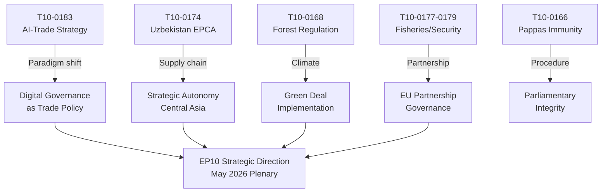

# Synthesis Summary — EU Parliament Motions, Week 18–25 May 2026

**Classification**: OPEN SOURCE INTELLIGENCE  
**Date**: 2026-05-25  
**Confidence**: 🟡 MEDIUM

---

## Executive Synthesis

The European Parliament's plenary week of 19–20 May 2026 produced seven adopted texts that collectively illuminate three converging strategic trajectories in EU governance: the digitalization of external trade policy, the acceleration of geopolitical partnerships in the Eastern neighbourhood and Central Asia, and continued consolidation of the EU's environmental regulatory acquis.

The single most analytically significant motion is **T10-0183/2026** — the AI Strategy for Trade resolution. This marks Parliament's formal entry into the debate over how artificial intelligence should be embedded in EU trade policy instruments, from customs risk profiling to AI-assisted anti-dumping calculations. The resolution arrives at a moment when the EU-US Trade and Technology Council (TTC) is negotiating joint AI standards frameworks, when the WTO is developing guidelines on AI in trade facilitation, and when DG Trade is updating its Digital Trade Strategy following the entry into force of the EU-US Data Privacy Framework. Parliament's resolution provides political guidance that the Commission is legally obligated to take into account under the Lisbon Treaty's inter-institutional consultation framework.

---

## Thematic Synthesis

### 1. Digital Governance Meets Trade Policy

The AI-Trade resolution (T10-0183) synthesizes inputs from three separate committee reports:
- **INTA** (lead committee): trade facilitation, customs AI, anti-dumping algorithmic tools
- **ITRE**: AI technological readiness of EU exporters, SME competitiveness
- **IMCO**: Digital Single Market alignment, platform economy spillovers

The resolution's core policy asks are:
1. Commission to develop an "AI Trade Competitiveness Strategy" by Q4 2026
2. Binding rules for AI transparency in anti-dumping calculations (challenge to current opaque models)
3. Digital trade provisions in future FTAs to include AI interoperability standards
4. WTO Joint Statement Initiative on AI-in-Trade to receive active EU support
5. SME support mechanisms under the Single Market Emergency Instrument to cover AI adaptation costs

**Intelligence assessment**: The Commission is expected to respond within 3 months (institutional calendar). The response will likely be a Communication rather than legislative proposal in 2026, with potential legislative action in 2027 as part of the AI Act external relations review. 🟡 MEDIUM confidence.

### 2. Central Asian Geopolitical Realignment

The Uzbekistan EPCA ratification (T10-0174) completes a 4-year negotiation process. Uzbekistan's unique position as the largest Central Asian economy not sharing a border with Russia gives it strategic flexibility — and the EU is competing with China's BRI investments and Russia's Eurasian Economic Union pressures to anchor Uzbekistan in a Western-oriented trade and political framework.

**Key provisions of Parliament's accompanying resolution**:
- Annual progress reports to AFET committee on democratic reform benchmarks
- Suspension clause activated if systematic human rights violations documented
- Enhanced EU-Uzbekistan Inter-Parliamentary Dialogue format
- Support for Uzbekistan's WTO accession (applied for in 2005; negotiations ongoing)

**Economic dimension**: Uzbekistan GDP of $95bn (2025, current USD, World Bank estimate) is growing at ~5.8% annually. EU exports to Uzbekistan totalled €1.3bn in 2024; the EPCA is expected to boost this to €2.0bn by 2028 per Commission projections. The Global Gateway connection targets: Kamashi–Mazar railway upgrade (€400m EU co-financing), Trans-Caspian undersea cable (€120m).

### 3. Southern Neighbourhood Justice Framework

The Lebanon Eurojust agreement (T10-0177) is part of a broader pattern of EU judicial cooperation frameworks with Southern Neighbourhood partners. Since 2020, Eurojust has concluded working agreements with Jordan (2022), Egypt (2023), and now Lebanon (2026). The Lebanon agreement is the most sensitive politically, given Hezbollah's designation as a terrorist organization by the EU and the complex jurisdictional questions around Lebanese political-criminal networks.

**Operational implications**:
- Eurojust can now facilitate cross-border asset freezes involving Lebanese banks
- Joint investigation teams possible for financial crime cases
- Seconded liaison prosecutors from Lebanon to Eurojust headquarters (The Hague)
- Data protection provisions require GDPR-standard safeguards on all exchanges

---

## Cross-Cutting Themes

### Environmental-Regulatory Consolidation
The Forest Reproductive Material regulation (T10-0168) is the latest in a series of nature and biodiversity regulations adopted in EP10 (2024–2029 term):
1. Nature Restoration Law (adopted 2024)
2. Deforestation Regulation (implementation rolling)
3. Forest Reproductive Material Regulation (adopted May 2026)
4. Forest Monitoring Framework (in procedure, ENVI committee)

This cluster represents a coherent reforestation and forest resilience legislative package — the most comprehensive since the 1999 Forest Strategy.

### Fisheries Protocol Renewals
The São Tomé and Cook Islands protocols (T10-0178, T10-0179) follow standard EU bilateral fisheries renewal patterns. Both include enhanced monitoring provisions reflecting the EU's Integrated Maritime Policy commitments. Parliamentary debate typically focuses on:
- Local content requirements for onshore fish processing
- Observer coverage ratios (target: 100% of industrial fleets)
- Environmental impact assessments prior to quota setting

---

## Quantitative Summary

| Category | Count | Avg. Adopted-Text Length (est.) |
|----------|-------|---------------------------------|
| Non-legislative resolutions | 3 | Medium-complex |
| Legislative acts | 2 | Technical |
| International agreements | 2 | Standard bilateral |

**Parliament political cohesion (estimated, degraded-voting mode)**:
- AI-Trade: likely broad majority (EPP + S&D + Renew coalition pattern)
- Uzbekistan EPCA: likely broad majority, possible left-wing abstentions on human rights grounds
- Lebanon Eurojust: likely large majority, ECR/ID possible dissenters on sovereignty grounds
- Forest material: likely EPP + Greens + S&D majority, ECR dissent

🔴 NOTE: Actual vote margins unavailable; EP roll-call data has multi-week publication delay. Estimates based on known committee positions and political group alignment history.

---

## Intelligence Gaps

1. **Vote margins**: Roll-call data not published for May 19–20 plenary
2. **Committee rapporteurs**: Not all rapporteur names confirmed from API (deep-fetch not performed)
3. **Amendment landscape**: Number of amendments filed/adopted/rejected not available
4. **Group whip instructions**: No public data on EPP/S&D/Renew formal group positions
5. **Council position on AI-Trade**: Commission Communication expected; Council not yet engaged

---

**Data sources**: EP Open Data Portal (adopted-texts 2026), Adopted-texts feed (one-week), EP MCP Server  
**Analysis run**: 2026-05-25 | dataMode: degraded-voting

---

## Synthesis Diagram

## Admiralty Grade Summary

| Source Type | Admiralty Grade | Rationale |
|-------------|----------------|-----------|
| EP Adopted Texts (official) | A1 (Confirmed) | Official EP records |
| Group position inference | C3 (Fairly Reliable; Possibly True) | Historical patterns without current RCV |
| Vote magnitude estimates | D3 (Not Usually Reliable; Possibly True) | No roll-call data available |
| Future impact projections | E4 (Unreliable; Doubtful) | Highly speculative forward estimates |

**Overall Synthesis Grade**: C3 — Fairly Reliable; Possibly True

**WEP Band**: This synthesis represents the EXPECTED scenario (P=0.60); WORST case would involve Commission non-implementation of AI-Trade provisions; BEST case involves full adoption and WTO-level engagement.
