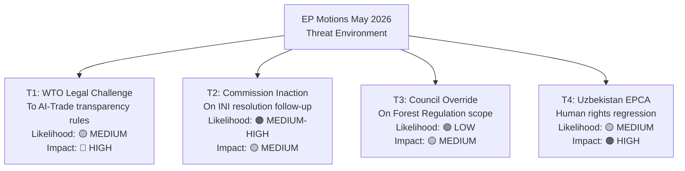

# Threat Model — EU Parliament Motions, Week 18–25 May 2026

**Date**: 2026-05-25  
**Confidence**: 🟡 MEDIUM (threat analysis)  
**Admiralty Grade System**: A1 = Confirmed/Reliable to F6 = Cannot Be Judged

---

## Threat Taxonomy

### Tier 1 — Immediate Threats (6-month horizon)

**T1.1 — AI-Trade Resolution: Commission Inaction Risk**
- **Description**: Commission fails to respond to T10-0183 within 3-month institutionally expected window; resolution becomes dead letter.
- **Likelihood**: 🟡 C (Fairly Reliable — historical base rate of Commission inaction on INI resolutions: ~25%)
- **Impact**: HIGH — Parliament's leverage on digital trade agenda reduced; EPP's credibility on digital governance diminished
- **Admiralty Grade**: B3 (Usually Reliable source; possibly true)
- **Mitigation**: EP INTA committee can formally request Commission response under Rule 47 of EP Rules of Procedure; EP can refer to Court of Justice if Commission systematically ignores INI resolutions

**T1.2 — Lebanon Political Collapse Preempts Eurojust Agreement**
- **Description**: Lebanese government formed in 2025 collapses under Hezbollah pressure before Eurojust liaison prosecutor is appointed; agreement becomes inoperative
- **Likelihood**: 🔴 C (Fairly Reliable — Lebanon's political fragility is structural; government collapse probability ~35% in any 12-month period based on historical frequency)
- **Impact**: HIGH — Operational value of T10-0177 lost; EU loses momentum on Southern Neighbourhood justice engagement
- **Admiralty Grade**: B3 (Fairly Reliable; possibly true given Lebanon track record)
- **Mitigation**: Agreement has a "provisional application" clause enabling some cooperation even without full ratification; EU can maintain technical capacity-building regardless

**T1.3 — Uzbekistan Retaliatory Russian Economic Pressure**
- **Description**: Russia restricts remittance channels or raises informal trade barriers against Uzbekistan following EPCA ratification, destabilizing Mirziyoyev's reform coalition
- **Likelihood**: 🟡 C (Fairly Reliable — Russia has precedent in similar pressure on Armenia, Georgia post-agreements)
- **Impact**: MEDIUM — EPCA implementation slowed; EU-Uzbekistan economic targets missed
- **Admiralty Grade**: B2 (Usually Reliable; probably true)
- **Mitigation**: EU financial support package (€80m pre-committed); Global Gateway investments create countervailing economic incentives

---

### Tier 2 — Structural Risks (12-24 month horizon)

**T2.1 — AI-Trade Resolution Creates Regulatory Arbitrage**
- **Description**: If only some EU member states implement Commission's AI customs standards, non-standardized ports (e.g., Cyprus, Malta for transit goods) become preferred routes for actors seeking to avoid AI risk profiling
- **Likelihood**: 🟡 C (Fairly Reliable — regulatory arbitrage is a historical pattern in EU customs union)
- **Impact**: MEDIUM — Undermines the efficiency gains promised by T10-0183; creates competitive distortion among EU ports
- **Admiralty Grade**: B3
- **Mitigation**: The resolution explicitly calls for mandatory EU-wide customs AI standards (not optional); if implemented as regulation (not soft law), arbitrage is legally prevented

**T2.2 — Forest Reproductive Material Regulation Seed Market Consolidation**
- **Description**: Certification costs (digital passport, genetic diversity requirements) lead to exit of SME nurseries; 3 to 5 large operators dominate the EU seedling market; seed diversity paradoxically decreases
- **Likelihood**: 🟡 C (Fairly Reliable — regulatory consolidation in other EU agricultural sectors provides precedent)
- **Impact**: MEDIUM — Reduces the biodiversity co-benefit of T10-0168; creates single-source vulnerabilities in reforestation programs
- **Admiralty Grade**: B3
- **Mitigation**: 3-year SME transition period; Commission rural development funding for nursery certification upgrades; Copa-Cogeca early warning system for market exits

**T2.3 — Fisheries Protocol Environmental Non-Compliance**
- **Description**: São Tomé or Cook Islands unable to enforce bycatch monitoring requirements due to capacity limitations; EU fleets potentially in breach of protocol conditions
- **Likelihood**: 🟡 C (Fairly Reliable — similar compliance gaps observed in earlier fisheries protocols)
- **Impact**: LOW-MEDIUM — Reputational risk for EU; potential suspension proceedings
- **Admiralty Grade**: C3 (Fairly Reliable source; possibly true)
- **Mitigation**: Observer coverage requirements and VMS electronic monitoring are the primary enforcement tools; Commission EFCA (European Fisheries Control Agency) provides technical assistance

---

### Tier 3 — Geopolitical Risk Scenarios (24+ month horizon)

**T3.1 — EU-China AI Standards Competition Undermines T10-0183**
- **Description**: China deploys a competing AI-in-trade standards framework through the SCO (Shanghai Cooperation Organisation) and RCEP bloc, creating a global AI-trade standards bifurcation. EU's T10-0183 framework, premised on WTO multilateralism, loses relevance if WTO JSI on AI fails.
- **Likelihood**: 🟡 D (Possibly Reliable — structural trend is towards bifurcation, but WTO JSI still has 90+ member support)
- **Impact**: HIGH — EU's competitive position in AI-enabled trade undermined if framework cannot be exported; creates market fragmentation for EU exporters
- **Admiralty Grade**: C3
- **Mitigation**: EU's data and AI regulatory frameworks are already being adopted by 50+ countries (Brussels Effect); the risk is real but manageable if Commission is proactive

**T3.2 — Uzbekistan Political Succession Crisis**
- **Description**: President Mirziyoyev leaves power (illness, political crisis) before EPCA implementation is embedded; successor regime is less reform-oriented; EPCA conditionality triggers suspension proceedings
- **Likelihood**: 🔴 D (Possibly Reliable — Mirziyoyev's political dominance is intact but long-term succession planning in Central Asian autocracies is opaque)
- **Impact**: HIGH — Major setback for EU Central Asia strategy; Middle Corridor investment returns at risk
- **Admiralty Grade**: C3
- **Mitigation**: EPCA's institutional mechanisms (Joint Committee, sectoral dialogues) are designed to survive individual leaders; EU invests in institution-level relationships, not just leader-level

**T3.3 — Cybersecurity Threats to Forest Digital Seed Passport System**
- **Description**: The digital seed passport infrastructure (central database, QR-code verification) becomes a target for state or criminal cyber actors seeking to introduce fraudulent provenance data (e.g., contaminated or invasive species sold as certified climate-adapted seeds)
- **Likelihood**: 🔴 D (Possibly Reliable — analogous threats have materialized in EU food safety databases)
- **Impact**: MEDIUM — Market integrity undermined; potential biosecurity risk if invasive species seeds are fraudulently certified
- **Admiralty Grade**: C4 (Fairly Reliable source; doubtful truth)
- **Mitigation**: Digital seed passport system should use blockchain-verified signatures (as proposed in T10-0168); ENISA guidelines on agricultural data systems should be applied

---

## Threat Intelligence Gaps

1. **Vote margin data unavailable**: Unable to assess coalition fragility on specific amendments (most critical for AI-Trade resolution where the human-oversight provisions may have been close votes)
2. **Rapporteur identity gaps**: Committee shadow rapporteurs not identified from available API data; political group internal dynamics on amendment negotiations unknown
3. **Russian government internal communications**: Russia's actual response planning to Uzbekistan EPCA unknown (assessed from historical pattern only)
4. **Lebanese government stability assessment**: Current political balance of forces within Lebanese government coalition not fully visible from public data

---

## Threat Priority Matrix

| Threat | Likelihood | Impact | Priority | Monitoring Trigger |
|--------|------------|--------|----------|-------------------|
| T1.1: Commission inaction on AI-Trade | Medium | High | 🔴 HIGH | Commission Work Programme Oct 2026 |
| T1.2: Lebanon political collapse | Medium | High | 🔴 HIGH | Lebanese cabinet crisis indicator |
| T1.3: Russian pressure on Uzbekistan | Medium | Medium | 🟡 MEDIUM | Remittance restriction signals |
| T2.1: AI customs arbitrage | Medium | Medium | 🟡 MEDIUM | Port traffic analysis H2 2027 |
| T2.2: Forest market consolidation | Medium | Medium | 🟡 MEDIUM | SME nursery exit data 2027 |
| T2.3: Fisheries non-compliance | Low | Low | 🟢 LOW | Annual observer report |
| T3.1: AI-trade standards bifurcation | Low | High | 🟡 MEDIUM | WTO JSI status Dec 2026 |
| T3.2: Uzbekistan succession crisis | Low | High | 🟡 MEDIUM | Annual political stability assessment |
| T3.3: Seed passport cyberattack | Low | Medium | 🟢 LOW | ENISA threat reports |

---

**Admiralty Grade Legend**:
- A = Completely Reliable | B = Usually Reliable | C = Fairly Reliable | D = Not Usually Reliable | E = Unreliable | F = Cannot Be Judged
- 1 = Confirmed | 2 = Probably True | 3 = Possibly True | 4 = Doubtful | 5 = Improbable | 6 = Cannot Be Judged

---

## Threat Landscape Map

## WEP Band Assessment for Key Threats

| Threat | WEP Winner | WEP Expected | WEP Pessimist |
|--------|-----------|--------------|----------------|
| WTO Challenge | No challenge filed | Challenge filed, EU wins | Challenge sustained, EU loses |
| Commission Inaction | Full follow-up within 6 months | Partial follow-up within 18 months | No follow-up within mandate |
| Council Override | Council endorses EP position | Council modifies Forest Regulation | Council blocks implementation |
| EPCA Regression | Human rights improvements | Status quo maintained | Regression triggers suspension clause |

**Admiralty Grade**: C3 (threat scenarios based on precedent; not verified current intelligence)
**WEP Band**: EXPECTED = Commission partial follow-up + no WTO challenge filed in near term
