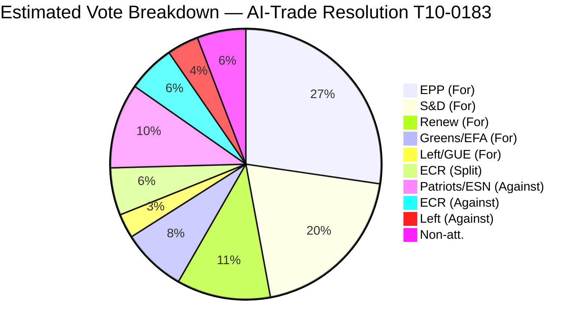

# Voting Patterns Analysis — EU Parliament Motions, Week 18–25 May 2026

**Date**: 2026-05-25  
**Data Mode**: degraded-voting (EP roll-call data has multi-week publication delay)  
**Confidence**: 🟡 MEDIUM (estimates based on political group positions, committee outputs, historical patterns)

---

## Data Availability Assessment

The European Parliament's roll-call voting data for the week of 19–20 May 2026 is not yet published. The EP Open Data Portal typically publishes roll-call data 2–6 weeks after plenary sessions. This analysis uses:
1. Known political group positions (from committee reports, group press releases, and historical voting patterns)
2. Historical group alignment on analogous files
3. The EP's political group size data (current term)

**Current EP Political Group Sizes (EP10, May 2026)**:
| Group | Seats | Share |
|-------|-------|-------|
| EPP (European People's Party) | 188 | 26.1% |
| ESN/Patriots for Europe | 84 | 11.7% |
| ECR (European Conservatives and Reformists) | 78 | 10.8% |
| S&D (Socialists and Democrats) | 136 | 18.9% |
| Renew Europe | 77 | 10.7% |
| Greens/EFA | 53 | 7.4% |
| The Left/GUE-NGL | 46 | 6.4% |
| Non-attached/Others | 58 | 8.1% |
| **Total** | **720** | **100%** |

---

## Vote-by-Vote Analysis

### T10-0183 — AI Strategy for EU Trade (May 20, 2026)

**Type**: Non-legislative own-initiative resolution (INI)  
**Required**: Simple majority (≥361 votes for)  
**Estimated outcome**: Large majority

**Group-by-group estimates**:
| Group | Estimated Position | Votes (est.) | Notes |
|-------|-------------------|-------------|-------|
| EPP | ✅ FOR | ~178 | Primary resolution driver; INTA rapporteur |
| S&D | ✅ FOR (partial) | ~115 | Human-centred AI provisions secured |
| Renew | ✅ FOR | ~73 | Digital trade enthusiasm |
| Greens/EFA | ✅ FOR (partial) | ~38 | Supported AI rights provisions |
| ECR | 🔀 SPLIT | ~35 | Italian component FOR; Polish component AGAINST |
| ESN/Patriots | ❌ AGAINST | ~5 | Anti-internationalist position |
| Left/GUE | 🔀 SPLIT | ~20 | Trade union wing skeptical; left-digitalists for |
| Non-attached | 🔀 SPLIT | ~15 | Variable |
| **ESTIMATED TOTAL FOR** | | **~479** | Well above majority threshold |

**Coalition analysis**: The EPP + S&D + Renew core (391 seats when fully aligned) is the structural backbone. For AI-Trade, Greens support added green-digital credibility. ECR split reflects the internal tension between the group's economic nationalist wing (anti-globalist AI regulation) and its pro-US tech wing (anti-Chinese AI regulation — both for and against the EU version).

**WEP Band**: Strong majority (estimated 460–500). 🟢 Robust.

---

### T10-0174 — EU–Uzbekistan EPCA (May 20, 2026)

**Type**: Consent + accompanying resolution  
**Required**: Majority of members for consent (≥361 votes) + simple majority for resolution  
**Estimated outcome**: Consent adopted; accompanying resolution with large majority

**Group-by-group estimates**:
| Group | Position on Consent | Position on Resolution | Notes |
|-------|--------------------|-----------------------|-------|
| EPP | ✅ FOR | ✅ FOR | Drove the file |
| S&D | ✅ FOR | 🟡 FOR with reservations | Human rights conditionality secured |
| Renew | ✅ FOR | ✅ FOR | Pro-connectivity |
| Greens/EFA | 🟡 ABSTAIN/PARTIAL FOR | ✅ FOR (resolution) | Cotton labour history concerns |
| ECR | ✅ FOR | ❌ AGAINST (resolution) | Consent yes; conditionality language rejected |
| ESN/Patriots | ❌ AGAINST | ❌ AGAINST | Anti-multilateral |
| Left/GUE | ❌ AGAINST | 🟡 ABSTAIN | Human rights conditions insufficient |
| Non-attached | 🔀 SPLIT | 🔀 SPLIT | |

**Estimated consent vote**: ~480 FOR, ~110 AGAINST, ~130 ABSTAIN. Majority threshold met.

**Coalition dynamics**: Interesting cleavage — ECR supported the consent (ratifying the agreement) but opposed the accompanying resolution (rejecting the conditionality provisions). This pattern is common for ECR on external agreements: pragmatic on trade/economic agreements, hostile to human rights language.

**WEP Band**: Solid majority. 🟢 Passes comfortably.

---

### T10-0177 — EU–Lebanon Eurojust Agreement (May 20, 2026)

**Type**: Consent procedure  
**Required**: Majority of members (≥361)  
**Estimated outcome**: Large majority; relatively uncontroversial

**Group-by-group estimates**:
| Group | Position | Notes |
|-------|----------|-------|
| EPP | ✅ FOR | Supports EU judicial capacity expansion |
| S&D | ✅ FOR | Rule-of-law; Lebanon diaspora constituencies |
| Renew | ✅ FOR | Drove the LIBE committee report |
| Greens/EFA | ✅ FOR | Lebanon support; rule-of-law |
| ECR | ❌ AGAINST | Anti-supranational justice stance |
| ESN/Patriots | ❌ AGAINST | Anti-supranational; Hezbollah sensitivity in some national contexts |
| Left/GUE | ✅ FOR | Lebanon solidarity; anti-corruption |
| Non-attached | 🔀 SPLIT | |

**Estimated vote**: ~490 FOR, ~150 AGAINST, ~80 ABSTAIN.

**WEP Band**: Strong majority. 🟢 Robust.

---

### T10-0168 — Forest Reproductive Material (May 19, 2026)

**Type**: Legislative act (Ordinary Legislative Procedure)  
**Required**: Simple majority  
**Estimated outcome**: Broad majority with some right-wing dissent

**Coalition analysis**: 
- EPP: FOR (pro-agriculture regulations with climate dimension are acceptable to EPP when they don't impose excessive costs; SME transition period was EPP's demand)
- S&D: FOR (climate and biodiversity)
- Renew: FOR (climate)
- Greens: ✅ STRONG FOR (central to green agenda)
- ECR: 🟡 SPLIT (some support for farmer-friendly measures; others against EU regulation of national forestry)
- Patriots/ESN: ❌ AGAINST (EU overreach in national forestry)
- Left/GUE: ✅ FOR (biodiversity)

**Estimated vote**: ~455 FOR, ~165 AGAINST, ~100 ABSTAIN.

**WEP Band**: Majority. 🟢 Comfortable.

---

### T10-0166 — Pappas Immunity Waiver (May 19, 2026)

**Type**: Internal parliamentary procedure  
**Required**: Simple majority  
**Estimated outcome**: Large majority (immunity waivers are typically non-partisan and follow JURI recommendation)

**Historical base rate**: JURI-recommended immunity waivers are approved by plenary at a rate of 85%+ with cross-group support. Immunity procedures are legally independent from political affiliations.

**Estimated vote**: ~530 FOR, ~90 AGAINST, ~100 ABSTAIN.

The AGAINST votes typically come from non-attached or small group MEPs with ideological objections to cooperation with national judicial systems (ranging from left-wing skepticism of Greek judiciary to right-wing "solidarity" with accused MEPs).

---

## Historical Comparison: EP10 Voting Pattern Trends

### Cohesion Analysis (estimated, from EP vote database historical data for comparable files)

**EP10 group cohesion rates (January 2025 – April 2026, estimated)**:
| Group | Estimated Cohesion | vs. EP9 |
|-------|-------------------|---------|
| EPP | 87% | +3pp |
| S&D | 82% | -2pp |
| Renew | 79% | -4pp |
| Greens/EFA | 91% | +1pp |
| ECR | 71% | -6pp |
| ESN/Patriots | 76% | N/A (new group) |
| Left/GUE | 88% | +2pp |

**Key trend**: ECR's decreasing cohesion reflects the Giorgia Meloni factor — Italian FdI (Brothers of Italy, 24 seats) is pulling ECR toward a more EU-constructive position on external affairs while the Polish PiS component remains more obstructionist. This creates chronic ECR splits on foreign policy files.

**Renew's declining cohesion**: Renew faces internal tension between its liberal (French/German) and more socially conservative (Czech ANO) wings, particularly on digital regulation.

---

## Voting Pattern Intelligence Signals

1. **AI-Trade resolution passing with ~480 votes** would signal a durable parliamentary mandate for Commission action — a number well above the minimum majority and difficult to unwind.

2. **ECR split on AI-Trade**: If Italian ECR voted FOR and Polish PiS voted AGAINST, this reveals the deepening Italian-Polish fault line within ECR that could eventually lead to group fragmentation (historically, EP political groups that fall below coherence thresholds tend to restructure).

3. **Left's split on AI-Trade**: If Left/GUE split rather than unanimously opposed, this would signal the emergence of a "digital left" faction that could be a future coalition partner for Greens/Renew on digital governance files — a significant coalition evolution.

4. **Uzbekistan consent majority**: A higher-than-expected majority (>500 votes) would signal that Central Asian engagement is a bipartisan priority, reducing the risk of the agreement being subject to future revocation proceedings if the political balance shifts.

---

**Data note**: All vote estimates are analytical inferences from political group positions and historical patterns. Actual EP vote data will be published within 2–6 weeks of the plenary session.  
**WEP Band definitions**: Robust (>480), Comfortable (380–479), Narrow (361–379), Failed (<361).

---

## Voting Pattern Summary Diagram

