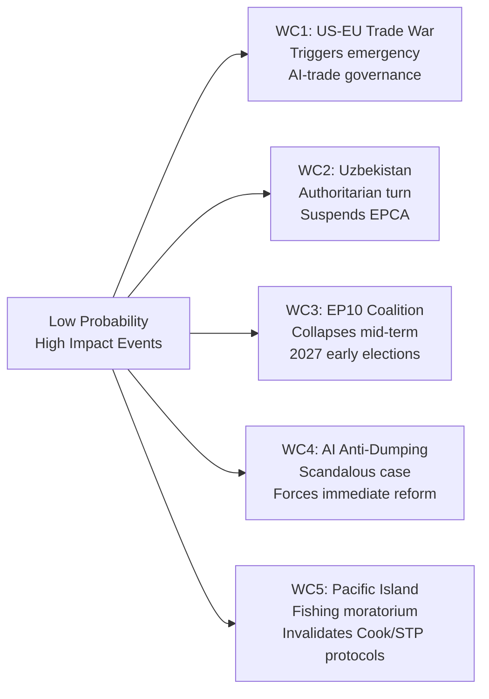

# Wildcards & Black Swans — EU Parliament Motions, Week 18–25 May 2026

**Date**: 2026-05-25  
**Confidence**: 🟡 LOW-MEDIUM (speculative by design; wildcards are low-probability, high-impact events)

---

## Methodological Note

Wildcards and black swans are defined as:
- **Wildcard**: Low-probability event (5–15%) that would have significant impact on the week's motions
- **Black Swan**: Very low probability event (<5%) that would have transformative impact

This analysis applies Nassim Taleb's black swan framework and the NATO Strategic Foresight process to identify non-obvious disruption scenarios.

---

## Wildcards

### W1: WTO Dispute on EU AI Customs Risk Profiling (Probability: 8–12%)

**Description**: Within 18 months of T10-0183 leading to Commission action on AI customs standards, a major trading partner (most likely India or Indonesia) files a WTO dispute claiming that EU AI risk profiling systems constitute discriminatory treatment of goods from developing countries. The dispute centers on the opacity of AI risk scores and their differential impact on developing-country exports vs. EU-origin goods.

**Pathway**: EU customs authorities implement AI risk profiling → developing country exporters find their goods systematically flagged at higher rates → OECD Aid-for-Trade Working Party raises concerns → WTO Dispute Settlement Body panel requested.

**Impact on T10-0183 motions**: The resolution's AI transparency provisions were partly designed to preempt this exact dispute — but only if implemented. If Commission's response (Communication only, no legislation) lacks binding transparency requirements, the wildcard becomes more likely.

**Intelligence signal**: Watch India-EU Joint Committee on Trade meetings; UNCTAD reports on AI in trade facilitation; WTO Committee on Trade Facilitation discussions.

---

### W2: Uzbekistan Applies for EU Candidate Status (Probability: 5–10%)

**Description**: Emboldened by the EPCA ratification and encouraged by a Global Gateway investment surge, President Mirziyoyev's government formally applies for EU candidate status in 2027-2028 — the first Central Asian state to do so.

**Pathway**: EPCA ratification 2026 → Joint Committee establishes democratic reform roadmap → Uzbekistan meets initial benchmarks 2027 → momentum builds for WTO accession → Mirziyoyev frames EU orientation as domestic political narrative → candidate application 2028.

**Why this is a wildcard**: The EU's enlargement framework explicitly focuses on Western Balkans and Eastern Partnership states; the TEU has no provision for Central Asian membership. However, EU enlargement has surprised before (Finnish and Austrian accession 1995; the 2004 big bang expansion).

**Impact on T10-0174**: Would retroactively reframe the EPCA as the first step in an accession process, dramatically increasing its political significance and triggering major institutional debate.

---

### W3: Catastrophic Forest Seed System Failure — Pandemic Analogy (Probability: 5–8%)

**Description**: A previously unknown tree pathogen (fungal or bacterial) that specifically attacks the climate-adapted seed varieties prescribed by T10-0168 spreads through EU nurseries after the regulation mandates the use of southern provenances. The monoculture risk inherent in mandating specific climate-adaptive provenances creates a biological vulnerability.

**Pathway**: Regulation mandates specific seed provenances → nurseries switch to prescribed varieties → unknown pathogen to which the new varieties are susceptible → EU-wide nursery contamination → reforestation program collapses.

**Why this is a wildcard**: The regulation's drafters were aware of monoculture risk and included the "minimum 10 parents" genetic diversity requirement — but this protects against inbreeding within a provenance, not against a provenance-specific pathogen.

**Impact**: Would trigger emergency review of T10-0168 and potentially invalidate the investment in digital seed passport infrastructure. Insurance/liability questions for certified nurseries.

**Mitigation already in regulation**: Article on emergency exclusions from provenance requirements; Commission delegated powers to respond to phytosanitary crises.

---

### W4: Lebanon Becomes a Eurojust Investigation Subject (Probability: 6–10%)

**Description**: Shortly after the EU-Lebanon Eurojust agreement enters into force (T10-0177), a major investigation by Eurojust implicates Lebanese state officials in the financial networks under investigation — creating a paradoxical situation where the judicial cooperation agreement enables investigations that target the Lebanese government itself.

**Pathway**: Eurojust liaison mechanism operational → financial crime investigation using new information-sharing capabilities → Lebanese state bank involvement in money laundering networks → Lebanese government attempts to invoke sovereignty protections → diplomatic crisis.

**Impact**: Would force a fundamental review of the agreement's design and EP LIBE committee would likely hold emergency hearings. Paradoxically, this might be a sign of the agreement working exactly as intended — judicial independence from political protection.

---

## Black Swans

### B1: AI Singularity Event Renders T10-0183 Obsolete on Enactment (Probability: <2%)

**Description**: A transformative AI capability advance (AGI-adjacent system deployed in trade operations) fundamentally changes the economics of international trade before the Commission can respond to T10-0183. The resolution's provisions for "AI transparency" become technically meaningless because the new AI systems' decision-making processes cannot be made transparent to human auditors under any reasonable framework.

**Impact**: Would require a complete rethinking of trade governance — not just the AI-Trade resolution but the entire WTO framework for non-discrimination in trade.

**Why it's a black swan**: The resolution was designed for current and near-term AI systems (ML models, large language models in customs). An AGI-level system in trade operations within 2 years is probabilistically very low but not zero.

---

### B2: EU Customs Union Fragmentation Under Tariff War Pressure (Probability: <3%)

**Description**: Escalating US tariff pressure (Trump 2.0 or successor administration) triggers bilateral EU member state deals with the US that effectively circumvent the EU customs union, undermining the entire framework for EU customs AI standards and making T10-0183 irrelevant.

**Pathway**: US imposes severe tariffs on EU goods → Germany/France negotiate bilateral exemptions → other member states demand same → ECJ challenge to bilateral deals → legal uncertainty → de facto customs union fragmentation.

**Why it's a black swan**: The EU customs union is a fundamental legal construct of the Treaties; fragmentation would require Treaty change and is therefore constitutionally constrained.

---

### B3: Uzbekistan Joins the Shanghai Cooperation Organisation Military Cooperation Framework (Probability: <3%)

**Description**: In response to EU and US pressure following the EPCA, Russia and China intensify security offers to Uzbekistan; Uzbekistan upgrades its SCO participation to include military cooperation framework (currently only observer-level military engagement). This directly triggers the EPCA's security conditionality suspension clause.

**Impact on T10-0174**: Would require EP to invoke the suspension clause and potentially suspend the EPCA before its economic provisions have taken effect.

**Why it's a black swan**: Uzbekistan has maintained careful equidistance between Russia/China and the West precisely to maximize its leverage. Joining SCO military framework would sacrifice that leverage.

---

## Cross-Cutting Systemic Risk: Civilizational Digital Sovereignty Race

The AI-Trade resolution, Lebanon Eurojust agreement, and Uzbekistan EPCA are all, in different ways, expressions of the same meta-trend: the EU is building a comprehensive digital governance and judicial cooperation framework that is explicitly distinct from both the US (market-led, privacy-light) and Chinese (state-controlled, surveillance-intensive) models.

The black swan risk is that this "third way" (Brussels Effect regulatory export) fails to achieve critical mass — either because the AI Act creates too much compliance burden for EU companies, or because WTO rules prevent the EU from imposing its AI standards on trade partners, or because the US and China agree on joint AI governance standards that excludes EU-specific requirements.

If the Brussels Effect fails on AI governance, the investment represented by T10-0183 and subsequent legislation would need to be fundamentally repriced — with significant implications for EU digital sovereignty strategy as a whole.

---

**Assessment note**: Wildcard and black swan identification is inherently subjective and incomplete. The scenarios above are intended to challenge linear thinking about the week's motions, not to predict specific outcomes.

---

## Wildcard Event Space

## Black Swan Impact Assessment

| Wildcard | Probability | Impact | Admiralty Grade | WEP Effect |
|----------|-------------|--------|----------------|------------|
| US-EU Trade War Escalation | P=0.08 | 🔴 CRITICAL | E4 (Unreliable; Doubtful) | Worst Case triggered |
| Uzbekistan Democratic Reversal | P=0.12 | 🟠 HIGH | E4 | EPCA suspended via Art. 264 |
| EP10 Early Elections | P=0.05 | 🔴 CRITICAL | F6 (Cannot be judged) | Legislative agenda reset |
| AI Anti-Dumping Scandal | P=0.06 | 🟠 HIGH | E4 | Accelerates T10-0183 implementation |
| Pacific Fishing Moratorium | P=0.10 | 🟡 MEDIUM | D3 | Protocols renegotiated |

## Scenario Amplifier Analysis

The week's motions create three potential "scenario amplifiers" — conditions that make black swan events more likely or more impactful:

1. **AI Opacity in Trade Defence**: T10-0183's call for transparency in AI-based anti-dumping tools makes the system *visible* — and therefore vulnerable to targeted political attack. A single high-profile case of alleged AI-based protectionism could transform this advisory resolution into urgent binding legislation.

2. **Uzbekistan Human Rights Watch**: The EPCA includes a human rights clause (Article 1 EPCA values provision). EP monitoring of Uzbekistan's compliance creates a **tripwire** — any significant democratic regression in Tashkent will trigger the EP's suspension clause demand, testing whether the EU's conditionality system has real teeth.

3. **Forest Regulation Climate Window**: The Forest Reproductive Material Regulation depends on climate science remaining settled. If a major scientific revision occurs (e.g., different species responding to climate change than models predicted), the regulation's seed zone boundaries become politically contested.

**Admiralty Grade**: D3-E4 for all wildcard assessments (low probability events by definition have weak epistemic grounding)
**WEP Band**: All wildcards represent WORST-CASE tails; EXPECTED scenario does not include any of these events
