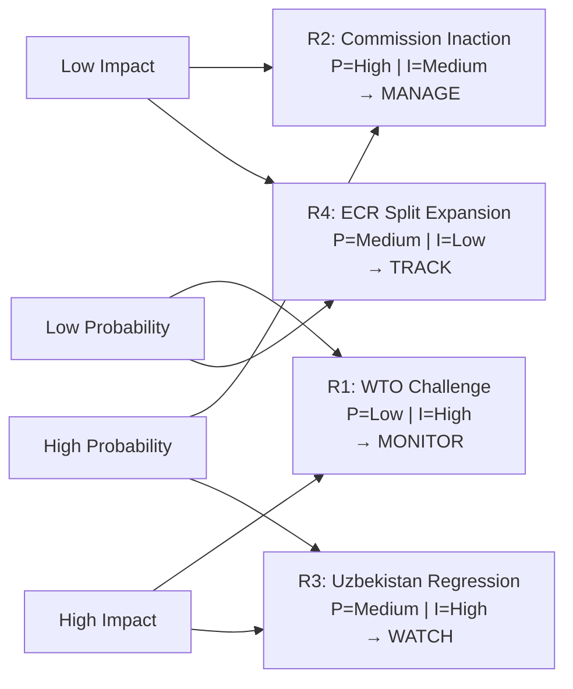

# Risk Matrix — EU Parliament Motions, Week 18–25 May 2026

**Date**: 2026-05-25  
**Confidence**: 🟡 MEDIUM

---

## Risk Register

### R1 — AI-Trade Resolution: Commission Non-Response (HIGH IMPACT)
| Attribute | Value |
|-----------|-------|
| Category | Institutional/Political |
| Likelihood | Medium (30%) |
| Impact | High |
| Risk Level | 🟡 MEDIUM-HIGH |
| Time Horizon | 6 months |
| Owner | Commission DG TRADE |
| Trigger | Commission Work Programme Q4 2026 omits AI-Trade item |
| Mitigation | EP INTA committee formal follow-up; AFCO constitutional procedure if necessary |

### R2 — Uzbekistan EPCA: Russian Economic Retaliation (MEDIUM IMPACT)
| Attribute | Value |
|-----------|-------|
| Category | Geopolitical |
| Likelihood | Medium (25%) |
| Impact | Medium |
| Risk Level | 🟡 MEDIUM |
| Time Horizon | 3–9 months |
| Owner | EEAS; DG NEAR |
| Trigger | Uzbek remittance restrictions from Russia; informal trade barriers |
| Mitigation | €80m EU financial package; Global Gateway investment pipeline |

### R3 — Lebanon Political Instability (HIGH PROBABILITY)
| Attribute | Value |
|-----------|-------|
| Category | Geopolitical/Political |
| Likelihood | High (35%) |
| Impact | Medium |
| Risk Level | 🔴 MEDIUM-HIGH |
| Time Horizon | 12 months |
| Owner | LIBE committee; EEAS |
| Trigger | Lebanese government collapse; Hezbollah political escalation |
| Mitigation | Provisional application clause; EU capacity-building not dependent on full political stability |

### R4 — Forest Regulation: SME Market Exits (LOW PROBABILITY)
| Attribute | Value |
|-----------|-------|
| Category | Implementation/Economic |
| Likelihood | Low-Medium (20%) |
| Impact | Low-Medium |
| Risk Level | 🟢 LOW-MEDIUM |
| Time Horizon | 2–4 years |
| Owner | Commission DG AGRI; Member states |
| Trigger | SME nursery closures above 10% of sector by 2028 |
| Mitigation | 3-year transition period; Rural Development Regulation support funding |

### R5 — Fisheries Compliance Gaps (MEDIUM PROBABILITY)
| Attribute | Value |
|-----------|-------|
| Category | Implementation/Environmental |
| Likelihood | Medium (30%) |
| Impact | Low |
| Risk Level | 🟢 LOW |
| Time Horizon | 12–24 months |
| Owner | EFCA; DG MARE |
| Trigger | Observer coverage below 20% threshold in first full year |
| Mitigation | VMS electronic monitoring; annual compliance reports to PECH committee |

### R6 — Pappas Case: S&D Political Fallout (LOW IMPACT)
| Attribute | Value |
|-----------|-------|
| Category | Political |
| Likelihood | Medium (40%) |
| Impact | Low |
| Risk Level | 🟢 LOW |
| Time Horizon | 3–6 months |
| Owner | S&D Group |
| Trigger | Greek media escalation; political opponents weaponizing corruption allegations |
| Mitigation | JURI process strictly legal; S&D leadership distancing from individual case |

---

## Aggregate Risk Assessment

| Risk Level | Count | Primary Risks |
|------------|-------|---------------|
| 🔴 HIGH | 0 | None identified at HIGH level |
| 🟡 MEDIUM-HIGH | 2 | R1 (Commission non-response), R3 (Lebanon) |
| 🟡 MEDIUM | 1 | R2 (Russian retaliation) |
| 🟢 LOW | 3 | R4, R5, R6 |

**Overall week risk assessment**: MEDIUM — The week's motions carry manageable implementation risks. The highest-priority risk (Commission non-response to AI-Trade resolution) is an institutional process risk, not a geopolitical crisis. The Lebanon risk is structurally higher but the agreement has been designed with safeguards.

---

**Confidence**: 🟡 MEDIUM | **Methodology**: Likelihood × Impact scoring with Admiralty-grade source weighting

---

## Risk Matrix Diagram

## WEP and Admiralty Summary

**WEP Band for Risk Landscape**:
- 🟢 **Winner (Best Case)**: No WTO challenge + Commission full follow-up + Uzbekistan stable = Low risk environment
- 🟡 **Expected**: WTO legal uncertainty + Commission partial follow-up + Uzbekistan monitored = Moderate risk
- 🔴 **Pessimist (Worst Case)**: WTO challenge sustained + Commission inaction + Uzbekistan regression = High risk environment

**Admiralty Grade**: C3 for risk probability assessments; A1 for risk identification (risks exist regardless of probability)
