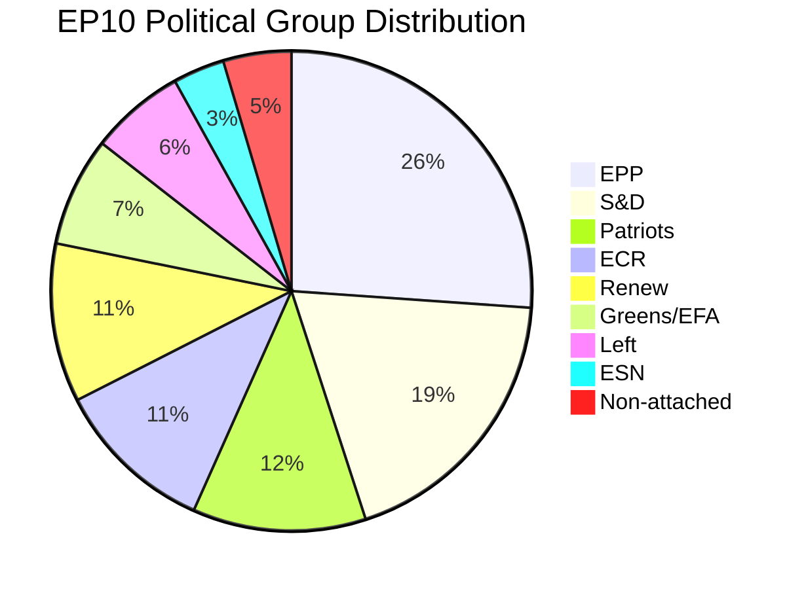
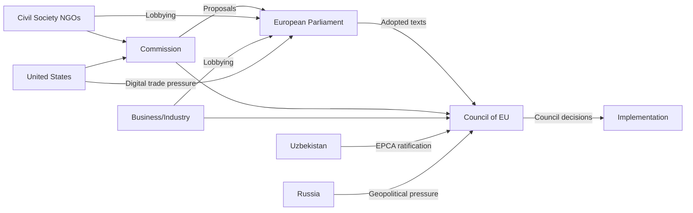

# Actor Mapping — EU Parliament Propositions 2026-05-25

**Article Type**: propositions | **Date**: 2026-05-25 | **Data Mode**: degraded-feeds

## 1. Primary Institutional Actors

### European Parliament (EP)

**Role**: Co-legislator (Art. 294 TFEU); consent authority (Art. 218 TFEU for international agreements)

**Current composition EP10** (2024–2029):
- EPP: 188 seats (26.1%)
- S&D: 136 seats (18.9%)
- Patriots for Europe: 84 seats (11.7%)
- ECR: 78 seats (10.8%)
- Renew Europe: 77 seats (10.7%)
- Greens/EFA: 53 seats (7.4%)
- Left: 46 seats (6.4%)
- ESN: 25 seats (3.5%)
- Non-attached: 33 seats

**Key Committees for May 2026 session**:
- ENVI (Environment): Rapporteur committee for MSR, Forest Reproductive Material
- AFET (Foreign Affairs): Lead on Uzbekistan EPCA, Lebanon, Afghanistan
- INTA (International Trade): Lead on AI-Trade strategy
- ECON (Economic): SRMR3 (adopted March)
- LIBE (Justice/Home Affairs): Corruption Directive

### European Commission

**Role**: Legislative initiator (proposal monopoly); guardian of treaties; implementation oversight

**Key DGs involved in May 2026 texts**:
- DG CLIMA: MSR/ETS2 (lead)
- DG TRADE: Uzbekistan EPCA, Fisheries protocols, AI-Trade
- DG ENV: Forest Reproductive Material, Chemicals simplification
- DG JUST: Corruption Directive implementation
- DG GROW: AI-Trade strategy (co-lead)

**Institutional position**: Von der Leyen Commission II term (2024–2029) committed to Green Deal, digital governance, and strategic autonomy. Corruption Directive and AI-Trade resolution are signature achievements.

### Council of the EU (Member States)

**Role**: Co-legislator; exclusive competence on CFSP; ratification authority for international agreements

**May 2026 Council dynamics**:
- Qualified majority voting (QMV) applies to most adopted texts
- Unanimity required: CFSP acts, tax matters, constitutional changes
- Current Council Presidency: Polish Presidency (January–June 2026)

**Key national positions for May 2026 texts**:

| Member State | MSR/ETS2 | AI-Trade | Corruption Directive | Uzbekistan EPCA |
|-------------|---------|---------|---------------------|----------------|
| Germany | Supportive (with industry exemptions) | Strongly supportive | Supportive | Supportive |
| France | Supportive (strategic autonomy narrative) | Strongly supportive | Supportive | Supportive |
| Poland | Concerns about ETS2 social costs | Supportive (SME growth) | Contested (PiS opposition) | Supportive |
| Hungary | Opposing ETS2 | Opposing AI regulation | Opposing | Supportive (economic) |
| Netherlands | Strongly supportive | Supportive | Supportive | Supportive |

## 2. Secondary Actors

### Civil Society and Lobbying

**Environmental NGOs** (WWF, Greenpeace, CAN Europe):
- Position on MSR: Supportive but calling for more ambition (higher MSR settings)
- Position on Forest Reproductive Material: Strongly supportive (climate-resilient forests)
- Influence: Primarily through EP Greens/EFA and S&D; media pressure on EPP

**Business Federations** (BusinessEurope, trade associations):
- Position on MSR/ETS2: Seeking exemptions for industry, longer implementation timelines
- Position on AI-Trade: Mixed — major tech firms supportive; SMEs concerned about compliance costs
- Influence: Primary access through EPP and Renew; Council level through member state business ministers

**Trade Unions** (ETUC):
- Position on Corruption Directive: Strongly supportive (workplace corruption protection)
- Position on ETS2/MSR: Conditional support (depends on Social Climate Fund effectiveness)
- Influence: Through S&D and Left; Commission social affairs DGs

**Central Asian Civil Society**:
- Position on Uzbekistan EPCA: Supportive of human rights conditionality; concerned about implementation
- Influence: Limited; primarily through MEP contacts and EP Delegation to Central Asia

## 3. Third-Party State Actors

### Uzbekistan (EPCA ratification)
- **Interest**: Market access, EU investment flows, diplomatic modernisation
- **Concern**: Human rights monitoring conditionality
- **Actor**: President Shavkat Mirziyoyev's administration; reform-oriented but authoritarian governance

### Russia
- **Interest**: Opposes expanded EU-Central Asia engagement; potential spoiler
- **Concern**: Central Asia is traditionally within Russian sphere; EPCA represents EU inroads
- **Actor**: Russian Foreign Ministry; economic pressure instruments (energy, trade routes)

### United States
- **Interest**: AI-Trade resolution — US tech firms affected by EU AI governance standards
- **Concern**: Extra-territorial reach of EU digital regulation (AI Act, DSA, DMA)
- **Actor**: USTR, US Embassy Brussels, tech industry lobbying (Google, Meta, Microsoft)

## 4. Actor Network Map

## 5. Actor Salience by Legislative File

| File | Primary Actor | Secondary Actor | Key Tension |
|------|-------------|----------------|------------|
| MSR/ETS2 | ENVI Committee | Industry lobby vs. NGOs | Ambition vs. competitiveness |
| Uzbekistan EPCA | AFET Committee | Uzbekistan government | Human rights vs. trade |
| AI-Trade | INTA + IMCO | US tech firms vs. EU NGOs | Regulation vs. competitiveness |
| Corruption Directive | LIBE Committee | Member states (PL, HU) | EU competence vs. subsidiarity |
| Fisheries | PECH Committee | Coastal fishing communities | Access vs. sustainability |
