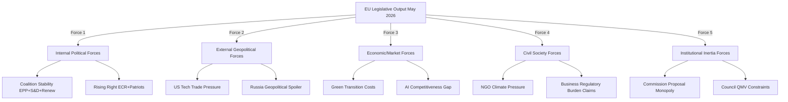
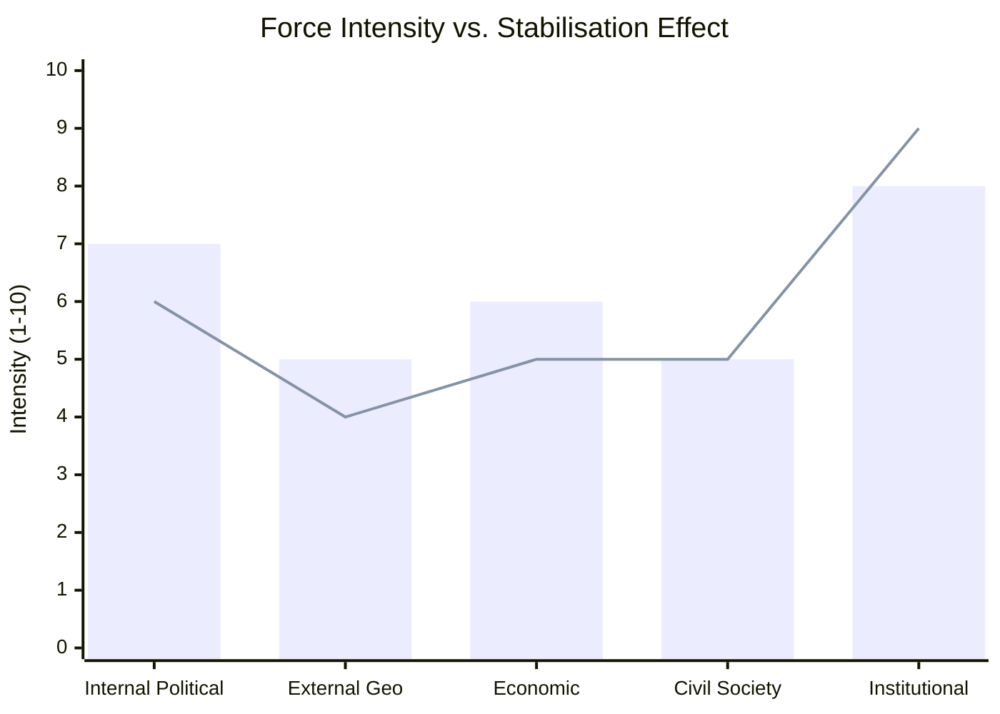

# Forces Analysis — EU Parliament Propositions 2026-05-25

**Article Type**: propositions | **Date**: 2026-05-25 | **Data Mode**: degraded-feeds

## 1. Porter's Five Forces Adapted for EU Legislative Context

## 2. Internal Political Forces

### Coalition Dynamics

**Centrist majority (EPP + S&D + Renew = 401 seats, 56% of 720)**:
- Structural majority for standard legislative files
- Cohesion: High on European integration, moderate on climate pace, divided on fiscal policy
- Vulnerability: S&D left wing and Greens demand more ambition; EPP right wing and some Renew resist

**Right-leaning opposition (ECR + Patriots + ESN = 187 seats, 26%)**:
- Structural opposition on most EP10 agenda items
- Internal contradiction: ECR national parties have divergent interests (Poland pro-EU vs. Italy far-right)
- Strategic opportunity: Can swing some EPP members on specific deregulation votes

**Left-Greens alliance (Greens/EFA + Left = 99 seats, 14%)**:
- Cannot block legislation alone but can swing S&D votes on environmental/social files
- High cohesion; consistent pressure for more ambitious climate action
- Influence disproportionate to seat count via media and committee positions

### Force Assessment: Internal Political Forces

| Force | Direction | Intensity | Duration |
|-------|----------|-----------|---------|
| Centrist coalition stability | Stabilising | HIGH | Medium-term |
| Right-populist opposition | Destabilising | MEDIUM-HIGH | Increasing |
| Left-Green pressure for ambition | Amplifying | MEDIUM | Stable |
| EPP internal divisions | Destabilising | LOW-MEDIUM | Context-dependent |

## 3. External Geopolitical Forces

### US-EU Relations

**AI-Trade Tension**: The AI-Trade INI resolution (TA-10-2026-0183) explicitly addresses US-EU digital trade tensions. The EU's AI Act creates potential friction:
- US AI companies (Google Gemini, OpenAI, Meta AI) classified as "general-purpose AI" under AI Act
- Compliance costs estimated €50–100M per major provider
- US USTR has flagged potential WTO challenge to AI governance framework

**Force intensity**: MEDIUM-HIGH and rising (US elections dynamics create uncertainty)

### Russia-EU Relations

**Central Asia competition**: The Uzbekistan EPCA represents a direct challenge to Russian soft power in Central Asia:
- Russia views Central Asia as its traditional sphere of influence
- Uzbekistan's EU orientation is a geopolitical signal; Russia has limited leverage (no Uzbek NATO membership issue)
- Gas supply routes through Uzbekistan and Kazakhstan are becoming strategically significant

**Force intensity**: MEDIUM — Russia lacks direct leverage over EU legislative process but creates indirect pressure on member states

### China-EU Relations

**Supply chain and technology dependencies**:
- Forest Reproductive Material Regulation partly driven by concerns about Chinese-origin forest seeds
- AI-Trade resolution addresses technology decoupling without naming China directly
- ETS2/CBAM creates potential for WTO challenges from China if EU extends carbon pricing to imports

**Force intensity**: MEDIUM — not dominant in May 2026 session but structural backdrop

## 4. Economic and Market Forces

### Green Transition Economics

**Carbon pricing impact on competitiveness**:
- ETS2 will add €150–400/year to average EU household energy costs (European Commission estimate, 2024)
- Offset by Social Climate Fund: ~€65bn over 2026–2032, but disbursement timeline uncertain
- Industry competitiveness: EU manufacturers face higher input costs vs. non-ETS competitors

**Market response indicators**:
- EU ETS carbon price (April 2026): ~€72/tonne (below 2023 peak of €100; above 2022 average of €60)
- Renewable energy investment: +18% YoY in EU (BloombergNEF Q1 2026 estimate)
- Green bond issuance: EU sovereign green bonds at €35bn in 2025 (record)

**Force assessment**: Economic forces are BIFURCATED — short-term costs create political resistance, but long-term investment signals are positive.

### AI and Digital Economy Forces

**EU-US AI investment gap**: EU AI investment ~0.3% GDP vs. US ~0.9%. The AI-Trade resolution acknowledges this gap and calls for regulatory proportionality.

**Digital Single Market fragmentation**: Member state implementation of DSA, DMA, and AI Act varies significantly — creating competitive distortions within the EU.

## 5. Civil Society Forces

### Environmental Movement

**Post-2025 trajectory**: European environmental movement has faced backlash (farmers' protests, fuel cost concerns) but maintains strong institutional presence:
- Fridays for Future: Reduced street presence but stronger policy advocacy
- WWF/Greenpeace: Increased focus on implementation and enforcement rather than new legislation

**Influence on May 2026 session**: Environmental NGOs applauded MSR extension and Forest Reproductive Material; criticised pace and ambition of ETS2.

### Anti-Corruption Civil Society

**Transparency International**: Strong advocacy for Corruption Directive; EU listed as "somewhat corrupt" rather than "not corrupt" in 2025 CPI
- Poland: Score 59/100 (improved from 55 in 2024)
- Hungary: Score 42/100 (declining)
- EU average: ~68/100

**Force assessment**: Strong civil society push created political space for Corruption Directive — rare case where civil society force directly enabled new EU competence.

## 6. Institutional Inertia Forces

### Commission Proposal Monopoly

The Commission's exclusive right to propose legislation (Art. 17(2) TEU) is both an inertia force (limits EP to reactive role) and a coordination force (ensures coherent legislative agenda).

**EP workaround**: INI (own-initiative) resolutions like the AI-Trade strategy — non-binding but politically powerful signals to Commission.

**Force on May 2026 session**: STABILISING — Commission's coherent Green Deal + Digital Agenda pipeline produced the files that became the May 2026 adopted texts.

### Institutional Timeline Constraints

EP electoral cycle imposes a structural "deadline" dynamic:
- EP10 runs 2024–2029
- "First half" (2024–2026) is the high-productivity period (legislative programme launches)
- "Second half" (2027–2029) is consolidation and pre-election positioning
- May 2026 session is at the peak of first-half productivity

**Force intensity**: ACCELERATING — the sense that major files must be completed before the MFF 2028 negotiations dominate agenda.

## 7. Force Balance Summary

**Net assessment** [WEP: ASSESSED]: The combination of institutional momentum, centrist coalition stability, and strong civil society signals produced the exceptional legislative output of May 2026 (28+ adopted texts). External geopolitical and internal political forces are rising but have not yet displaced this productive equilibrium. The equilibrium is estimated to hold through Q4 2026 but faces increasing stress in the 2027 MFF pre-negotiation period.
