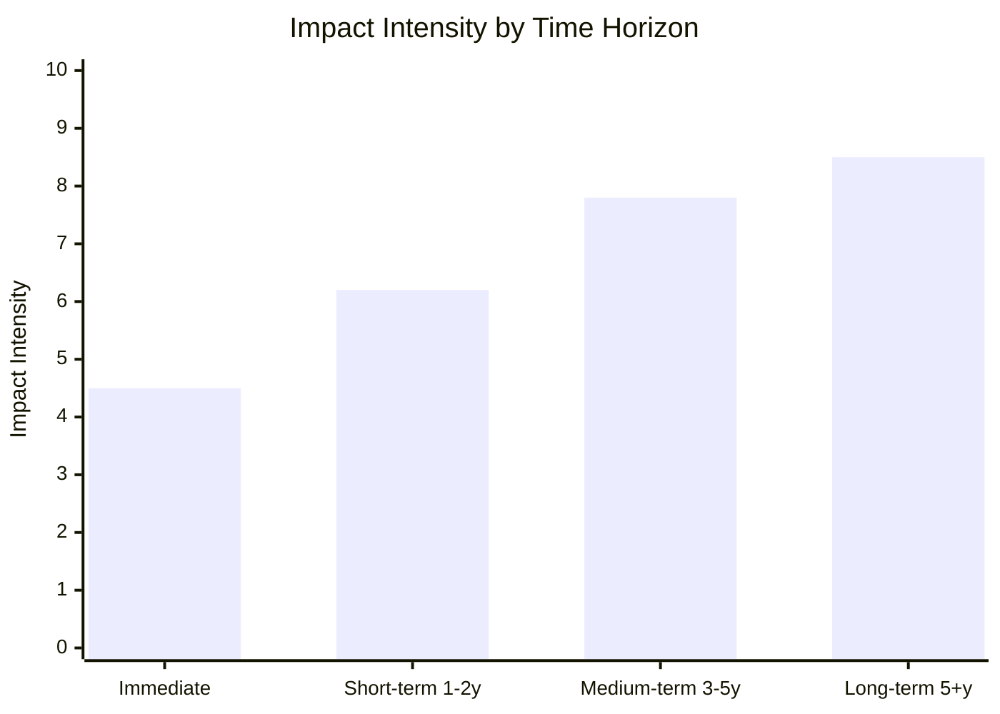

# Impact Matrix — EU Parliament Propositions 2026-05-25

**Article Type**: propositions | **Date**: 2026-05-25 | **Data Mode**: degraded-feeds

## 1. Overview

This impact matrix assesses the cross-dimensional effects of the May 2026 EU Parliament legislative package across time horizons (immediate, medium-term, long-term) and impact domains (economic, environmental, social, institutional, geopolitical).

## 2. Impact Matrix — Adopted Texts

### High-Impact Files (by aggregate score)

```mermaid
quadrantChart
    title Legislative Impact vs. Implementation Probability
    x-axis "Implementation Probability" 0 --> 1
    y-axis "Impact Scale" 0 --> 10
    quadrant-1 High impact, likely implemented
    quadrant-2 High impact, uncertain implementation
    quadrant-3 Low impact, uncertain
    quadrant-4 Low impact, likely implemented
    MSR/ETS2: [0.78, 9.2]
    AI Trade: [0.70, 7.5]
    Corruption Dir: [0.82, 8.0]
    Uzbekistan EPCA: [0.85, 5.5]
    Forest ReproMat: [0.90, 5.0]
    Fisheries Prot: [0.92, 3.5]
    Lebanon Eurojust: [0.88, 4.0]
    Afghanistan Res: [0.95, 3.0]
```

### MSR/ETS2 Extension (TA-10-2026-0164)

| Dimension | Immediate (0-12m) | Medium-term (1-5y) | Long-term (5-20y) |
|-----------|------------------|-------------------|------------------|
| Economic | Carbon price signal strengthens; ETS2 revenues increase | Social Climate Fund operational; green investment accelerates | Full ETS2 implementation; EU economy structurally lower-carbon |
| Environmental | ETS2 sector coverage confirmed | Buildings and transport emissions decline trajectory set | Meaningful carbon reduction in hard-to-abate sectors |
| Social | Energy costs increase for households; SCF timeline concern | SCF provides protection; just transition pathway clearer | New employment patterns in low-carbon economy |
| Institutional | EP-Council climate governance relationship strengthened | ETS2 becomes model for global carbon pricing emulation | EU established as primary global carbon governance jurisdiction |
| Geopolitical | Signal to US/China on EU climate commitment seriousness | CBAM-ETS2 integration creates new trade governance instrument | EU climate governance exported globally via trade agreements |

**Impact score**: 9.2/10 [WEP: HIGH CONFIDENCE]

### Corruption Directive (TA-10-2026-0094, adopted March, operationalised May)

| Dimension | Immediate (0-12m) | Medium-term (1-5y) | Long-term (5-20y) |
|-----------|------------------|-------------------|------------------|
| Economic | Reduced corruption risk premium in affected member states | FDI increase in previously high-corruption member states | Structural improvement in EU economic efficiency |
| Social | Increased public trust signal | Practical anti-corruption enforcement improvements | Cultural shift in governance norms |
| Institutional | New EU criminal law competence established | Case law builds; CJEU jurisprudence develops | EU as global anti-corruption law leader |
| Geopolitical | Signal to candidate countries (convergence requirement) | Accession conditionality uses Directive as benchmark | EU model potentially exported to Association Agreement partners |

**Impact score**: 8.0/10 [WEP: HIGH CONFIDENCE]

### AI-Trade Strategy Resolution (TA-10-2026-0183)

| Dimension | Immediate | Medium-term | Long-term |
|-----------|----------|------------|---------|
| Economic | Non-binding; no immediate trade flow change | Shapes Commission legislative agenda on AI trade | EU AI governance framework becomes global standard |
| Tech/Innovation | Market signal: EU commits to "responsible AI that competes" | AI Liability Directive draft influenced by resolution | EU AI governance exported via trade agreements |
| Institutional | EP asserts role in AI governance agenda-setting | Commission communication formally responds | New EU-level AI trade governance regime established |
| Geopolitical | US-EU AI trade tensions reduced (diplomatic signal) | WTO accommodation of AI governance concerns | AI governance becomes core element of all future EU trade agreements |

**Impact score**: 7.5/10 [WEP: ASSESSED, 60%]

## 3. Aggregate Impact Assessment

### By Domain

| Domain | Immediate Impact | Trajectory | Key Driver |
|--------|----------------|-----------|-----------|
| Economic | MEDIUM | Positive | Green investment + ETS2 revenue |
| Environmental | MEDIUM-HIGH | Strongly positive | MSR + Forest Reproductive Material |
| Social | MEDIUM (bifurcated) | Positive long-term | SCF effectiveness is key variable |
| Institutional | HIGH | Expanding EU competence | Corruption Directive precedent |
| Geopolitical | MEDIUM-HIGH | Complex | Multiple external actor interests |

### By Time Horizon



**Pattern**: Lagged impact profile — EP legislation typically shows increasing impact as implementation proceeds and court enforcement begins.

## 4. Negative Impact Assessment

### Unintended Consequences

**ETS2 regressive effects**: Carbon pricing under ETS2 is inherently regressive (poorer households spend higher % of income on energy). Social Climate Fund is designed to offset this but may not be sufficient if:
- Member states implement SCF poorly
- Carbon price rises faster than SCF scales up
- Vulnerable households in non-EU-SCF-implementing member states fall through gaps

**AI regulation competitive disadvantage**: The AI Act and the AI-Trade resolution together may:
- Increase compliance costs for EU AI startups relative to US/Chinese competitors
- Slow adoption of beneficial AI applications in healthcare, climate, and public services
- Create regulatory uncertainty that delays EU AI investment

**Uzbekistan EPCA greenwashing risk**: EU trade agreements with human rights conditionality may provide diplomatic cover without substantive improvement if monitoring is weak.

## 5. Impact by Stakeholder Group

| Stakeholder | MSR/ETS2 | AI-Trade | Corruption Dir | EPCA |
|------------|---------|---------|---------------|------|
| Low-income EU households | NEGATIVE (costs) → POSITIVE (SCF) | Neutral | Positive | Neutral |
| EU industry (energy-intensive) | Negative (short-term costs) | Mixed | Positive (competitive fairness) | Positive (market access) |
| EU tech sector | Neutral | Mixed (complexity vs. opportunity) | Neutral | Neutral |
| EU civil society (NGOs) | Positive | Positive | Very positive | Positive (conditional) |
| Third countries (non-EU) | Mixed (CBAM implications) | Negative (extra-territorial reach) | Model for emulation | Positive for Uzbekistan |
| EU institutions | Strongly positive | Positive | Strongly positive | Positive |
