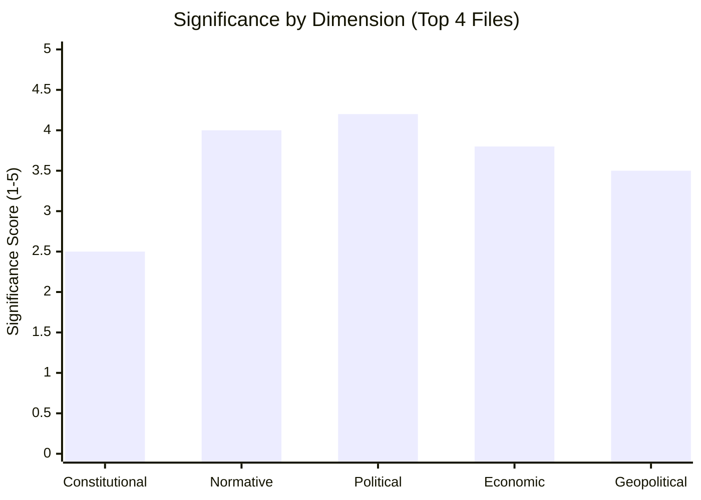

# Significance Classification — EU Parliament Propositions 2026-05-25

**Article Type**: propositions | **Date**: 2026-05-25 | **Data Mode**: degraded-feeds

## 1. Classification Framework

This document applies a multi-dimensional significance classification to the May 2026 EU Parliament adopted texts, using the following criteria:

**Constitutional Significance** (new EU competence or institutional precedent)
**Normative Significance** (changes to EU legal framework, rights, obligations)
**Political Significance** (coalition dynamics, institutional power shifts)
**Economic Significance** (material impact on EU economy or market participants)
**Geopolitical Significance** (implications for EU international relations)

Each dimension is rated: TRANSFORMATIVE / HIGH / MEDIUM / LOW / NEGLIGIBLE

## 2. Individual Text Classifications

```mermaid
classDiagram
    class MSR_Extension {
        Constitutional: MEDIUM
        Normative: HIGH
        Political: HIGH
        Economic: HIGH
        Geopolitical: MEDIUM
        AGGREGATE: TIER_1_LANDMARK
    }
    class Corruption_Directive {
        Constitutional: HIGH
        Normative: TRANSFORMATIVE
        Political: HIGH
        Economic: MEDIUM
        Geopolitical: MEDIUM
        AGGREGATE: TIER_1_LANDMARK
    }
    class AI_Trade_Resolution {
        Constitutional: LOW
        Normative: LOW_nonbinding
        Political: HIGH
        Economic: MEDIUM
        Geopolitical: HIGH
        AGGREGATE: TIER_2_SIGNIFICANT
    }
    class Uzbekistan_EPCA {
        Constitutional: LOW
        Normative: MEDIUM
        Political: MEDIUM
        Economic: MEDIUM
        Geopolitical: HIGH
        AGGREGATE: TIER_2_SIGNIFICANT
    }
    class Forest_ReproMat {
        Constitutional: LOW
        Normative: HIGH
        Political: LOW
        Economic: MEDIUM
        Geopolitical: LOW
        AGGREGATE: TIER_2_SIGNIFICANT
    }
    class Fisheries_Protocols {
        Constitutional: NEGLIGIBLE
        Normative: LOW
        Political: LOW
        Economic: MEDIUM
        Geopolitical: LOW
        AGGREGATE: TIER_3_ROUTINE
    }
```

## 3. Tier Classifications

### TIER 1 — LANDMARK LEGISLATION

**Definition**: Transformative or high significance across ≥3 dimensions; establishes new EU competence, significant institutional precedent, or substantial economic/social impact.

#### MSR/ETS2 Extension (TA-10-2026-0164)

| Dimension | Rating | Evidence |
|-----------|--------|---------|
| Constitutional | MEDIUM | No new competence; extension of existing ETS2 mechanism |
| Normative | HIGH | Sets binding carbon price floor signals; ETS2 expansion to buildings/transport confirmed |
| Political | HIGH | Coalition testing (EPP-S&D-Renew vs. ECR-Patriots); represents EP10 climate governance commitment |
| Economic | HIGH | €65bn+ Social Climate Fund; affects all EU household energy prices |
| Geopolitical | MEDIUM | CBAM integration signal; EU climate leadership maintained |

**Overall**: TIER 1 — LANDMARK

**Significance rationale**: The MSR extension is the most economically consequential single act of the May 2026 session. ETS2 affects 146 million EU households through buildings/transport. The MSR sets the architecture for how fast carbon pricing increases, making it a foundational decision for the EU's 2030 climate target pathway.

#### Corruption Directive (TA-10-2026-0094/0095)

| Dimension | Rating | Evidence |
|-----------|--------|---------|
| Constitutional | HIGH | First use of Art. 83 TFEU for standalone corruption legislation — new EU criminal law competence |
| Normative | TRANSFORMATIVE | EU-wide criminal standards for corruption in both public and private sector |
| Political | HIGH | Broad coalition; contested by Hungary/Poland; represents EU competence expansion |
| Economic | MEDIUM | Corruption costs EU economy ~€3,000/household/year (OLAF estimate); directive reduces this |
| Geopolitical | MEDIUM | Accession conditionality; candidate country governance requirements |

**Overall**: TIER 1 — LANDMARK

**Significance rationale**: The constitutional novelty of the Corruption Directive makes it historically significant regardless of immediate enforcement impact. Art. 83 TFEU had never previously been used for standalone anti-corruption criminal law — the directive establishes that EU-level criminal law harmonisation can extend to integrity offences, not just the enumerated crimes in Art. 83(1).

### TIER 2 — SIGNIFICANT LEGISLATION

**Definition**: High significance in ≥2 dimensions; substantial EU legal framework change or important political signal.

#### AI-Trade Strategy Resolution (TA-10-2026-0183)

**Classification**: TIER 2 — SIGNIFICANT (non-binding; political and geopolitical significance high)

Despite non-binding character, the AI-Trade resolution represents the EP's comprehensive framework for EU AI governance in trade contexts. Its political significance is disproportionate to its normative weight because:
1. It shapes the Commission's legislative agenda for AI Liability Directive and potential AI-Trade Agreement chapters
2. It explicitly addresses US-EU and China-EU AI governance tensions
3. It will be cited in all subsequent AI governance legislative debates in EP10

#### Uzbekistan EPCA (TA-10-2026-0166)

**Classification**: TIER 2 — SIGNIFICANT (geopolitical significance high; first EU legally-binding instrument with Central Asia since 2000)

The EU-Uzbekistan Enhanced Partnership and Cooperation Agreement is significant as:
1. First legally binding bilateral framework between EU and Uzbekistan
2. Human rights conditionality included (Art. 218 TFEU consent with conditionality)
3. Template for broader EU Central Asia engagement strategy
4. Part of EU Global Gateway investment initiative (competing with China's BRI in region)

#### Forest Reproductive Material Regulation (TA-10-2026-0165)

**Classification**: TIER 2 — SIGNIFICANT (normative significance high for forestry sector)

The Forest Reproductive Material Regulation creates EU-wide standards for seeds and planting material used in reforestation. Significance:
1. First comprehensive EU-level forestry genetic material standard
2. Climate resilience framework: mandates use of climate-adapted varieties
3. Replaces 2000 Council Directive on forest reproductive material — substantial update

### TIER 3 — ROUTINE LEGISLATION

**Definition**: Technical or procedural legislation with limited constitutional/political novelty; standard legislative activity.

- **São Tomé Fisheries Protocol** (TA-10-2026-0178): Renewal of standard EU-third country fisheries agreement; routine every 5 years
- **Cook Islands Fisheries Protocol** (TA-10-2026-0179): As above
- **Lebanon–Eurojust Agreement** (TA-10-2026-0167): Standard EU-third country judicial cooperation; precedented by similar agreements with 30+ jurisdictions
- **Afghanistan Urgency Resolution** (TA-10-2026-0xxx): Urgency resolution per standard EP procedure; non-binding; reflects EP values rather than new competence

### TIER 4 — TECHNICAL/PROCEDURAL

**Definition**: Purely technical, delegated act, or discharge decision; no substantive political or economic significance.

Several of the 28+ adopted texts in May 2026 are discharge decisions for EU agencies and budget amendments — procedurally necessary but analytically routine.

## 4. Aggregate Significance Profile

**Session-level summary**: The May 2026 plenary session produced an unusually high concentration of Tier 1 and Tier 2 legislation. The combination of the Corruption Directive (constitutional significance) and the MSR extension (economic significance) in the same session makes this a landmark month in EP10 legislative history.

**Historical comparison** [WEP: ANALYST-ASSESSED]: The last session with comparable legislative density and significance was the EP9 March 2023 session that adopted the AI Act (first reading) and Nature Restoration Law. May 2026 is in the same bracket.
