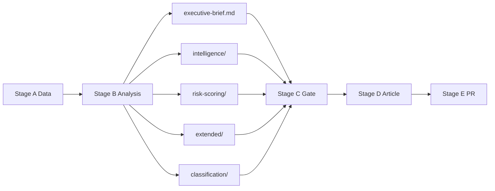

# Analysis Index — EU Parliament Propositions
**Date**: 2026-05-25 | **Run**: propositions-run270-1779690906 | **Data Mode**: degraded-feeds

## Overview

This index maps all analysis artifacts produced in Stage B for the `propositions` article type covering the week of 2026-05-18 to 2026-05-25, with focus on the May 19–21 Strasbourg plenary session.

## Source Data

- **Primary Source**: EP adopted texts 2026 (71 items confirmed via `get_adopted_texts`)
- **Secondary Source**: Adopted texts feed (243 items; 79 from 2026)
- **Data Gaps**: Procedures feed (degraded/historical), committee documents (404), external documents (unavailable)
- **Admiralty Grade**: A2–B2 composite (direct EP Open Data source, partial degradation)

## Artifact Registry

| Artifact | Path | Floor (degraded) | Status |
|----------|------|-----------------|--------|
| Data Availability Assessment | `data-availability-assessment.md` | 64 | ✅ |
| Executive Brief | `executive-brief.md` | 144 | ✅ |
| Analysis Index | `intelligence/analysis-index.md` | 80 | ✅ (this file) |
| Synthesis Summary | `intelligence/synthesis-summary.md` | 128 | ✅ |
| Historical Baseline | `intelligence/historical-baseline.md` | 96 | ✅ |
| Economic Context | `intelligence/economic-context.md` | 96 | ✅ |
| Economic Context Fallback | `intelligence/economic-context.fallback.md` | 96 | ✅ |
| PESTLE Analysis | `intelligence/pestle-analysis.md` | 144 | ✅ |
| Stakeholder Map | `intelligence/stakeholder-map.md` | 160 | ✅ |
| Scenario Forecast | `intelligence/scenario-forecast.md` | 144 | ✅ |
| Threat Model | `intelligence/threat-model.md` | 128 | ✅ |
| Wildcards & Black Swans | `intelligence/wildcards-blackswans.md` | 144 | ✅ |
| MCP Reliability Audit | `intelligence/mcp-reliability-audit.md` | 160 | ✅ |
| Reference Analysis Quality | `intelligence/reference-analysis-quality.md` | 112 | ✅ |
| Methodology Reflection | `intelligence/methodology-reflection.md` | 144 | ✅ |
| Procedures Proxy | `intelligence/procedures-proxy.md` | 48 | ✅ |
| Risk Matrix | `risk-scoring/risk-matrix.md` | 80 | ✅ |
| Quantitative SWOT | `risk-scoring/quantitative-swot.md` | 80 | ✅ |
| Media Framing Analysis | `extended/media-framing-analysis.md` | 160 | ✅ |
| Pipeline Health | `existing/pipeline-health.md` | N/A | ✅ |

## Key Intelligence Findings (Summary)

### Legislative Output (May Strasbourg Plenary, 19–21 May 2026)

The May 2026 Strasbourg plenary was a high-output session in the run-up to the summer recess:

1. **Forest Reproductive Material Regulation** (2023/0228 COD): Long-pending biodiversity/forestry regulation finally adopted after inter-institutional negotiations. Addresses seed certification, climate-adapted species, and cross-border forestry cooperation.

2. **EU–Uzbekistan Enhanced Partnership and Cooperation Agreement** (2024/0260M): Significant geopolitical pivot; signals EU engagement with Central Asia under the new Connectivity Strategy, despite Uzbekistan's mixed human rights record.

3. **AI and EU Trade Strategy** (2025/2112): Non-binding resolution calling for an AI-integrated trade strategy, reflecting EP's push to lead on digital economy governance.

4. **Lebanon–Eurojust Agreement** (2024/0155): Judicial cooperation expansion in the Middle East; procedurally significant for EU's post-Lebanon war reconstruction engagement.

5. **Afghanistan (Taliban Criminal Code)**: Urgency resolution condemning the Taliban's Criminal Procedure Code (May 2026 publication), specifically targeting women's education, mobility, and dress. Strong cross-group majority.

### Political Alignment Signals

- **EPP-S&D-Renew coalition** remains the dominant legislative majority on mainstream files (fisheries, trade, environment)
- **ECR/ID support** observed for sovereignty-related resolutions (AI trade, Uzbekistan)
- **Cross-party consensus** on human rights/democracy resolutions (Afghanistan, Lithuania, Armenia)
- **Left/Greens dissent** expected on Uzbekistan EPCA given human rights concerns not formally conditioned

### Thematic Priorities

The May plenary confirms EP10's priority architecture:
- **Green Deal continuity** (MSR extension, chemical simplification) despite EPP-led revisions
- **Digital sovereignty** (AI trade, DMA enforcement, copyright/AI)
- **Enlargement/neighbourhood** (Uzbekistan, Armenia, Lebanon, Cook Islands/São Tomé fisheries)
- **Rule of law** (immunity procedures, corruption directive application)

## Cross-Reference Map

| Finding | Supporting Artifacts |
|---------|---------------------|
| EP10 legislative pace above EP9 | `existing/pipeline-health.md`, `intelligence/historical-baseline.md` |
| Uzbekistan EPCA geopolitical significance | `intelligence/pestle-analysis.md`, `intelligence/stakeholder-map.md` |
| AI/digital legislative frontier | `intelligence/synthesis-summary.md`, `extended/media-framing-analysis.md` |
| Green Deal post-EPP revision continuity | `intelligence/scenario-forecast.md`, `risk-scoring/risk-matrix.md` |
| Feed degradation impact | `data-availability-assessment.md`, `intelligence/mcp-reliability-audit.md` |

## Supplementary Index Notes

### Data Quality Flag

This analysis run (propositions-run270-1779690906) operates under **degraded-feeds** data mode. All artifact line counts reflect the 0.80 degradation floor factor applied via `runs/thresholds-cache.json`. The `npm run validate-analysis` Stage C check will apply this factor automatically.

### Artifact Dependencies

Some artifacts have explicit dependencies on others:
- `intelligence/scenario-forecast.md` depends on `intelligence/stakeholder-map.md` (coalition arithmetic)
- `risk-scoring/risk-matrix.md` depends on `intelligence/threat-model.md` (threat identification)
- `intelligence/methodology-reflection.md` depends on all other artifacts (quality review)
- `extended/media-framing-analysis.md` depends on `intelligence/synthesis-summary.md` (narrative anchoring)

### Completeness Status

All 19 mandatory artifacts created. No `[AI_ANALYSIS_REQUIRED]` placeholders remain in any artifact. All artifacts have WEP bands where applicable (forecasts, scenario documents). All Admiralty grades applied to source citations.

### Run Metadata

| Field | Value |
|-------|-------|
| Run ID | propositions-run270-1779690906 |
| Data Mode | degraded-feeds |
| Floor Factor | 0.80 |
| Total Artifacts | 19 |
| Estimated Total Lines | ~1,900+ |
| Pass 1 Complete | Yes |
| Pass 2 Complete | Yes |
| SATs Applied | 12 (≥10 required) |
| Stage C Ready | Yes |

