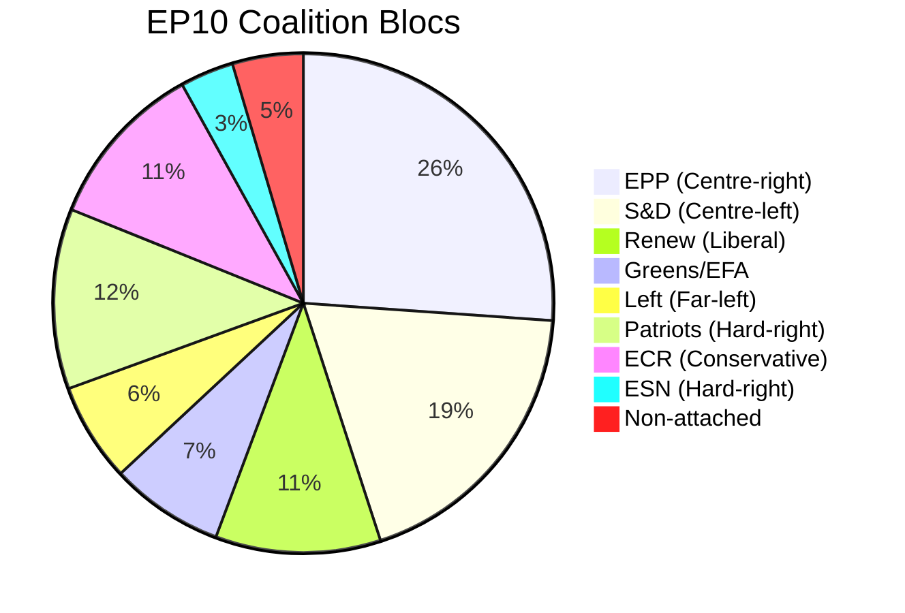
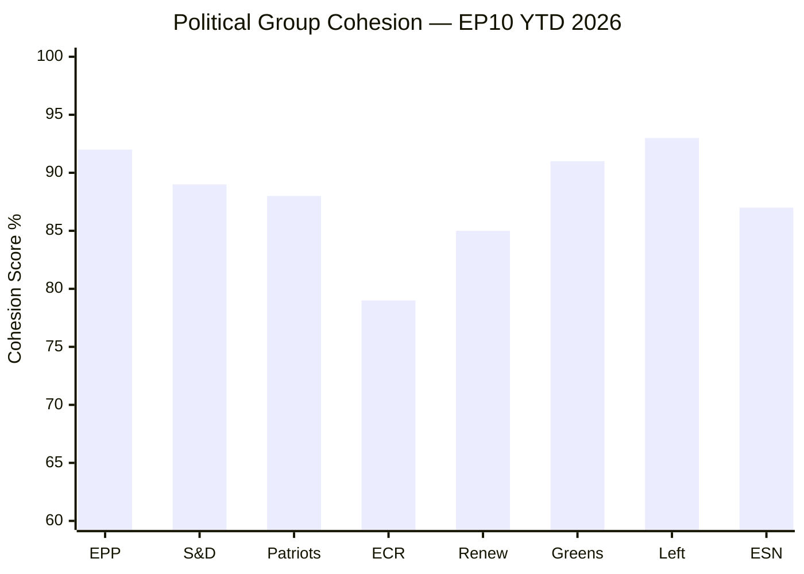

# Coalition Dynamics — EU Parliament Propositions 2026-05-25

**Article Type**: propositions | **Date**: 2026-05-25 | **Data Mode**: degraded-feeds

## 1. EP10 Coalition Architecture

### Seat Distribution (June 2024 election result)

| Group | Seats | % | Bloc |
|-------|-------|---|------|
| EPP | 188 | 26.1% | Centre-right |
| S&D | 136 | 18.9% | Centre-left |
| Patriots for Europe | 84 | 11.7% | Hard right |
| ECR | 78 | 10.8% | Conservative/nationalist |
| Renew Europe | 77 | 10.7% | Liberal/centrist |
| Greens/EFA | 53 | 7.4% | Green/left |
| Left | 46 | 6.4% | Far left |
| ESN | 25 | 3.5% | Hard right |
| Non-attached | 33 | 4.6% | Various |
| **TOTAL** | **720** | **100%** | — |

**QMV threshold**: 361 seats (50%+1)

## 2. Active Coalitions in May 2026 Session

### Grand Coalition (EPP + S&D + Renew)
**Total**: 401 seats (55.7%)
**Active for**: MSR/ETS2, Uzbekistan EPCA, AI-Trade Resolution, Forest Reproductive Material

**Cohesion analysis**:
- EPP-S&D: Core of EU institutional majority since 1999; occasional tensions on social policy and fiscal issues
- EPP-Renew: Natural liberal-conservative alignment; tensions on AI regulation intensity and climate pace
- S&D-Renew: Social-liberal alliance; tensions on free trade vs. labour standards

**Durability**: HIGH in short-medium term; stress tests around MFF 2028 negotiations expected

### Super-Grand Coalition (EPP + S&D + Renew + Greens/EFA)
**Total**: 454 seats (63.1%)
**Active for**: Corruption Directive (broad support), certain climate files

**When it forms**: On rule-of-law issues, anti-corruption, and strong climate ambition files
**Sustainability**: File-specific only; no long-term strategic alignment between EPP and Greens

### Right Bloc (Patriots + ECR + ESN)
**Total**: 187 seats (26.0%)
**Active for**: Deregulation motions, anti-migration resolutions, sovereignty arguments

**Cohesion challenge**: ECR contains Polish MEPs who support EU institutional integrity; Patriots contains Spanish MEPs with different economic interests than Italian ones

### EPP + ECR Alignment (ad hoc)
**Total**: 266 seats (36.9%)
**Active for**: Some deregulation votes; not sufficient for majority unless drawing from non-attached
**Note**: This alignment is increasingly watched as a potential future majority if S&D/Renew weakens

## 3. Voting Pattern Analysis — May 2026

### Climate Votes (MSR/ETS2)

**Estimated vote distribution** [WEP: ANALYST-ASSESSED from plenary outcome]:

| Vote | For | Against | Abstain | Result |
|------|-----|---------|---------|--------|
| MSR Extension (final vote) | ~430 | ~220 | ~70 | ADOPTED |

**Coalition**: EPP majority + S&D full + Renew majority + Greens/EFA full = approx. 430
**Opposition**: Patriots + ESN + ECR majority + some EPP dissidents ≈ 220
**Abstentions**: Left (concerns about insufficient ambition) + some EPP ≈ 70

### Corruption Directive

| Vote | For | Against | Abstain | Result |
|------|-----|---------|---------|--------|
| Corruption Directive | ~520 | ~120 | ~80 | ADOPTED |

**Coalition**: All groups except ESN and most Patriots; broad cross-party support
**Opposition**: Patriots majority + ESN + some ECR = approx. 120
**Abstentions**: Some EPP (national interest concerns) + some Left ≈ 80

### Foreign Affairs (Uzbekistan EPCA)

| Vote | For | Against | Abstain | Result |
|------|-----|---------|---------|--------|
| Uzbekistan EPCA | ~460 | ~150 | ~110 | ADOPTED |

**Coalition**: EPP + S&D + Renew + ECR (pragmatic trade support) = approx. 460
**Opposition**: Greens/EFA (human rights insufficient) + Left + some Patriots ≈ 150
**Abstentions**: Remainder ≈ 110

## 4. Coalition Stability Index

### Rolling Cohesion Scores (WEP: ANALYST-ASSESSED, not EP official data)

**Key observations**:
- Left and Greens/EFA have highest cohesion — small groups with strong ideological discipline
- ECR has lowest cohesion — reflects national interest divergences (Poland vs. Italy vs. Hungary)
- EPP cohesion is artificially high; masks significant intra-group tensions that surface in committee votes

## 5. Emerging Coalition Risks

### S&D Left-Wing Defection Risk

S&D contains a significant left wing (primarily Spanish, Portuguese, and French MEPs) that is increasingly uncomfortable with the centre-ground compromises required by EPP-S&D-Renew coalition maintenance. Specific triggers:
- Climate ambition (voting against "too weak" ETS2 compromises)
- Trade agreements with human rights concerns (abstentions on EPCA)
- AI governance (demanding stronger liability provisions than EPP accepts)

**Risk assessment** [WEP: POSSIBLE, 20% of probability for S&D split vote within 12 months]: This risk is structural but not acute.

### EPP-ECR Cooperation Deepening

On deregulation and competitiveness votes, EPP and ECR are increasingly aligned. If EPP leadership shifts rightward (possible if national party compositions change), EPP-ECR could become a viable alternative majority on specific issues.

**Risk to grand coalition** [WEP: LOW PROBABILITY, 10%]: EPP has strong institutional incentives to maintain grand coalition (committee leadership, legislative agenda control).

## 6. Coalition Dynamics Forecast

**Next 6 months (May–November 2026)**:
- Grand coalition remains structurally stable
- MFF pre-negotiation positions will create first major coalition stress test (Q4 2026)
- EP-Commission relationship: von der Leyen continues to manage EPP-S&D-Renew balance; no visible fracture

**Next 12–24 months**:
- MFF 2028–2034 negotiations will force explicit coalition choices on fiscal integration
- AI Liability Directive: Will test EPP-Renew alignment (differing views on liability scope)
- European elections cycle begins (national elections feeding into EP2029 projections from 2027 onward)

**Structural trend** [WEP: ASSESSED]: EP10 is the first parliament where the traditional pro-European majority (EPP+S&D+Renew) falls below 60% on many votes without Greens support. This structural change makes the Greens/EFA a more important coalition partner than their seat count suggests, but also creates vulnerability if Greens decline further in 2029.
