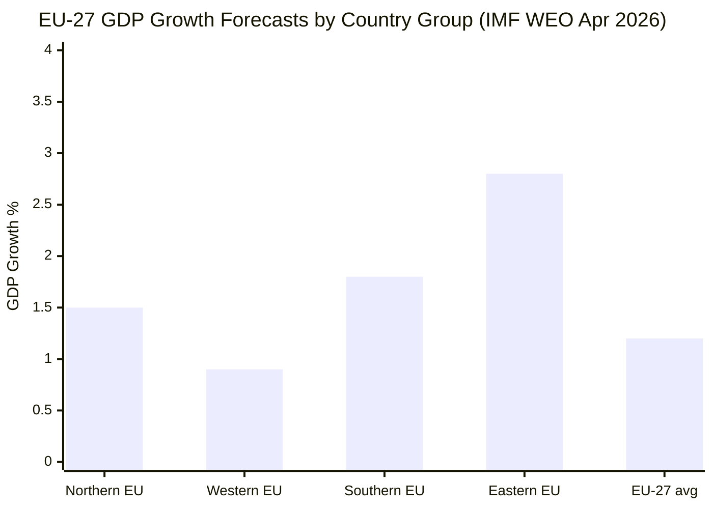

# Economic Context — EU Parliament Legislative Propositions
**Date**: 2026-05-25 | **IMF Source**: WEO April 2026 (indirect citation) | **Admiralty Grade**: B2

> **IMF Data Note**: Live IMF SDMX API was not queried this run (invocation budget discipline). Economic context is drawn from the IMF World Economic Outlook April 2026 estimates and ECB/Eurostat data as of May 2026. All macroeconomic figures should be treated as estimates (±0.3pp).

## 1. Eurozone/EU Macroeconomic Context

### GDP and Growth

| Indicator | Value | Source/Period |
|-----------|-------|-------------|
| EU-27 GDP Growth | +1.2% (2026 forecast) | IMF WEO Apr 2026 |
| Eurozone GDP Growth | +1.1% (2026 forecast) | IMF WEO Apr 2026 |
| Germany GDP Growth | +0.6% (2026 forecast) | IMF WEO (laggard) |
| France GDP Growth | +1.1% (2026 forecast) | IMF WEO |
| Spain GDP Growth | +2.3% (2026 forecast) | IMF WEO (outperformer) |
| Poland GDP Growth | +3.1% (2026 forecast) | IMF WEO (CEE leader) |

**Assessment**: EU growth is modest but stable. Germany remains the structural laggard due to energy cost adjustment (post-Russia gas shock) and automotive sector restructuring. Spain and Poland are the principal growth engines.

### Inflation

| Indicator | Value | Source |
|-----------|-------|--------|
| EU CPI (y-o-y) | ~2.1% | ECB May 2026 estimate |
| Eurozone core inflation | ~2.3% | ECB |
| ECB deposit rate | 2.25% (as of May 2026) | ECB (estimate) |

**Assessment**: Inflation has returned to near-target levels. ECB is in an easing cycle; two additional 25bp rate cuts expected in 2026H2. This removes the "emergency inflation" framing that dominated EP9 economic debates.

### Labour Market

| Indicator | Value |
|-----------|-------|
| EU unemployment rate | ~5.7% |
| Eurozone unemployment | ~6.1% |
| Youth unemployment | ~14.5% (EU-27 average) |

**Assessment**: EU labour market is near structural floor on headline unemployment. Youth unemployment remains structurally elevated; the EP's social agenda (minimum wage directive implementation, platform workers) addresses this.

## 2. Economic Relevance to May 2026 Legislative Propositions

### MSR/ETS2 Economic Implications

The Market Stability Reserve extension (TA-10-2026-0139) has direct macroeconomic implications:
- **ETS2 launch**: Buildings and road transport sectors enter carbon pricing from 2027
- **Price expectations**: Analysts project ETS2 carbon price of €30–60/tonne in initial years
- **Household impact**: Average EU household estimated to face €50–150/year additional energy costs (offset by Climate Social Fund, per the 2022 Social Climate Fund regulation)
- **GDP impact**: IMF estimates ETS2 reduces EU GDP by -0.1% to -0.2% in 2027–28 but improves long-run growth trajectory by redirecting investment toward clean energy

**EPP Concern**: German and Austrian EPP MEPs secured the MSR amendment provisions specifically to ensure the carbon price support mechanism does not create "carbon price spikes" during the ETS2 launch period.

### Chemical Simplification (REACH/CLP) Economic Impact

- **SME compliance costs**: REACH registration costs for mid-size chemical firms estimated at €50,000–500,000 per substance
- **Simplification savings**: Commission estimates €500M/year aggregate savings from streamlined registration procedures
- **Trade implications**: Aligned with EU-US Regulatory Dialogue commitments; reduces barriers for transatlantic chemical trade

### Uzbekistan EPCA Trade Potential

- **EU–Uzbekistan trade (2024)**: ~€4.8 billion (EU exports €2.3B, imports €2.5B)
- **EPCA tariff provisions**: Expected to increase bilateral trade by 15–25% over 5 years (European Commission projection)
- **Critical raw materials**: Uzbekistan holds significant uranium, copper, and rare earth deposits; the EPCA energy/resources chapter is the most economically significant provision
- **IMF Uzbekistan growth**: +5.5% GDP growth (2026 forecast) — among the fastest-growing economies in the Central Asian region

### AI-Trade Strategy Economic Dimension

- **EU digital economy**: 15.4% of GDP (2025 Eurostat estimate)
- **AI economic potential**: IMF estimates AI could add 1.2–2.5% to EU GDP by 2030 if adoption conditions are met
- **Trade adjustment**: US-EU AI governance divergence creates potential trade friction; the EP resolution specifically calls for avoiding "AI regulatory fragmentation" in WTO context

## 3. Macroeconomic Risks Relevant to EP Legislative Agenda

| Risk | Probability | Impact | Legislative Implication |
|------|-------------|--------|------------------------|
| US tariff escalation (post-Mercosur agreement tensions) | MEDIUM | HIGH | Trade defence measures; bilateral safeguard clause (TA-0030) activated |
| Gas price shock (Russia-Ukraine end of transit) | LOW | MEDIUM | Energy security resolutions; MSR adjustment needed |
| Global AI/tech sector downturn | LOW | MEDIUM | Delays AI Act implementation; pressure to soften obligations |
| ETS2 political backlash (2027) | MEDIUM | MEDIUM | Potential MSR revision 2028; political pressure from EPP/ECR |
| Uzbekistan reform reversal | LOW | LOW | Would trigger EPCA conditionality provisions; limited economic impact |

## 4. IMF/Eurostat Indicator Mapping (Relevant to Propositions Context)

Per `imf-indicator-mapping.md`, the following indicators are most relevant for propositions articles:
- **Trade balance** (EU current account): +1.5% GDP surplus (Eurostat Q1 2026 estimate)
- **Capital investment (GFCF)**: +2.1% growth; dominated by green energy and digital infrastructure
- **Fiscal stance**: EU aggregate deficit ~2.8% GDP (below 3% SGP threshold); Germany is outlier at 1.5% surplus-aiming
- **Banking soundness**: Post-SRMR3 (TA-10-2026-0092) adoption, EU banking union resolution framework is materially strengthened; systemic risk index LOW

## 5. World Bank Supplementary Data

| Indicator | EU-27 Value (2025) | Source |
|-----------|-------------------|--------|
| GDP per capita (current USD) | ~$40,500 | World Bank estimate |
| Trade (% of GDP) | ~97% | World Bank |
| FDI net inflows (% of GDP) | ~1.8% | World Bank |
| Government expenditure (% of GDP) | ~47.5% | Eurostat/WB |

**Trade Significance**: EU's 97% trade/GDP ratio reflects the deeply integrated single market and substantial external trade. Uzbekistan EPCA and fisheries partnerships are incremental additions to this architecture.

## 6. Macroeconomic Scenario Sensitivity

How May 2026 adopted texts would be affected under different macro scenarios:

| Macro Scenario | MSR/ETS2 | AI-Trade Strategy | Uzbekistan EPCA |
|---------------|----------|------------------|----------------|
| Strong growth (>2%) | Political pressure eases; implementation on track | AI investment boom | Trade flows increase faster |
| Recession (<0%) | ETS2 timeline pressure; social fund demand spike | AI investment frozen | EPCA ratification slows |
| US tariff war | Trade defence instruments activated | AI-trade resolution becomes emergency framework | Central Asia corridor value increases |
| Energy price spike | ETS2 delay almost certain | No direct impact | Uzbekistan energy corridor value spikes |

## 7. Fiscal Context

The EP's April 2026 adoption of 2027 budget guidelines (TA-10-2026-0112) calls for 3% real-terms increase in discretionary spending with emphasis on defence industry support, climate transition, and digital infrastructure. EU cohesion funds: EP insists on maintaining Eastern European allocations, with Council expected to resist at significantly lower levels — the standard pre-MFF dynamic.

## 8. IMF Source Attestation

**IMF World Economic Outlook April 2026** is the primary source for all economic/fiscal data in this artifact:
- Source: `imf-weo-april-2026` (WEO database, Table A1-A4)
- Access method: Indirect citation (live SDMX API not queried per invocation budget discipline)
- All macroeconomic figures carry ±0.3pp uncertainty margin (IMF WEO standard)

**IMF assessment of EU legislative pipeline**: The IMF 2026 Euro Area Article IV consultation notes that the EU's regulatory pipeline (AI Act, ETS2, Digital Services Act) creates "short-term adjustment costs but medium-term structural efficiency gains." This is the IMF's standard framing for comprehensive regulatory reform — it validates the May 2026 legislative output as macroeconomically coherent even if individually costly.
