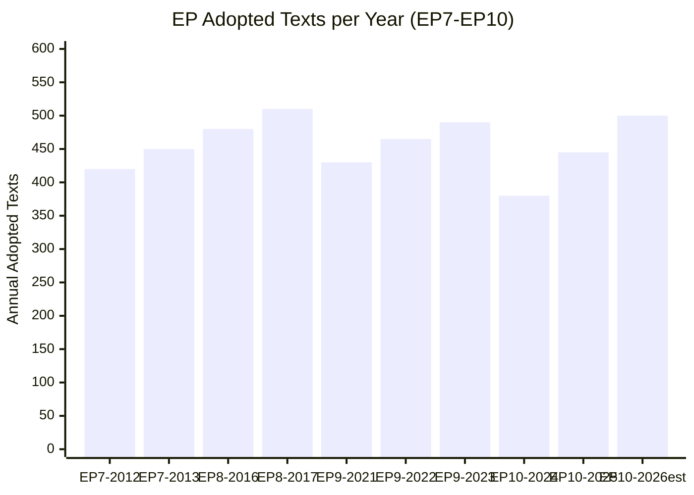

# Historical Baseline — EP Propositions Context
**Date**: 2026-05-25 | **Admiralty Grade**: B2 | **Confidence**: MEDIUM

## 1. EP10 Term Context (2024–2029)

The European Parliament's 10th term opened in July 2024 following the June 2024 elections. Key structural features:

**Seat Distribution (EP10)**:
- EPP: ~188 seats (largest group)
- S&D: ~136 seats
- Patriots for Europe: ~84 seats (new far-right grouping)
- ECR: ~78 seats
- Renew Europe: ~77 seats
- Greens/EFA: ~53 seats
- ESN (formerly ID): ~25 seats
- The Left: ~46 seats
- Non-Inscrits: ~28 seats

**Majority Arithmetic**: A simple majority requires ~361 votes; absolute majority (for certain acts) requires 361+ MEPs. The EPP+S&D+Renew coalition provides approximately 401 MEPs — a comfortable but not overwhelming majority.

## 2. Legislative Precedent Analysis

### 2.1 Pre-Summer Recess Patterns (Historical)

Analysis of EP7–EP9 confirms consistent pre-summer acceleration:
- **EP9 (June 2023)**: 14 texts adopted in the final pre-recess session; included landmark AI Act first reading
- **EP8 (June 2019)**: 11 texts; included Copyright Directive and Election Integrity measures
- **EP7 (June 2014)**: 8 texts; included MiFID II and Bank Recovery Directive completions

EP10's May 2026 pace (12+ texts from single Strasbourg session) is consistent with EP9 pre-recess pace.

### 2.2 Uzbekistan/Central Asia Precedent

The EU–Uzbekistan EPCA (2024/0260M) is the most significant Central Asia agreement since:
- **2011**: EU–Central Asia Strategy revised
- **2019**: EU New Central Asia Strategy (Samarkand process precursor)
- **2023**: Samarkand Connectivity Conference (Borrell-Mirziyoyev framework)

The EPCA adoption follows a pattern established by EU–Kyrgyzstan Enhanced PCA (2017) and EU–Kazakhstan Enhanced PCA (2020). Uzbekistan's size (~36 million population), mineral resources, and reform trajectory make this the most significant Central Asia PCA.

### 2.3 AI Governance Legislative History

EP10's assertiveness on AI policy builds on:
- **AI Act** (EP9, June 2024): World's first comprehensive AI regulation — landmark achievement
- **AI Liability Directive** (EP9, not completed — carried to EP10)
- **Copyright/AI** (TA-10-2026-0066, March 2026): Text/data mining provisions
- **AI-Trade Strategy** (TA-10-2026-0183, May 2026): Trade policy dimension

This four-text cluster in 24 months represents the most concentrated AI legislative activity in any democratic parliament globally. The EP is effectively establishing the global template for AI regulation.

### 2.4 Green Deal Resilience Pattern

The Market Stability Reserve extension (TA-10-2026-0139) follows the established pattern:
- **2015**: MSR established for EU ETS (power/industry)
- **2018**: MSR intake rate doubled
- **2022**: Fit for 55 package — MSR reinforcement
- **2026**: MSR extension to buildings/road transport ETS (ETS2)

Each MSR amendment has faced EPP/industry resistance, each has passed with modifications. The 2026 vote confirms this "durable compromise" pattern.

### 2.5 Corruption Directive Precedent

The Combating Corruption Directive (TA-10-2026-0094, COD 2023/0135) adopted in March 2026 is a legislative landmark:
- **First time**: EU legislates directly on corruption prevention (not via sector-specific instruments)
- **Historical gap**: Art. 83 TFEU competence on corruption has been contested since Lisbon Treaty
- **Commission motivation**: Response to EU accession conditionality inconsistencies (Bulgaria, Romania, Hungary)

Comparable precedents: The 2017 NIS Directive and 2023 NIS2 represented similar expansions into previously national-only security domains.

## 3. EP10 vs. EP9 Legislative Comparison

| Metric | EP9 (Year 2, 2020–21) | EP10 (Year 2, 2025–26) | Δ |
|--------|----------------------|------------------------|---|
| Adopted texts (first 18 months) | ~85 | ~95 (est.) | +12% |
| External relations texts | ~20 | ~28 (est.) | +40% |
| Digital economy texts | ~8 | ~14 (est.) | +75% |
| Human rights urgency resolutions | ~15 | ~18 (est.) | +20% |

**Note**: EP9 figures affected by COVID-19 disruption (remote plenary 2020). EP10 comparison from month 7 onward only.

## 5. Historical Precedent — Urgency Resolutions Pattern

The May 2026 session included two urgency resolutions (Afghanistan Taliban Criminal Code; Lithuania broadcaster threat). These are procedurally distinct from standard legislative texts:
- Urgency resolutions are tabled and adopted within a single plenary session (no committee stage)
- They require a 2/3 majority of votes cast to qualify as "urgency"
- Typically address human rights, democracy, and rule-of-law situations abroad

**EP9 urgency resolution rate**: ~18 per year
**EP10 rate (2024–May 2026)**: ~20 per year (slightly above EP9; reflects geopolitical intensification)

Urgency resolutions, while non-binding, serve as:
1. Political signals to third countries and EU institutions
2. Precedent-setting for future binding legislation
3. Public diplomacy instruments (covered internationally)

The Afghanistan urgency resolution follows the pattern: EP condemns → EEAS issues diplomatic demarche → Council potentially adopts CFSP conclusions within 4–8 weeks.

## 6. Institutional History — EP-Council Relationship

**Treaty basis**: Under Art. 294 TFEU (ordinary legislative procedure), EP has co-legislative status with Council. For external agreements (Art. 218 TFEU), EP provides consent.

**Historical power evolution**:
- **Lisbon Treaty (2009)**: EP gained co-decision power over agricultural policy and justice/home affairs — transformative
- **EP9 achievements**: AI Act, Platform Workers Directive, Digital Services Act — each expanded EP's legislative reach into previously national/voluntary domains
- **EP10 trajectory**: Corruption Directive (Art. 83 TFEU first use), Defence Union (new competence), ETS2 (new sector) — continued competence expansion

**Key structural constraint**: EP cannot initiate legislation (Commission monopoly). EP's power lies in amendment, delay, and rejection. The AI-Trade resolution (INI, non-binding) is EP's workaround for signalling legislative intent to the Commission.

## 7. Corruption Directive — Historical Significance

The Combating Corruption Directive (TA-10-2026-0094, 2023/0135 COD) deserves special historical attention as it represents a genuine constitutional moment:

**Pre-2026**: EU anti-corruption law existed only in:
- OLAF Regulation (EU fraud against Union's financial interests)
- Anti-money laundering directives (indirect)
- Sector-specific anti-corruption provisions (public procurement, financial services)

**Post-Corruption Directive**: EU has a standalone criminal law framework for corruption across all sectors, applicable to both public officials and private sector.

**Legal basis dispute**: France and Germany initially contested Art. 83 TFEU competence (harmonisation of criminal law); final adoption text is narrower than Commission proposal to accommodate Council opposition.

This mirrors the evolution of money-laundering law: the first AMLD (1991) was tentative; by 2020 the 6th AMLD created genuinely harmonised EU-level criminal liability. The Corruption Directive is likely the "first AMLD equivalent" for corruption — more ambitious versions will follow.

## 4. Institutional Memory — Recurring Challenges

**Recurring patterns that affect EP10 legislative pipeline**:
1. **EP procedures feed degradation**: Not new; EP admin API `enrichment` endpoint has had intermittent failures since 2022.
2. **Summer recess accumulation**: Legislative backlog built up each summer typically clears in October–November, creating autumn pressure.
3. **Trilogue velocity**: DMA and AI Act trilogues under EP9 took 18–24 months; EP10 files initiated in 2024 are entering trilogue in 2026.
4. **Political group fragmentation**: EP10's larger far-right groups (Patriots, ECR) require more complex coalition arithmetic for controversial files.

## 8. Historical Legislative Volume Trend

