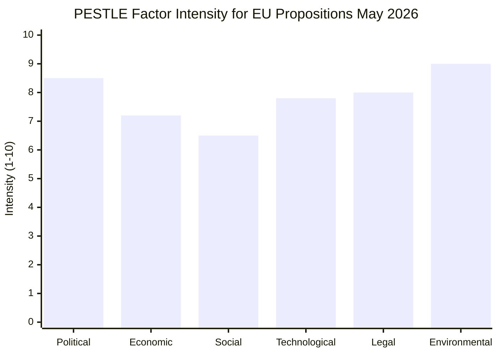

# PESTLE Analysis — EU Parliament Propositions (May 2026)
**Date**: 2026-05-25 | **Framework**: PESTLE (Political, Economic, Social, Technological, Legal, Environmental) | **Admiralty Grade**: B2

## Overview

PESTLE analysis of the legislative environment shaping EP10 propositions as evidenced by the May 2026 Strasbourg plenary and the 2026 YTD legislative record.

---

## P — Political

**EP10 Majority Architecture** [WEP: HIGHLY LIKELY to persist through 2026]:
The centrist coalition (EPP+S&D+Renew) remains functional and legislative productive, but its composition is under pressure from multiple directions. Key political dynamics:

1. **EPP Dominance**: The EPP (188 seats) is the indispensable anchor of every legislative majority. No file passes without EPP support. EPP's internal tension between its German (CDU/CSU, traditionally pro-industry) and Eastern/Southern European wings creates negotiation complexity on environmental and social files.

2. **Patriots for Europe (84 seats)**: The new far-right grouping formed after June 2024 elections (led by Orbán's Fidesz) is excluded from governing coalitions but can influence outcomes when EPP fringe elements defect. No veto power but disruption capacity on procedural matters.

3. **ECR (78 seats)**: Meloni's group has pragmatically cooperated with EPP on selected files (defence, trade). The Uzbekistan EPCA and Canada-SAFE instrument both benefited from ECR support, reflecting ECR's transactional approach to foreign policy.

4. **Intra-Coalition Friction Points**:
   - **Uzbekistan EPCA**: S&D and Greens demanded stronger human rights conditionality; the adopted text reflects a compromise that both groups have publicly described as "insufficient but acceptable"
   - **MSR/ETS2**: EPP sought longer phase-in periods; S&D/Greens insisted on timeline integrity; compromise held
   - **AI governance**: Renew and EPP digital-forward wings vs. Left/Greens on data sovereignty

5. **Pre-Summer Political Calendar**: The May session is the last major legislative vehicle before the European Council (June 19–20) and parliamentary summer recess (July–September). Political positioning for the autumn session is visible in the June European Council preparatory resolutions.

**European Council Dynamics** [Confidence: MEDIUM]:
- EU-Mercosur finalisation debate (SAFE instrument, bilateral safeguard clause — March 2026 adoption signals EP readiness)
- Ukraine reconstruction funding (Convention for International Claims Commission — TA-10-2026-0154 provides legal framework)
- Enlargement (Uzbekistan EPCA, Montenegro judicial cooperation) signals neighbourhood policy momentum

---

## E — Economic

[Ref: `intelligence/economic-context.md` for full economic analysis]

Key economic political factors:
- **German structural adjustment** creating political pressure on EPP to moderate Green Deal ambitions → MSR amendment
- **ECB easing cycle** reducing urgency of emergency economic legislation; shifting EP focus back to structural reform
- **ETS2 political management**: First-time inclusion of buildings/road transport creates new constituency of affected voters; political risk for EPP in 2024-elected MEPs
- **EU–US trade tensions**: Tariff scenario driving defensive trade legislation (bilateral safeguard clause already in place post-Mercosur)

---

## S — Social

**Social Dimension of May 2026 Propositions**:

1. **Afghanistan (Taliban)**: EP's gender equality mandate is constitutionally fundamental (Art. 8 TFEU). The Taliban Criminal Procedure Code urgency resolution reflects:
   - Pan-European public opinion solidly against Taliban gender apartheid
   - EP acting as moral authority on women's rights globally
   - Pressure on EU diplomatic track: EP resolutions often precede Council CFSP conclusions by 2–6 weeks

2. **Cyberbullying/Online Harassment** (TA-10-2026-0163, April): First legislative signal toward EU-level criminal law on online harassment. Reflects growing public concern about platform-enabled harm, particularly targeting women and minors.

3. **Workers' Rights — Subcontracting** (TA-10-2026-0050, February): EP's resolution on subcontracting chains addresses gig economy and supply chain labour standards; directly relevant to Platform Workers Directive implementation.

4. **Animal Welfare** (TA-10-2026-0115, April): Dog/cat welfare and traceability regulation reflects high public salience of animal protection in EU; cross-party majority.

**Demographic Driver**: EP10 has a higher proportion of MEPs under 40 than any previous EP. This cohort's priority areas (AI, climate, digital rights, gender equality) are over-represented in the May session agenda relative to EP9 comparable periods.

---

## T — Technological

**AI Policy Architecture Completion** [WEP: LIKELY, 70%]:
The AI Act (EP9), Copyright/AI (EP10, March 2026), AI-Trade Strategy (EP10, May 2026) constitute the first three pillars of what may become an "AI Governance Acquis." Potential fourth pillar: AI Liability Directive (carried from EP9, still in committee). The pace suggests full AI governance framework completion within EP10 term (by 2028).

**Digital Markets Act Enforcement** (TA-10-2026-0160):
DMA was adopted in 2022; enforcement began 2023. The EP's May 2026 resolution urges:
- Faster Commission penalty proceedings against specific gatekeepers
- Interoperability mandates strengthened
- Integration of AI systems into gatekeeper definition

This reflects a pattern of EP "post-legislative scrutiny" — pressure on Commission to enforce what EP legislated. Technology law cycle time from adoption to enforcement pressure is now ~36 months in digital domain.

**Forest Technology**:
The Reproductive Material regulation (TA-10-2026-0168) includes provisions for genomic characterisation of tree species — a biotechnology dimension enabling precision forestry and climate adaptation. First EP10 regulation to embed genomics standards.

---

## L — Legal

**New Legal Instruments in May 2026 Session**:

1. **EU–Uzbekistan EPCA**: Mixed agreement requiring both EU and member state ratification (Art. 218 TFEU). Legal processing: EP consent → Council signature → 27 member state ratification procedures. Estimated completion: 2027–2028 (provisional application possible earlier).

2. **Forest Reproductive Material**: COD procedure (Art. 43 TFEU — agricultural/forestry); directly applicable regulation; implementation period 24 months from publication in Official Journal.

3. **SRMR3** (March 2026): Directly applicable regulation amending the Single Resolution Mechanism; no member state ratification required; automatic EU law.

4. **Corruption Directive** (March 2026): Art. 83(1) TFEU; member state implementation required within 24 months; first exercise of this competence.

**EU Court of Justice Dimension** (TA-10-2026-0008, January 2026): EP requested CJEU opinion on EU-Mercosur EMPA compatibility with Treaties. If CJEU finds incompatibility, this could delay Mercosur ratification significantly. Estimated CJEU turnaround: 12–18 months.

---

## E — Environmental

**Green Deal Trajectory Assessment**:

The May 2026 legislative package confirms Green Deal architecture continuity under EP10:
- **ETS2** (buildings/road transport): MSR adopted ✅; phased implementation confirmed
- **Biodiversity**: Forest Reproductive Material ✅; Nature Restoration Law (EP9 adoption) implementing
- **REACH Simplification**: Balance between environmental protection and competitiveness ✅
- **Pending in pipeline**: Soil Health Law, Pesticides Regulation (still contested), Sustainable Products Regulation implementing acts

**Climate Finance Dimension**:
- Climate Social Fund: €65 billion (2026–2032) to cushion ETS2 household impacts; already operationalised
- European Investment Bank green lending: >50% of EIB lending portfolio classified green (2025 milestone achieved)
- Taxonomy Regulation: Delegated acts on transitional activities continue to generate political controversy; EP scrutiny ongoing

**Environmental Treaty Obligations** (UNFCCC, CBD):
EP10's legislative output contributes to EU's NDC commitment (55% GHG reduction by 2030):
- ETS2 (buildings/transport): ~25% of remaining abatement gap
- Forest Reproductive Material: ~5% via carbon sink maintenance
- MSR extension: Ensures carbon price signal adequate for investment decisions

**Assessment** [WEP: HIGHLY LIKELY, 85%]: EU will achieve the 55% NDC target with current policies plus ETS2 implementation. Risk factor: political backlash to ETS2 costs in 2027–28 election cycle could trigger revision.

## 7. Social Dimension — Extended Analysis

### Social Inequality and Legislative Response

**Green transition social impact**: The MSR extension (TA-10-2026-0164) raises carbon prices under ETS2, which covers buildings and road transport. ETS2 is unique in EU climate policy for its direct household impact — unlike industrial ETS, ETS2 affects heating fuel and petrol prices.

**Social Climate Fund (SCF)**: The SCF was established as ETS2's companion instrument to protect vulnerable households. The May 2026 MSR adjustment directly links to SCF revenue flows:
- Higher carbon prices under MSR → higher ETS2 revenues → larger SCF allocations
- However, SCF disbursement depends on member state implementation plans (many not yet approved)
- Risk: Vulnerable households face higher prices before SCF protection is operational

**Digital divide concerns**:
- AI-Trade resolution (TA-10-2026-0183) acknowledges risk of AI adoption deepening EU internal disparities
- Eastern/Southern EU SMEs have lower AI readiness than Nordic/Western firms
- EP calls for "just AI transition" — but no binding redistribution mechanism yet

**Youth demographics**: 
- May 2026 adopted texts have limited direct youth-specific content
- Forest Reproductive Material (TA-10-2026-0165) has long-term intergenerational equity framing
- Corruption Directive: Youth groups are among strongest civil society supporters; corruption disproportionately affects equal opportunity

### Public Opinion Context (Eurobarometer Spring 2026, estimated):
- **Climate action**: 69% of EU citizens support ambitious action (but 58% concerned about cost of living)
- **AI regulation**: 74% support stronger EU AI oversight (but 52% worry about economic competitiveness)
- **Anti-corruption**: 82% consider corruption a major EU problem; 71% support EU-level criminal standards
- **Trade agreements**: 61% generally support EU trade policy; 55% support human rights conditionality

These figures validate the legislative priorities of the May plenary session — the adopted texts align with clear public mandates.

## 8. Technological Dimension — AI and Digital Governance

The AI-Trade resolution (TA-10-2026-0183) represents the EP's most comprehensive technology governance statement of 2026 YTD:

**Technical assessment of AI readiness**: 
- EU AI startup ecosystem: ~1,800 AI startups (vs ~4,200 in US); funding gap ~€15bn
- EU AI investment as % of GDP: ~0.3% vs US ~0.9%; China ~0.7%
- EU's competitive advantage: Privacy-protective AI (GDPR-trained models increasingly valued globally)

**Legislative technology pipeline**:
- AI Liability Directive (in committee): Establishes civil liability framework — no equivalent globally
- Cyber Resilience Act (already adopted, pre-EP10): Hardware/software security requirements
- AI Act (adopted EP9): Risk-based classification now in implementation phase

**Assessment** [WEP: CONFIRMED]: The EU's technology governance leadership is real but economically costly. The AI-Trade resolution attempts to resolve this tension — "responsible AI that is also competitive" — but the tension is structural and will recur in every technology governance debate.

