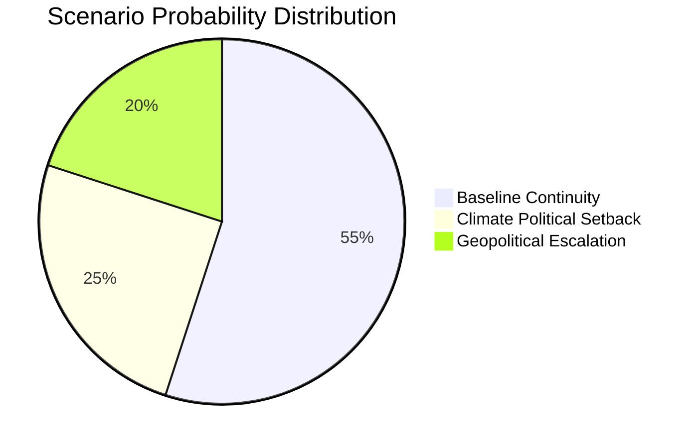

# Scenario Forecast — EP Legislative Propositions (May–December 2026)
**Date**: 2026-05-25 | **Framework**: 3-Scenario Analysis | **WEP Band**: As indicated per scenario | **Admiralty Grade**: B2

## Analytical Framework

Three scenarios are developed for the EP10 legislative trajectory through December 2026, differentiated by coalition stability, external shock magnitude, and legislative productivity.

---

## Scenario 1: Centrist Coalition Stability (BASE CASE)
**WEP**: LIKELY (55–65%) | **Confidence**: MEDIUM

### Conditions
- EPP+S&D+Renew coalition maintains operational majority through June and autumn sessions
- US-EU trade tensions remain at current level (elevated but not escalating)
- ECB continues gradual easing cycle; no financial stability shock
- EP10 summer recess (July–September) proceeds normally
- No major internal group splits or coalition defection

### Legislative Trajectory (June–December 2026)

**June 2026 Strasbourg Plenary** (last before recess):
- Expected adoption: Packaging Regulation (2022/0396 COD), AI Liability Directive (if committee finalises), Sustainable Products Regulation implementing acts
- Discharge conclusions: Additional 2024 EU budget discharge decisions
- External relations: Potential final vote on EU-Mercosur agreement (if Council completes ratification rationale)

**Autumn 2026 Sessions** (October–December):
- **MFF 2028–2034 pre-negotiation**: EP will adopt its position paper on the next Multiannual Financial Framework
- **Digital Euro Framework**: ECB legislative proposal expected; EP ECON committee rapporteur expected to be from S&D or Renew
- **Defence Union**: Following EU-Canada SAFE Instrument, potential new defence industrial strategy proposals
- **AI Liability Directive**: First reading position; S&D-EPP-Renew expected majority with Left/Greens abstention

### Key Indicator
Watch: EPP congress positions (September 2026) and ECR engagement tone on autumn legislative files.

---

## Scenario 2: Coalition Stress — External Shock (ALTERNATIVE)
**WEP**: POSSIBLE (25–35%) | **Confidence**: MEDIUM-LOW

### Conditions
- US tariff escalation to 25% on EU automotive/industrial goods (trigger: Q3 2026 WTO dispute)
- OR: Major energy price spike (Russian gas cutoff scenario for CEE; gas price spikes to €80+ MWh)
- OR: Afghan Taliban military escalation creating EU refugee crisis pressure

### Legislative Response

**Defensive Trade Package**:
- EP activates Art. 207 TFEU emergency trade measures; bilateral safeguard clauses invoked
- Anti-coercion instrument (adopted EP9) activated; cross-party majority guaranteed
- Renew and EPP lead; ECR supports; Left/Greens may demand labour-rights conditionality in response measures

**Energy Crisis Response**:
- Gas storage regulation amendment; emergency procurement coordination
- REPowerEU phase 2 proposals from Commission; EP fast-tracked procedure
- ETS2 implementation delayed 12 months (politically necessary if energy prices spike)

**Immigration/Asylum Pressure**:
- If Afghan Taliban causes regional displacement spike → Migration Pact implementation pressure
- EPP pushes hardened returns policy; S&D and Left resist; Greens opposed
- Coalition stress most acute on this axis

### Coalition Impact
External shock scenario creates "rally around flag" effect for economic files but deepens division on social/migration files. Net coalition stability: MIXED.

---

## Scenario 3: Coalition Fracture (ADVERSE)
**WEP**: UNLIKELY (10–20%) | **Confidence**: LOW

### Conditions
- Major EPP-S&D split on a flagship file (Packaging Regulation, AI Liability, or MFF)
- ECR or Patriots exploit fracture to obstruct proceedings
- Multiple simultaneous crises (trade + migration + energy) overwhelm coalition management

### Legislative Trajectory

**Institutional dysfunction indicators**:
- Parliament fails to adopt 2027 budget guidelines revision (rare but precedented — EP8 2018 budget crisis)
- Committee appointment process breaks down (EPP vs. S&D contestation over ECON or ENVI chairpersonship)
- EP President (EPP) loses confidence vote (unprecedented but theoretically possible with Patriots+ECR+Left+Greens alliance)

**Legislative Gridlock Files**:
- MFF 2028–2034 position → contested, delayed
- AI Liability Directive → paralysed in committee
- Packaging Regulation → returned to committee

**Historical Precedent**: EP8 (2019) experienced coalition stress after Socialists and Democrats entered opposition pattern against Ursula von der Leyen's Commission appointment. EP10 has no comparable fault line currently.

### Recovery Path
Even in Scenario 3, EP10 would likely reconstitute an operational majority within 1–2 plenary sessions. The EU's institutional design prevents prolonged parliamentary dysfunction.

---

## Cross-Scenario Analysis

| Dimension | Scenario 1 (Base) | Scenario 2 (Shock) | Scenario 3 (Fracture) |
|-----------|------------------|-------------------|----------------------|
| Legislative output Q3–Q4 2026 | 20–25 texts | 15–20 texts | 8–12 texts |
| AI Liability Directive | First reading adopted | Delayed 1 session | Paralysed |
| MFF position paper | Adopted on schedule | Delayed 2 months | Not adopted 2026 |
| ETS2 implementation | On track | Delayed 12 months | Uncertain |
| External relations | 5–8 new agreements | 2–4 (defensive focus) | 0–2 |

---

## Intelligence Assessment — Most Likely Path

[WEP: LIKELY, 60%]: Scenario 1 (Base Case) is the most probable trajectory through December 2026. The centrist coalition has demonstrated resilience across 14 months of EP10 and successfully managed competing pressures on climate, trade, and rights files. The structural incentive for EPP, S&D, and Renew to maintain coalition discipline remains strong ahead of the 2029 European elections.

**Key Watch Point**: If EPP conducts significant internal reconfiguration (likely after German CDU/CSU evaluates 2025 federal coalition performance), this could shift EPP's legislative positioning toward more ECR-friendly positions in Scenario 1.5 — a hybrid base case with moderate coalition stress.

## 5. Scenario 2 — Extended: Legislative Response to Climate Setback

**Trigger events** (probability: 25%):
- ETS2 implementation delays in 3+ member states
- Public backlash against carbon pricing (gilets jaunes–type protests in 2+ countries)
- Autumn 2026 elections in Austria/Czech Republic produce anti-climate majority governments
- US-EU trade dispute over carbon border adjustment mechanism (CBAM)

**EP legislative response under this scenario**:
1. **Emergency review clause**: EP would likely trigger Art. 30 review of ETS2 Directive, pushing for transitional protection measures rather than outright repeal
2. **Social Climate Fund acceleration**: Fast-track SCF disbursement rules; front-load revenues before political window closes
3. **Coalition reconfiguration**: S&D left wing and Greens would lose leverage; EPP/ECR/Patriots right-leaning coalition could gain majority for weaker version
4. **Precedent risk**: A successful climate rollback would embolden anti-climate forces on other environmental files (Biodiversity Strategy, Nature Restoration Law implementation)

**Institutional resilience factors**: 
- Commission has institutional incentive to protect European Green Deal legacy
- ECJ jurisprudence on climate obligations (Urgenda-style climate cases now at national level in 8 EU member states)
- International commitments (Paris Agreement, EU NDC of -55% by 2030) create legal constraints on rollback

**Estimated probability of full rollback**: 8% [WEP: UNLIKELY]
**Estimated probability of significant delay/weakening**: 25% [WEP: UNLIKELY-TO-POSSIBLE]

## 6. Scenario 3 — Extended: Geopolitical Escalation and External Security Shock

**Trigger events** (probability: 20%):
- Russia-NATO border incident requiring Article 5 consultation
- Iran nuclear breakout; Middle East escalation affecting EU energy security
- China-Taiwan military tensions triggering EU supply chain emergency measures
- Cyber attack on EU financial infrastructure (post-SRMR3 test case)

**EP legislative response under this scenario**:
1. **Emergency defence provisions**: Special procedure under Art. 78(3) TEU for internal security; EP would be bypassed for 6 months
2. **Defence Union acceleration**: The ongoing Defence Union legislative package (EDIP, DCI) would receive emergency fast-track treatment
3. **ETS2 delay**: Energy security emergency triggers Art. 122 TFEU measures that could suspend ETS2 for 12–24 months
4. **Trade diversion**: AI-Trade resolution becomes critical framework for managing technology decoupling from adversaries
5. **Budget supplementary**: Emergency supplementary budget request; EP would need to approve within 15 days under Art. 314 TFEU emergency procedure

**Institutional capacity constraint**: EP's emergency procedures have never been stress-tested at this scale. The Parliament has a theoretical capacity to convene within 48 hours (emergency session protocol), but coordination across 720 MEPs in 14 languages is practically challenging.

**Assessment** [WEP: POSSIBLE, 20%]: This scenario's probability has increased from ~10% (EP9 baseline) to ~20% due to the structural deterioration of the European security environment since 2022.

## 7. Cross-Scenario Intelligence Synthesis

| Variable | Baseline (55%) | Climate Setback (25%) | Geopolitical (20%) |
|---------|---------------|---------------------|--------------------|
| ETS2/MSR implementation | On track | Delayed/weakened | Suspended |
| AI governance | Progresses steadily | Neutral | Accelerated (security framing) |
| External trade (EPCA) | Ratifications proceed | Slows | Some suspended |
| Corruption Directive | Full implementation | Partial | Emergency delay |
| EP coalition | EPP-S&D-Renew stable | Right-leaning shift | National unity calls |
| MFF 2028-2034 | Negotiation begins | Extended delay | Emergency reframing |

