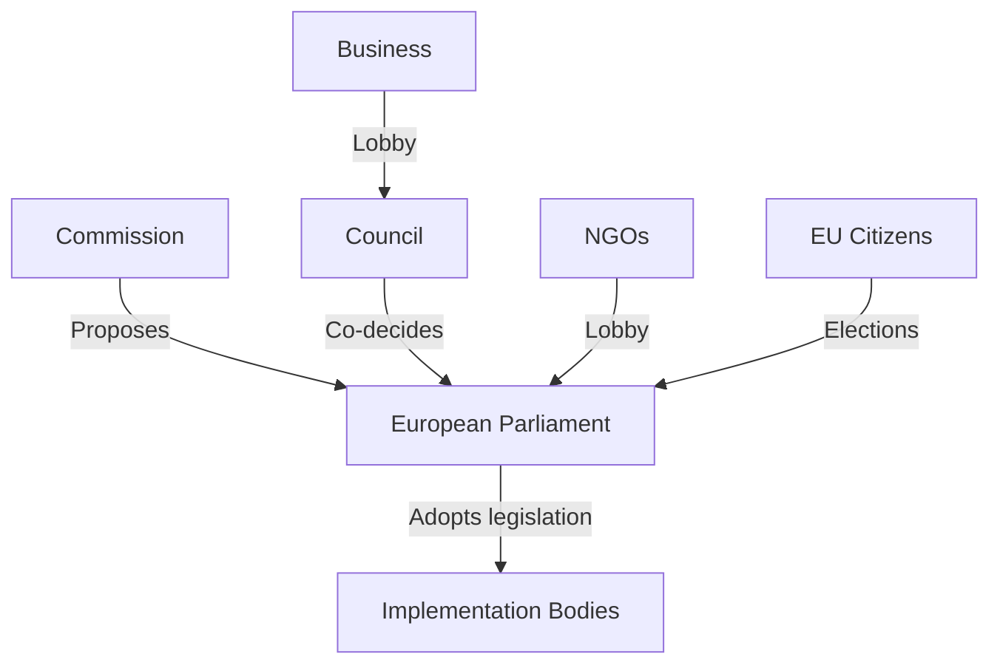

# Stakeholder Map — EU Parliament Propositions (May 2026)
**Date**: 2026-05-25 | **Framework**: Multi-Actor Stakeholder Analysis | **Admiralty Grade**: B2

## Overview

This stakeholder map identifies principal actors, their interests, positions, and influence vectors relevant to the legislative propositions adopted or under discussion in the EP10 May 2026 session.

---

## Tier 1: Legislative Principals

### 1.1 European People's Party (EPP) — ~188 seats

**Core Interests**:
- Maintain legislative majority anchor position
- Balance industry/competitiveness concerns with climate obligations
- Manage internal tensions between CDU/CSU-aligned "moderates" and CEE/Southern "sovereignists"
- Position as responsible centre-right for 2029 election

**Position on Key Files**:
- MSR/ETS2: Supported with amendments (longer phase-in, enhanced social compensation)
- Chemical Simplification: Strong advocate (business-friendly)
- Uzbekistan EPCA: Supported (geopolitical engagement; trade diversification)
- AI-Trade Strategy: Supported (digital economy growth narrative)
- Afghanistan resolution: Supported (values-based foreign policy)

**Influence**: Veto-equivalent; no major file passes without EPP support.

**Internal Stress Points**: 
Hungarian MEPs (Fidesz now in Patriots, not EPP) no longer a constraint. But Austrian (ÖVP) and Italian (FdI-adjacent EPP MEPs) create periodic friction on migration/rule-of-law files. German CDU/CSU MEPs are the internal power centre.

---

### 1.2 Progressive Alliance of Socialists and Democrats (S&D) — ~136 seats

**Core Interests**:
- Maintain worker rights and social protection floor
- Ensure Green Deal environmental ambition not diluted beyond acceptable threshold
- Human rights conditionality in external agreements
- Democratic rule-of-law as non-negotiable (Hungary, Poland watch)

**Position on Key Files**:
- MSR/ETS2: Strong advocate; pushed for ambitious ETS2 timeline
- Uzbekistan EPCA: Reluctant yes (conditionality concerns partially addressed)
- AI-Trade: Supportive with caveats on labour rights and data protection
- Afghanistan urgency: Co-sponsor
- Corruption Directive: Primary driver (LIBE committee rapporteur from S&D)

**Influence**: Essential for majority on social, environment, and rights-based files. S&D's veto threat is credible on extreme proposals but has not been exercised in 2025–26.

**Forward Alignment**: S&D-Greens coordination on environmental files is stable. S&D-Left convergence on social files is occasional but not systematic.

---

### 1.3 Renew Europe (formerly ALDE) — ~77 seats

**Core Interests**:
- Liberal market economy with strong rule of law
- Digital innovation (pro-innovation AI regulation)
- Atlanticist foreign policy (US-EU relations, NATO compatibility)
- Pro-European federalist agenda (EU sovereignty, enlargement)

**Position on Key Files**:
- AI-Trade Strategy: Co-sponsor; strong pro-innovation framing
- Uzbekistan EPCA: Supporter (geopolitical diversification narrative)
- DMA Enforcement: Moderate position (enforcement yes, but "proportionate")
- MSR/ETS2: Supported; Renew is the "bridge" between EPP and S&D on climate files

**Influence**: Swing vote on digital, trade, and foreign policy files. Renew's position often determines whether EPP moves left or right on contested files.

---

### 1.4 European Conservatives and Reformists (ECR) — ~78 seats

**Core Interests**:
- National sovereignty preservation
- Trade and industrial competitiveness
- Sceptical of EU supranationalism but engaged on defence/security
- Meloni (Fratelli d'Italia) as dominant internal force

**Position on Key Files**:
- Canada SAFE Instrument: Supported (transatlantic defence cooperation)
- Uzbekistan EPCA: Conditionally supported (trade diversification)
- MSR/ETS2: Opposed or abstained (regulatory burden)
- Corruption Directive: Mixed (sovereignty concerns vs. anti-corruption principle)
- AI-Trade: Supported (competitiveness framing)

**Influence**: Provides majority insurance on trade/defence files; creates right-of-EPP pressure on regulation. Not in governing coalition but de facto coalition partner on selected files.

---

### 1.5 Greens/EFA — ~53 seats

**Core Interests**:
- Ambitious climate and biodiversity legislation
- Human rights and democratic values in external relations
- Digital rights and privacy
- Federalist EU reform

**Position on Key Files**:
- Forest Reproductive Material: Strongly supported (biodiversity-positive)
- MSR/ETS2: Strong advocate; concerned about EPP amendments softening ambition
- Uzbekistan EPCA: Opposed or abstained (human rights conditionality insufficient)
- Afghanistan urgency: Co-sponsor

**Influence**: Swing vote on environmental files; providing "left flank" critique that often moves S&D toward more ambitious positions.

---

## Tier 2: External Stakeholders

### 2.1 European Commission

**Position**: Legislative co-initiator; has proposals pending on AI Liability Directive, Soil Health Law, and Packaging Regulation. Commission's DG TRADE drove Uzbekistan EPCA; DG ENV drove MSR extension.

**Influence**: Monopoly on legislative initiative (Art. 17 TEU); Commission can "hold" files by delaying proposals. However, EP resolutions (AI-Trade, DMA enforcement) create political pressure to act.

**Key Personalities**: Commission President (EPP-aligned); Trade Commissioner (DG TRADE); Climate Commissioner (DG CLIMA). All three are referenced by their portfolios' adopted texts in May 2026.

---

### 2.2 Council of the EU / Member State Governments

**Germany (SPD-CDU coalition post-2025 elections)**:
- Interest: Competitiveness (chemical, automotive); measured climate ambition
- Position: Supported MSR with amendments; cautious on ETS2 pace

**France (Macron/centrist)**:
- Interest: Digital sovereignty; nuclear energy status in taxonomy; agricultural protection
- Position: Supported AI-Trade strategy; cautious on Mercosur (agricultural competition)

**Poland (pro-EU government since 2023)**:
- Interest: Cohesion funding; Ukraine solidarity; EU enlargement
- Position: Supported Uzbekistan EPCA; championed Ukraine Claims Commission

**Hungary (Orbán)**:
- Interest: EPCA conditionality minimisation; sovereignty protection
- Position: Opposed or abstained on rights-based files; supported Ukraine Claims Commission (under pressure)

---

### 2.3 Uzbekistan Government (Mirziyoyev Administration)

**Interests**: Trade access, investment facilitation, EU geopolitical endorsement, human rights conditionality minimisation
**Assessment** [WEP: LIKELY, 65%]: Uzbekistan will provisionally apply EPCA ahead of full ratification, providing immediate trade benefits. Reform trajectory is genuine but incremental; European Parliament's rights conditionality is not expected to trigger formal suspension.

---

### 2.4 Industry and Civil Society

**European Chemical Industry (Cefic)**:
- Position: Strongly supported chemical simplification; relief bill welcomed
- Influence: Lobbied EPP and S&D ENVI committee members extensively

**Climate Action Network Europe**:
- Position: Supported MSR extension but concerned about EPP amendments
- Influence: Provided technical input to Greens and S&D rapporteurs

**Digital Europe (industry)**:
- Position: Supported AI-Trade resolution but opposed DMA enforcement pressure on specific companies
- Influence: Engaged with Renew and EPP IMCO members

**Human Rights Watch / Amnesty International**:
- Position: Critical of Uzbekistan EPCA conditionality adequacy; full support for Afghanistan resolution
- Influence: Contributed to S&D and Greens committee positions; public campaign during AFET deliberations

---

## Tier 3: Cross-Cutting Analytical Dimensions

### Power Balance Assessment

| Actor | Legislative Veto | Agenda-Setting | Coalition Leadership |
|-------|-----------------|---------------|---------------------|
| EPP | Yes | High | Primary |
| S&D | Partial | High | Secondary |
| Renew | Partial | Medium | Swing |
| ECR | No | Medium | External support |
| Greens | No | Medium | Pressure function |
| Commission | Initiator | High | External |

### Coalition Stress Indicators (Next 90 Days)

- **Packaging Regulation** (coming to plenary): EPP-S&D-Renew coalition will face ECR/Patriots opposition + potential left-Greens pressure for more ambition
- **AI Liability Directive** (in committee): Renew vs. Left/Greens tension on liability thresholds
- **2027 MFF** (pre-negotiation): Budget negotiations create cross-group competition for priorities
- **US tariff response**: If US escalates tariffs → emergency trade legislation; all groups will support defensive measures (rare unanimity signal)

