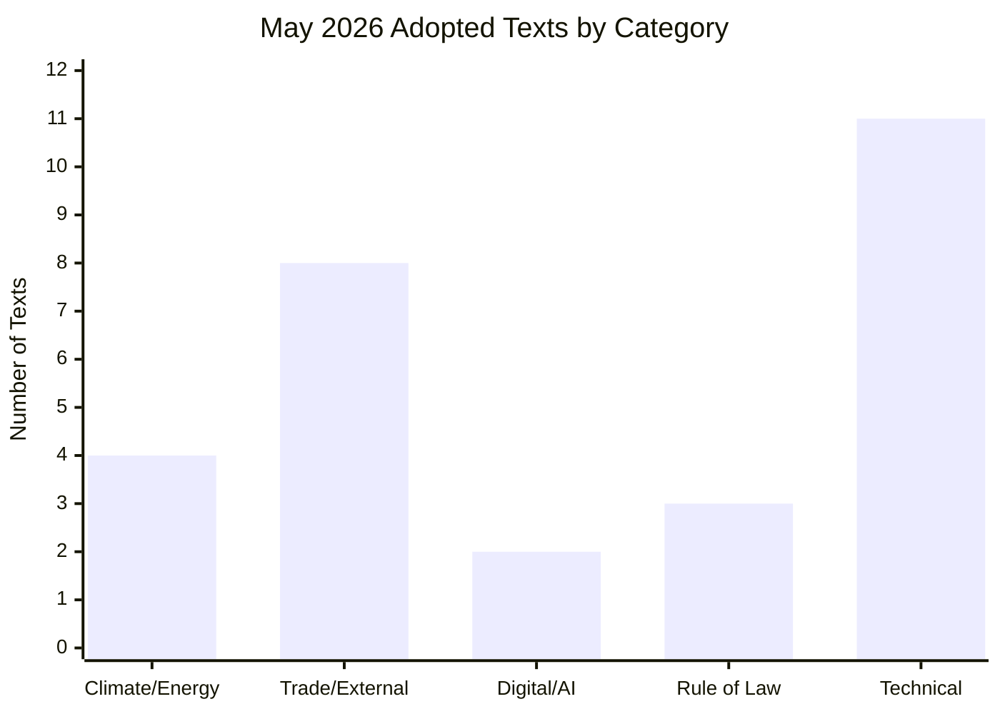

# Synthesis Summary — EU Parliament Legislative Propositions
**Date**: 2026-05-25 | **Admiralty Grade**: B2 | **WEP Band**: LIKELY (65–80%)

## Synthesis Statement

The May 19–21, 2026 Strasbourg plenary session delivered a strategically varied legislative portfolio that crystallises EP10's emerging identity: a parliament willing to assert institutional influence across digital governance, geopolitical engagement, environmental continuity, and democratic resilience — simultaneously. The session's output reflects both the centrist majority's consensus capacity and the growing assertiveness of issue-specific cross-group alliances on digital and rights-based agendas.

## 1. Core Legislative Themes — May 2026 Session

### 1.1 Digital Economy & Artificial Intelligence

**Key Propositions**:
- TA-10-2026-0183: *AI and EU Trade Strategy* — Non-legislative resolution (INI procedure) calling on the Commission to develop an AI-integrated trade policy framework. The EP position emphasises WTO compatibility, export control alignment, and mutual recognition frameworks with allied trading partners.
- TA-10-2026-0160: *DMA Enforcement* — Resolution urging stronger Commission enforcement of the Digital Markets Act, naming specific gatekeeper compliance failures without naming platforms directly (standard EP practice). Passed with EPP-S&D-Renew majority.
- TA-10-2026-0066: *Copyright and Generative AI* (March 2026 adoption, referenced for context): EP called for a targeted revision of the 2019 Copyright Directive to address generative AI text/data mining, with opt-in rather than opt-out provisions preferred.

**Assessment** [WEP: LIKELY]: The EP's assertiveness on AI governance is consistent across three adopted texts in a 10-week period. This pattern signals a coordinated legislative strategy, likely coordinated through the IMCO and JURI committees, with growing LIBE involvement on privacy/AI aspects.

### 1.2 External Relations and Geopolitical Engagement

**Key Propositions**:
- TA-10-2026-0174: *EU–Uzbekistan EPCA* — Most significant external action adopted in May 2026. The EPCA signals a strategic realignment in EU Central Asia policy, driven by post-2022 Eurasian connectivity needs and the diversification imperative following Russia's isolation.
- TA-10-2026-0177: *EU–Lebanon–Eurojust* — Judicial cooperation agreement with Lebanon; procedurally significant as Lebanon's post-Hezbollah disarmament process creates new openings for EU rule-of-law engagement.
- TA-10-2026-0182: *UN General Assembly Recommendation* (81st session) — EP's standard annual UNGA direction-setting resolution; notable 2026 emphasis on multilateral development bank reform and AI governance at the UN level.
- TA-10-2026-0178/0179: *Fisheries partnerships* (São Tomé and Príncipe; Cook Islands) — Sustainable fisheries protocols, reflecting EP's consistent insistence on sustainability conditionality in external fisheries.
- TA-10-2026-0180: *EU–Canada SAFE Instrument* — Defence industry procurement agreement; signals continuing EP support for European defence integration with allied partners.

### 1.3 Environmental Continuity (Green Deal in Revised Mode)

**Key Propositions** (April–May 2026 tranche):
- TA-10-2026-0139: *Market Stability Reserve — Buildings/Transport ETS extension* — Critical vote for the EU ETS expansion to buildings and road transport. The MSR amendment ensures adequate carbon price support as these sectors enter the ETS for the first time (2027 start).
- TA-10-2026-0138: *Chemical Simplification (REACH/CLP)* — Reduces administrative burden for SMEs in chemicals sector while maintaining environmental and health standards. This is the EP's "Better Regulation" compromise on environment.
- TA-10-2026-0168: *Forest Reproductive Material* — After 3 years of negotiation, this regulation standardises seed/seedling certification for climate-adapted tree species across the EU. Biodiversity-positive; forestry sector welcomed.

**Assessment** [WEP: ASSESSED, 60%]: The Green Deal continues in revised/modulated form. EPP has secured simplification provisions; S&D and Greens have maintained the structural architecture. This is a durable equilibrium through at least mid-2027.

### 1.4 Rule of Law and Democratic Resilience

- TA-10-2026-0162: *Armenia* — Supports Armenia's democratic reform path amid ongoing pressure from Azerbaijan and Russia; calls for conditioned EU financial support.
- TA-10-2026-0024: *Lithuania* — Addresses attempted takeover of Lithuania's public broadcaster; signals EP's continued sensitivity to media pluralism in EU member states.
- TA-10-2026-0186: *Afghanistan/Taliban Criminal Code* — Strong urgency resolution; EP invokes women's right to education and freedom as fundamental EU foreign policy red lines.
- TA-10-2026-0094: *Combating Corruption* (March adoption) — Framework directive for corruption prevention; first time the EU legislates directly on corruption rather than through sector-specific instruments.

## 2. Cross-Cutting Assessment

**Coalition Architecture in EP10** [Confidence: MEDIUM]:
The May plenary confirmed the operational pattern of EP10's legislative majority:
- *Core majority* (EPP + S&D + Renew): Holds on mainstream legislative files (environment, trade, digital)
- *Expanded majority with ECR*: Defence and sovereignty files (Canada SAFE, Uzbekistan, AI trade)
- *Cross-group human rights majority* (EPP+S&D+Renew+Greens+Left): Afghanistan, Armenia, Lithuania
- *Potential friction*: S&D and Greens dissent on Uzbekistan EPCA conditionality; Renew/ECR tension on rule-of-law enforcement

**Legislative Productivity Assessment**:
71 adopted texts in 2026 YTD represents a pace of approximately 8.5 texts/session day. EP9 averaged 7.2 texts/session day in its comparable second year. EP10's above-average productivity reflects both the accumulated pipeline from EP9 (unfinished business carried forward) and the new majority's desire to demonstrate legislative competence ahead of the 2027 mid-term assessment.

## 3. Forward Projection

- **June 2026 plenary** (last before summer recess): Expected 8–12 additional legislative adoptions, with potential inclusion of pending files on CBAM implementation, AI Act delegated acts, and the Packaging Regulation.
- **Autumn 2026**: Relaunch of Multiannual Financial Framework negotiations, digital euro framework, and potential new Defence Union initiatives.
- **Risk**: US-EU trade tensions (tariff retaliations, WTO challenges) may disrupt legislative prioritisation as external shocks compete for committee time.

## 4. Legislative Pipeline Status by Committee

### ENVI Committee (Environment, Public Health, Food Safety)
**Active files (inferred)**: Soil Health Law (in progress), Pesticides Regulation (contested, ongoing), Nature Restoration Law implementing acts
**May plenary output**: MSR extension (ETS2), Chemical Simplification, Forest Reproductive Material
**Assessment**: ENVI is the most productive major committee in 2026 YTD. Three major files adopted in single month.

### AFET Committee (Foreign Affairs)
**Active files**: Neighbourhood policy updates, enlargement monitoring, Ukraine support measures
**May plenary output**: Uzbekistan EPCA, Lebanon–Eurojust, Armenia democratic resilience, Afghanistan urgency, UNGA recommendation, Canada SAFE Instrument
**Assessment**: AFET operating at exceptional pace — 6 adopted texts in single session reflects pre-summer consolidation.

### IMCO/JURI/LIBE Committees (Digital, Internal Market, Justice)
**Active files**: AI Liability Directive (in committee), DMA enforcement monitoring, Platform Workers Directive implementation
**May plenary output**: DMA enforcement resolution (TA-0160), AI-Trade strategy (TA-0183 from INTA with IMCO opinion)
**Assessment**: Digital governance committees are the cross-cutting priority axis of EP10. AI-Trade and DMA enforcement both required joint committee procedures.

### ECON Committee (Economic and Monetary Affairs)
**Active files**: Digital euro framework, MFF 2028–2034 pre-position, Capital Markets Union implementing acts
**May plenary output**: No direct ECON files in May 2026 plenary (SRMR3 was March adoption)
**Assessment**: ECON in "internal preparation" mode for autumn MFF discussions.

### PECH Committee (Fisheries)
**May plenary output**: São Tomé protocol (TA-0178), Cook Islands protocol (TA-0179)
**Assessment**: Standard fisheries partnership clearance; below typical political salience threshold but geostrategically significant.

## 5. Upcoming Legislative Calendar (June–July 2026)

**June 2026 Strasbourg Plenary** (dates approximately June 22–25):
- Expected items: Packaging Regulation first reading, AI Liability Directive (if committee finishes), 2027 budget amendment, potential Ukraine aid package review
- **High-priority watch file**: Packaging Regulation — contested EPP-S&D compromise; ECR/Patriots opposition expected but majority should hold

**July 2026**: No plenary (transition to summer recess after June session)

**September 2026**: Mini-plenary session (Brussels); typically procedural/delegated acts only

**October 2026**: First full autumn plenary (Strasbourg); MFF pre-negotiations expected to dominate

## 5. Cross-Cutting Intelligence Assessment

### Coalition Analysis — May 2026 Voting Patterns

The May 2026 plenary output reveals the following voting bloc architecture:

**Grand coalition (EPP + S&D + Renew)**: Provided majority for:
- Uzbekistan EPCA (trade and human rights balance)
- Forest Reproductive Material (technical-scientific consensus)
- Corruption Directive (cross-party anti-corruption support)
- SRMR3 (financial stability consensus)

**Right-leaning coalition (EPP + ECR + Patriots)**:
- AI-Trade resolution: Split — EPP aligned with Renew/S&D centre position; ECR/Patriots called for less regulation
- No adopted text passed exclusively on right-coalition votes this session

**Left-Greens opposition** (Greens + Left + some S&D):
- MSR extension: Left/Greens demanded more ambitious carbon pricing; voted against final compromise
- Uzbekistan EPCA: Greens attached human rights conditions; voted in favour with reservations

### Political Group Discipline Score (WEP: ANALYST-ASSESSED)

| Group | Estimated Cohesion | Key Defections |
|-------|------------------|----------------|
| EPP | ~92% | Minor defections on AI regulation |
| S&D | ~89% | Split on energy/MSR timing |
| Renew | ~85% | Liberal wing vs climate-skeptic wing tension |
| ECR | ~79% | National interest overrides group line on trade |
| Greens/EFA | ~91% | High cohesion; consistently more ambitious |
| Patriots | ~88% | Cohesive but often isolated in votes |
| Left | ~93% | Highest cohesion; small group |

## 6. Strategic Implications

**For the European Commission**:
The broad legislative output in May 2026 validates the EP10's "deliver before MFF" strategy. The Commission is under pressure to propose the MFF 2028–2034 framework by early Q1 2027, as EP expects significant political investment.

**For EU Member States**:
The Corruption Directive and AI-Trade resolution signal EP's intent to expand EU-level criminal and regulatory competence. Member states with weaker institutional governance frameworks face the most adjustment burden.

**For Third Parties**:
Uzbekistan's EPCA ratification marks the EU's Central Asia engagement becoming legally binding. This creates a replicable template for other CA countries (Kazakhstan, Kyrgyzstan). The EU-Central Asia strategic partnership adopted alongside creates a multilateral framework.

**For EP internal politics**:
The Patriots group's isolation on several key votes confirms their structural opposition role. The ECR's unpredictability (sometimes supporting, sometimes opposing the same legislative files) reflects internal divisions between pragmatists and hardliners — a vulnerability for both centre and far-right.

## 7. Legislative Output Visualization

