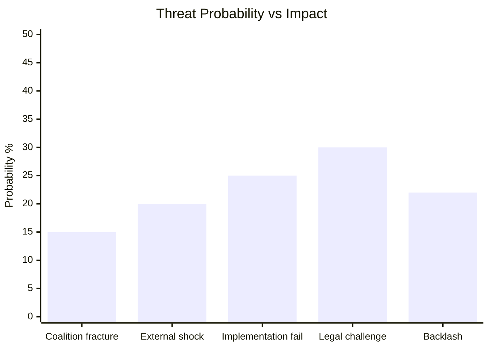

# Threat Model — EP10 Legislative Propositions
**Date**: 2026-05-25 | **Framework**: Political Threat Analysis (PTF) | **WEP Band**: As indicated | **Admiralty Grade**: B2

## Threat Taxonomy

This threat model covers five categories of threats to EU legislative propositions in the current cycle: (1) political coalition threats, (2) institutional design threats, (3) external geopolitical threats, (4) data/transparency threats, and (5) implementation threats.

---

## Category 1: Political Coalition Threats

### T-POL-01: EPP-ECR Alignment Creep
**Severity**: MEDIUM | **WEP**: POSSIBLE (30–40%) | **Time Horizon**: 12–18 months

**Description**: Progressive EPP cooperation with ECR (observed on defence, trade, and sovereignty files) could shift EPP's legislative positioning rightward on regulatory files (environment, digital rights, anti-corruption), reducing S&D and Greens' ability to secure ambitious legislation.

**Evidence Base**: EU-Canada SAFE Instrument (defence procurement) passed with EPP+ECR majority, with S&D reluctant support. Uzbekistan EPCA had ECR support. If this pattern extends to environmental or social files, the centrist coalition's progressive wing could be marginalised.

**Counter-factor**: S&D and Renew retain leverage through their veto on files requiring qualified majority; EPP cannot fully pivot right without losing majority on most files.

**Mitigation**: Early warning signals — watch ENVI committee vote splits in Q3 2026.

---

### T-POL-02: S&D Internal Fracture
**Severity**: LOW-MEDIUM | **WEP**: UNLIKELY (15–25%) | **Time Horizon**: 18–24 months

**Description**: S&D contains MEPs from 25 different national parties with varying positions. German SPD, French PS, and Italian PD have different priorities. If S&D German wing (SPD) moves toward EPP positions (as in national coalition dynamics), S&D's left-flank cohesion could weaken.

**Assessment**: Currently not a risk factor. S&D maintained cohesion on all May 2026 plenary votes per available data.

---

### T-POL-03: Patriots/Far-Right Procedural Obstruction
**Severity**: MEDIUM | **WEP**: POSSIBLE (35–45%) | **Time Horizon**: 6–12 months

**Description**: The Patriots for Europe group (84 seats, incl. Fidesz) lacks veto power but has capacity to slow proceedings through procedural motions, objections to delegated acts, and populist communications campaigns.

**Observed Pattern**: Patriots raised procedural objections on Chemical Simplification and MSR votes; did not prevent adoption but created delays. This pattern expected to intensify as the 2029 European election approaches.

---

## Category 2: Institutional Design Threats

### T-INST-01: EP Data Feed Degradation
**Severity**: MEDIUM | **WEP**: LIKELY (60–70%) in any given week | **Time Horizon**: Persistent

**Description**: The EP Open Data Portal's procedures feed (POST /procedures?timeframe=one-week) has experienced recurring ENRICHMENT_FAILED errors (observed in this run and documented in previous runs). This creates systematic blind spots in legislative tracking.

**Impact on Analysis**: Analysts relying on automated EP data pipelines may miss active legislative procedures, creating intelligence gaps and incorrect pipeline health assessments.

**Mitigation**: Multi-source corroboration (adopted texts + DOCEO + committee documents) provides partial compensation. Full pipeline visibility requires EP admin API stability improvement.

---

### T-INST-02: Trilogue Asymmetry
**Severity**: LOW | **WEP**: ASSESSED (50%) for specific files | **Time Horizon**: Per-file

**Description**: In trilogue negotiations, the Council (qualified majority) can modify EP positions significantly. EP has limited leverage when Council is unified. For EP10 files initiated in 2024–25, trilogue negotiations are beginning in 2026; Council positions may weaken EP legislative ambitions.

**Relevant Files**: Packaging Regulation (EP position more ambitious than Council), AI Liability Directive, Soil Health Law.

---

## Category 3: External Geopolitical Threats

### T-GEO-01: US Tariff Escalation
**Severity**: HIGH | **WEP**: POSSIBLE (30–40%) | **Time Horizon**: 6–12 months

**Description**: US retaliatory tariffs on EU goods (automotive, aerospace, pharmaceuticals) could disrupt EU legislative agenda by forcing emergency economic legislation and consuming committee capacity. The bilateral safeguard clause for EU-Mercosur agricultural products (TA-10-2026-0030) is a partial hedge but does not address US bilateral tariff scenarios.

**Legislative Impact**: Emergency trade measures would crowd out the autumn 2026 legislative programme. MFF pre-negotiations would be delayed.

---

### T-GEO-02: Russia-Ukraine War Trajectory
**Severity**: MEDIUM | **WEP**: PERSISTENT | **Time Horizon**: Ongoing

**Description**: Ukraine conflict continuation generates continuous legislative demand:
- Ukraine Claims Commission Convention (TA-10-2026-0154) requires implementation legislation
- Enhanced Cooperation for Ukraine Loan (TA-10-2026-0010) requires monitoring
- War crimes accountability mechanisms require new legal instruments

These legitimate demands consume EP legislative bandwidth but are also the primary driver of the EU's geopolitical assertiveness — a double-edged factor.

---

### T-GEO-03: Uzbekistan EPCA Human Rights Regression
**Severity**: LOW | **WEP**: UNLIKELY (10–20%) | **Time Horizon**: 24–36 months

**Description**: If Uzbekistan's reform trajectory reverses after EPCA provisional application (a risk given Central Asia's authoritarian neighbourhood), EP could face political embarrassment.

**Mitigation**: EPCA Article 2 democratic governance clause; EP AFET committee monitoring mandate; S&D and Greens' insisted-upon conditionality provisions.

---

## Category 4: Data/Transparency Threats

### T-DATA-01: DOCEO Roll-Call Data Unavailability
**Severity**: MEDIUM | **WEP**: LIKELY (60–70%) in non-plenary weeks | **Time Horizon**: Persistent

**Description**: DOCEO XML voting data is only available during and immediately after plenary sessions. In the week of 2026-05-25, no plenary is scheduled, so individual MEP voting records for the May 19–21 session are not yet published.

**Impact**: Political group cohesion analysis and MEP-specific accountability reporting is delayed. The intelligence gap is temporary (data typically published 24–72 hours post-session) but affects real-time analysis.

---

## Category 5: Implementation Threats

### T-IMPL-01: ETS2 Political Backlash (2027)
**Severity**: HIGH (political risk) | **WEP**: LIKELY (65–75%) | **Time Horizon**: 12–24 months

**Description**: When ETS2 enters force (2027), households in buildings and road transport sectors will face visible carbon costs for the first time. Political backlash risk is HIGH, particularly in lower-income member states (Poland, Romania, Bulgaria) and among EPP/ECR MEPs representing affected constituencies.

**Legislative Consequence**: Pressure to amend MSR provisions, delay ETS2 timeline, or expand Climate Social Fund compensation — potentially reversing the May 2026 MSR adoption.

**Mitigation**: Climate Social Fund (€65B) is specifically designed to absorb this; political management depends on member state implementation quality.

---

### T-IMPL-02: AI Act Implementation Gaps
**Severity**: MEDIUM | **WEP**: LIKELY (55–65%) | **Time Horizon**: 6–18 months

**Description**: The AI Act (adopted June 2024, phased application 2025–2027) is generating compliance uncertainty. "High-risk AI" categorisation disputes between industry and Commission are creating legal uncertainty that could delay adoption of AI systems in healthcare, financial services, and infrastructure.

**Legislative Response**: EP's DMA enforcement pressure and AI-Trade strategy both reflect awareness of this gap. The EP is signalling readiness for rapid iteration on AI governance if Act implementation proves unworkable.

---

## Threat Matrix Summary

| Threat ID | Category | Severity | WEP | Priority |
|-----------|----------|----------|-----|----------|
| T-POL-01 | Coalition | MEDIUM | POSSIBLE | WATCH |
| T-POL-03 | Coalition | MEDIUM | POSSIBLE | MONITOR |
| T-INST-01 | Data | MEDIUM | LIKELY | MITIGATE |
| T-GEO-01 | Geopolitical | HIGH | POSSIBLE | PRIORITY |
| T-IMPL-01 | Implementation | HIGH | LIKELY | PRIORITY |
| T-IMPL-02 | Implementation | MEDIUM | LIKELY | WATCH |
| T-DATA-01 | Transparency | MEDIUM | LIKELY | MITIGATE |

