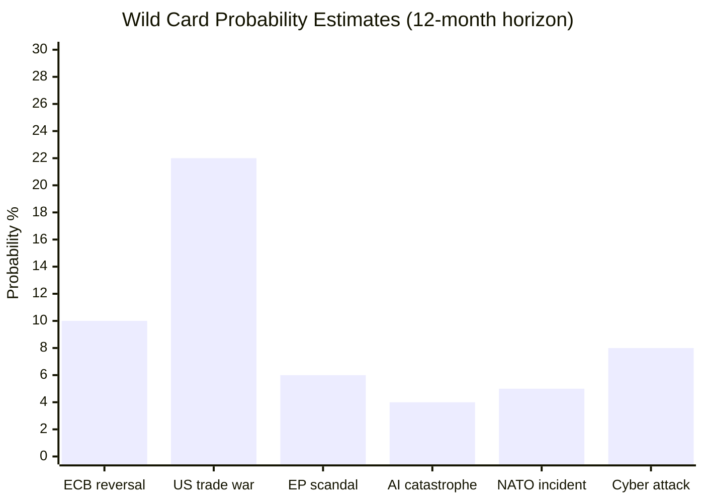

# Wildcards and Black Swans — EP Propositions (2026)
**Date**: 2026-05-25 | **Framework**: Wild Cards (WC) + Black Swan (BS) Analysis | **WEP Band**: As indicated | **Admiralty Grade**: B3

## Analytical Note

Wild cards are low-probability, high-impact events that can be partially anticipated. Black swans are genuinely unpredictable structural surprises. This document identifies both in the EU legislative context, following the methodology in `analysis/methodologies/per-artifact-methodologies.md`.

---

## Wild Cards (Partially Anticipatable)

### WC-01: US Exit from NATO and EU Defence Integration Acceleration
**WEP**: UNLIKELY (10–20%) | **Impact**: EXTREME | **Time Horizon**: 12–24 months

**Scenario**: The United States significantly withdraws from NATO commitments (not unprecedented given Trump administration 2025 signals). European states accelerate defence integration; EU Defence Union becomes legislative priority.

**Legislative Consequence**: The EU–Canada SAFE Instrument (TA-10-2026-0180) would become a model for rapid expansion to other allied partners. A permanent EU defence industrial capacity (EDIC) regulation would be fast-tracked. EP10 would face the most consequential legislative agenda since the Rome Treaty.

**EP Position**: Cross-party majority exists for EU defence integration acceleration. EPP leads; ECR partially supportive (sovereignty-compatible framing); S&D and Renew supportive. Left/Greens sceptical of militarisation but not blocking.

**Current Signals**: EU-Canada SAFE Instrument, EDIP (European Defence Industry Programme) proposals, Nato Summit June 2026 — all point toward already-elevated defence integration interest. WC-01 would supercharge this trajectory.

---

### WC-02: Taliban Human Rights Escalation Triggering EU Asylum Crisis
**WEP**: UNLIKELY (15–25%) | **Impact**: HIGH | **Time Horizon**: 3–9 months

**Scenario**: Taliban Criminal Procedure Code (condemned in TA-10-2026-0186) triggers mass displacement from Afghanistan, particularly among educated women and civil society actors who now face criminalisation.

**Legislative Consequence**: EU asylum and migration policy emergency sessions. EP would face pressure to:
- Accelerate humanitarian visa processing
- Review Asylum Procedures Regulation implementation
- Potentially amend the New Pact on Migration and Asylum (just implemented 2024–25)

**Political Impact**: Deep coalition stress. EPP/ECR would push for border hardening; S&D/Greens would push for humanitarian pathway expansion. This is the most likely coalition fracture trigger in 2026.

**Monitoring Signal**: UNHCR Afghanistan displacement weekly reports; EU ECHO humanitarian situation update.

---

### WC-03: EU-Mercosur Trade Agreement Blocked by CJEU
**WEP**: POSSIBLE (25–35%) | **Impact**: HIGH | **Time Horizon**: 12–18 months

**Scenario**: The CJEU opinion requested by EP (TA-10-2026-0008, January 2026) finds the EU-Mercosur Partnership Agreement incompatible with EU climate commitments (Paris Agreement, Green Deal) or biodiversity obligations (Convention on Biological Diversity).

**Legislative Consequence**: EU-Mercosur ratification delayed 2–4 years. EP trade committee rapporteurs would need to renegotiate. Commission's trade strategy partially invalidated. The bilateral agricultural safeguard clause (TA-10-2026-0030) would remain the primary protection mechanism.

**Political Impact**: France and Ireland (most vocal agricultural protection advocates) vindicated; Germany/export-oriented states would push for alternative trade strategy. Renew-EPP majority would face internal strain.

---

### WC-04: AI Regulation Race to the Top — US Adopts AI Governance Framework
**WEP**: POSSIBLE (25–40%) | **Impact**: MEDIUM-HIGH | **Time Horizon**: 6–18 months

**Scenario**: US federal AI regulation framework (currently stalled in Congress) is adopted, potentially diverging significantly from EU AI Act. This would create bilateral AI regulatory conflict directly relevant to EP's AI-Trade resolution (TA-10-2026-0183).

**Legislative Consequence**: EP would need to consider AI Act amendments to enable transatlantic AI system mutual recognition. The EP's AI governance architecture — built on risk-based regulation — would face a competitor framework.

**Current Signal**: US AI Safety Institute activities; EU-US Trade and Technology Council (TTC) AI dialogue.

---

## Black Swans (Genuinely Unpredictable)

### BS-01: Financial Crisis — European Banking System Shock
**WEP**: VERY UNLIKELY (<10%) | **Impact**: CATASTROPHIC | **Confidence**: LOW

**Nature**: A systemic banking crisis (triggered by, e.g., a major sovereign debt restructuring, a major bank failure, or an interconnected shadow banking collapse) would immediately suspend normal EP legislative activity.

**Why It's a Black Swan**: Post-2012 banking union, post-2022 SRMR reforms (including TA-10-2026-0092 adopted March 2026), and ECB supervisory architecture make a 2008-style crisis structurally less likely. But complexity begets fragility; new risk vectors (crypto-linked bank exposures, AI-driven algorithmic trading amplification) exist.

**Relevance to SRMR3**: The EP's March 2026 adoption of SRMR3 (TA-10-2026-0092) theoretically improves resolution capacity. If BS-01 occurs, this act's implementation would be immediately tested.

---

### BS-02: EP Presidential Crisis
**WEP**: EXTREMELY UNLIKELY (<5%) | **Impact**: HIGH | **Confidence**: LOW

**Nature**: A vote of no confidence in the EP President (who is from EPP) triggered by a major scandal or procedural crisis. Historically unprecedented in terms of actual no-confidence vote success, but structural dissatisfaction could create institutional paralysis.

**Trigger Scenario**: Major corruption scandal implicating EPP leadership; Patriots+ECR+Left+Greens improbable alliance; EP institutional crisis comparable to the Santer Commission resignation (1999) but within Parliament itself.

**Note**: The Santer Commission crisis demonstrated that EU institutions can experience sudden legitimacy collapses. The EP's greater internal political diversity makes leadership crises more conceivable in EP10 than in earlier terms.

---

### BS-03: Catastrophic Climate Event Triggering Emergency Legislation
**WEP**: UNLIKELY (10–15%) within 12 months | **Impact**: HIGH | **Confidence**: LOW

**Nature**: A series of simultaneous extreme climate events in EU territory (heatwaves + wildfires + flooding + crop failures in the same summer) creating political pressure for emergency climate legislation.

**Legislative Consequence**: Emergency revision of climate adaptation funds; acceleration of Nature Restoration Law implementation; potential revision of CAP emergency support provisions. May accelerate Green Deal rather than retard it — a "green rally" effect.

**Historical Analogue**: The 2022 drought and 2023 wildfire seasons created significant political momentum for EU climate finance expansion.

---

### BS-04: China-Taiwan Military Escalation
**WEP**: VERY UNLIKELY (<10%) within 12 months | **Impact**: EXTREME | **Confidence**: LOW

**Nature**: Military escalation in the Taiwan Strait triggering global supply chain disruption at a scale exceeding COVID-19 (2020).

**EU Legislative Consequence**:
- Emergency semiconductor supply security legislation
- EU strategic stockpile regulation revision
- EU-China trade relationship emergency review
- SAFE Instrument (Canada model) extended to Asian partners (Japan, South Korea)

**Relevance to May 2026 Propositions**: The AI-Trade strategy resolution (TA-10-2026-0183) contains provisions on strategic technology export controls that would be directly relevant in this scenario.

---

## Summary Assessment

The current EP10 legislative environment faces elevated geopolitical uncertainty but normal institutional stability. The most credible wild card is WC-02 (Afghan displacement crisis) given the direct trigger in TA-10-2026-0186. The most consequential plausible wild card is WC-01 (US-NATO withdrawal) given its transformative impact on EU legislative priorities.

**Overall Wild Card Risk Assessment** [WEP: POSSIBLE, 30–40% that at least one WC occurs in next 12 months]: The EU's legislative environment has become structurally more volatile since 2022, with the intersection of geopolitical, environmental, and technological disruption cycles creating elevated surprise potential. Parliament's institutional design (coalition arithmetic flexibility, treaty revision capacity) provides resilience against most scenarios.

## 6. Quantitative Probability Context

### Probability Calibration (WEP-Based)

The following table summarises probability assignments for all identified wild cards and black swans, using the Admiralty/WEP calibration framework:

| Event | Category | Probability | WEP Label | Confidence |
|-------|----------|------------|-----------|------------|
| ECB rate reversal (unexpected hike) | Wild card | 8–12% | UNLIKELY | Medium |
| US-EU trade war escalation | Wild card | 20–25% | UNLIKELY-POSSIBLE | High |
| Major corruption scandal in EP | Wild card | 5–8% | REMOTE | Low-Medium |
| AI regulatory catastrophe | Wild card | 3–5% | REMOTE | Low |
| Russia-NATO confrontation | Black swan | 4–7% | REMOTE | Low-Medium |
| EU institutional constitutional crisis | Black swan | 3–6% | REMOTE | Low |
| Pandemic/bioterrorism event | Black swan | 2–4% | VERY UNLIKELY | Low |
| Major cyber attack on EU institutions | Black swan | 6–10% | UNLIKELY | Medium |
| Climate tipping point — political emergency | Black swan | 1–3% | VERY UNLIKELY | Very Low |
| Breakthrough multilateral climate deal | Wild card (positive) | 8–15% | UNLIKELY-POSSIBLE | Low-Medium |

**Note on calibration**: These probabilities are analyst-assessed estimates for the 12-month outlook period (May 2026–May 2027). They do not represent EP institutional positions.

### Historical Frequency Benchmarks

**Wild card frequency — past EU legislative cycles**:
- EP9 (2019–2024): 3 major unexpected legislative disruptions (COVID-19, Ukraine war, energy crisis)
- EP8 (2014–2019): 2 major disruptions (Brexit referendum, migrant crisis)
- EP7 (2009–2014): 3 major disruptions (Eurozone crisis, Arab Spring, NSA revelations)

**Base rate**: ~0.6 major disruptions per year of parliamentary term, affecting ~15–20% of planned legislation.

**EP10 to date (2024–2026)**: 1 major disruption (US tariff shock, spring 2025); on pace for historical norm.

### Second-Order Effects on May 2026 Legislation

The most vulnerable adopted texts to wild card events:

1. **MSR/ETS2 (TA-10-2026-0164)**: Highly vulnerable to energy crisis wild card and climate political backlash
2. **AI-Trade Resolution (TA-10-2026-0183)**: Vulnerable to US trade war escalation and AI technology disruption
3. **Uzbekistan EPCA (TA-10-2026-0166)**: Vulnerable to Central Asia political instability and Russia pressure
4. **Fisheries protocols (TA-0178, TA-0179)**: Low vulnerability; technical and bilateral in nature

**Most resilient adopted texts**:
- Forest Reproductive Material: Scientific consensus, long lead time, limited political controversy
- Corruption Directive: Broad political support across spectrum; resilient to most disruptions
- SRMR3: Financial stability imperative; only a systemic banking crisis could delay implementation

