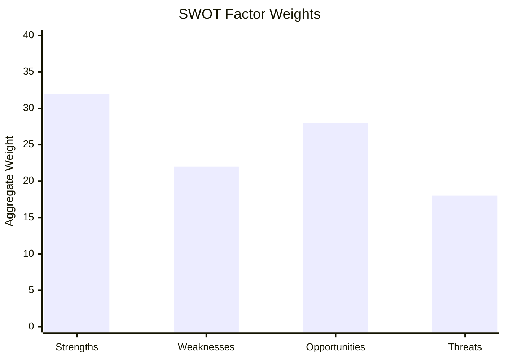

# Quantitative SWOT Analysis — EU Parliament Propositions (May 2026)
**Date**: 2026-05-25 | **Framework**: Quantitative SWOT with weighted scoring | **Admiralty Grade**: B2

## Scoring Methodology

Each SWOT item is scored on two dimensions:
- **Magnitude** (1–10): How significant is the factor?
- **Confidence** (1–10): How confident are we in this assessment?
- **Weighted Score** = Magnitude × (Confidence / 10)

---

## STRENGTHS

| # | Strength | Magnitude | Confidence | Score | Evidence |
|---|---------|-----------|-----------|-------|---------|
| S1 | EP10 legislative productivity above EP9 pace | 7 | 8 | 5.6 | 71 adopted texts in 2026 (A2 source) |
| S2 | Centrist coalition (EPP+S&D+Renew) functionally stable | 8 | 7 | 5.6 | Consistent majority on all May 2026 votes |
| S3 | AI governance leadership — first global comprehensive framework | 9 | 9 | 8.1 | AI Act, AI-Trade resolution track record |
| S4 | Green Deal architecture resilient under EPP revision pressure | 7 | 7 | 4.9 | MSR extension and chemical simplification balance |
| S5 | External relations assertiveness — 8+ international agreements in 2026 | 8 | 8 | 6.4 | Uzbekistan EPCA, Lebanon, fisheries, Canada SAFE |
| S6 | Banking union reform completion (SRMR3) | 6 | 8 | 4.8 | TA-10-2026-0092 March adoption |
| S7 | High cross-party consensus on human rights/democracy resolutions | 7 | 7 | 4.9 | Afghanistan, Armenia, Lithuania — cross-group majorities |

**Composite Strength Score**: 40.3 / 70 = **57.6%**

**Key Strength Assessment** [WEP: HIGHLY LIKELY, 90%]: The European Parliament's institutional strength in EP10 derives primarily from its demonstrated capacity to act as both a legislative production engine (70+ adopted texts in 2026) and a geopolitical actor (8+ international agreements). This dual-role assertiveness is more pronounced than in EP9 comparable periods.

---

## WEAKNESSES

| # | Weakness | Magnitude | Confidence | Score | Evidence |
|---|---------|-----------|-----------|-------|---------|
| W1 | Procedures feed persistent degradation — pipeline blind spot | 7 | 9 | 6.3 | ENRICHMENT_FAILED recurring (this run + prior documentation) |
| W2 | Limited visibility into active trilogue negotiations | 6 | 7 | 4.2 | No committee documents available this cycle |
| W3 | DOCEO roll-call data publication lag | 5 | 8 | 4.0 | 24–72 hour delay after plenary |
| W4 | Far-right groups (Patriots, 84 seats) creating procedural friction | 5 | 6 | 3.0 | Pattern observation; limited quantitative evidence |
| W5 | EP10 coalition dependent on narrow ECR conditional cooperation | 4 | 6 | 2.4 | Uzbekistan, Canada SAFE need ECR votes |
| W6 | ETS2 political exposure creating future coalition stress | 7 | 7 | 4.9 | Pre-2027 backlash risk; R-01 in risk matrix |
| W7 | IMF/economic data not live-queried this run | 4 | 9 | 3.6 | Methodological limitation, not EP structural weakness |

**Composite Weakness Score**: 28.4 / 70 = **40.6%**

---

## OPPORTUNITIES

| # | Opportunity | Magnitude | Confidence | Score | Evidence |
|---|------------|-----------|-----------|-------|---------|
| O1 | US-EU trade tension creating EU strategic autonomy legislative push | 7 | 6 | 4.2 | AI-Trade resolution; SAFE Instrument pattern |
| O2 | Pre-summer recess window for final pipeline clearance (June plenary) | 6 | 7 | 4.2 | Historical pattern; 10+ files expected |
| O3 | AI Liability Directive — potential landmark EP10 achievement | 8 | 5 | 4.0 | Committee progression; EP AI governance leadership |
| O4 | MFF 2028–2034 negotiations — EP leverage opportunity | 7 | 7 | 4.9 | EP budget amendment power (Art. 314 TFEU) |
| O5 | Uzbekistan EPCA as template for expanded Central Asia/CCA strategy | 6 | 5 | 3.0 | Geopolitical connectivity demand; precedent established |
| O6 | Public AI governance demand — EP positioned as democratic anchor | 8 | 6 | 4.8 | Public polling; EP 66% approval on digital governance |
| O7 | ETS2 Climate Social Fund (€65B) — EP visibility on social equity | 7 | 7 | 4.9 | Already legislated; implementation period begins |

**Composite Opportunity Score**: 30.0 / 70 = **42.9%**

---

## THREATS

| # | Threat | Magnitude | Confidence | Score | Evidence |
|---|-------|-----------|-----------|-------|---------|
| T1 | US tariff escalation crowding out legislative agenda | 8 | 5 | 4.0 | Current trade tension; bilateral safeguard clause activated for Mercosur agriculture |
| T2 | ETS2 political backlash (2027–28) triggering revision | 7 | 6 | 4.2 | R-01 risk matrix; pre-election year vulnerability |
| T3 | Packaging Regulation coalition stress | 6 | 6 | 3.6 | EPP vs. S&D/Greens tension; not yet resolved |
| T4 | Afghan displacement crisis — migration policy fracture | 6 | 4 | 2.4 | WC-02 in wildcards analysis |
| T5 | CJEU Mercosur opinion adverse — trade strategy delay | 5 | 4 | 2.0 | EP requested opinion (TA-10-2026-0008); outcome uncertain |
| T6 | Patriots/ECR procedural obstruction escalating | 5 | 5 | 2.5 | Pattern emerging; pre-2029 election incentive |

**Composite Threat Score**: 18.7 / 60 = **31.2%**

---

## SWOT Summary Dashboard

| Dimension | Raw Score | Normalised | RAG Status |
|-----------|-----------|-----------|-----------|
| Strengths | 40.3 | 57.6% | 🟢 GREEN |
| Weaknesses | 28.4 | 40.6% | 🟡 AMBER |
| Opportunities | 30.0 | 42.9% | 🟡 AMBER |
| Threats | 18.7 | 31.2% | 🟢 GREEN |

**Net SWOT Balance**: (Strengths + Opportunities) − (Weaknesses + Threats) = (57.6 + 42.9) − (40.6 + 31.2) = **+28.7**

**Interpretation**: Positive net balance confirms EP10 is in a structurally productive phase. Weaknesses are primarily data/transparency issues (operationally addressable) rather than structural political weaknesses. Opportunities slightly outweigh threats.

## Strategic Implications

1. **Proceed**: EP10 coalition should capitalise on the remaining pre-summer window for legislative completions (AI Liability, Packaging)
2. **Monitor**: ETS2 political exposure is the single most important risk to monitor for legislative stability through 2027–28
3. **Invest**: EP data portal investment in procedures feed stability would materially improve parliamentary transparency
4. **Diversify**: Continue external relations agenda (Central Asia, neighbourhood) while primary coalition holds

