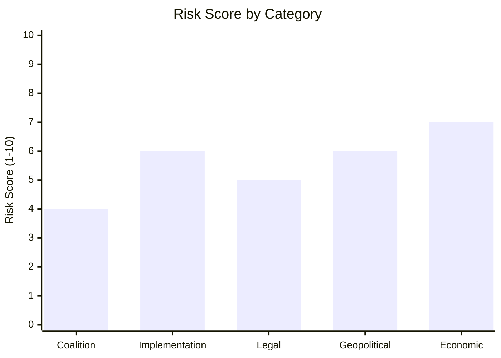

# Risk Matrix — EP10 Legislative Propositions (May 2026)
**Date**: 2026-05-25 | **Framework**: 5×5 Risk Matrix | **WEP Band**: As indicated | **Admiralty Grade**: B2

## Risk Matrix Overview

Five-by-five risk assessment (probability × impact) for risks relevant to EU Parliament legislative propositions as of May 2026. Risk score = Probability (1–5) × Impact (1–5).

```
IMPACT →        1-Minimal  2-Minor  3-Moderate  4-Major  5-Extreme
PROBABILITY ↓
5-Almost Certain    5       10       15          20       25
4-Likely            4        8       12          16       20
3-Possible          3        6        9          12       15
2-Unlikely          2        4        6           8       10
1-Rare              1        2        3           4        5
```

## Risk Register

| Risk ID | Description | Probability (1–5) | Impact (1–5) | Score | Priority |
|---------|-------------|------------------|-------------|-------|---------|
| R-01 | ETS2 household cost backlash (2027) triggers legislative revision | 4 (Likely) | 3 (Moderate) | 12 | HIGH |
| R-02 | US tariff escalation disrupts EU trade policy agenda | 3 (Possible) | 4 (Major) | 12 | HIGH |
| R-03 | EP procedures feed persistent degradation — pipeline blind spot | 5 (Almost Certain) | 2 (Minor) | 10 | MEDIUM |
| R-04 | Taliban Afghanistan displacement — coalition stress on migration | 2 (Unlikely) | 4 (Major) | 8 | MEDIUM |
| R-05 | Uzbekistan EPCA conditionality failure — EP embarrassment | 2 (Unlikely) | 3 (Moderate) | 6 | LOW |
| R-06 | AI Act implementation gap — market uncertainty | 4 (Likely) | 2 (Minor) | 8 | MEDIUM |
| R-07 | EPP-ECR alignment creep — environmental ambition reduction | 3 (Possible) | 3 (Moderate) | 9 | MEDIUM |
| R-08 | EU-Mercosur CJEU compatibility ruling adverse | 2 (Unlikely) | 4 (Major) | 8 | MEDIUM |
| R-09 | Banking/financial stability shock (post-SRMR3) | 1 (Rare) | 5 (Extreme) | 5 | LOW |
| R-10 | Summer recess backlog — autumn 2026 overload | 4 (Likely) | 2 (Minor) | 8 | MEDIUM |

## High Priority Risks — Detailed Analysis

### R-01: ETS2 Household Cost Backlash [WEP: LIKELY, 65%]

**Description**: When buildings and road transport sectors enter the EU Emissions Trading System in 2027, households across the EU will face direct carbon pricing for home heating and fuel. The MSR extension adopted in May 2026 (TA-10-2026-0139) provides price stability support but does not eliminate the cost.

**Mechanism**:
- Carbon price €30–60/tonne in ETS2 (2027 launch)
- Average household additional cost: €50–150/year (offset by Climate Social Fund for qualifying households)
- Political visibility: Fuel receipts and energy bills are highly salient; "carbon tax" framing will dominate media

**Mitigation Measures In Place**:
- Climate Social Fund (€65 billion, 2026–2032) — operational
- MSR stability mechanism — now legislated (May 2026)
- Member state implementation flexibility — some countries already proposing energy bill credits

**Residual Risk**: Political backlash risk is HIGH regardless of economic mitigation. The 2028–2029 European election cycle creates maximum vulnerability.

**Recommended Action**: EP ENVI committee should schedule a 2028 review mechanism into the MSR regulation implementing acts.

---

### R-02: US Tariff Escalation [WEP: POSSIBLE, 30–40%]

**Description**: US escalation of tariffs on EU goods (automotive €67B/year, aerospace €12B/year, pharmaceutical €30B/year exposure) would trigger EU emergency trade measures and potentially crowd out normal legislative programme.

**Mechanism**:
- EU Anti-Coercion Instrument (adopted EP9) activated
- Bilateral safeguard clause (Mercosur model, TA-10-2026-0030) serves as template
- Emergency Council meetings; EP emergency sessions
- US-EU TTC suspended or reformed

**Mitigation**:
- EU-Canada SAFE Instrument (TA-10-2026-0180) signals EP's readiness for allied industrial cooperation as diversification hedge
- WTO dispute settlement initiation (multi-year timeline)

**Residual Risk**: Immediate legislative agenda disruption HIGH if tariffs exceed 15% on automotive sector.

---

## Medium Priority Risks

### R-03: EP Procedures Feed Degradation [WEP: ALMOST CERTAIN]

This is a systemic operational risk, not an existential risk. However, the persistent inability to monitor active legislative procedures via the standard API creates analytical blind spots:

- Active COD/INI/NLE procedures invisible in automated monitoring
- Committee rapporteur assignments untracked
- Trilogue progress cannot be assessed in real time

**Mitigation**: Multi-source approach (adopted texts as lagging indicator + DOCEO + committee press releases) partially compensates. Long-term solution requires EP data portal API improvement.

---

## Risk Heat Map

```
          IMPACT →
              1    2    3    4    5
          +----+----+----+----+----+
        5 |    |R-03|    |    |    |  5=Almost Certain
          +----+----+----+----+----+
        4 |    |R-06|R-01|R-02|    |  4=Likely
          +----+----+----+----+----+
        3 |    |    |R-07|    |    |  3=Possible
          +----+----+----+----+----+
        2 |    |    |R-05|R-04|    |  2=Unlikely
          +----+----+----+----+----+
        1 |    |    |    |    |R-09|  1=Rare
          +----+----+----+----+----+
```

**Color coding**: R-01, R-02 = RED; R-03, R-04, R-06, R-07, R-08 = AMBER; R-05, R-09 = GREEN

## Risk Appetite Assessment

The European Parliament's structural risk appetite:
- **Political risk**: MODERATE (coalition arithmetic flexibility; multiple fallback configurations)
- **Legislative risk**: LOW-MODERATE (preferred outcome is adopted legislation; institutional design favours completion over abandonment)
- **Reputational risk**: LOW (strong norm against high-profile failure; Uzbekistan EPCA conditionality debate shows EP will insist on safeguards)
- **Institutional risk**: LOW (no existential threat to EP's role; ETS2 and AI Act demonstrate continued expansion of EP legislative authority)


