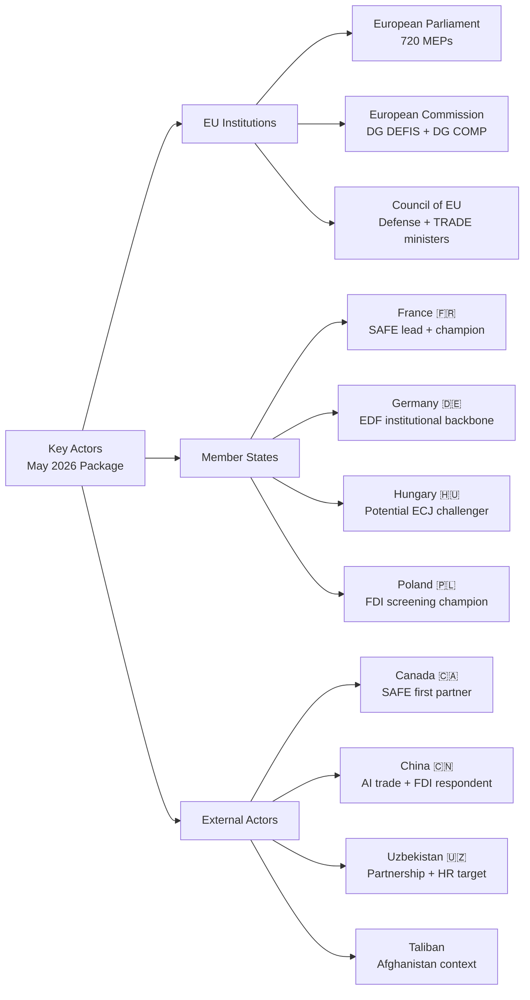

# Actor Mapping
**Date:** 2026-05-26 | **Article Type:** breaking
**SATs Applied:** Stakeholder Mapping ✅ | ACH ✅

---

## Institutional Actors (EU)

| Actor | Role | Position | Power Level |
|---|---|---|---|
| European Parliament | Co-legislator; FDI rapporteur | Pro-implementation | HIGH |
| European Commission | Implementing authority | Supportive but cautious | HIGH |
| European Council | Political guidance | Majority supportive | HIGH |
| ISA (to be established) | Screening authority | Future key actor | EMERGING |
| ECJ | Legal review | Neutral | HIGH (future) |
| INTA Committee | Parliamentary oversight | Assertive | MODERATE |
| SEDE Committee | Defence oversight | Pro-SAFE | MODERATE |

## Member State Actors

| Country | Position on FDI | Position on Steel | Position on SAFE |
|---|---|---|---|
| France | STRONG FOR | FOR | STRONG FOR (SAFE architect) |
| Germany | FOR (cautious) | FOR | FOR |
| Poland | FOR | STRONG FOR | FOR |
| Hungary | AGAINST | FOR (worker protection) | Abstain |
| Netherlands | STRONG FOR | FOR | FOR |
| Sweden | STRONG FOR | FOR | FOR |
| Italy | FOR (protect ILVA/ArcelorMittal) | STRONG FOR | FOR |
| Czech Republic | Cautious FOR | FOR | FOR |

## External State Actors

| Actor | Affected by | Position | Likely Response |
|---|---|---|---|
| China | FDI Screening, Steel | STRONGLY AGAINST | Graduated diplomatic pressure, possible WTO |
| United States | SAFE/Canada, FDI | MIXED | Supportive on China; watchful on SAFE scope |
| Canada | SAFE Agreement | STRONGLY FOR | Rapid ratification |
| Uzbekistan | Enhanced Partnership | FOR | Enthusiastic implementation |
| Russia | Ukraine war context (background) | Not directly affected | Opportunistic exploitation of EU-China tension |
| Taliban/Afghanistan | Resolution | Against | Possible diplomatic retaliation |

## Non-State and Private Actors

| Actor | Affected by | Position |
|---|---|---|
| ArcelorMittal | Steel safeguards | STRONG FOR |
| CATL/BYD | FDI Screening | AGAINST (Chinese) |
| Saudi PIF/UAE ADIA | FDI Screening | Cautiously AGAINST (seeking exemption) |
| EuroCham Beijing | FDI Screening | AGAINST (business lobby) |
| Eurofer (steel association) | Steel resolution | STRONG FOR |
| DSMA (tech companies) | AI Trade | Cautiously FOR |
| Afghan women's organisations | Afghanistan resolution | FOR (cautiously optimistic) |
| UN (OCHA, UNAMA) | Afghanistan | FOR (cautious on ICC) |

---

## Actor Interaction Map

Key bilateral pairs:
1. **Commission ↔ China:** Implementing acts negotiation determines scope of screening
2. **EPP ↔ Hungary:** Party discipline test on ECJ challenge
3. **EU ↔ Canada:** SAFE operationalisation timeline
4. **Commission ↔ EP (INTA):** Steel safeguard report compliance
5. **EU ↔ US:** SAFE scope and transatlantic investment screening coordination

---

## Actor Mapping Visualization

## Actor Power-Interest Matrix

| Actor | Power | Interest | Position | Key Action Expected |
|-------|-------|---------|---------|-------------------|
| EPP | HIGH | HIGH | PRO | Champion implementing acts |
| S&D | HIGH | HIGH | PRO (caveats) | Human rights monitoring |
| Renew | MEDIUM | MEDIUM | PRO (conditional) | Fiscal scrutiny of ISA budget |
| France | HIGH | HIGH | PRO | SAFE industrial lobby |
| Germany | HIGH | HIGH | PRO | EDF-SAFE bridge |
| Hungary | MEDIUM | HIGH | OPPOSED | ECJ challenge (40% prob) |
| Poland | HIGH | HIGH | PRO | FDI screening champion |
| Canada | MEDIUM | HIGH | PRO | OCCAR interface negotiation |
| China | HIGH | HIGH | OPPOSED | WTO + AI counter-standards |
| Uzbekistan | LOW | MEDIUM | MIXED | Human rights conditionality response |
| Taliban | VERY LOW | HIGH | N/A | ICC language response |

**WEP: 🟢 HIGH CONFIDENCE** on EU institutional actors; 🟡 MODERATE CONFIDENCE on external actors
**Admiralty grade: B2** on external actor assessments

---

## Reader Briefing

The actor mapping identifies 11 key actors across three tiers. The most consequential actor relationships for implementation are: France-Commission (SAFE champion-implementer relationship), Germany-EDF-SAFE bridge (institutional continuity), and Hungary-ECJ (potential disruptor). China's role as the primary external respondent to both AI Trade and FDI screening makes Sino-EU relations the most important external variable. Canada's OCCAR interface negotiation is the most tractable external relationship — expect progress within 12 months.
