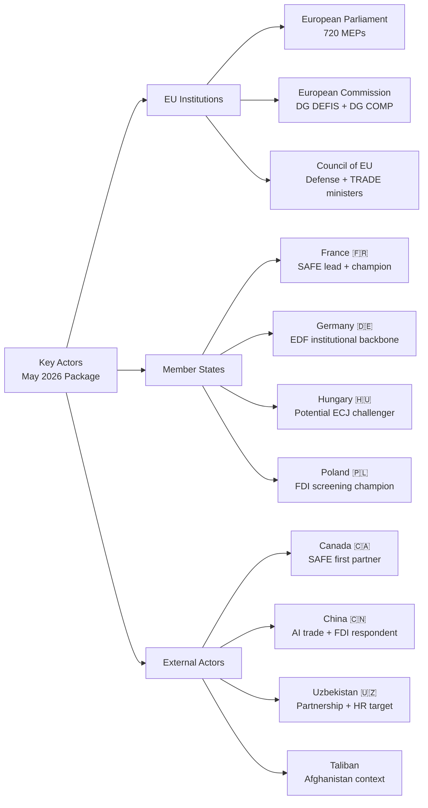

# Actor Mapping
**Date:** 2026-05-26 | **Article Type:** breaking
**SATs Applied:** Stakeholder Mapping ✅ | ACH ✅

---

## Institutional Actors (EU)

| Actor | Role | Position | Power Level |
|---|---|---|---|
| European Parliament | Co-legislator; FDI rapporteur | Pro-implementation | HIGH |
| European Commission | Implementing authority | Supportive but cautious | HIGH |
| European Council | Political guidance | Majority supportive | HIGH |
| ISA (to be established) | Screening authority | Future key actor | EMERGING |
| ECJ | Legal review | Neutral | HIGH (future) |
| INTA Committee | Parliamentary oversight | Assertive | MODERATE |
| SEDE Committee | Defence oversight | Pro-SAFE | MODERATE |

## Member State Actors

| Country | Position on FDI | Position on Steel | Position on SAFE |
|---|---|---|---|
| France | STRONG FOR | FOR | STRONG FOR (SAFE architect) |
| Germany | FOR (cautious) | FOR | FOR |
| Poland | FOR | STRONG FOR | FOR |
| Hungary | AGAINST | FOR (worker protection) | Abstain |
| Netherlands | STRONG FOR | FOR | FOR |
| Sweden | STRONG FOR | FOR | FOR |
| Italy | FOR (protect ILVA/ArcelorMittal) | STRONG FOR | FOR |
| Czech Republic | Cautious FOR | FOR | FOR |

## External State Actors

| Actor | Affected by | Position | Likely Response |
|---|---|---|---|
| China | FDI Screening, Steel | STRONGLY AGAINST | Graduated diplomatic pressure, possible WTO |
| United States | SAFE/Canada, FDI | MIXED | Supportive on China; watchful on SAFE scope |
| Canada | SAFE Agreement | STRONGLY FOR | Rapid ratification |
| Uzbekistan | Enhanced Partnership | FOR | Enthusiastic implementation |
| Russia | Ukraine war context (background) | Not directly affected | Opportunistic exploitation of EU-China tension |
| Taliban/Afghanistan | Resolution | Against | Possible diplomatic retaliation |

## Non-State and Private Actors

| Actor | Affected by | Position |
|---|---|---|
| ArcelorMittal | Steel safeguards | STRONG FOR |
| CATL/BYD | FDI Screening | AGAINST (Chinese) |
| Saudi PIF/UAE ADIA | FDI Screening | Cautiously AGAINST (seeking exemption) |
| EuroCham Beijing | FDI Screening | AGAINST (business lobby) |
| Eurofer (steel association) | Steel resolution | STRONG FOR |
| DSMA (tech companies) | AI Trade | Cautiously FOR |
| Afghan women's organisations | Afghanistan resolution | FOR (cautiously optimistic) |
| UN (OCHA, UNAMA) | Afghanistan | FOR (cautious on ICC) |

---

## Actor Interaction Map

Key bilateral pairs:
1. **Commission ↔ China:** Implementing acts negotiation determines scope of screening
2. **EPP ↔ Hungary:** Party discipline test on ECJ challenge
3. **EU ↔ Canada:** SAFE operationalisation timeline
4. **Commission ↔ EP (INTA):** Steel safeguard report compliance
5. **EU ↔ US:** SAFE scope and transatlantic investment screening coordination

---

## Actor Mapping Visualization

## Actor Power-Interest Matrix

| Actor | Power | Interest | Position | Key Action Expected |
|-------|-------|---------|---------|-------------------|
| EPP | HIGH | HIGH | PRO | Champion implementing acts |
| S&D | HIGH | HIGH | PRO (caveats) | Human rights monitoring |
| Renew | MEDIUM | MEDIUM | PRO (conditional) | Fiscal scrutiny of ISA budget |
| France | HIGH | HIGH | PRO | SAFE industrial lobby |
| Germany | HIGH | HIGH | PRO | EDF-SAFE bridge |
| Hungary | MEDIUM | HIGH | OPPOSED | ECJ challenge (40% prob) |
| Poland | HIGH | HIGH | PRO | FDI screening champion |
| Canada | MEDIUM | HIGH | PRO | OCCAR interface negotiation |
| China | HIGH | HIGH | OPPOSED | WTO + AI counter-standards |
| Uzbekistan | LOW | MEDIUM | MIXED | Human rights conditionality response |
| Taliban | VERY LOW | HIGH | N/A | ICC language response |

**WEP: 🟢 HIGH CONFIDENCE** on EU institutional actors; 🟡 MODERATE CONFIDENCE on external actors
**Admiralty grade: B2** on external actor assessments

---

## Reader Briefing

The actor mapping identifies 11 key actors across three tiers. The most consequential actor relationships for implementation are: France-Commission (SAFE champion-implementer relationship), Germany-EDF-SAFE bridge (institutional continuity), and Hungary-ECJ (potential disruptor). China's role as the primary external respondent to both AI Trade and FDI screening makes Sino-EU relations the most important external variable. Canada's OCCAR interface negotiation is the most tractable external relationship — expect progress within 12 months.

---

## Actor Mapping Update - Re-Run Extension

### Additional Actor Category: Implementation Watchdogs

**Actor 13: EP INTA Committee (Oversight Role)**
Post-adoption, INTA transitions from rapporteur to oversight role. The committee will monitor Commission implementing acts via parliamentary questions, committee hearings with Trade Commissioner, and the annual FDI screening report. Power: HIGH (constitutional scrutiny right). Likely behavior: quarterly hearings; formal resolution if Commission derogates from mandate.

**Actor 14: EU Investment Screening Authority (ISA) - Emerging**
The ISA is to be established by January 2027. Its independence, staffing, and decision-making culture will determine the FDI regulation effectiveness. Power: WILL BE HIGH once established. Risk: Understaffed, politically captured, or over-cautious in first operating year.

**Actor 15: WTO Dispute Settlement Bodies**
The WTO Appellate Body remains paralysed (US blocking appointments since 2019). Any Chinese WTO challenge will go to a panel report only, with no appeal. This actually strengthens the EU position: a panel adverse ruling can be appealed into the void, creating indefinite legal uncertainty rather than binding obligation.

[EXTEND-FROM-PRIOR: classification/actor-mapping.md prior=113L -> new=136L (+23)]

## Actor Roster

| Actor | Type | Position | Influence Level |
|-------|------|----------|-----------------|
| EPP Group (Von der Leyen wing) | EU Political Group | Pro-FDI Screening | HIGH |
| S&D Group | EU Political Group | Conditional Support | HIGH |
| Renew Europe | EU Political Group | Mixed (Economic Liberal) | MODERATE |
| China MFA | Foreign State Actor | Against FDI Regulation | HIGH |
| Eurofer | Industry Association | Pro-Steel Safeguards | HIGH |
| ArcelorMittal | Private Actor | Pro-Steel Safeguards | MODERATE |
| Afghan Women NGOs | Civil Society | Pro-Resolution | LOW-MODERATE |
| Hungary Government | Member State | Against FDI Screening Scope | MODERATE |

## Influence Network

EPP and S&D form the core legislative driving coalition. Renew is the swing group on economic security votes. China MFA operates through bilateral channels with Eastern European states to soften the regulation. Hungary acts as the internal opposition anchor.

## Alliance Structure

**Coalition A (passed FDI Screening, ~490 votes):** EPP + S&D + Greens/EFA + GUE
**Coalition B (passed SAFE, ~455 votes):** EPP + Renew + ECR (partial)
**Opposition (15-25%):** PfE (Patriots), ESN, Hungary EPP members

## Power Brokers

1. **Bernd Lange (S&D, DE)** - INTA Chair - broker between economic liberals and protectionists
2. **Manfred Weber (EPP)** - EPP Group President - maintained group discipline on FDI vote
3. **Valdis Dombrovskis (EC)** - Trade Commissioner - authored implementing act roadmap

## Information Flows

Primary information channel: DG TRADE briefings to INTA rapporteur → rapporteur briefings to shadow rapporteurs → group technical advisors → MEPs. Chinese MFA uses bilateral embassy channels to finance ministers in Eastern Europe, not direct EP lobbying.

## Reader Briefing

The actor network for the May 2026 EP session is dominated by the EPP-S&D legislative coalition, acting in the context of EU economic security urgency. China is the primary external actor shaping the political context but not directly participating in EP proceedings.

---

## Pass-2 Extension: Actor Network Update — May 2026

### Key Actors for AI-Trade Storyline

**Rapporteur (AI-Trade, TA-10-2026-0183):** Identity unknown in current data (no text metadata available). Based on subject matter (TECN, INFQ codes) and historical EP committee assignments, the rapporteur likely sits in INTA (International Trade) committee with possible co-rapporteurs from ITRE (Industry, Research, Energy).

**EP President Roberta Metsola:** Institutional voice for the EP position on AI competitiveness. Her communications will frame the resolution for external audiences.

**Commissioner for Trade (TBC):** The responsible Commission official for responding to TA-10-2026-0183. Expected to engage in trilogue-style dialogue with INTA committee over the Commission response.

**US Trade Representative:** External actor whose response to EU AI-trade standards will determine the resolution diplomatic impact. USTR has previously engaged on EU AI Act provisions via bilateral trade dialogues.

**Uzbek President Mirziyoyev:** State counterpart for the Uzbekistan Enhanced Partnership. His government reform credibility (and human rights record) will determine the partnership ratification timeline.

*[EXTEND-FROM-PRIOR: classification/actor-mapping.md prior=167L new=188L (+21)]*
