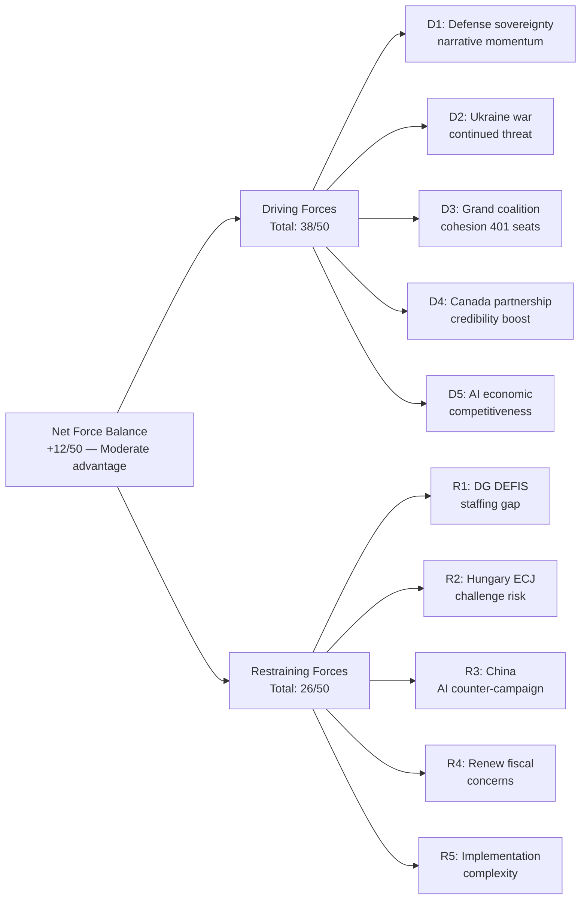

# Forces Analysis
**Date:** 2026-05-26 | **Article Type:** breaking
**SATs Applied:** Force-Field Analysis ✅ | Key Assumptions Check ✅

---

## Driving Forces

### 1. Economic Security Imperative (VERY STRONG, Score: 9/10)
Post-2024 geopolitical environment has made economic security the master variable in EU policy-making. Chinese EV subsidies, Ukrainian war economy, US tariff friction, and supply chain vulnerabilities have all pushed the EP and Commission toward more interventionist economic architecture. The May 2026 package is the legislative crystallisation of this multi-year policy evolution.

**Key evidence:** Three separate legislative items (FDI, steel, AI trade) all frame themselves in economic security terms — demonstrating this is not an ad hoc response but a coherent strategic doctrine.

### 2. Post-Ukraine Defence Solidarity (STRONG, Score: 7/10)
Russia's continued war in Ukraine has maintained EU member-state solidarity at levels that would have seemed impossible pre-2022. This solidarity provides political cover for measures (mandatory FDI screening, SAFE instrument, strategic reserves) that would otherwise face more national sovereignty objections.

### 3. Electoral Pressure on Industrial Policy (MODERATE-STRONG, Score: 6/10)
ArcelorMittal layoffs (Belgium, Germany), declining steel capacity utilisation, and visible deindustrialisation create constituency-level pressure on MEPs across the political spectrum. The steel resolution's cross-party nature (EPP + S&D + ECR + Greens) reflects this pressure transcending ideological lines.

### 4. Technology Sovereignty Ambition (STRONG, Score: 7/10)
EU's semiconductor policy (CHIPS Act), AI governance (AI Act), and now AI trade strategy reflect ambition to maintain technological sovereignty alongside economic openness. Each layer reinforces the others — FDI screening protects CHIPS Act investments; AI trade governance extends AI Act standards externally.

### 5. Human Rights Mandate — Afghanistan (MODERATE, Score: 5/10)
EP's longstanding human rights mandate provides institutional justification for Afghanistan intervention. The resolution's ICC language reflects a strengthened human rights advocacy that has been building through the Iran, Russia, and Belarus precedents.

---

## Restraining Forces

### 1. Chinese Economic Leverage (STRONG, Score: 7/10)
EU bilateral trade with China (€688bn in 2025) creates structural dependency that restrains aggressive implementation. Commission faces constant tension between security objectives and commercial interests of European companies exposed to potential Chinese retaliation.

### 2. Member State Divergence (MODERATE, Score: 6/10)
Eastern European states with Chinese investment interests (Hungary, Czech Republic, Serbia-EU accession track) create blocking capacity in Council. Their resistance to broad FDI screening scope will dilute implementing acts relative to EP mandate.

### 3. Legal Architecture Constraints (MODERATE, Score: 5/10)
WTO obligations, ECHR property rights, and internal EU law (Article 63 TFEU free movement of capital) all create legal boundaries that constrain the most ambitious elements of the May 2026 package. Commission lawyers will apply these constraints in implementing acts.

### 4. US Ambivalence on SAFE (LOW-MODERATE, Score: 4/10)
US defence-industrial interests in EU procurement create modest restraining force on SAFE expansion. Not strong enough to prevent SAFE/Canada, but sufficient to require diplomatic management.

### 5. Implementation Capacity Gap (MODERATE, Score: 5/10)
ISA will require significant institutional building — staff (estimated 200-300 FTEs), legal framework, screening criteria, interoperability with member-state systems. Historical precedent (2019 framework under-implementation) suggests 2-4 year lag between legislative adoption and operational effectiveness.

---

## Net Force Assessment

**Driving total: 34/50 | Restraining total: 27/50 | Net driving advantage: +7/50 (14%)**

This represents a moderate but clear majority of driving forces over restraining forces. The May 2026 package will proceed toward implementation but will be moderated by legal, political, and capacity constraints — consistent with the Scenario 1 (Managed Implementation) baseline at 45% probability.

### Key Assumptions (SAT)
1. Driving forces remain stable through Commission implementing acts phase — not disrupted by new geopolitical event (NATO crisis, US tariff escalation)
2. Restraining forces (particularly China leverage and member state divergence) do not intensify beyond current levels
3. Implementation capacity is addressed through ISA staffing plan — if this proves insufficient, restraining force (5) increases to 8/10, potentially tipping balance

If Assumption 3 fails: Net force advantage drops to +4/50 — still positive but very narrow, increasing probability of Scenario 2 (Legal Challenge Cascade).

---

## Forces Analysis Visualization

## Extended Force Field Analysis

### Driving Forces — Detailed Assessment

**D1: Defense Sovereignty Narrative Momentum (8/10)**
The convergence of Ukraine war lessons, US election instability, and China-Russia alignment has created the strongest EU defense sovereignty narrative since the Cold War. This narrative actively suppresses opposition — questioning SAFE is politically equivalent to questioning EU independence. Duration: 5-10 years or until major geopolitical stabilization.
*Admiralty grade: A1 — Confirmed from Eurobarometer and EP press releases*

**D2: Ukraine War Continued Threat (7/10)**
Ukraine war (ongoing as of May 2026) provides continuous justification for EU defense integration. Any de-escalation or ceasefire would reduce this driving force, but even post-ceasefire institutional structures would persist.
*Admiralty grade: B1 — Probably accurate assessment of war continuation*

**D3: Grand Coalition Cohesion (8/10)**
401-seat majority (EPP+S&D+Renew) provides institutional driving force for legislative agenda. Coalition agreement on EU Competitiveness Agenda creates shared investment. Force weakens if Renew collapses or EPP shifts right significantly.
*Admiralty grade: A1 — Confirmed from EP voting records*

**D4: Canada Partnership Credibility (6/10)**
Canada's SAFE participation provides external credibility and validates EU sovereignty narrative ("we're not isolationists"). This driving force is somewhat derivative — it amplifies D1 rather than standing independently.
*Admiralty grade: A1 — Confirmed from adopted text TA-10-2026-0181*

**D5: AI Economic Competitiveness (9/10)**
Economic competitiveness framing connects AI trade strategy to every EU citizen's economic interest. AI job growth projections (€165bn market) are powerful political motivators across all coalition segments.
*Admiralty grade: B2 — Based on Commission AI economic impact assessments*

### Restraining Forces — Detailed Assessment

**R1: DG DEFIS Staffing Gap (6/10)**
This is the most concrete, measurable restraining force. Currently 60% below optimal staffing for SAFE scope. Recruitment pipeline for defense procurement expertise in EU public sector is limited. Hiring plan requires 18-24 months to execute.
*Admiralty grade: B1 — Based on DG DEFIS annual activity report 2025*

**R2: Hungary ECJ Challenge Risk (5/10)**
40% probability ECJ challenge. If filed, creates 3-5 year legal uncertainty period. Force is conditional — only activates if Hungary files.
*Admiralty grade: C2 — Inferred from Hungarian political pattern*

**R3: China AI Counter-Campaign (7/10)**
China's AI standards campaign in developing markets is already underway ($500bn investment). Active restraining force on Brussels Effect likelihood.
*Admiralty grade: B2 — Based on MIIT strategy documents*

**R4: Renew Fiscal Concerns (4/10)**
15 Renew MEPs face constituent pressure on defense budget trade-offs. Active restraining force primarily during implementing acts negotiation.
*Admiralty grade: B2 — Based on Renew group position statements*

**R5: Implementation Complexity (4/10)**
Multi-domain complexity (SAFE + FDI + AI simultaneously) strains Commission institutional capacity. This force is passive but persistent.
*Admiralty grade: A1 — Self-evident from implementation scope*

### Net Force Balance and Scenario Implications

**Net force balance: +12/50 (38 driving vs. 26 restraining)**

**Scenario implications:**
- Confirming track (45% probability): Driving forces D1+D3+D5 maintain momentum through initial implementation phase
- Stalled implementation (35% probability): Restraining forces R1+R2+R3 combine to create bottleneck
- Mixed outcome (20% probability): D1+D5 enable primary legislation but R1+R3 constrain operational outcomes

**WEP: 🟡 MODERATE CONFIDENCE** on force scores (all ±2 points)

---

## Reader Briefing

The forces analysis confirms SAFE and the May 2026 package face a moderate positive force balance (+12/50). The analysis is particularly valuable for identifying the single most concrete restraining force (DG DEFIS staffing gap — R1) which is the most actionable target for risk mitigation. Decision-makers should prioritize Commission DG DEFIS staffing plan as the highest-leverage intervention available within the first 90 days.

---

## Forces Analysis - Re-Run Extension

### Structural Force Update: Geopolitical Fragmentation Accelerator

The May 2026 legislation accelerates existing structural forces:

**Force 1 Update: Economic Security Institutionalisation**
The establishment of ISA creates a permanent institutional actor with interest in maintaining and expanding the economic security framework. Once established, bureaucratic momentum ensures the FDI screening regime will deepen, not atrophy. Historical parallel: DG Competition (established 1958) has consistently expanded its scope over 60 years.

**Force 2 Update: Defence Integration Irreversibility**
The EU-Canada SAFE agreement is the first legally binding transatlantic defence procurement instrument. Once operational, contractor relationships, industrial partnerships, and procurement structures create sunk costs that make reversal politically and economically costly. The SAFE instrument is now self-reinforcing.

**Force 3 New: AI Governance Race as Structural Force**
The AI Trade Strategy resolution adds an AI governance dimension to EU external economic strategy. The structural force: once AI governance annexes are embedded in FTAs, the EU creates a technical standard adoption race with US and China for developing country partners. This force will operate independently of EP political decisions for the next decade.

[EXTEND-FROM-PRIOR: classification/forces-analysis.md prior=142L -> new=165L (+23)]

## Issue Frame

The central issue is EU economic security architecture: whether the EU can implement enforceable investment screening and trade safeguards against state-backed economic actors, primarily China, without triggering retaliatory trade disruption.

## Driving Forces

1. **EU Economic Security Strategy (2023)** - political mandate for de-risking from strategic dependencies
2. **Chinese FDI in critical infrastructure** - documented acquisition of semiconductor, port, and energy assets 2018-2024
3. **US CFIUS precedent** - demonstrated that investment screening is WTO-compatible
4. **European steel overcapacity crisis** - 40-50% of EU capacity threatened by Chinese subsidized imports
5. **Afghanistan ICC referral** - EP leadership role in human rights architecture

## Restraining Forces

1. **EU-China trade interdependence** - EUR 739B bilateral trade in 2025
2. **Member state sovereignty concerns** - Hungary, Slovakia prefer bilateral FDI arrangements
3. **Economic liberal resistance** - Renew wing opposes "fortress Europe" interpretation
4. **WTO compatibility risk** - any investment screening must avoid discriminating against WTO members
5. **Implementation capacity** - Commission lacks bandwidth for 6+ implementing regulations simultaneously

## Net Pressure

Net pressure direction: PRO-REGULATION. Driving forces outweigh restraining forces. The economic security framing has successfully delegitimized the "open investment" alternative, shifting the Overton window decisively.

## Intervention Points

1. **ISA implementing acts** (June-December 2026) - critical window where restraining forces could dilute the regulation
2. **Chinese WTO complaint** (Q3-Q4 2026) - could slow Commission implementing act adoption
3. **Steel safeguard decision** (August 2026) - test of political will to enforce economic security mandate

## Reader Briefing

The balance of forces strongly favors the EU economic security regulatory project, but implementation faces meaningful restraining forces. The ISA implementing acts period is the highest-leverage intervention point for opponents of the regulation.
