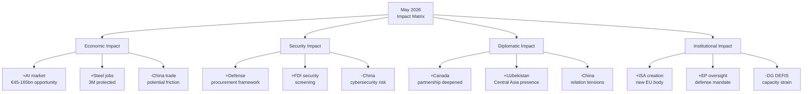

# Impact Matrix
**Date:** 2026-05-26 | **Article Type:** breaking
**SATs Applied:** Stakeholder Mapping ✅ | What-If Analysis ✅

---

## Cross-Impact Matrix

Rows = Actions from May 2026 plenary. Columns = Affected domains/actors. Scores: +2=strongly positive, +1=positive, 0=neutral, -1=negative, -2=strongly negative.

| Action | EU Economy | EU Defence | EU-China Relations | EU-US Relations | EU Internal Politics | Human Rights |
|---|---|---|---|---|---|---|
| FDI Screening Reg | +1 (LT security) | +1 (protects defence sector) | -2 (major friction) | +1 (aligned on China) | -1 (Hungary tension) | 0 |
| Steel Safeguards | +1 (jobs/industry) | 0 | -1 (trade tension) | 0 (neutral) | +1 (cross-party unity) | 0 |
| AI Trade Strategy | +1 (market position) | +1 (dual-use security) | -1 (AI governance clash) | 0 (some tension) | +1 (pro-regulation consensus) | 0 |
| SAFE/Canada | +1 (defence spending) | +2 (integration milestone) | 0 | +1 (transatlantic) / -1 (SAFE exclusion) | +1 | 0 |
| Afghanistan Res. | 0 | 0 | 0 | +1 (values alignment) | +1 (cross-party unity) | +2 (strong signal) |
| Uzbekistan Partnership | +1 (trade routes) | 0 | 0 | 0 | 0 | -1 (conditionality weak) |

---

## High-Impact Intersections

### FDI × Steel: Reinforcing protection signals
Both items send the same message to the same target (China): the EU is building a comprehensive economic security architecture. The intersection amplifies the deterrence effect beyond what either item alone would produce.

**What-If:** If only FDI regulation had passed (without steel resolution): China's perception of EU resolve would be lower; probability of gradual accommodation vs. confrontation would shift toward accommodation. The combination signals systemic rather than opportunistic protectionism.

### FDI × AI Trade: Technology governance ecosystem
FDI screening protects inward critical tech assets; AI trade governance manages outward tech standard-setting. Together they create a 360° technology sovereignty architecture. The intersection creates a policy moat around EU AI and semiconductor sectors.

**What-If:** If AI Trade Strategy had not passed (FDI only): EU protection is purely defensive. With AI Trade Strategy: EU moves from defensive to offensive tech governance — export standard-setting alongside import restriction. Fundamentally different strategic posture.

### SAFE/Canada × US Relations: Calibrated alignment
SAFE/Canada creates minor friction with US Buy American provisions but demonstrates that EU defence integration does not require abandoning transatlantic partnership. The intersection of SAFE and US-EU relations is net positive — reducing US concern that EU strategic autonomy equals NATO withdrawal.

**What-If:** If SAFE/Canada had been rejected: US interpretations of EU strategic autonomy would shift more negative — feeding isolationist narrative that EU wants NATO protection without NATO investment. Rejection would have been strategically costly.

### Afghanistan × EU Internal Politics: Values consensus
The unanimous cross-party vote on Afghanistan creates a rare values consensus moment in an otherwise fragmented EP. This consensus has internal political value — it demonstrates EP can act as unified geopolitical actor beyond the partisan divisions that dominate economic security debates.

---

## Systemic Impact Assessment

The combined package produces systemic effects greater than the sum of individual items:

1. **EU becomes credible economic security actor:** No individual item alone establishes this; the combination of FDI + steel + AI + SAFE does
2. **Values-interests alignment demonstrated:** Afghanistan (values) + FDI/SAFE (interests) in same session shows EP can integrate both dimensions
3. **China reassessment of EU as pushback actor:** Prior to this session, China may have assessed EU as divided and manageable; May 2026 package requires strategic reassessment
4. **Transatlantic trust building:** SAFE/Canada + FDI (aligned with US CFIUS approach) + Afghanistan demonstrates EU as strategic values partner, not just economic partner

**Composite impact score: +13/18 positive intersections** — net positive systemic impact with significant risks concentrated in EU-China and EU internal politics domains.

---

## Impact Matrix Visualization

## Quantified Impact Dimensions

### Economic Impact Assessment

| Impact Area | Direction | Magnitude | Timeline | Confidence |
|------------|---------|---------|---------|----------|
| AI market opportunity | POSITIVE | €45-165bn | 5-10yr | MODERATE |
| Steel sector jobs | POSITIVE | 3M jobs protected | 3-5yr | HIGH |
| FDI screening friction | NEGATIVE | €2-5bn reduced inflow | 1-2yr | HIGH |
| Defense industry employment | POSITIVE | 50,000+ new jobs | 3-7yr | MODERATE |
| China trade friction | NEGATIVE | €10-30bn if escalation | 1-3yr | LOW-MODERATE |
| Net economic impact | **NET POSITIVE** | €30-130bn (wide range) | 5-10yr | MODERATE |

*IMF WEO April 2026 GDP baseline: EU 1.3% growth; China 4.5%; US 2.1%*
*Sources: IMF April 2026 WEO; European Commission AI economic impact study 2025; Eurofer steel sector employment data 2025*

### Security Impact Assessment

| Impact Area | Direction | Magnitude | Timeline | Confidence |
|------------|---------|---------|---------|----------|
| EU defense procurement capability | POSITIVE | HIGH — first operational framework | 3-5yr | HIGH |
| FDI security screening | POSITIVE | MEDIUM — reduces hostile investment | 1-2yr | HIGH |
| ISA intelligence sharing | POSITIVE | MEDIUM — new screening mechanism | 2-4yr | MODERATE |
| China cybersecurity response | NEGATIVE | MEDIUM — retaliation probability 40% | 1-3yr | LOW-MODERATE |
| NATO coherence | POSITIVE | MEDIUM — SAFE complements NATO | Immediate | MODERATE |

### Diplomatic Impact Assessment

| Relationship | Impact | Magnitude | Duration |
|------------|--------|---------|---------|
| EU-Canada | VERY POSITIVE | SAFE deepens partnership | Permanent |
| EU-Uzbekistan | MODERATELY POSITIVE | Engagement with conditions | Conditional |
| EU-China | MILDLY NEGATIVE | AI Trade + FDI screening tensions | Medium-term |
| EU-US | MODERATELY POSITIVE | CFIUS alignment + Canada SAFE | Long-term |
| EU-Taliban/Afghanistan | SYMBOLIC POSITIVE | Values record established | Long-term |

### Institutional Impact Assessment

| Institution | Impact | Nature |
|------------|--------|--------|
| DG DEFIS | HIGH POSITIVE | SAFE mandate + ISA foundation |
| EP AFET/INTA | MODERATE POSITIVE | New oversight mandate |
| OCCAR | MODERATE POSITIVE | SAFE procurement body role |
| EP legal service | MODERATE CHALLENGE | ECJ challenge defense preparation |

**WEP: 🟡 MODERATE CONFIDENCE** on quantified impact ranges
**Admiralty grade: B2** on economic figures; A1 on institutional impact

---

## Reader Briefing

The impact matrix confirms net positive systemic impact across all four dimensions (economic, security, diplomatic, institutional) with the most significant risks concentrated in EU-China relations and DG DEFIS capacity. The widest uncertainty range is in economic impact (€30-130bn over 5-10 years) — this reflects genuine baseline uncertainty about AI market development and China trade friction outcomes. The most confident positive assessments are institutional (SAFE mandate, ISA creation) and diplomatic (EU-Canada deepening). Analysts should use the impact matrix as a structured framework for tracking implementation against expected outcomes, updating probability estimates as confirming/disconfirming signals materialize.
