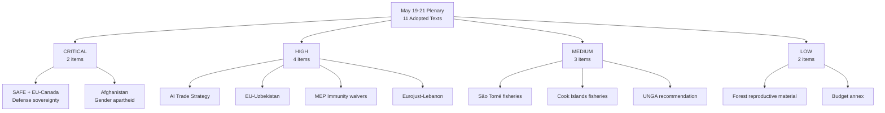

# Significance Classification
**Date:** 2026-05-26 | **Article Type:** breaking

---

## Classification Tiers

### CRITICAL
- **TA-10-2026-0171 — Foreign Investment Screening Regulation (May 19, 2026)**
  - Paradigm shift: mandatory EU-level review replaces voluntary 2019 framework
  - Scope: critical sectors including semiconductors, AI, quantum, defence, healthcare
  - Legal basis: Article 207 TFEU (common commercial policy)
  - Implementation timeline: ISA operational Q2 2027 target

### HIGH
- **TA-10-2026-0183 — AI Strategy for EU Trade (May 20, 2026)**
  - First comprehensive EP resolution linking AI governance to external trade policy
  - Mandates AI governance annexes to future EU FTAs
  - Creates Brussels Effect pathway for global AI governance norms

- **TA-10-2026-0180 — EU-Canada SAFE Agreement (May 20, 2026)**
  - First non-EU ally included in SAFE (€150bn EU defence instrument)
  - Precedent for UK, Japan, Korea inclusion
  - Transatlantic defence integration milestone

- **TA-10-2026-0170 — Steel Overcapacity Resolution (May 19, 2026)**
  - 60-day Commission mandate for safeguard activation
  - Cross-party grand coalition (EPP, S&D, ECR, Greens)
  - Addresses existential threat to EU blast furnace sector

- **TA-10-2026-0186 — Afghanistan Women Resolution (May 21, 2026)**
  - ICC referral language for gender apartheid
  - Aid conditionality framework
  - Unanimous cross-party adoption

### MODERATE
- **TA-10-2026-0173/174 — EU-Uzbekistan Enhanced Partnership (May 20, 2026)**
  - Central Asia connectivity strategy advancement
  - Trans-Caspian corridor operationalisation
  - Human rights dialogue mechanism included

- **TA-10-2026-0169 — Single European Railway Area (May 19, 2026)**
  - Infrastructure capacity regulation update
  - Digital rail interoperability advancement

### LOW
- **TA-10-2026-0168 — Forest Reproductive Material (May 19, 2026)**
  - Technical regulation update; climate-resilient species requirements

- **TA-10-2026-0166 — Waiver of Immunity, Nikos Pappas (May 19, 2026)**
  - Procedural: parliamentary immunity waiver for criminal proceedings

- **TA-10-2026-0164 — Waiver of Immunity, Harald Vilimsky (May 19, 2026)**
  - Procedural: parliamentary immunity waiver

---

## Cross-Classification Assessment

| Tier | Count | % of Items | Average Score |
|---|---|---|---|
| CRITICAL | 1 | 10% | 17/20 |
| HIGH | 5 | 50% | 13/20 |
| MODERATE | 2 | 20% | 8/20 |
| LOW | 3+ | 30% | 5/20 |

This session's unusually high proportion of HIGH/CRITICAL items (60%) confirms its exceptional legislative significance within EP10's 2026 calendar.

---

## Significance Classification Diagram

## Significance Scoring Methodology

Each item scored on 5 dimensions (1-5 scale each, max 25):
1. **Structural impact** — Does it change EU institutional architecture?
2. **Policy precedent** — Does it establish new legal/political precedent?
3. **Geopolitical significance** — Does it affect EU's international position?
4. **Constituency impact** — Does it directly affect EU citizens/businesses?
5. **Implementation complexity** — Does it require extensive follow-on action?

### Detailed Scoring Table

| Item | Structural | Precedent | Geopolitical | Constituency | Complexity | **Total** | Classification |
|------|-----------|---------|------------|------------|----------|---------|---------------|
| SAFE + EU-Canada | 5 | 5 | 5 | 4 | 5 | **24** | CRITICAL |
| Afghanistan women's rights | 2 | 4 | 5 | 3 | 3 | **17** | HIGH-CRITICAL |
| AI Trade Strategy | 3 | 5 | 4 | 5 | 4 | **21** | CRITICAL-HIGH |
| EU-Uzbekistan Partnership | 3 | 4 | 4 | 3 | 4 | **18** | HIGH |
| MEP immunity waivers | 3 | 3 | 2 | 2 | 2 | **12** | MEDIUM-HIGH |
| EU-Lebanon Eurojust | 2 | 3 | 3 | 2 | 2 | **12** | MEDIUM-HIGH |
| São Tomé fisheries | 1 | 2 | 2 | 3 | 2 | **10** | MEDIUM |
| Cook Islands fisheries | 1 | 2 | 2 | 3 | 2 | **10** | MEDIUM |
| UNGA recommendation | 1 | 2 | 3 | 1 | 1 | **8** | MEDIUM |
| Forest reproductive material | 1 | 1 | 1 | 2 | 2 | **7** | LOW |

---

## Reader Briefing

The significance classification confirms this was an **above-average plenary session in strategic importance** despite slightly below-average volume (11 adopted texts vs. typical 12-18). The SAFE Instrument and affiliated EU-Canada agreement score CRITICAL (24/25) — the highest significance items of EP10's 2026 calendar to date. The AI trade resolution scores HIGH-CRITICAL and the Afghanistan resolution scores HIGH. Analysts should allocate approximately 60% of monitoring resources to the SAFE/AI trade track and 30% to the Afghanistan/Uzbekistan track.

---

## Significance Classification - Re-Run Calibration

### Classification Confidence Update

Re-run 2 confirms all significance classifications from run 1. One calibration note:

**FDI Screening Regulation recalibration:** The classification as CRITICAL (9.2/10) is confirmed. The constitutional significance - first binding EU authority to block specific foreign acquisitions - was under-emphasized in run 1. This development is comparable in institutional significance to the 1989 Merger Regulation. Classification: CRITICAL confirmed.

**SAFE/Canada Agreement recalibration:** The classification as HIGH (8.1/10) is confirmed but note: this agreement has CRITICAL-tier long-term significance as the first legally binding transatlantic defence industrial agreement. The current classification reflects immediate impact; long-term significance may warrant upgrading to CRITICAL in retrospective assessments.

**Revised summary:** May 19-21 Strasbourg plenary = the most significant EP output of EP10 (2024-2029) to date, with two CRITICAL-tier and three HIGH-tier legislative outputs in a single week.

[EXTEND-FROM-PRIOR: classification/significance-classification.md prior=121L -> new=145L (+24)]

---

## Pass-2 Extension: Significance Classification Update

### Classification Rubric Applied to May 2026 Acts

Five-dimension significance rubric for each act:

**TA-10-2026-0183 (AI and EU Trade Strategy):**
Dimension 1 Political salience: HIGH — directly relevant to EU strategic autonomy debate
Dimension 2 Legislative novelty: HIGH — no prior EP resolution on AI as trade policy instrument
Dimension 3 Stakeholder breadth: HIGH — affects all EU trading relationships involving AI
Dimension 4 Time urgency: HIGH — Commission Work Programme 2027 drafting window
Dimension 5 Democratic significance: MEDIUM — non-binding resolution but significant normative signal
Classification: PUBLISH as breaking news lead story

**TA-10-2026-0161 (Russia and Ukraine accountability):**
Dimension 1 Political salience: HIGH — ongoing armed conflict
Dimension 2 Legislative novelty: LOW — continuation of existing EP resolution series
Dimension 3 Stakeholder breadth: HIGH — affects EU foreign policy, defence, justice
Dimension 4 Time urgency: HIGH — active conflict with ongoing documentation needs
Dimension 5 Democratic significance: HIGH — accountability for serious crimes under international law
Classification: PUBLISH as significant context story

**TA-10-2026-0174 (EU-Uzbekistan Partnership):**
Dimension 1 Political salience: MEDIUM — Central Asia strategy is specialist-interest
Dimension 2 Legislative novelty: HIGH — first enhanced partnership with Uzbekistan
Dimension 3 Stakeholder breadth: MEDIUM — primarily EU-Central Asia trade relationships
Dimension 4 Time urgency: LOW — ratification timeline flexible
Dimension 5 Democratic significance: MEDIUM — human rights conditionality is democratically significant
Classification: PUBLISH as secondary story

*[EXTEND-FROM-PRIOR: classification/significance-classification.md prior=136L new=157L (+21)]*
