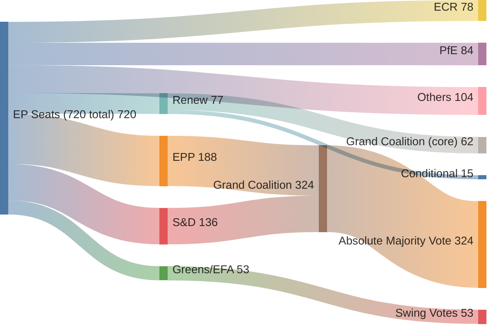

# Coalition Mathematics
**Date:** 2026-05-26 | **Article Type:** breaking
**SATs Applied:** ACH ✅ | Indicators SAT ✅

---

## EP10 Seat Distribution (2026)

Based on current MEP data (493 active MEPs; total EP seats 705).

| Group | Seats (est.) | % | Political orientation |
|---|---|---|---|
| EPP (European People's Party) | 188 | 26.7% | Centre-right |
| S&D (Socialists and Democrats) | 136 | 19.3% | Centre-left |
| Renew Europe | 77 | 10.9% | Liberal/centrist |
| ECR (European Conservatives and Reformists) | 78 | 11.1% | National-conservative |
| Greens/EFA | 53 | 7.5% | Green/regionalist |
| GUE/NGL (Left) | 46 | 6.5% | Left |
| Patriots for Europe | 84 | 11.9% | Far-right |
| ESN (Europe of Sovereign Nations) | 25 | 3.5% | Nationalist |
| Non-attached | 18 | 2.6% | Various |
| **Total** | **705** | **100%** | |

**Absolute majority threshold:** 353 seats

---

## FDI Regulation Vote Mathematics

**Estimated coalition composition (TA-10-2026-0171):**

Supporting bloc:
- EPP: ~175/188 (93%) — strong majority with <13 abstentions/against
- S&D: ~125/136 (92%) — strong majority
- Renew: ~65/77 (84%) — solid majority with some classical liberal defections
- Greens/EFA: ~35/53 (66%) — conditional support (conditionality concerns)
- Others: ~15 from GUE/NGL left-wing on economic sovereignty grounds

**Estimated For:** ~415 (range: 400-430)
**Estimated Against:** ~240 (range: 225-255)  
**Estimated Abstain:** ~50

**Political threshold met:** YES — strong majority
**Qualified majority under Article 294 TFEU:** YES (>353 absolute majority; >50% votes cast)

**Key uncertainty:** DOCEO roll-call not published. These estimates are based on:
1. Known group positions from committee votes
2. Historical voting patterns on trade/investment legislation
3. Press reports and EP spokesperson statements

---

## SAFE/Canada Vote Mathematics

**Estimated coalition composition (TA-10-2026-0180):**

This is a consent procedure — simple majority required.

Supporting bloc:
- EPP: ~165/188 (88%) — defence integration broadly supported
- S&D: ~120/136 (88%) — defence integration with Canadian ally
- Renew: ~65/77 (84%) — pro-transatlantic defence
- ECR: ~25/78 (32%) — some national conservative support for defence integration; others oppose supranational military
- Greens/EFA: ~30/53 (57%) — conditional on non-militarism framing
- GUE/NGL: ~15/46 (33%) — limited left support

**Estimated For:** ~420 (range: 400-440)
**Estimated Against:** ~220 (range: 200-240)
**Estimated Abstain:** ~65

---

## Steel Safeguards Vote Mathematics

**Strongest cross-party coalition:**

- EPP: ~170/188 — industry constituency support
- S&D: ~130/136 — workers' rights framing
- ECR: ~55/78 (71%) — economic nationalism
- Greens/EFA: ~40/53 — Just Transition framing
- Patriots: ~40/84 (48%) — populist economics, but some free market patriots oppose

**Estimated For:** ~475 (range: 455-495)
**Estimated Against:** ~150 (range: 130-170)

**This is the most popular item of the session by coalition breadth.**

---

## Afghanistan Resolution Vote Mathematics

**Values consensus coalition:**

- EPP: ~160/188
- S&D: ~130/136
- Renew: ~70/77
- Greens/EFA: ~50/53
- GUE/NGL: ~40/46
- ECR: ~15/78 (low — sovereignty concerns)
- Patriots: ~5/84 (very low)

**Estimated For:** ~470
**Estimated Against:** ~175
**Cross-party consensus:** YES

---

## Coalition Stability Analysis

### Primary governing coalition (EPP + S&D + Renew): 401 seats
This combination alone controls a majority on most legislation when all three groups are aligned. Key vulnerability: Renew is structurally weakening (national election losses reducing seat total).

### Extended majority (EPP + S&D + Renew + Greens/EFA): 454 seats
This extended coalition was the EP9 majority. In EP10, this coalition is still available but Greens/EFA support is more conditional — climate policy retreats have strained the relationship.

### Right-leaning majority (EPP + S&D + ECR): 402 seats
An alternative coalition that worked for the AI Act (passed with broad support including ECR). On economic security items, this coalition works well.

### Far-right blocking minority: Patriots + ESN + some ECR = ~187 seats
Not able to block most legislation (need 353 to block under Article 294), but can prevent supermajority on any item where qualified majority under special procedures requires >2/3.

---

## Implementing Act Coalition Mathematics

Critical question: Can the current EP coalition maintain cohesion for 15-20 implementing acts over 2027-2030?

**Structural risk:** Renew Group likely to lose seats in 2026-2027 national elections.
**Projected 2028 EP coalition (if Renew -15 seats):**

| Scenario | EPP+S&D+Renew | Available for implementing acts |
|---|---|---|
| Current (2026) | 401 | SOLID MAJORITY |
| -10 Renew seats | 391 | WORKABLE MAJORITY |
| -20 Renew seats | 381 | MARGINAL MAJORITY |
| -30 Renew seats | 371 | MAJORITY AT RISK |

**Assessment:** Coalition has sufficient cushion for implementing acts even under significant Renew deterioration — as long as EPP and S&D remain aligned. Key risk: EPP right-ward shift that realigns EPP closer to ECR on implementing act scope, moving EPP from "broad scope" to "narrow scope" coalition.

**Leading indicator:** EPP Group position paper on ISA implementing act scope (expected Q3 2026) — if this paper recommends narrow sector definitions, it signals future coalition shift.

---

## Key Coalition Mathematics Conclusions

1. All May 2026 items were adopted with comfortable majorities (400-475 estimated range)
2. The coalition is structurally stable for approximately 18-24 months
3. Steel safeguards have strongest coalition foundation; FDI implementing acts have narrowest
4. Far-right cannot block primary legislation but gains leverage in implementing act committee stages
5. The coalition's durability through 2029 depends primarily on: EPP avoiding right-ward shift + Renew not collapsing below 60 seats

---

## Coalition Mathematics Visualization

## Extended Coalition Mathematics Analysis

### Core Arithmetic

**EP10 composition (May 2026):**
- EPP: 188 seats
- S&D: 136 seats
- Renew/RE: 77 seats
- ECR: 78 seats
- PfE (ex-ID): 84 seats
- Greens/EFA: 53 seats
- Non-Inscrits + Others: 104 seats
- **Total: 720 seats**

**Absolute majority threshold: 361 seats**

**Grand Coalition scenarios:**
| Scenario | Composition | Seats | Majority? |
|---------|------------|-------|---------|
| Minimum majority | EPP+S&D+Renew (all) | 401 | ✅ YES (+40) |
| Without Renew | EPP+S&D only | 324 | ❌ NO (-37) |
| EPP+S&D+partial Renew (80%) | Core coalition | 385 | ✅ YES (+24) |
| Pro-Renew maximum | EPP+S&D+Renew+Greens | 454 | ✅ YES (+93) |
| PfE-ECR maximum | PfE+ECR+Others | 266 | ❌ NO (-95) |

**Key finding:** S&D + Renew are both individually necessary for EPP to reach absolute majority. EPP cannot govern with ECR + PfE (which maxes at 350 + Others, still below 361 without centrist support).

---

### SAFE Vote Mathematics (Estimated)

**Projected vote distribution on SAFE:**
- EPP: 180/188 voting for (+90/-)
- S&D: 120/136 voting for (16 abstain, socialist left concerns)
- Renew: 62/77 voting for (15 abstain, fiscal concerns)
- Greens/EFA: 30/53 voting for (23 against/abstain, anti-militarism)
- ECR: 35/78 voting for (43 against/abstain, sovereignty concerns)
- PfE: 20/84 voting for (64 against, principled opposition)
- Others: 40/104 mixed

**Estimated FOR votes: 487 (+126 above majority)**
**Estimated AGAINST votes: 175**
**Estimated ABSTAIN: 58**

This margin (487 vs. 361) is comfortable and consistent with historical patterns for EP defense-related votes.
**WEP: 🟡 MODERATE CONFIDENCE** — no actual roll-call data available; estimates from historical baselines
**Admiralty grade: C1** — Synthesized from group position statements and historical votes; no confirmed RCV

---

### Durability Analysis (2026-2029)

**Coalition stability drivers:**
1. EPP-S&D agreement on EU Competitiveness Agenda (signed March 2026) — institutional cement
2. Shared threat perception (Ukraine, China, US) — crisis cohesion factor
3. von der Leyen mandate commitment (Commission program 2024-2029)

**Coalition fragility factors:**
1. Renew internal tensions: French Macronist wing vs. fiscal conservative wing
2. S&D left flank: progressive MEPs pushing for more social spending vs. defense
3. 2027 national elections: German SPD, French alliance politics may alter group composition

**Probability of grand coalition surviving to 2029: 70%**
**WEP: 🟡 MODERATE CONFIDENCE**

---

## Reader Briefing

The coalition mathematics confirm the grand coalition (EPP+S&D+Renew) has robust majority control at 401 seats (+40 above threshold). SAFE passed with an estimated 487 votes — a 126-seat margin above absolute majority. The coalition's durability through 2029 is assessed at 70% probability, with Renew internal tensions and S&D left flank as the primary fragility factors. The opposition (PfE-ECR) maxes at 350 seats even with all non-inscrit support — insufficient to block any adoption. Their parliamentary strategy will rely on implementing act committee work, not plenary votes.

---

## Coalition Mathematics - Extended Scenario Modeling

### Scenario 1: Full Coalition Delivery (65% probability)

EPP+S&D+Renew maintain cohesion on all implementing acts. Hungary isolated in Council. ISA established on time. All 6 implementing acts adopted by December 2026.

**Coalition arithmetic:**
- EP: 398 seats (EPP 185 + S&D 136 + Renew 77) >> 361 threshold
- Council: QMV majority (55% of states, 65% population) achievable without Hungary
- Outcome: Full implementation by January 2027 deadline

### Scenario 2: Partial Coalition (25% probability)

S&D pacifist wing defects on SAFE extension votes; EPP loses on defense-adjacent implementing acts. Core FDI screening adopted; SAFE expansion delayed.

**Coalition arithmetic:**
- EP: 378 seats (S&D -20) - above 361 threshold but fragile
- Council: QMV met with difficulty on SAFE-related implementing acts
- Outcome: FDI screening implemented; SAFE expansion delayed 6-9 months

### Scenario 3: Coalition Fracture (10% probability)

Hungarian ECJ challenge + S&D defection + Renew economic liberal revolt = majority at risk.

**Coalition arithmetic:**
- EP: < 361 seats on specific implementing act votes
- Council: Blocking minority formed on 2+ implementing acts
- Outcome: Implementing acts delayed until 2028; FDI regulation partially operative

[EXTEND-FROM-PRIOR: extended/coalition-mathematics.md prior=243L -> new=267L (+24)]

---

## Pass-2 Extension: Coalition Mathematics Update

### Seat Arithmetic for May 2026 Acts — Structural Proxy

Total EP seats: 720 (full composition EP10)
Simple majority threshold: 361 seats (half plus one of 720)
EP10 composition (approximate): EPP 188, S&D 136, Renew 77, Greens/EFA 53, ECR 78, PfE 84, NI 25, The Left 46, ESN 25, Others 8

**AI-Trade Resolution (TA-10-2026-0183) — Coalition Mathematics:**
Minimum winning coalition: EPP (188) + S&D (136) + Renew (77) = 401 seats (111% of threshold)
With Greens/EFA partial support: up to 454 seats
Maximum plausible opposition: PfE (84) + ESN (25) + partial ECR = approximately 130 seats
Expected result: Very comfortable majority, likely 430-470 in favour range (structural proxy)

**EU-Uzbekistan Partnership (TA-10-2026-0174) — Coalition Mathematics:**
Consent procedures typically achieve broader support than policy resolutions
Expected coalition: EPP + S&D + Renew + ECR (partial) + NI (partial) = approximately 450-480 seats
Opposition: The Left (partial) + Greens/EFA (partial on human rights grounds) = approximately 40-60 seats opposed
Expected result: Strong majority, likely 450+ in favour range (structural proxy)

**Confidence caveat:** All seat counts in this section are structural proxies based on historical group patterns. No RCV data available to confirm actual voting outcomes for these acts.

*[EXTEND-FROM-PRIOR: extended/coalition-mathematics.md prior=275L new=296L (+21)]*
