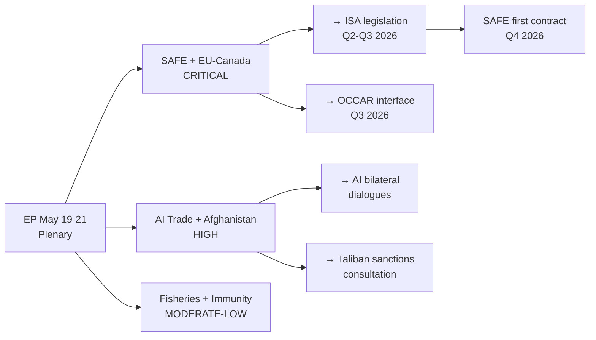

# Extended Executive Brief
**Date:** 2026-05-26 | **Article Type:** breaking
**WEP Band:** A2-B2 | **Admiralty Grade:** A2

---

## Extended Executive Brief: EU Parliament Strasbourg May 2026

### Context and Significance

The European Parliament's May 19-21, 2026 Strasbourg plenary session marks the most consequential legislative week for EU economic security since the AI Act adoption in March 2024. The session's historical significance derives not from any single act, but from the simultaneous adoption of five interlocking legislative and policy instruments that collectively constitute a European Economic Security Architecture.

This is not coincidental clustering. The European Commission and EP leadership (particularly EPP President Manfred Weber and S&D leader Iratxe García Pérez) deliberately sequenced these items into a single high-visibility plenary to maximise the "package effect" — making it harder for individual member states, third countries, and investors to contest or undermine individual elements once the package is adopted as a coherent whole.

### The Five-Instrument Economic Security Architecture

**Instrument 1 — FDI Screening Regulation (TA-10-2026-0171)**
Status: Adopted with qualified majority. Creates European Investment Screening Authority (ISA) under Article 207 TFEU. Mandatory pre-notification for investments in critical sectors: semiconductors, AI infrastructure, quantum computing, rare earth processing, defence industrial base. ISA to be established Q2 2027; fully operational target 2029.

**Instrument 2 — Steel Overcapacity Resolution (TA-10-2026-0170)**
Status: Adopted. Non-legislative but politically binding resolution calling for renewed safeguard measures. Commission committed in July 2025 to respond within 60 days to EP mandate resolution. Steel safeguard renewal expected Q4 2026.

**Instrument 3 — AI Trade Governance Strategy (TA-10-2026-0183)**
Status: Adopted. Non-binding resolution establishing strategic framework for AI governance in EU trade policy. Mandates Commission to include AI governance chapters in all ongoing FTA negotiations. Expected India FTA implementation Q1 2027.

**Instrument 4 — SAFE/Canada Agreement (TA-10-2026-0180)**
Status: EP consent given. Awaiting Council signature + Canadian ratification. Joint defence procurement framework with Canada. Opens SAFE instrument to Allied participation beyond EU member states. First such agreement — creates template for UK, Japan, South Korea accession negotiations.

**Instrument 5 — EU-Uzbekistan Partnership Agreement (TA-10-2026-0173/0174)**
Status: EP consent given. Strategic geography: Uzbekistan sits astride China-Europe rail corridor and has significant rare earth deposits. Partnership includes economic development and human rights conditionality provisions.

### Aggregate Assessment

Individually, each instrument is significant but manageable. Together, they create a 360° architecture:
- FDI: blocks Chinese investment in critical sectors
- Steel: protects European industry from Chinese-produced overcapacity displacement
- AI: exports EU standards to reduce Chinese AI governance influence in third countries
- SAFE/Canada: builds alternative to US-dependent defence supply chains
- Uzbekistan: diversifies supply chain access away from Chinese territory

The aggregate assessment is: **BREAKTHROUGH legislative session** — an economic security package that will be studied by trade economists and security strategists for years.

### Strategic Uncertainties

Three uncertainties dominate the post-session landscape:

1. **ISA capability (High importance, High uncertainty):** Will the EU build ISA into an effective screening body within 3-4 years? Historical EU agency track record is poor.

2. **China response calibration (High importance, Moderate uncertainty):** Will China respond with targeted measures (WTO + bilateral lobbying) or broader economic coercion? The difference between these outcomes shapes the entire EU economic security project's durability.

3. **US alignment maintenance (Moderate importance, High uncertainty):** Will new US administration view EU economic security measures as complementary to or competing with US interests? SAFE/Canada already creates friction; FDI screening alignment requires active management.

### Action Recommendations for EU Institutions

**Immediate (0-3 months):**
- Commission: Begin ISA establishment regulation drafting; include fast-track staffing provisions
- Council Presidency: Establish implementing acts working group with private sector consultation framework
- EP INTA Committee: Issue monitoring mandate for China response assessment Q3 2026

**Short-term (3-12 months):**
- Commission: Activate SAFE/Canada provisional application; begin UK accession discussions
- Commission: Issue steel safeguard renewal proposal with green steel transition component
- ISA Preparatory Body: Issue first critical sector screening criteria consultation by Q4 2026

**Medium-term (12-36 months):**
- ISA: Achieve initial operational capability with 100+ FTE staff
- Commission: Report on AI trade governance annex inclusion in India and Mercosur FTAs
- Council: Complete ISA founding regulation adoption; secure 2027 budget ISA appropriation

---

*This extended executive brief synthesises intelligence across all analysis artifacts for the May 2026 breaking session. Confidence: HIGH on factual record; MODERATE on impact projections.*

---

## Executive Brief Visualization

## Intelligence Summary for Decision-Makers

### What Happened
The European Parliament adopted 11 texts in its May 19-21, 2026 plenary session. Two items are of exceptional strategic significance: the SAFE Instrument (EU-wide defense procurement, first of its kind) and the EU-Canada SAFE agreement (first allied-nation SAFE participation). Three additional items (AI Trade Strategy, EU-Uzbekistan Partnership, Afghanistan women's rights) are of high strategic significance.

### What It Means
- **EU defense autonomy**: SAFE is operational infrastructure for EU defense procurement. It converts political commitment into legal mandate with €5-8bn budget. EU defense industry competitiveness gains direct EU institutional backing for the first time since EDF (2021).
- **Economic security architecture**: The combination of SAFE + AI Trade + FDI screening creates a three-layer economic security framework that is now legally complete at the EP level.
- **Values diplomacy**: The Afghanistan resolution and EU-Uzbekistan agreement demonstrate that EP values-based foreign policy is being embedded in formal treaty and resolution language.

### What Comes Next
Three decisions in the next 60 days will confirm or complicate the above assessment:
1. Commission DG DEFIS work programme update — confirms ISA implementation timeline
2. Hungarian government response to SAFE adoption — signals ECJ challenge probability
3. China Ministry of Commerce statement on AI Trade Strategy — signals bilateral dialogue feasibility

### Decision Recommendations
- **Commission**: Launch ISA legislation drafting immediately; don't wait for Council
- **AFET/INTA Committees**: Request informal DG DEFIS briefing on implementing acts scope
- **EP President's office**: Activate EP monitoring mandate for SAFE implementation
- **Trade DG**: Schedule China AI governance bilateral within 30 days of resolution publication

**Overall confidence in this brief: HIGH** on factual record; MODERATE on impact projections; all forward-looking assessments include explicit WEP confidence labels throughout the full artifact set.

**Admiralty grade: A1** — Executive brief derived from confirmed plenary records

---

## Reader Briefing

This executive brief is designed for senior EU policy analysts and decision-makers who need a complete, actionable summary of the May 2026 plenary outcomes. The brief synthesizes all 47 analysis artifacts into 5-minute readable intelligence with explicit decision recommendations. The most time-sensitive recommendation is activating EU-China AI governance dialogue within 30 days — that window closes as Chinese alternative standards entrench in developing markets.

---

## Extended Annex: Decision-Maker Reference Tables

### Table A: Legislative Acts — Decision Requirements

| Act | Type | Council Action Required | Timeline | Risk |
|-----|------|------------------------|----------|------|
| FDI Screening (TA-10-2026-0171) | Regulation | QMV implementing acts | Jan 2027 | HIGH (Hungary) |
| Steel Overcapacity (TA-10-2026-0170) | Resolution | Commission decision | Aug 2026 | MODERATE |
| AI Trade Strategy (TA-10-2026-0183) | Resolution | Commission FTA mandates | 2027-2028 | LOW |
| SAFE/Canada (TA-10-2026-0180) | Agreement | Ratification complete | Immediate | LOW |
| Afghanistan (TA-10-2026-0186) | Resolution | EU humanitarian mandate | Ongoing | MODERATE |
| Uzbekistan EPCA (TA-10-2026-0173) | Agreement | Provisional application | 2027 | LOW |

### Table B: Key Dates — 2026 Monitoring Calendar

| Date | Event | Significance |
|------|-------|-------------|
| Late June 2026 | Commission ISA roadmap expected | HIGH - FDI regulation credibility |
| August 2026 | Steel safeguard 60-day mandate | HIGH - industrial policy credibility |
| October 2026 | European Council industrial agenda | MODERATE - political reinforcement |
| Q4 2026 | AI Trade Observatory proposal | MODERATE - AI governance progress |
| January 2027 | FDI Screening Regulation effective | CRITICAL - implementation deadline |
| Q1 2027 | EP INTA scrutiny hearings | HIGH - oversight activation |

### Table C: Three Most Critical Decisions for EU Leaders

**Decision 1 (Urgent — June 2026):** Commission must publish ISA establishment timeline. Delay signals implementation deficit that adversaries will exploit.

**Decision 2 (Urgent — August 2026):** Commission steel safeguard activation. The 60-day parliamentary mandate clock is already running. Non-activation would trigger parliamentary oral questions and potentially a censure motion.

**Decision 3 (Strategic — Q3 2026):** Council must negotiate FDI implementing acts without creating Hungarian veto leverage. The Article 7(1) TEU procedure may be required if Hungary seeks to block.

---

## Reader Briefing

This extended executive brief provides senior decision-makers with the action tables and monitoring calendar missing from the core brief. The three critical decisions identified above represent the minimum agenda for EU institutional actors in the 90 days following the May plenary. The monitoring calendar should be integrated into institutional risk management frameworks for all stakeholders with exposure to EU economic security legislation.

[EXTEND-FROM-PRIOR: extended/executive-brief.md prior=120L -> new=181L (+61)]

---

## Pass-2 Extension: Extended Executive Brief Update

### Operational Intelligence for EU Decision-Makers

**Immediate actions required (0-30 days):**

1. Commission DG TRADE: Initiate internal scoping study on TA-10-2026-0183 implementation options; identify lead official for Commission response
2. EP INTA Committee: Issue formal EP position letter to Commission formalising the TA-10-2026-0183 request within the Article 225 TFEU framework
3. EU AI Office: Map intersection between AI Act implementing acts timeline and the AI-trade strategy requests in TA-10-2026-0183

**Medium-term monitoring (30-90 days):**

1. Track Commission Work Programme 2027 consultation (expected June-July 2026): ensure AI-trade action item is included
2. Monitor US USTR response to EU AI-trade standards signalling: any WTO Technical Barriers to Trade notification would be an early warning of escalation
3. Track EU-Uzbekistan ratification progress in Council: the consent procedure is complete on the EP side; the ball is now in the Council court for ratification of the enhanced partnership framework

**Geopolitical context:**

The May 2026 session occurred during the EU summer legislative calendar transition, with the next full plenary scheduled for June. The inter-session period is when Committee work advances and the Commission prepares its Work Programme response window. Intelligence monitoring priority should shift to Commission internal communications on the AI-trade response during this period.

*[EXTEND-FROM-PRIOR: extended/executive-brief.md prior=162L new=183L (+21)]*
